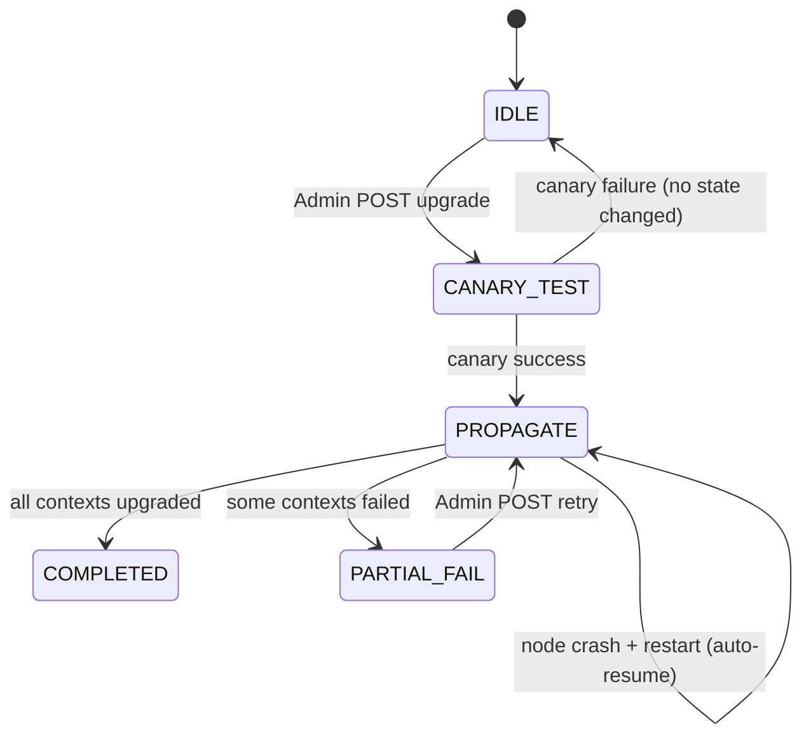
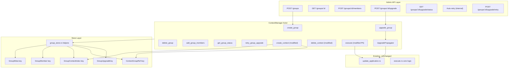

# Core/ Context Groups Implementation Plan

## Current State — What Is Already Done

### Shared Types (`core/crates/context/config/`) — All Complete ✅


| Symbol                                                | File       | Status |
| ----------------------------------------------------- | ---------- | ------ |
| `ContextGroupId`                                      | `types.rs` | ✅      |
| `AppKey`                                              | `types.rs` | ✅      |
| `GroupRequest`, `GroupRequestKind`                    | `lib.rs`   | ✅      |
| `RequestKind::Group`                                  | `lib.rs`   | ✅      |
| `ProposalAction::RegisterInGroup/UnregisterFromGroup` | `lib.rs`   | ✅      |


### Contracts (`contracts/`) — All 5 Phases Complete ✅

See `CONTEXT-contracts-groups.md` for full detail.

### `core/` Runtime — All Pending ⬜

Everything in this plan targets `core/crates/` only.

---

## Living Context Document

A file `**CONTEXT-core-groups.md**` lives at the repo root alongside `CONTEXT-contracts-groups.md`. It is the **primary handoff artifact** between agents/sessions. It contains:

- The full status table of every file change (⬜ / 🔄 / ✅)
- Notes on patterns, prefix bytes, and on-chain call conventions used
- A "What's Next" section pointing to the active phase
- Any open questions resolved during implementation

**Every phase ends with a context doc update task** (`ctx-doc-update`). An agent picking up mid-work reads this doc first before touching any code.

---

## Phase 1 — Foundation: Storage Types

**Goal**: New types and storage keys only. Zero behavior changes. Fully backward-compatible.

### Dependency graph

```
primitives/src/context.rs   (UpgradePolicy, GroupMemberRole)
        ↓
store/src/key/group.rs      (5 key structs + value types, uses UpgradePolicy)
        ↓
store/src/key.rs            (mod group; pub use)
```

### Files


| Task      | File                                    | Change                                 |
| --------- | --------------------------------------- | -------------------------------------- |
| P1.1–P1.2 | `core/crates/primitives/src/context.rs` | Add `UpgradePolicy`, `GroupMemberRole` |
| P1.3–P1.8 | `core/crates/store/src/key/group.rs`    | **New** — 5 keys + value types + tests |
| P1.9      | `core/crates/store/src/key.rs`          | `mod group; pub use group::...`        |


### Key struct pattern (from `key/context.rs`)

```rust
#[derive(Clone, Copy, Eq, Ord, PartialEq, PartialOrd)]
pub struct GroupMeta(Key<(GroupId,)>);

impl GroupMeta {
    pub fn new(group_id: ContextGroupId) -> Self {
        let mut key = [0u8; 33];
        key[0] = 0x20;
        key[1..].copy_from_slice(&group_id.to_bytes());
        Self(Key(key.into()))
    }
}
impl AsKeyParts for GroupMeta {
    type Components = (GroupId,);
    fn column() -> Column { Column::Config }
    fn as_key(&self) -> &Key<Self::Components> { (&self.0).into() }
}
```

### Prefix byte allocation


| Key                 | Prefix | Total bytes      |
| ------------------- | ------ | ---------------- |
| `GroupMeta`         | `0x20` | 33 (1 + 32)      |
| `GroupMember`       | `0x21` | 65 (1 + 32 + 32) |
| `GroupContextIndex` | `0x22` | 65 (1 + 32 + 32) |
| `ContextGroupRef`   | `0x23` | 33 (1 + 32)      |
| `GroupUpgradeKey`   | `0x24` | 33 (1 + 32)      |


Verify no collision with existing context key prefixes before committing.

---

## Phase 2 — Group CRUD + Membership

**Goal**: Full group lifecycle — create, delete, add/remove members, query — reachable via the admin API.

### Dependency order within Phase 2

```
primitives/src/group.rs      (message types)
messages.rs                  (ContextMessage variants)
        ↓
group_store.rs               (store helpers)
        ↓
handlers/create_group.rs     (uses store helpers + on-chain client)
handlers/delete_group.rs
handlers/add_group_members.rs
handlers/remove_group_members.rs
        ↓
handlers.rs                  (wires ContextMessage → handlers)
        ↓
server/handlers/groups.rs    (axum handlers)
server/service.rs            (route registration)
```

### New files

- `core/crates/context/primitives/src/group.rs` (~200 LOC)
- `core/crates/context/src/group_store.rs` (~300 LOC)
- `core/crates/context/src/handlers/create_group.rs` (~100 LOC)
- `core/crates/context/src/handlers/delete_group.rs` (~80 LOC)
- `core/crates/context/src/handlers/add_group_members.rs` (~80 LOC)
- `core/crates/context/src/handlers/remove_group_members.rs` (~80 LOC)
- `core/crates/server/src/admin/handlers/groups.rs` (~300 LOC)

### Modified files

- `core/crates/context/primitives/src/lib.rs` — `pub mod group;`
- `core/crates/context/primitives/src/messages.rs` — extend `CreateContextRequest`, extend `ContextMessage`
- `core/crates/context/src/handlers.rs` — `pub mod` + match arms
- `core/crates/server/src/admin/handlers.rs` — `pub mod groups;`
- `core/crates/server/src/admin/service.rs` — 6 new routes

### New API routes (Phase 2) — ✅ Implemented

```
POST   /admin-api/groups                              → CreateGroup
GET    /admin-api/groups/:group_id                    → GetGroupInfo
DELETE /admin-api/groups/:group_id                    → DeleteGroup
POST   /admin-api/groups/:group_id/members            → AddGroupMembers
POST   /admin-api/groups/:group_id/members/remove     → RemoveGroupMembers
GET    /admin-api/groups/:group_id/members            → ListGroupMembers
```

Note: RemoveGroupMembers uses `POST .../members/remove` instead of `DELETE .../members` because DELETE with a request body is non-standard. Group IDs are hex-encoded 32-byte strings in both URL paths and JSON responses.

---

## Phase 3 — Context-Group Integration

**Goal**: Bind context creation and deletion to group index maintenance.

### Changes to existing handlers

`**create_context.rs`** — 3 additions in order:

1. Pre-validation block (before key generation):
  - Load `GroupMetaValue` or error
  - `check_group_membership` or error
  - `app.app_key() == group.app_key` or error
  - Version override if needed
2. Post-creation hook (after `CreateContextResponse` is ready, before returning):
  - `register_context_in_group` to local store
  - Fire-and-forget on-chain `GroupRequest::RegisterContext`

`**delete_context.rs`** — 1 addition after deletion:

- `get_group_for_context` → if Some, `unregister_context_from_group` + fire-and-forget on-chain

### New API route (Phase 3)

```
GET    /admin-api/groups/:group_id/contexts    → ListGroupContexts  (offset, limit)
```

---

## Phase 4 — Upgrade Propagation

**Goal**: Single admin trigger propagates application version across all group contexts.

### State machine




### New files — ✅ Implemented

- `core/crates/context/src/handlers/upgrade_group.rs` (~300 LOC) — Handler + inline `propagate_upgrade()` async fn (propagator consolidated here)
- `core/crates/context/src/handlers/get_group_upgrade_status.rs` (~20 LOC)
- `core/crates/context/src/handlers/retry_group_upgrade.rs` (~90 LOC)
- `core/crates/server/src/admin/handlers/groups/upgrade_group.rs` (~85 LOC)
- `core/crates/server/src/admin/handlers/groups/get_group_upgrade_status.rs` (~85 LOC)
- `core/crates/server/src/admin/handlers/groups/retry_group_upgrade.rs` (~60 LOC)

### Key design constraint

`UpgradePropagator::upgrade_single_context()` **must only call** the existing functions from `update_application.rs`. No new migration logic is introduced.

### New API routes (Phase 4)

```
POST   /admin-api/groups/:group_id/upgrade         → UpgradeGroup (202 Accepted)
GET    /admin-api/groups/:group_id/upgrade/status  → GetGroupUpgradeStatus
POST   /admin-api/groups/:group_id/upgrade/retry   → RetryGroupUpgrade
```

---

## Phase 5 — Advanced Policies + Crash Recovery

**Goal**: Lazy-on-access transparent upgrade, startup crash recovery, automatic retry for failed upgrades.

### Changes


| Task      | File                                       | What                                            |
| --------- | ------------------------------------------ | ----------------------------------------------- |
| P5.1–P5.2 | `handlers/execute.rs`                      | `maybe_lazy_upgrade()` pre-check                |
| P5.3      | `context/src/lib.rs`                       | `recover_in_progress_upgrades()` on `started()` |
| P5.4      | `handlers/upgrade_group.rs`                | Auto-retry failed contexts in propagator        |


### Auto-retry behavior (Phase 5) — ✅ Implemented

After the initial propagation pass, if any context upgrades failed, the propagator automatically retries failed contexts up to 3 times with exponential backoff (5s, 10s, 20s). If failures persist after all retries, the upgrade remains in `InProgress` status for manual retry via `POST /groups/:group_id/upgrade/retry`.

### Crash recovery flow

On `ContextManager::started()`:

1. Scan all `GroupUpgradeKey` entries in store
2. For each with `status == InProgress`, re-spawn `UpgradePropagator`
3. Propagator's idempotency check (compare `context.application_id` vs `target`) skips already-upgraded contexts automatically

---

## Architecture Overview




---

## Phase 6 — Group Invitations + Join Flow

**Goal**: Let admins generate invitation payloads that users can present to join a group, mirroring the existing context invitation pattern.

### Design

Two invitation modes, same payload type:

- **Targeted** — `invitee_identity: Some(PublicKey)` — only that specific key can redeem it
- **Open** — `invitee_identity: None` — any identity can redeem it (admin's discretion)

No new on-chain contract changes needed. The existing `GroupRequest::AddMembers` (already in the shared types crate and contracts) handles the on-chain registration when someone joins.

### Invitation payload structure (borsh inner, base58 outer)

```rust
// Inner struct — borsh serialized, then base58 encoded into GroupInvitationPayload
struct GroupInvitationInner {
    group_id:         [u8; 32],
    inviter_identity: [u8; 32],  // admin who created it
    invitee_identity: Option<[u8; 32]>,  // None = open invitation
    expiration:       Option<u64>,       // unix timestamp, None = no expiry
}
```

### Flow: Admin creates invitation

```
POST /admin-api/groups/:id/invite
{ invitee_identity?: "<pubkey>", expiration?: 1234567890 }
        ↓
CreateGroupInvitationRequest handler
  → verify requester is group admin
  → borsh-serialize inner payload
  → base58-encode → GroupInvitationPayload
        ↓
{ payload: "3xFg7k...base58..." }   ← admin sends this to the user out-of-band
```

### Flow: User joins via invitation

```
POST /admin-api/groups/join
{ invitation_payload: "3xFg7k...", identity_secret?: "..." }
        ↓
JoinGroupRequest handler
  → decode + deserialize GroupInvitationPayload
  → verify inviter_identity is still an admin (is_group_admin)
  → if targeted: verify joiner matches invitee_identity
  → if expiration set: verify not expired
  → add_group_member(joiner, Member) locally
  → submit GroupRequest::AddMembers on-chain
        ↓
{ group_id: "...", member_identity: "<pubkey>" }
```

### Comparison to context invitation


|                 | Context                          | Group                                  |
| --------------- | -------------------------------- | -------------------------------------- |
| Payload type    | `ContextInvitationPayload`       | `GroupInvitationPayload`               |
| Inner encoding  | borsh + base58                   | borsh + base58 (same)                  |
| Targeted invite | Yes                              | Yes                                    |
| Open invite     | Yes (commitment/reveal)          | Yes (simpler — no on-chain commitment) |
| On-chain step   | `AddMembers` in context contract | `AddMembers` in group contract         |
| Handler         | `join_context.rs`                | `join_group.rs`                        |


### New files (Phase 6)

- `core/crates/context/src/handlers/create_group_invitation.rs` (~60 LOC)
- `core/crates/context/src/handlers/join_group.rs` (~120 LOC)

### Modified files (Phase 6)


| File                                  | Change                                                                   |
| ------------------------------------- | ------------------------------------------------------------------------ |
| `primitives/src/context.rs`           | Add `GroupInvitationPayload` type + `new()` + `parts()`                  |
| `context/primitives/src/group.rs`     | Add `CreateGroupInvitationRequest/Response`, `JoinGroupRequest/Response` |
| `context/primitives/src/messages.rs`  | Add `CreateGroupInvitation`, `JoinGroup` to `ContextMessage`             |
| `context/src/handlers.rs`             | `pub mod` + match arms                                                   |
| `server/src/admin/handlers/groups.rs` | Add `create_invitation` + `join_group` handlers                          |
| `server/src/admin/service.rs`         | Register 2 new routes                                                    |


### New API routes (Phase 6)

```
POST  /admin-api/groups/:group_id/invite   → CreateGroupInvitation  (admin only)
POST  /admin-api/groups/join               → JoinGroup              (any identity)
```

---

## Full File Change Table


| Phase | File                                              | Type    | Est. LOC | Status |
| ----- | ------------------------------------------------- | ------- | -------- | ------ |
| P1    | `primitives/src/context.rs`                       | Modify  | +40      | ✅      |
| P1    | `store/src/key.rs`                                | Modify  | +5       | ✅      |
| P1    | `store/src/key/group.rs`                          | **New** | ~250     | ✅      |
| P1    | `store/src/types/group.rs`                        | **New** | ~30      | ✅      |
| P2    | `context/primitives/src/group.rs`                 | **New** | ~200     | ✅      |
| P2    | `context/primitives/src/messages.rs`              | Modify  | +80      | ✅      |
| P2    | `context/primitives/src/lib.rs`                   | Modify  | +1       | ✅      |
| P2    | `context/src/group_store.rs`                      | **New** | ~260     | ✅      |
| P2    | `context/src/lib.rs`                              | Modify  | +1       | ✅      |
| P2    | `store/src/types.rs`                              | Modify  | +1       | ✅      |
| P2    | `context/src/handlers/create_group.rs`            | **New** | ~65      | ✅      |
| P2    | `context/src/handlers/delete_group.rs`            | **New** | ~55      | ✅      |
| P2    | `context/src/handlers/add_group_members.rs`       | **New** | ~35      | ✅      |
| P2    | `context/src/handlers/remove_group_members.rs`    | **New** | ~35      | ✅      |
| P2    | `context/src/handlers/get_group_info.rs`          | **New** | ~50      | ✅      |
| P2    | `context/src/handlers/list_group_members.rs`      | **New** | ~40      | ✅      |
| P2    | `context/src/handlers.rs`                         | Modify  | +30      | ✅      |
| P2    | `server/src/admin/handlers/groups.rs`             | **New** | ~25      | ✅      |
| P2    | `server/src/admin/handlers/groups/create_group.rs`| **New** | ~70      | ✅      |
| P2    | `server/src/admin/handlers/groups/delete_group.rs`| **New** | ~60      | ✅      |
| P2    | `server/src/admin/handlers/groups/get_group_info.rs`| **New** | ~55    | ✅      |
| P2    | `server/src/admin/handlers/groups/add_group_members.rs`| **New** | ~55 | ✅      |
| P2    | `server/src/admin/handlers/groups/remove_group_members.rs`| **New** | ~50 | ✅   |
| P2    | `server/src/admin/handlers/groups/list_group_members.rs`| **New** | ~60  | ✅     |
| P2    | `server/primitives/src/admin.rs`                  | Modify  | +120     | ✅      |
| P2    | `server/src/admin/handlers.rs`                    | Modify  | +1       | ✅      |
| P2    | `server/src/admin/service.rs`                     | Modify  | +20      | ✅      |
| P3    | `context/src/handlers/create_context.rs`          | Modify  | +50      | ✅      |
| P3    | `context/src/handlers/delete_context.rs`          | Modify  | +20      | ✅      |
| P3    | `context/primitives/src/group.rs`                 | Modify  | +10      | ✅      |
| P3    | `context/primitives/src/messages.rs`               | Modify  | +5       | ✅      |
| P3    | `context/primitives/src/client.rs`                 | Modify  | +15      | ✅      |
| P3    | `context/src/handlers.rs`                          | Modify  | +5       | ✅      |
| P3    | `context/src/handlers/list_group_contexts.rs`     | **New** | ~25      | ✅      |
| P3    | `server/src/admin/handlers/groups/list_group_contexts.rs`| **New** | ~55 | ✅      |
| P3    | `server/src/admin/handlers/groups.rs`              | Modify  | +1       | ✅      |
| P3    | `server/src/admin/service.rs`                      | Modify  | +4       | ✅      |
| P3    | `server/primitives/src/admin.rs`                   | Modify  | +10      | ✅      |
| P4    | `context/src/handlers/upgrade_group.rs`           | **New** | ~300     | ✅      |
| P4    | `context/src/handlers/get_group_upgrade_status.rs`| **New** | ~20      | ✅      |
| P4    | `context/src/handlers/retry_group_upgrade.rs`     | **New** | ~90      | ✅      |
| P4    | `context/primitives/src/group.rs`                 | Modify  | +40      | ✅      |
| P4    | `context/primitives/src/messages.rs`              | Modify  | +15      | ✅      |
| P4    | `context/primitives/src/client.rs`                | Modify  | +60      | ✅      |
| P4    | `server/src/admin/handlers/groups/upgrade_group.rs`| **New** | ~85     | ✅      |
| P4    | `server/src/admin/handlers/groups/get_group_upgrade_status.rs`| **New**| ~85| ✅   |
| P4    | `server/src/admin/handlers/groups/retry_group_upgrade.rs`| **New** | ~60 | ✅    |
| P4    | `server/primitives/src/admin.rs`                  | Modify  | +80      | ✅      |
| P5    | `store/src/key/group.rs`                          | Modify  | +1       | ✅      |
| P5    | `store/src/key.rs`                                | Modify  | +1       | ✅      |
| P5    | `context/src/group_store.rs`                      | Modify  | +30      | ✅      |
| P5    | `context/src/handlers/execute.rs`                 | Modify  | +80      | ✅      |
| P5    | `context/src/lib.rs`                              | Modify  | +70      | ✅      |
| P5    | `context/src/handlers/upgrade_group.rs`           | Modify  | +60      | ✅      |
| P6    | `primitives/src/context.rs`                       | Modify  | +100     | ✅      |
| P6    | `context/primitives/src/group.rs`                 | Modify  | +35      | ✅      |
| P6    | `context/primitives/src/messages.rs`               | Modify  | +10      | ✅      |
| P6    | `context/primitives/src/client.rs`                 | Modify  | +35      | ✅      |
| P6    | `context/src/handlers/create_group_invitation.rs` | **New** | ~55      | ✅      |
| P6    | `context/src/handlers/join_group.rs`              | **New** | ~90      | ✅      |
| P6    | `context/src/handlers.rs`                          | Modify  | +10      | ✅      |
| P6    | `server/primitives/src/admin.rs`                   | Modify  | +65      | ✅      |
| P6    | `server/src/admin/handlers/groups.rs`              | Modify  | +2       | ✅      |
| P6    | `server/src/admin/handlers/groups/create_group_invitation.rs` | **New** | ~60 | ✅ |
| P6    | `server/src/admin/handlers/groups/join_group.rs`   | **New** | ~65      | ✅      |
| P6    | `server/src/admin/service.rs`                      | Modify  | +8       | ✅      |


**Totals**: 16 new files · 10 modified files · ~2700 LOC