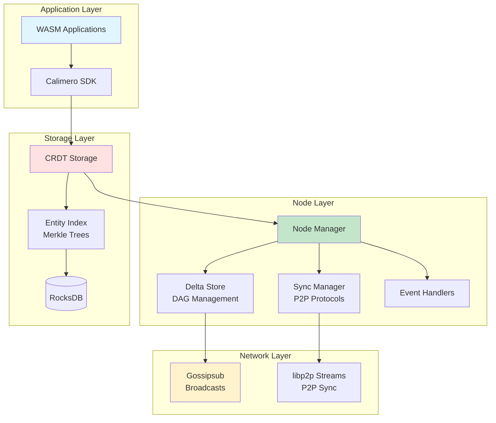
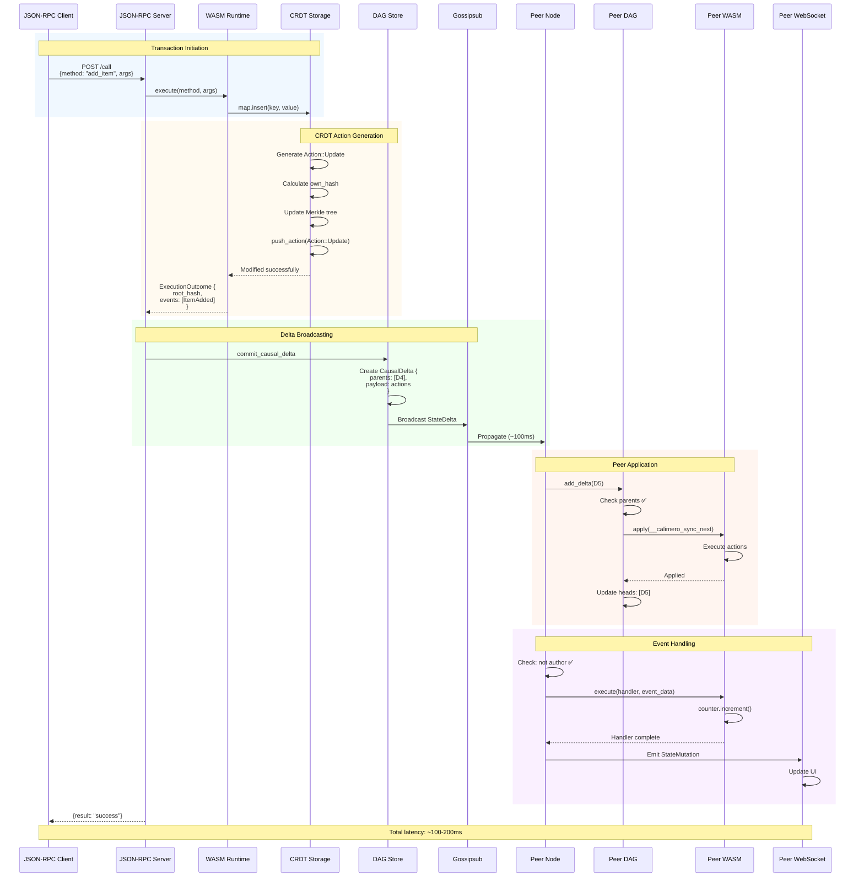
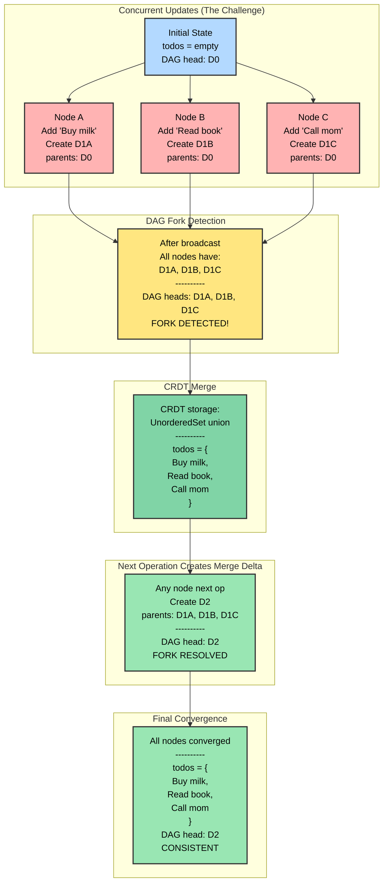

# Welcome to Calimero Network

[](https://discord.gg/wZRC73DVpU)
[](#license)
[](https://github.com/calimero-network/core/issues)

<div align="center">
  <picture>
    <source media="(prefers-color-scheme: dark)" srcset="https://assets-global.website-files.com/6256e0ccf395021e66e913b6/65cb5711287e06754d171147_calimero_logo_white.svg">
    
  </picture>
</div>

## Build Self-Sovereign Applications with CRDT-Powered P2P Sync

Calimero Network is a framework for building distributed, peer-to-peer applications with **automatic conflict-free data synchronization**, data ownership, and verifiable off-chain computing.

### Key Features

- ✅ **DAG-based CRDT Sync** - Automatic conflict resolution, works offline
- ✅ **Event-driven Architecture** - Real-time notifications across nodes
- ✅ **Encrypted P2P** - Secure data sharing with end-to-end encryption
- ✅ **WASM Runtime** - Write apps in Rust, compile to WebAssembly
- ✅ **Multi-chain Integration** - NEAR, ICP, Ethereum, Stellar, ZKSync
- ✅ **Local-first** - Your data, your node, your control

## Quick Start

### 1. Install Prerequisites

```bash
# Rust toolchain
curl --proto '=https' --tlsv1.2 -sSf https://sh.rustup.rs | sh
rustup target add wasm32-unknown-unknown

# Calimero CLI
cargo install --git https://github.com/calimero-network/core meroctl
```

### 2. Create Your First App

```rust
use calimero_sdk::app;
use calimero_sdk::borsh::{BorshSerialize, BorshDeserialize};
use calimero_storage::collections::UnorderedMap;

#[app::state]
#[derive(BorshSerialize, BorshDeserialize)]
#[borsh(crate = "calimero_sdk::borsh")]
pub struct MyApp {
    items: UnorderedMap<String, String>,
}

#[app::logic]
impl MyApp {
    #[app::init]
    pub fn init() -> MyApp {
        MyApp {
            items: UnorderedMap::new(),
        }
    }
    
    pub fn add_item(&mut self, key: String, value: String) -> app::Result<()> {
        self.items.insert(key, value)?;
        Ok(())
    }
}
```

### 3. Build and Deploy

```bash
# Build WASM
cargo build --target wasm32-unknown-unknown --release

# Start node
merod --node-type peer

# Install app
meroctl --node-name node1 app install ./target/wasm32-unknown-unknown/release/my_app.wasm

# Call methods
meroctl --node-name node1 call add_item '{"key": "hello", "value": "world"}'
```

## Why Calimero?

### Data Ownership and Privacy

Calimero puts **users in control** of their data:

- **Self-Sovereign Apps (SSApps)** run on user-controlled nodes
- **Encrypted storage** keeps data secret from unauthorized parties
- **Selective sharing** - only invite trusted peers to contexts
- **No central servers** - data never leaves your control

### Automatic Synchronization

Built on cutting-edge **CRDT technology**:

- **Conflict-free merges** - concurrent edits automatically reconcile
- **Works offline** - sync when reconnected
- **DAG-based causality** - preserves operation order
- **Eventually consistent** - all nodes converge to same state

### Verifiable Off-Chain Computing

Efficient and cost-effective:

- **Local consensus** - only context participants validate
- **Selective state updates** - not the entire network
- **Cross-chain proofs** - verify computation on L1s
- **Horizontal scalability** - more contexts = more throughput

## Architecture

### System Overview



### Data Flow (End-to-End)



### DAG-Based CRDT Synchronization



**Key Insight**: DAG tracks causality, CRDTs resolve conflicts automatically.

### Key Components

#### 1. CRDT Storage (`crates/storage`)

Conflict-free Replicated Data Types with automatic merging:

- **UnorderedMap** - Key-value storage with LWW
- **Vector** - Ordered list with LWW
- **Counter** - Distributed G-Counter (no lost increments!)
- **Merkle trees** - Efficient state comparison

[→ Storage Documentation](crates/storage/README.md)

#### 2. DAG-based Synchronization (`crates/dag`, `crates/node`)

Directed Acyclic Graph for causal delta tracking:

- **Out-of-order delivery** - Buffers deltas until dependencies arrive
- **Fork detection** - Handles concurrent updates
- **Automatic cascade** - Applying one delta unlocks pending children

[→ DAG Documentation](crates/dag/README.md)  
[→ Node Documentation](crates/node/README.md)

#### 3. Event-Driven Architecture (`crates/sdk`)

Real-time notifications with handler execution:

- **Emit events** from transactions
- **Automatic propagation** to peer nodes
- **Handler execution** on receiving nodes
- **WebSocket streaming** to clients

[→ SDK Documentation](crates/sdk/README.md)

#### 4. P2P Networking (`crates/network`)

libp2p-based communication:

- **Gossipsub** - Fast broadcast for real-time deltas
- **Streams** - Reliable P2P for sync and recovery
- **DHT** - Peer discovery (Kademlia)
- **Encryption** - Noise protocol for secure channels

#### 5. Multi-Chain Integration (`contracts/`)

Cross-chain proof verification:

- **NEAR Protocol** - Native integration
- **ICP (Internet Computer)** - Canister contracts
- **Ethereum** - Solidity contracts

## Core Principles

### 1. Data Ownership

**You own your data. Period.**

- SSApps run on **your devices**
- Data stored in **your local storage**
- Only **you control** who has access
- No backdoors, no exceptions

### 2. Privacy by Default

**Encrypted end-to-end, always.**

- All P2P communication encrypted (Noise protocol)
- Storage encrypted at rest
- Zero-knowledge proofs for verification
- Metadata minimization

### 3. Distributed by Design

**No single point of failure.**

- Peer-to-peer architecture
- No central servers or coordinators
- Nodes can operate offline
- Resilient to network partitions

### 4. Developer-Friendly

**Simple API, powerful primitives.**

- Rust SDK with macros
- Automatic CRDT handling
- Familiar async/await patterns
- Comprehensive documentation

## Project Structure

```
calimero/core/
├── apps/                      # Example applications
│   ├── kv-store/              # Simple key-value store
│   ├── kv-store-with-handlers/# KV store with events
│   └── blobs/                 # Blob sharing example
│
├── crates/                    # Core Rust crates
│   ├── sdk/                   # Application SDK
│   ├── storage/               # CRDT storage layer
│   ├── dag/                   # DAG logic (pure)
│   ├── node/                  # Node runtime
│   ├── network/               # P2P networking
│   ├── server/                # JSON-RPC server
│   ├── auth/                  # Authentication
│   └── meroctl/               # CLI tool
│
├── contracts/                 # Cross-chain contracts
│   ├── near/                  # NEAR contracts
│   ├── icp/                   # ICP canisters
│   ├── ethereum/              # Solidity contracts
│
└── e2e-tests/                 # End-to-end test suite
```

## Development

### Building

```bash
# Build all crates
cargo build --release

# Build specific crate
cargo build -p calimero-node --release

# Build example apps
cd apps/kv-store && ./build.sh
```

### Testing

```bash
# Unit tests
cargo test

# Integration tests
cargo test --test '*'

# E2E tests (requires release build)
cargo build --release
./target/release/e2e-tests \
  --merod-binary ./target/release/merod \
  --meroctl-binary ./target/release/meroctl \
  --protocols near
```

### Running a Node

```bash
# Coordinator node (first node)
merod --node-type coordinator

# Peer node (connects to coordinator)
merod --node-type peer --swarm-addrs /ip4/127.0.0.1/tcp/2428

# Custom config
merod --home ~/.calimero-node --config custom-config.toml
```

## Use Cases

### Collaborative Editing

Real-time document collaboration without central servers:

```rust
#[app::state]
pub struct Document {
    content: Vector<String>,  // Lines of text
    edits: Counter,            // Edit counter
}
```

### Decentralized Social

User-controlled social networks:

```rust
#[app::state]
pub struct SocialNetwork {
    posts: Vector<Post>,
    likes: Counter,
    followers: UnorderedSet<String>,
}
```

### Gaming

P2P multiplayer games with automatic state sync:

```rust
#[app::state]
pub struct GameState {
    players: UnorderedMap<String, Player>,
    score: Counter,
    events: Vector<GameEvent>,
}
```

### IoT Networks

Decentralized device coordination:

```rust
#[app::state]
pub struct IoTNetwork {
    devices: UnorderedMap<String, Device>,
    readings: Vector<SensorData>,
    alerts: Counter,
}
```

## Backstory

Calimero Network was born out of the need to solve fundamental issues in existing technology and blockchain systems: **privacy**, **data control**, and **scalability**.

Inspired by the core principles of decentralization, the Calimero team set out to redesign how decentralized applications work. Our focus:

1. **User privacy** - Data encrypted and owned by users
2. **Data control** - Users decide who accesses their data
3. **Scalability** - Efficient off-chain computing with on-chain verification

Driven by innovation, we developed:

- **CRDT-based storage** for automatic conflict resolution
- **DAG synchronization** for causal ordering
- **Event-driven architecture** for real-time updates
- **Multi-chain integration** for universal verification

Our journey is about creating a **private, efficient, and open decentralized web** where users truly own their digital lives.

## Ethos

Calimero aims to make a significant impact in both Web2 and Web3:

- **Catalyst for change** - Disrupting centralized data control
- **Privacy-first** - End-to-end encryption by default
- **User-centric** - Data ownership above all
- **Innovation-driven** - Pushing boundaries of what's possible
- **Open and transparent** - Open source, open community

We stand as a testament to the pursuit of an **equitable, decentralized internet**.

## Community

### Get Involved

- **Discord**: [Join our community](https://discord.gg/wZRC73DVpU)
- **GitHub**: [Open an issue](https://github.com/calimero-network/core/issues)
- **Documentation**: [Read the docs](crates/)
- **Twitter**: [@CalimeroNetwork](https://twitter.com/CalimeroNetwork)

### Contributing

We welcome contributions! Please see our [Contributing Guide](CONTRIBUTING.md).

All contributions must:

1. Read the [Developer Certificate of Origin Version 1.1](https://developercertificate.org/)
2. Sign all commits

This ensures all software is contributed under the terms of our license.

## Version Management

Calimero Core uses centralized version management where all crates share a single version number.

```bash
# Install cargo-workspaces
cargo install --git https://github.com/miraclx/cargo-workspaces --tag v0.3.0 cargo-workspaces

# Update all versions
cargo ws version custom 0.2.0 --yes

# Publish to crates.io
cargo ws publish --yes --allow-dirty --force '*'
```

**Current version**: 0.1.1

## License

This repository contains Calimero, covered under the [Apache License 2.0](LICENSE), except where noted (Calimero logos and trademarks are not covered).

Calimero is a product produced from this open source software, exclusively by Calimero, Ltd. It is distributed under our commercial terms.

Others may make their own distribution of the software, but cannot use any Calimero trademarks, cloud services, etc.

We explicitly grant permission for you to make a build that includes our trademarks while developing Calimero itself. You may not publish or share the build for other purposes.

---

**Built with ❤️ by the Calimero Network team**

For questions, reach out on [Discord](https://discord.gg/wZRC73DVpU).
