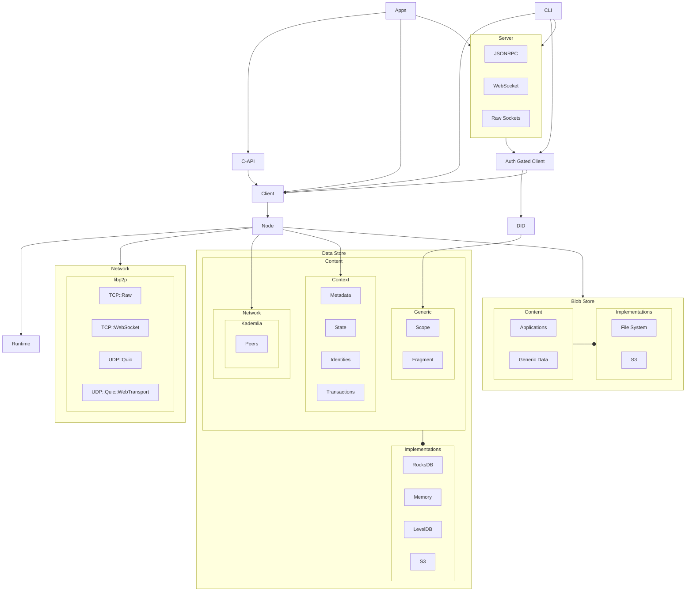

# Welcome to Calimero Network

  <picture>
    <source media="(prefers-color-scheme: dark)" srcset="https://assets-global.website-files.com/6256e0ccf395021e66e913b6/65cb5711287e06754d171147_calimero_logo_white.svg">
    
  </picture>

Calimero Network is a framework that enables building and running peer-to-peer
Self-Sovereign applications focusing on data ownership, harnessing the power of
verifiable off-chain computing and data ownership.

Calimero Network enables users to own their data. In the Web3 landscape, while
you can own your money, data ownership and control over access are still
lacking. Calimero addresses this gap by providing solutions for secure data
storage and complete control over data access. Users deserve to know what
happens on the backend level when using software. This transparency is a core
reason why Calimero is open-source, making sense for an infra framework
positioned as L0 for privacy and verifiable off-chain computing.

Our architecture supports encrypted peer-to-peer communication, ensuring data
privacy and security through advanced encryption methods. Calimero utilizes
local storage and nodes, adopting a localized consensus model that enhances
scalability and efficiency without compromising privacy.

## Why Calimero?

Calimero Network embodies a pioneering spirit, offering innovative solutions
that disrupt the digital landscape. Our mission is to revolutionize data
ownership principles, bringing control back to users. We aim to redefine
privacy, security, and user autonomy through a robust framework that supports a
diverse ecosystem of SSApps. Our vision is to become the L0 for privacy across
all ecosystems and beyond. Calimero provides an easy-to-integrate solution that
extends blockchain technology, offering an extra layer of security, privacy, and
data ownership. Calimero enables verifiable off-chain computing, allowing for
efficient and cost-effective computation by updating the state only for a
selective group of peers within a context, rather than the entire network.

**Core Principles**

1. Values - the main values of Calimero are data ownership, privacy, data
   control, innovation, and simplicity.
2. Data Ownership and Access Control - SSApps work with encrypted user(peer)
   data: SSApps and their data are stored on a local storage(node), but have a
   synchronized state and can run on multiple devices. The data is kept secret
   from any person who does not have direct access provided by the owner. SSApps
   run only on user-trusted devices: a user can interact with an SSApp only
   after the application code and data arrives from encrypted decentralized
   storage and gets loaded into the trusted execution environment. Once the
   SSApps are loaded into the user-controlled device, they do not need to
   interact with any machine or server when offering functionality to the user.
3. Ethos - Calimero aims to make a significant impact and drive disruptive
   change within both Web2 and Web3. We are a catalyst for a secure, private,
   and user-centric digital world, standing as a testament to innovation and the
   pursuit of an equitable decentralized internet.

## Backstory

Calimero Network was born out of the need to solve major issues in existing
technology and blockchain systems. We noticed big problems with privacy, data
control, and scalability that had to be fixed.

Inspired by the core ideas of decentralization, the Calimero team aimed to
redesign decentralized applications (dApps). Our main focus was on ensuring user
privacy, giving users control over their data, and improving access management.
This mission fueled the creation of Calimero Network.

Driven by innovation, Calimero developed special tools like the Protocol SDK and
specialized nodes. These tools are meant to make decentralized applications more
functional and secure. Calimero uses an integrated approach to manage
decentralized identities (DIDs) within client nodes. This allows users to
effectively and securely manage their digital footprint. Our journey is all
about striving for a private, efficient, cost-effective, and open decentralized
web. Our dedication to privacy and security sets new standards in the
decentralized world, always putting user privacy and data control first.

## Architecture

## Contributing

Calimero is Open Source under the [Apache License 2.0](LICENSE), and is the
[copyright of its contributors](NOTICE). If you would like to contribute to the
software, you must:

1. Read the
   [Developer Certificate of Origin Version 1.1](https://developercertificate.org/)
2. Sign all commits to the Calimero project

This ensures that users, distributors, and other contributors can rely on all
the software related to Calimero being contributed under the terms of the
[License](LICENSE). No contributions will be accepted without following this
process.

Afterwards, navigate to the [contributing guide](CONTRIBUTING.md) to get
started.

## License

This repository contains Calimero, covered under the
[Apache License 2.0](LICENSE), except where noted (any Calimero logos or
trademarks are not covered under the Apache License, and should be explicitly
noted by a LICENSE file.)

Calimero is a product produced from this open source software, exclusively by
Calimero, Ltd. It is distributed under our commercial terms.

Others are allowed to make their own distribution of the software, but they
cannot use any of the Calimero trademarks, cloud services, etc.

We explicitly grant permission for you to make a build that includes our
trademarks while developing Calimero itself. You may not publish or share the
build, and you may not use that build to run Calimero for any other purpose.

## Questions

For more information on how to use and develop Calimero, talk to us on
[Discord](https://discord.gg/KHezXS9XvT).
