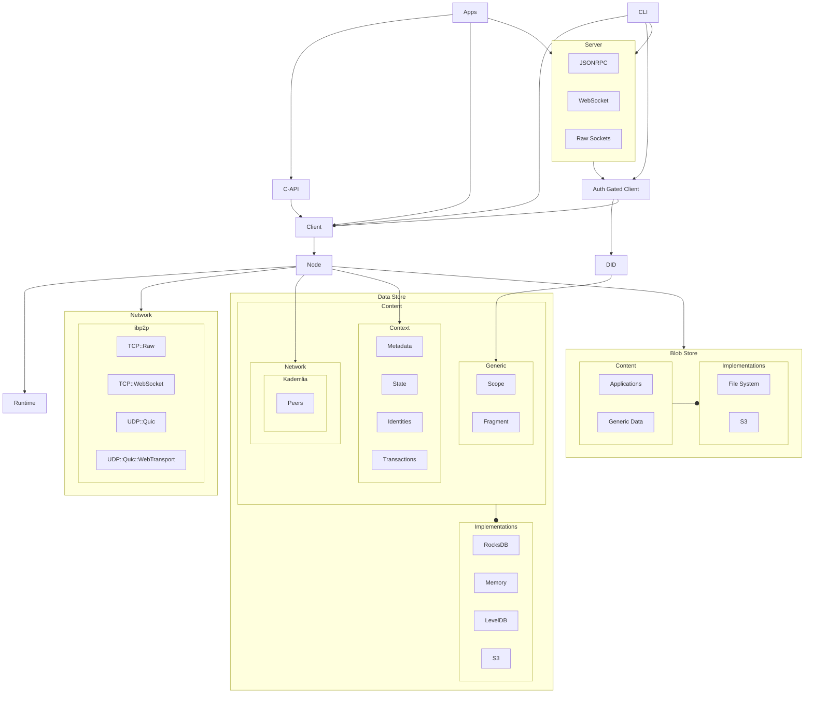

# Welcome to Calimero

  <picture>
    <source media="(prefers-color-scheme: dark)" srcset="https://assets-global.website-files.com/6256e0ccf395021e66e913b6/65cb5711287e06754d171147_calimero_logo_white.svg">
    
  </picture>

Calimero Network is designed as an innovative framework for building
decentralized application protocols and facilitating private data sharing,
addressing the critical need for privacy and data ownership in the digital age.

It empowers developers with tools like the Protocol SDK for defining
application-specific communication rules and the Client SDK for seamless
interaction with the network, alongside a specialized compute market for
executing demanding tasks. The network's architecture supports peer-to-peer
encrypted communication, ensuring data privacy and security through end-to-end
encryption methods, such as the Double Ratchet Algorithm.

Calimero stands out by offering localized consensus, which contrasts with
traditional global consensus models, allowing for scalable and efficient
application performance without sacrificing user privacy. Intended for
developers seeking to create privacy-preserving applications and users desiring
control over their data, Calimero Network promises a decentralized computing
environment where privacy is paramount, and data remains under the user's
control.

## Why Calimero?

The name Calimero Network symbolizes a pioneering spirit and a commitment to
addressing the nuanced challenges within the decentralized digital landscape.
Inspired by the concept of breaking new ground and offering innovative
solutions, Calimero Network was conceived to redefine the paradigms of privacy,
security, and user autonomy in the decentralized space.

At its core, Calimero Network is about empowerment and transformation, providing
robust tools and a secure framework for developers and users alike. It champions
the principles of user privacy and data sovereignty, addressing the pressing
need for a platform that prioritizes these elements without compromising on
efficiency and scalability.

The ethos of Calimero Network is rooted in the idea of creating a significant
impact and driving change within the decentralized ecosystem, much like a
catalyst that sparks a broader movement towards a more secure, private, and
user-centric digital world. It stands as a testament to the power of innovation
and the relentless pursuit of a more equitable and decentralized internet.

## Backstory

In the early days of decentralized technology, a visionary team observed the
challenges and limitations of existing blockchain infrastructures, particularly
around privacy, data sovereignty, and scalability. Inspired by the core
principles of Web3, they embarked on a mission to reimagine how decentralized
applications could operate, with a strong emphasis on user privacy and data
control. This led to the birth of Calimero Network, a groundbreaking ecosystem
designed from the ground up to address these challenges.

The team's commitment to innovation resulted in the creation of unique
components like the Protocol SDK, specialized nodes, and an integrated approach
to managing decentralized identities (DIDs) within client nodes, ensuring user
anonymity and security.

Calimero Network's story is one of relentless pursuit of a more private,
efficient, and user-centric decentralized web, setting a new standard for what
decentralized platforms can achieve.

## Architecture

## Contributing

Calimero is Open Source under the [Apache License 2.0](LICENSE), and is the
[copyright of its contributors](NOTICE). If you would like to contribute to the
software, you must:

  1. Read the [Developer Certificate of Origin Version 1.1](https://developercertificate.org/)
  2. Sign all commits to the Calimero project

This ensures that users, distributors, and other contributors can rely on all
the software related to Calimero being contributed under the terms of the
[License](LICENSE). No contributions will be accepted without following this
process.

Afterwards, navigate to the [contributing guide](CONTRIBUTING.md) to get
started.

## License

This repository contains Calimero, covered under the [Apache License
2.0](LICENSE), except where noted (any Calimero logos or trademarks are not
covered under the Apache License, and should be explicitly noted by a LICENSE
file.)

Calimero is a product produced from this open source software, exclusively by
Calimero, Ltd. It is distributed under our commercial terms.

Others are allowed to make their own distribution of the software, but they
cannot use any of the Calimero trademarks, cloud services, etc.

We explicitly grant permission for you to make a build that includes our
trademarks while developing Calimero itself. You may not publish or share the
build, and you may not use that build to run Calimero for any other purpose.

## Questions

For more information on how to use and develop Calimero, talk to us on
[Discord](https://discord.gg/7HjWChbE).
