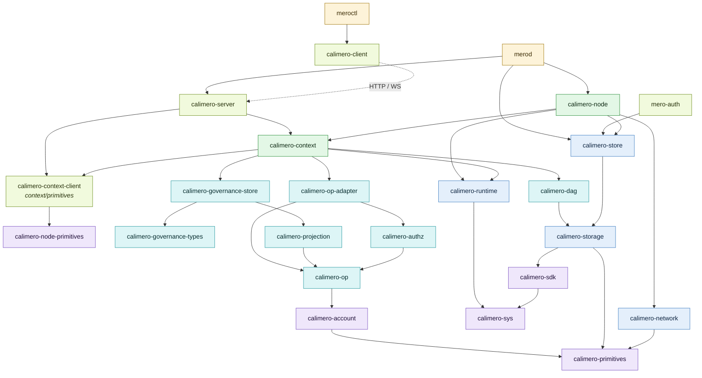
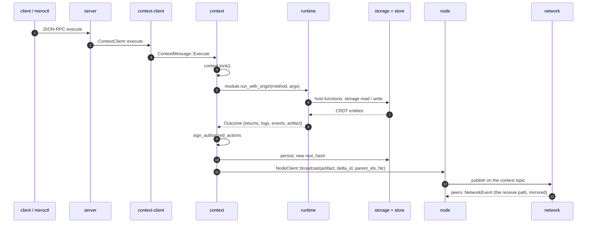
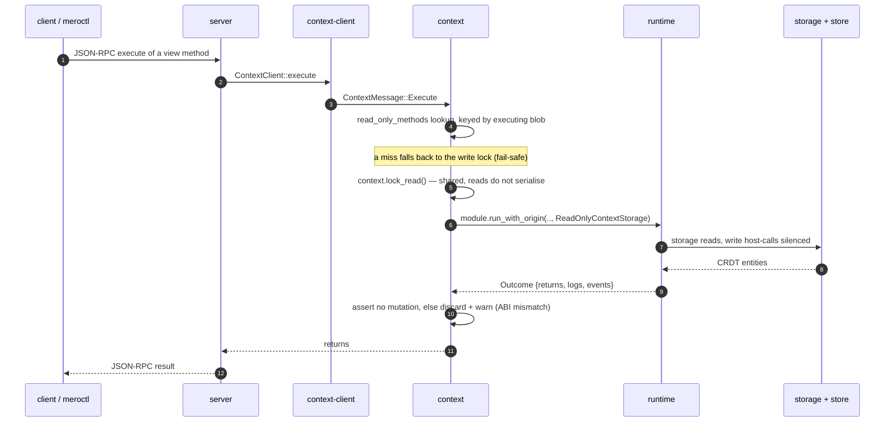
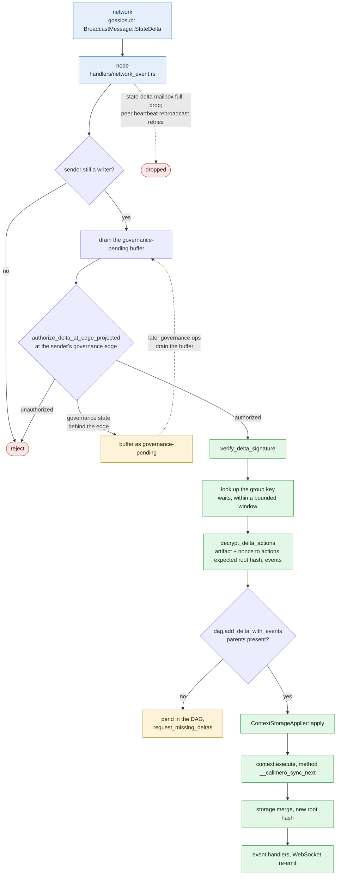
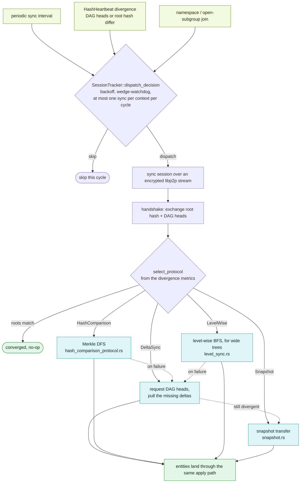
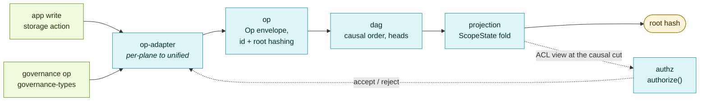

# Crates Directory - AI Agent Guidance

Core library crates for Calimero infrastructure. Each crate is conceptually separate.

## Crate Categories

### Binary Crates (executables)

| Crate     | Binary         | Entry Point           | Purpose          |
| --------- | -------------- | --------------------- | ---------------- |
| `merod`   | `merod`        | `merod/src/main.rs`   | Node daemon      |
| `meroctl` | `meroctl`      | `meroctl/src/main.rs` | CLI tool         |
| `auth`    | `mero-auth`    | `auth/src/main.rs`    | Auth service     |

### Core Library Crates

| Crate              | Entry Point          | Purpose                   |
| ------------------ | -------------------- | ------------------------- |
| `calimero-node`    | `node/src/lib.rs`    | Node runtime coordination |
| `calimero-runtime` | `runtime/src/lib.rs` | WASM execution (wasmer)   |
| `calimero-storage` | `storage/src/lib.rs` | CRDT collections          |
| `calimero-network` | `network/src/lib.rs` | P2P networking (libp2p)   |
| `calimero-server`  | `server/src/lib.rs`  | HTTP/WS/SSE server        |
| `calimero-context` | `context/src/lib.rs` | Context lifecycle         |
| `calimero-dag`     | `dag/src/lib.rs`     | DAG causal ordering       |
| `calimero-store`   | `store/src/lib.rs`   | KV store (RocksDB)        |
| `calimero-sdk`     | `sdk/src/lib.rs`     | App development SDK       |
| `calimero-projection` | `projection/src/lib.rs` | Deterministic ScopeState projection of the op-log |
| `calimero-authz`   | `authz/src/lib.rs`   | Authorization decision over the unified causal log |
| `calimero-op-adapter` | `op-adapter/src/lib.rs` | Bridges per-plane ops onto the unified causal log |
| `calimero-governance-store` | `governance-store/src/lib.rs` | Local group-governance apply pipeline & broadcast |
| `calimero-tee-attestation` | `tee-attestation/src/lib.rs` | TEE (TDX) attestation generation & verification |
| `calimero-wasm-abi` | `wasm-abi/src/lib.rs` | WASM ABI schema: `AbiType`, validate, embed |

### Support Crates

| Crate                 | Purpose                                                         |
| --------------------- | --------------------------------------------------------------- |
| `calimero-primitives` | Shared types: `ContextId`, `ApplicationId`, `PublicKey`, `Hash` |
| `calimero-bundle`     | `.mpk` manifest types + signature canonicalization, shared by `calimero-node-primitives`, `cargo-mero`, `mero-sign` |
| `calimero-crypto`     | Cryptographic utilities                                         |
| `calimero-config`     | Configuration parsing                                           |
| `calimero-client`     | HTTP/WS client for nodes                                        |
| `calimero-account`    | Account/device identity primitive (ids, certs, key chains)      |
| `calimero-op`         | Unified op envelope types + id/root hashing                     |
| `calimero-governance-types` | Signed group-operation types (local governance)           |

## How the Crates Fit Together

Three views the tables above cannot give you: which crate may import which, which
crate owns each hop of a live request, and how the four unified-causal-log crates
relate to each other.

Everything else — the actor model, the host ABI boundary, the DAG fold, the
column-family layout, the scope tree — is already drawn as SVG on the docs site
under [`docs/src/components/diagrams/`](../docs/src/components/diagrams/), wired
into the [architecture orientation](../docs/src/content/docs/contribute/architecture.mdx)
and the [protocol reference](../docs/src/content/docs/protocol/overview.mdx).
Link to those rather than redrawing them here; two copies of a diagram drift.

### Dependency spine

The load-bearing edges only — the full graph is roughly 90. Arrows point *from*
the dependent *to* what it depends on. Colours match the six bands in the docs
site's `CrateStack` figure, which shows the same layering without the edges.



What the shape tells you:

- Everything converges on `calimero-primitives`. If you are adding a type two
  crates both need, that is where it goes — see the Primitives Crates Pattern below.
- `calimero-network` never imports application-level types. It ferries opaque
  bytes and hands them up as `NetworkEvent`; decoding happens in the node layer.
- `calimero-context-client` does **not** depend on `calimero-context`. It holds a
  message `Recipient`, which is what keeps the two out of a dependency cycle.
- The unified-log crates (`op`, `op-adapter`, `projection`, `authz`) sit *below*
  `context` and `governance-store`, not beside them.

### Life of one write

Which crate owns each hop when a JSON-RPC `execute` arrives. Worth noting because
it surprises people: the server does **not** route through `NodeManager` on the
way in — it calls `ContextClient::execute` directly. The node layer is on the
*outbound* broadcast side.



### Life of a read

Same entry point — there is no separate query RPC — but the path forks early and
never reaches the node or network layer at all. A method the app declared
`#[app::view]` is looked up in the ABI's read-only set, keyed by the executing
bytecode blob, and any miss falls back to the exclusive write lock.



Three defences stack here, and it is worth knowing all three exist: the shared
`lock_read()` lets concurrent reads run without serialising; `ReadOnlyContextStorage`
silences write host-calls at the boundary; and if a mutation nonetheless comes
back, `context` discards it rather than committing. The absence of the last four
steps of the write path — sign, persist, broadcast — is the whole difference.

### Receiving a delta

What happens on the other side of that broadcast. Note the shape: authorization
happens *before* decryption, and a delta that arrives before the governance state
that authorizes it is buffered rather than dropped.



The last hop is the one to internalise: **applying a peer's delta re-enters the
same execute path as a local write**, with the method name `__calimero_sync_next`.
That is why `crates/context/src/handlers/execute/mod.rs` branches on `is_state_op`
throughout — same code, two callers — and why an applied delta does not
re-broadcast.

### When sync kicks in

Gossip is best-effort, so deltas get dropped, arrive out of order, or miss a peer
that was offline. `SyncManager` (`crates/node/src/sync/`, a long-lived task rather
than an actor) is the backstop that reconciles whatever gossip missed.



The dotted edges are a fallback chain, not alternatives: `HashComparison` and
`LevelWise` fall back to DAG-heads sync on failure, and that falls back to a full
snapshot. Snapshot is correct but expensive, so a system that keeps reaching for
it is telling you something. `BloomFilter` and `SubtreePrefetch` appear in the
selector but are not implemented — they fall through to snapshot.

Missing *parents* are a separate, cheaper mechanism: the receive path requests
them directly via `request_missing_deltas` without opening a sync session.

### The unified causal log

Why there are four crates here and not one. `op-adapter` is explicitly
transitional: it exists to map the older per-plane operation types onto the
unified payload, and goes away once everything speaks `Op` natively.



The dotted back-edge is the part to internalise: **authorization reads the
projection, and the projection is built from the log it authorizes into.** That
loop is why the ordering rules are subtle, and why `authorize` resolves its ACL
view at the op's causal cut rather than at the current head.

## Patterns & Conventions

### Primitives Crates Pattern

Shared types go in `*-primitives` crates to avoid circular dependencies:

```
context/primitives/  → calimero-context-client
node/primitives/     → calimero-node-primitives
network/primitives/  → calimero-network-primitives
server/primitives/   → calimero-server-primitives
```

### Config Crates Pattern

Configuration types often in separate `*-config` crates:

```
context/config/      → calimero-context-config
```

### Actix Actors

Node components use actix actor framework for async coordination:

- ✅ See pattern: `node/src/handlers/network_event.rs`
- ✅ Actor definitions: `node/src/lib.rs`

### File Organization

```rust
// src/lib.rs - exports and top-level types
pub mod handlers;
pub mod sync;
mod constants;
mod utils;

// Each handler in separate file
// src/handlers/network_event.rs
// src/handlers/state_delta.rs
```

## Common Dependencies

```toml
# Error handling
eyre = "0.6"

# Async runtime
tokio = "1.47"
actix = "0.13"

# Serialization
borsh = "1.3"      # Binary (storage)
serde = "1.0"      # JSON (API)

# Networking
libp2p = "0.56"

# WASM
wasmer = "6.1"

# Storage
rocksdb = "0.24"
```

## Commands

```bash
# Build specific crate
cargo build -p calimero-node

# Test specific crate
cargo test -p calimero-node

# Test with output
cargo test -p calimero-dag test_dag_out_of_order -- --nocapture

# Run SDK macro tests (compile-time)
cargo test -p calimero-sdk-macros
```

## JIT Index

### Find Functions

```bash
# Find host functions
rg -n "pub fn " runtime/src/logic/host_functions/

# Find handlers
rg -n "pub async fn handle" node/src/handlers/

# Find API endpoints
rg -n "pub async fn " server/src/admin/
```

### Find Types

```bash
# Find struct definitions
rg -n "pub struct" primitives/src/

# Find enums
rg -n "pub enum" -A5 context/primitives/src/

# Find trait definitions
rg -n "pub trait" storage/src/
```

## Sub-Package AGENTS.md

Every crate has its own `AGENTS.md`. Binaries and services:

- [merod/AGENTS.md](merod/AGENTS.md) - Node daemon
- [meroctl/AGENTS.md](meroctl/AGENTS.md) - CLI tool
- [auth/AGENTS.md](auth/AGENTS.md) - `mero-auth` auth service

Core libraries:

- [node/AGENTS.md](node/AGENTS.md) - Node orchestration
- [runtime/AGENTS.md](runtime/AGENTS.md) - WASM runtime
- [storage/AGENTS.md](storage/AGENTS.md) - CRDT collections
- [store/AGENTS.md](store/AGENTS.md) - RocksDB KV store (+ encryption, blobs)
- [sdk/AGENTS.md](sdk/AGENTS.md) - App SDK
- [server/AGENTS.md](server/AGENTS.md) - HTTP/WS server
- [network/AGENTS.md](network/AGENTS.md) - P2P networking
- [context/AGENTS.md](context/AGENTS.md) - Context lifecycle & local governance
- [client/AGENTS.md](client/AGENTS.md) - HTTP/WS client for nodes
- [dag/AGENTS.md](dag/AGENTS.md) - DAG causal ordering

Unified causal log & governance:

- [account/AGENTS.md](account/AGENTS.md) - Account/device identity primitive
- [op/AGENTS.md](op/AGENTS.md) - Unified op envelope + id/root hashing
- [op-adapter/AGENTS.md](op-adapter/AGENTS.md) - Per-plane ops onto the unified log
- [projection/AGENTS.md](projection/AGENTS.md) - Deterministic ScopeState projection
- [authz/AGENTS.md](authz/AGENTS.md) - Authorization over the causal log
- [governance-types/AGENTS.md](governance-types/AGENTS.md) - Signed group-op types
- [governance-store/AGENTS.md](governance-store/AGENTS.md) - Local governance apply pipeline

Foundations & support:

- [primitives/AGENTS.md](primitives/AGENTS.md) - Shared types (`ContextId`, `PublicKey`, `Hash`)
- [bundle/AGENTS.md](bundle/AGENTS.md) - `.mpk` manifest types & signature canonicalization
- [crypto/AGENTS.md](crypto/AGENTS.md) - ECDH shared-key encryption
- [config/AGENTS.md](config/AGENTS.md) - Node configuration parsing
- [sys/AGENTS.md](sys/AGENTS.md) - WASM host ABI types
- [wasm-abi/AGENTS.md](wasm-abi/AGENTS.md) - WASM ABI schema emit/validate/embed
- [tee-attestation/AGENTS.md](tee-attestation/AGENTS.md) - TEE (TDX) attestation
- [prelude/AGENTS.md](prelude/AGENTS.md) - Shared root-storage-key prelude
- [storage-macros/AGENTS.md](storage-macros/AGENTS.md) - Storage derive macros
- [build-utils/AGENTS.md](build-utils/AGENTS.md) - build.rs version/git helpers
- [git-hooks/AGENTS.md](git-hooks/AGENTS.md) - Self-installing pre-commit hook
- [utils/AGENTS.md](utils/AGENTS.md) - `calimero-utils-actix` actor helpers
