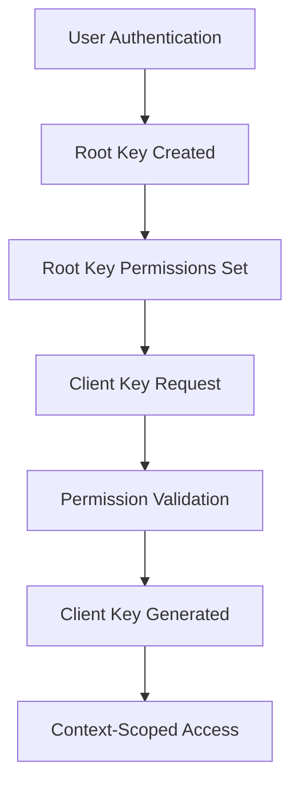

# Calimero Authentication Service

A production-ready forward authentication service implementing hierarchical key management with pluggable providers and comprehensive security features.

## Architecture Overview

The service implements **Forward Authentication** pattern where a reverse proxy delegates authentication decisions to this service. The node remains completely authentication-unaware.

```
┌─────────────┐    ┌──────────────┐    ┌─────────────┐    ┌──────────┐
│   Client    │───▶│ Reverse Proxy│───▶│ Auth Service│    │   Node   │
│             │    │   (nginx/    │    │             │    │          │
│             │    │   traefik)   │    │             │    │          │
└─────────────┘    └──────────────┘    └─────────────┘    └──────────┘
                           │                    │
                           │                    │
                           ▼                    ▼
                    /auth/validate       JWT validation
                    (token check)        & permission check
```

### Key Components

- **Hierarchical Keys**: Root keys (identity) + Client keys (context-scoped)
- **Provider System**: Pluggable authentication backends
- **Secret Management**: Encrypted storage of JWT secrets and keys
- **Permission System**: Granular resource-based permissions
- **Storage Layer**: Pluggable storage backends (RocksDB, Memory)

## Quick Start

### Development Mode
```bash
# Run with minimal configuration
cargo run --bin calimero-auth -- --bind 0.0.0.0:3001

# Test endpoints
curl http://localhost:3001/auth/identity
curl http://localhost:3001/auth/providers
```

### Production Mode
```bash
# With configuration file
cargo run --bin calimero-auth -- --config config.toml
```

## Configuration

### Basic Configuration (`config.toml`)
```toml
listen_addr = "0.0.0.0:3001"

[jwt]
issuer = "calimero-auth"
access_token_expiry = 3600      # 1 hour
refresh_token_expiry = 2592000  # 30 days

[storage]
type = "rocksdb"  # or "memory"
path = "/data/auth_db"

[cors]
allow_all_origins = true
allowed_methods = ["GET", "POST", "PUT", "DELETE", "OPTIONS"]
allowed_headers = ["Authorization", "Content-Type", "Accept"]

[security]
max_body_size = 1048576  # 1MB
[security.rate_limit]
rate_limit_rpm = 50
rate_limit_burst = 5

[security.headers]
enabled = true
hsts_max_age = 31536000
frame_options = "DENY"

[providers]
near_wallet = true

[near]
network = "testnet"
rpc_url = "https://rpc.testnet.near.org"
wallet_url = "https://wallet.testnet.near.org"
```

### Environment Variables
All configuration can be overridden via environment variables using `AUTH_` prefix:
```bash
AUTH_LISTEN_ADDR="0.0.0.0:3001"
AUTH_JWT__ISSUER="my-issuer"
AUTH_STORAGE__TYPE="rocksdb"
AUTH_STORAGE__PATH="/data/auth"
AUTH_PROVIDERS__NEAR_WALLET=true
```

## Root and Client Keys

### Hierarchical Key System

The service implements a two-tier key system:

1. **Root Keys** - Identity-level authentication
   - Prove "who you are"
   - Created through provider authentication (wallet, OAuth, etc.)
   - Can create client keys with limited permissions
   - Long-lived, user-managed

2. **Client Keys** - Context-scoped authorization
   - Grant "what you can do" in specific contexts
   - Inherit subset of root key permissions
   - Short-lived, application-managed
   - Tied to specific contexts/resources

### Key Lifecycle



### Key Storage Structure
```
Keys:
├── root:{key_id}           # Root key data
├── client:{key_id}         # Client key data
├── root_clients:{root_id}  # Client key index
└── permissions:{key_id}    # Key permissions
```

## Authentication Flow

### 1. Root Key Authentication
```bash
# Get challenge
curl -s http://localhost:3001/auth/challenge

# Sign challenge with wallet (browser/CLI)
# Exchange for root key JWT
curl -X POST http://localhost:3001/auth/token \
  -H 'Content-Type: application/json' \
  -d '{
    "auth_method": "near_wallet",
    "public_key": "ed25519:...",
    "client_name": "My App",
    "timestamp": 1234567890,
    "provider_data": {
      "wallet_address": "user.testnet",
      "signature": "...",
      "message": "challenge"
    }
  }'
```

### 2. Client Key Generation
```bash
# Use root key to generate client key
curl -X POST http://localhost:3001/admin/client-key \
  -H "Authorization: Bearer $ROOT_KEY_JWT" \
  -d '{
    "context_id": "01J7XS...",
    "context_identity": "user.testnet",
    "permissions": ["context:read", "context:execute"]
  }'
```

## API Endpoints

### Public Endpoints (No Authentication)
```
GET  /auth/login              # React SPA for authentication
GET  /auth/challenge          # Get signing challenge
POST /auth/token              # Exchange challenge for root key JWT
POST /auth/refresh            # Refresh expired tokens
GET  /auth/providers          # List available providers
GET  /auth/identity           # Service information
GET  /auth/validate           # Forward auth validation endpoint
POST /auth/validate           # (same as above, for proxies)
```

### Protected Endpoints (Require Root Key JWT)
```
# Root Key Management
GET    /admin/keys                           # List root keys
POST   /admin/keys                           # Create root key
DELETE /admin/keys/{key_id}                  # Delete root key

# Client Key Management  
GET    /admin/keys/clients                   # List client keys
POST   /admin/client-key                     # Generate client key
DELETE /admin/keys/{key_id}/clients/{client_id} # Delete client key

# Permission Management
GET    /admin/keys/{key_id}/permissions      # Get key permissions
PUT    /admin/keys/{key_id}/permissions      # Update permissions

# Token Management
POST   /admin/revoke                         # Revoke current token

# System
GET    /admin/metrics                        # Service metrics
```

## Permissions System

### Permission Structure
```rust
pub enum Permission {
    Keys(KeyPermission),           // Key management
    Context(ContextPermission),    // Context operations  
    Application(ApplicationPermission), // Application management
    Alias(AliasPermission),        // Alias management
    Blob(BlobPermission),          // Blob operations
}
```

### Permission Examples
```json
{
  "permissions": [
    "keys:create",
    "keys:list", 
    "context:read:global",
    "context:execute:specific:01J7XS...",
    "application:install:global",
    "alias:create:specific:my-alias"
  ]
}
```

### Permission Validation
The service validates permissions for each request by:
1. Extracting JWT from Authorization header
2. Decoding token and extracting permissions
3. Matching request path/method to required permissions
4. Allowing/denying based on permission check

### Path-to-Permission Mapping
```rust
// Example mappings in validator.rs
"/admin/keys" + GET    -> Permission::Keys(KeyPermission::List)
"/admin/keys" + POST   -> Permission::Keys(KeyPermission::Create)  
"/admin/contexts/{id}" -> Permission::Context(ContextPermission::Read(Specific(id)))
```

## Authentication Providers

### Provider Interface
```rust
#[async_trait]
pub trait AuthProvider: Send + Sync {
    fn name(&self) -> &str;
    fn provider_type(&self) -> &str;
    fn description(&self) -> &str;
    fn supports_method(&self, method: &str) -> bool;
    fn is_configured(&self) -> bool;
    
    async fn authenticate(&self, request: &AuthRequest) -> Result<AuthResponse>;
    async fn verify_signature(&self, data: &VerificationData) -> Result<bool>;
    fn get_config_options(&self) -> serde_json::Value;
}
```

### Available Providers

#### NEAR Wallet Provider (`near_wallet`)
- **Location**: `src/providers/impls/near_wallet.rs`
- **Authentication**: NEAR wallet signature verification
- **Configuration**: Network, RPC URL, wallet URL
- **Flow**: Challenge → Sign → Verify → Root Key

### Creating Custom Providers
```rust
// src/providers/impls/my_provider.rs
pub struct MyProvider {
    config: MyConfig,
}

#[async_trait]
impl AuthProvider for MyProvider {
    fn name(&self) -> &str { "my_provider" }
    
    async fn authenticate(&self, request: &AuthRequest) -> Result<AuthResponse> {
        // 1. Extract provider_data from request
        // 2. Verify signature/credentials
        // 3. Return AuthResponse with user info
    }
    
    async fn verify_signature(&self, data: &VerificationData) -> Result<bool> {
        // Implement signature verification logic
    }
}
```

### Provider Registration
```rust
// src/providers/mod.rs
pub fn create_providers(
    storage: Arc<dyn Storage>,
    config: &AuthConfig,
    token_manager: TokenManager,
) -> Result<Vec<Box<dyn AuthProvider>>> {
    let mut providers = Vec::new();
    
    if config.providers.get("near_wallet").unwrap_or(&false) {
        providers.push(Box::new(NearWalletProvider::new(config.near.clone())?));
    }
    
    // Add your provider here
    if config.providers.get("my_provider").unwrap_or(&false) {
        providers.push(Box::new(MyProvider::new(config.my_config.clone())?));
    }
    
    Ok(providers)
}
```

## Storage Layer

### Storage Interface
```rust
#[async_trait]
pub trait Storage: Send + Sync {
    async fn get(&self, key: &str) -> Result<Option<Vec<u8>>>;
    async fn set(&self, key: &str, value: &[u8]) -> Result<()>;
    async fn delete(&self, key: &str) -> Result<()>;
    async fn exists(&self, key: &str) -> Result<bool>;
    async fn list_keys(&self, prefix: &str) -> Result<Vec<String>>;
}
```

### Available Storage Backends

#### RocksDB Storage (Production)
```toml
[storage]
type = "rocksdb"
path = "/data/auth_db"
```

#### Memory Storage (Development)
```toml
[storage]
type = "memory"
```

### Custom Storage Implementation
```rust
pub struct MyStorage {
    // Your storage implementation
}

#[async_trait]
impl Storage for MyStorage {
    async fn get(&self, key: &str) -> Result<Option<Vec<u8>>> {
        // Implement get logic
    }
    
    async fn set(&self, key: &str, value: &[u8]) -> Result<()> {
        // Implement set logic
    }
    
    // ... other methods
}
```

## Secret Management

### JWT Secret Handling
The service automatically generates and manages JWT signing secrets:

1. **Secret Generation**: 32-byte cryptographically secure random secrets generated on first startup
2. **Storage**: Stored as base64-encoded JSON in the configured storage backend
3. **Key Rotation**: Supports secret rotation with grace periods (24h rotation, 48h grace period)
4. **Security**: Secrets never logged or exposed, stored with versioning and expiration

### Secret Storage Structure
```
Secrets:
├── system:secrets:jwt_auth           # JWT auth signing secret
├── system:secrets:jwt_challenge      # JWT challenge signing secret  
├── system:secrets:csrf               # CSRF protection secret
├── system:secrets:jwt_auth_backup    # Backup auth secret
├── system:secrets:jwt_challenge_backup # Backup challenge secret
└── system:secrets:csrf_backup        # Backup CSRF secret
```

### Secret Manager Interface
```rust
impl SecretManager {
    pub async fn initialize(&self) -> Result<()>;
    pub async fn get_secret(&self, secret_type: SecretType) -> Result<String>;
    pub async fn rotate_secret(&self, secret_type: SecretType) -> Result<()>;
    pub async fn get_jwt_auth_secret(&self) -> Result<String>;
    pub async fn get_jwt_challenge_secret(&self) -> Result<String>;
    pub async fn get_csrf_secret(&self) -> Result<String>;
}
```

### Security Details
- **Secret Generation**: Cryptographically secure random number generation
- **Storage Format**: JSON serialized with base64-encoded secret values
- **Rotation**: Automatic rotation with configurable intervals and grace periods
- **Backup Strategy**: Primary + backup storage locations for resilience
- **Memory Safety**: Secrets cleared from memory after use

## Request Handlers

### Handler Structure
All handlers follow this pattern:
```rust
pub async fn handler_name(
    state: Extension<Arc<AppState>>,
    // Other extractors (Query, Json, Path, etc.)
) -> impl IntoResponse {
    // 1. Validate input
    // 2. Check permissions (if protected)
    // 3. Execute business logic
    // 4. Return standardized response
}
```

### Response Format
```json
{
  "data": { /* response data */ },
  "error": null
}
```

### Error Response
```json
{
  "data": null,
  "error": "Error message"
}
```

### Key Handlers

#### Authentication Handlers (`src/api/handlers/auth.rs`)
- `login_handler`: Serves React SPA for interactive auth
- `challenge_handler`: Generates signing challenges  
- `token_handler`: Exchanges signed challenge for JWT
- `refresh_token_handler`: Refreshes expired tokens
- `validate_handler`: Validates tokens for forward auth

#### Key Management Handlers (`src/api/handlers/root_keys.rs`, `src/api/handlers/client_keys.rs`)
- `list_keys_handler`: Lists user's keys
- `create_key_handler`: Creates new root keys
- `delete_key_handler`: Revokes keys
- `generate_client_key_handler`: Creates client keys

#### Permission Handlers (`src/api/handlers/permissions.rs`)
- `get_key_permissions_handler`: Gets key permissions
- `update_key_permissions_handler`: Updates permissions

## Development

### Running Tests
```bash
# Unit tests
cargo test

# Integration tests
cargo test --test integration

# Specific test module
cargo test auth::token
```

### Development Mode
```bash
# Enable debug logging
RUST_LOG=debug cargo run --bin calimero-auth

# Test with curl
curl -v http://localhost:3001/auth/identity
```

### Frontend Development
```bash
cd frontend
npm install
npm run dev  # Starts on http://localhost:5173
```

## Production Deployment

### Docker
```dockerfile
FROM rust:1.75 as builder
WORKDIR /app
COPY . .
RUN cargo build --release --bin calimero-auth

FROM debian:bookworm-slim
RUN apt-get update && apt-get install -y ca-certificates
COPY --from=builder /app/target/release/calimero-auth /usr/local/bin/
EXPOSE 3001
CMD ["calimero-auth", "--config", "/config/auth.toml"]
```

### Reverse Proxy Configuration

#### Nginx
```nginx
server {
    listen 80;
    server_name api.example.com;
    
    # Auth service routes
    location /auth/ {
        proxy_pass http://auth:3001;
    }
    
    location /admin/ {
        proxy_pass http://auth:3001;
    }
    
    # Protected routes (forward auth)
    location / {
        auth_request /auth-check;
        proxy_pass http://node:2428;
    }
    
    location = /auth-check {
        internal;
        proxy_pass http://auth:3001/auth/validate;
        proxy_pass_request_body off;
        proxy_set_header Content-Length "";
        proxy_set_header X-Original-URI $request_uri;
    }
}
```

#### Traefik
```yaml
# docker-compose.yml
services:
  auth:
    image: calimero/auth:latest
    labels:
      - "traefik.http.routers.auth.rule=PathPrefix(`/auth`) || PathPrefix(`/admin`)"
      - "traefik.http.middlewares.auth-forward.forwardauth.address=http://auth:3001/auth/validate"
      
  node:
    image: calimero/node:latest
    labels:
      - "traefik.http.routers.node.rule=!PathPrefix(`/auth`) && !PathPrefix(`/admin`)"
      - "traefik.http.routers.node.middlewares=auth-forward"
```

## Security Features

### Built-in Security
- **Rate Limiting**: Configurable request limiting
- **CORS**: Cross-origin request handling
- **Security Headers**: HSTS, CSP, X-Frame-Options
- **Input Validation**: Request validation with error handling
- **JWT Security**: Short-lived tokens with refresh rotation

### Security Headers
```rust
// Automatically added security headers
"Strict-Transport-Security": "max-age=31536000; includeSubDomains"
"X-Frame-Options": "DENY"
"X-Content-Type-Options": "nosniff"
"Referrer-Policy": "strict-origin-when-cross-origin"
"Content-Security-Policy": "default-src 'self'; script-src 'self' 'unsafe-inline'"
```

## Monitoring

### Health Checks
```bash
# Service health
curl http://localhost:3001/auth/health

# Service identity  
curl http://localhost:3001/auth/identity
```

### Metrics (Protected)
```bash
curl -H "Authorization: Bearer $JWT" \
     http://localhost:3001/admin/metrics
```

### Logging
```bash
# Configure logging levels
RUST_LOG=calimero_auth=debug,tower_http=info cargo run --bin calimero-auth
```

## Troubleshooting

### Common Issues

1. **"No authentication providers available"**
   - Check provider configuration in config.toml
   - Ensure provider dependencies are available

2. **"Storage initialization failed"**
   - Check storage path permissions
   - Verify storage type configuration

3. **"JWT secret generation failed"**
   - Check storage write permissions
   - Verify storage backend is accessible

4. **"Forward auth validation failed"**
   - Check reverse proxy configuration
   - Verify auth endpoint is reachable
   - Check JWT token format

### Debug Mode
```bash
RUST_LOG=trace cargo run --bin calimero-auth -- --config config.toml
```

## License

Licensed under [MIT OR Apache-2.0](../../LICENSE)
