# calimero-dag

Pure DAG (Directed Acyclic Graph) for causal delta tracking with automatic dependency resolution.

## What It Does

Manages causal relationships between state changes (deltas), ensuring they're applied in the correct order even when received out-of-order over the network.

```rust
// Deltas can arrive in any order
receive(Delta3);  // parents: [Delta2] → buffered (waiting)
receive(Delta2);  // parents: [Delta1] → buffered (waiting)
receive(Delta1);  // parents: [Delta0] → applied!
                  //                   → triggers Delta2
                  //                   → triggers Delta3
// Result: All 3 deltas applied in correct causal order
```

### DAG Structure Visualization


## Core Types

```rust
use calimero_dag::{DagStore, CausalDelta, DeltaApplier};

// Delta with parent references
pub struct CausalDelta<T> {
    pub id: [u8; 32],           // Unique ID (content hash)
    pub parents: Vec<[u8; 32]>, // Parent IDs (causal dependencies)
    pub payload: T,             // Your delta content
    pub timestamp: u64,         // Creation time
}

// DAG manager
pub struct DagStore<T> {
    deltas: HashMap<[u8; 32], CausalDelta<T>>,  // All seen deltas
    applied: HashSet<[u8; 32]>,                  // Successfully applied
    pending: HashMap<[u8; 32], PendingDelta<T>>, // Waiting for parents
    heads: HashSet<[u8; 32]>,                    // Current tips
}
```

## Usage

### 1. Define How to Apply Deltas

```rust
use async_trait::async_trait;

struct MyApplier;

#[async_trait]
impl DeltaApplier<MyPayload> for MyApplier {
    async fn apply(&self, delta: &CausalDelta<MyPayload>) -> Result<(), ApplyError> {
        // Your logic: write to database, update state, etc.
        apply_to_storage(&delta.payload)?;
        Ok(())
    }
}
```

### 2. Create DAG and Add Deltas

```rust
let mut dag = DagStore::new([0; 32]);  // Start from root
let applier = MyApplier;

let delta = CausalDelta {
    id: [1; 32],
    parents: dag.get_heads(),  // Build on current heads
    payload: my_changes,
    timestamp: now(),
};

match dag.add_delta(delta, &applier).await? {
    true => println!("Applied immediately"),
    false => println!("Pending (waiting for parents)"),
}
```

### 3. Handle Missing Parents

```rust
// Check what's missing
let missing = dag.get_missing_parents();

// Request from network
    for parent_id in missing {
    let parent_delta = request_from_peer(parent_id).await?;
    dag.add_delta(parent_delta, &applier).await?;  // Triggers cascade
}
```

## Key Features

### Delta State Machine


### Out-of-Order Delivery


### Concurrent Updates (Forks)

```
Initial: heads = [Delta5]

Node A creates Delta6A (parents: [Delta5])
Node B creates Delta6B (parents: [Delta5])

After both received:
  heads = [Delta6A, Delta6B]  ← Fork detected!

Next delta merges:
  Delta7 (parents: [Delta6A, Delta6B])
  heads = [Delta7]  ← Fork resolved
```

### Automatic Cascade

```
Add Delta1 (applies immediately)
  → Unlocks Delta2 (was pending, now applies)
    → Unlocks Delta4 (was pending, now applies)
  → Unlocks Delta3 (was pending, now applies)

One delta can trigger a cascade of pending applications.
```

## API Reference

```rust
// Add delta
let applied: bool = dag.add_delta(delta, &applier).await?;

// Query state
let heads: Vec<[u8; 32]> = dag.get_heads();
let missing: Vec<[u8; 32]> = dag.get_missing_parents();
let delta: Option<&CausalDelta<T>> = dag.get_delta(&id);

// Cleanup
let evicted: usize = dag.cleanup_stale(max_age);

// Stats
let stats = dag.pending_stats();
println!("Pending: {}, Missing: {}", stats.count, stats.total_missing_parents);
```

## Integration with calimero-node

```rust
// Node wraps DAG with WASM execution
pub struct DeltaStore {
    dag: Arc<RwLock<DagStore<Vec<Action>>>>,
    applier: Arc<ContextStorageApplier>,
}

// Applier connects DAG to WASM
impl DeltaApplier<Vec<Action>> for ContextStorageApplier {
    async fn apply(&self, delta: &CausalDelta<Vec<Action>>) -> Result<(), ApplyError> {
        // Serialize actions
        let artifact = borsh::to_vec(&StorageDelta::Actions(delta.payload.clone()))?;
        
        // Execute in WASM
        let outcome = self.context_client
            .execute(&self.context_id, &self.our_identity, 
                    "__calimero_sync_next", artifact, vec![], None)
            .await?;
        
        Ok(())
    }
}
```

## Design Principles

- **Pure logic**: No network, storage, or WASM dependencies
- **Generic payloadMenuWorks with any delta content type `T`
- **Dependency injectionMenuApplier pattern for testability
- **Memory-only**: DAG state in RAM (persistence handled by wrapper)

## Performance

**Memory**: ~200 bytes + payload size per delta

**Time Complexity**:
- `add_delta`: O(1) if applied, O(P) if pending (check for unlocked children)
- `get_heads`: O(H) where H = head count (typically 1-10)
- `cleanup_stale`: O(P) where P = pending count

**CascadeMenuO(N) where N = total pending deltas that become ready

## Testing

```bash
cargo test -p calimero-dag

# Run all tests
cargo test -p calimero-dag

# Run specific test
cargo test -p calimero-dag test_dag_out_of_order -- --nocapture
```

### Test Coverage

The DAG crate has **comprehensive test coverage** with 30+ tests validating all critical scenarios.

#### Test 1: Linear Sequence (Basic Functionality)

```mermaid
sequenceDiagram
    participant Test
    participant DAG
    participant Applier
    
    Note over Test: Create chain: root → D1 → D2 → D3
    
    Test->>DAG: add_delta(D1, parents: [root])
    DAG->>DAG: Check parents: root ✅
    DAG->>Applier: apply(D1)
    Applier-->>DAG: Applied
    DAG-->>Test: ✅ applied = true
    
    Test->>DAG: add_delta(D2, parents: [D1])
    DAG->>DAG: Check parents: D1 ✅
    DAG->>Applier: apply(D2)
    Applier-->>DAG: Applied
    DAG-->>Test: ✅ applied = true
    
    Test->>DAG: add_delta(D3, parents: [D2])
    DAG->>DAG: Check parents: D2 ✅
    DAG->>Applier: apply(D3)
    Applier-->>DAG: Applied
    DAG-->>Test: ✅ applied = true
    
    Test->>DAG: get_heads()
    DAG-->>Test: [D3]
    
    Test->>Applier: get_applied()
    Applier-->>Test: [D1, D2, D3]
    
    Note over Test: ✅ PASS: All applied in order
```



**What it validates**: Sequential deltas apply in order, heads track correctly.

#### Test 2: Out-of-Order Delivery (Buffering + Cascade)

```mermaid
graph TB
    subgraph "Step 1: Receive D2 (D1 missing)"
        R1[Receive D2<br/>parents: D1]
        C1{D1 applied?}
        P1[❌ No - Buffer as pending]
        
        R1 --> C1 --> P1
    end
    
    subgraph "Step 2: Check State"
        S1[DAG state:<br/>pending = {D2}<br/>missing = {D1}<br/>heads = {root}]
        A1[Applier:<br/>applied = empty]
        
        P1 --> S1
        P1 --> A1
    end
    
    subgraph "Step 3: Receive D1"
        R2[Receive D1<br/>parents: root]
        C2{root applied?}
        AP1[✅ Yes - Apply D1]
        
        R2 --> C2 --> AP1
    end
    
    subgraph "Step 4: Cascade"
        CH[Check pending for D1]
        F[Found D2 waiting for D1!]
        AP2[Apply D2 CASCADE]
        
        AP1 --> CH --> F --> AP2
    end
    
    subgraph "Final State"
        FS[DAG state:<br/>pending = empty<br/>heads = {D2}]
        FA[Applier:<br/>applied = {D1, D2}]
        
        AP2 --> FS
        AP2 --> FA
    end
    
    style P1 fill:#FFB84D,stroke:#333,stroke-width:3px,color:#000
    style S1 fill:#FF6B6B,stroke:#333,stroke-width:3px,color:#000
    style AP1 fill:#4ECDC4,stroke:#333,stroke-width:3px,color:#000
    style AP2 fill:#4ECDC4,stroke:#333,stroke-width:3px,color:#000
    style FS fill:#51CF66,stroke:#333,stroke-width:3px,color:#000
    style FA fill:#51CF66,stroke:#333,stroke-width:3px,color:#000
```

**What it validates**: 
- Deltas with missing parents buffer correctly
- Cascade triggers when parent arrives
- Correct application order maintained

**Code**: `test_dag_out_of_order`, `test_dag_deep_pending_chain`

#### Test 3: Concurrent Updates (Fork Detection)

```mermaid
graph TB
    subgraph "Setup: Two nodes update simultaneously"
        I[Initial state<br/>heads = {root}]
        
        D1A[Node A creates D1A<br/>parents: root<br/>value: 10]
        D1B[Node B creates D1B<br/>parents: root<br/>value: 20]
        
        I --> D1A
        I --> D1B
    end
    
    subgraph "Apply Both Deltas"
        A1[add_delta D1A]
        A2[add_delta D1B]
        
        D1A --> A1
        D1B --> A2
        
        A1 --> H1[heads = {D1A}]
        A2 --> H2[heads = {D1A, D1B}]
    end
    
    subgraph "Fork Detected"
        H2 --> FK[⚠️ TWO HEADS<br/>Fork detected!]
    end
    
    subgraph "Merge Delta"
        M[Create merge:<br/>D2<br/>parents: {D1A, D1B}]
        AM[add_delta D2]
        
        FK --> M --> AM
    end
    
    subgraph "Final State"
        FH[heads = {D2}<br/>✅ Fork resolved]
        
        AM --> FH
    end
    
    style I fill:#4DABF7,stroke:#333,stroke-width:3px,color:#000
    style D1A fill:#FF6B6B,stroke:#333,stroke-width:3px,color:#000
    style D1B fill:#FF6B6B,stroke:#333,stroke-width:3px,color:#000
    style FK fill:#FFB84D,stroke:#333,stroke-width:3px,color:#000
    style M fill:#4ECDC4,stroke:#333,stroke-width:3px,color:#000
    style FH fill:#51CF66,stroke:#333,stroke-width:3px,color:#000
```

**What it validates**:
- Multiple heads tracked correctly
- Fork detection works
- Merge delta resolves fork

**Code**: `test_dag_concurrent_updates`, `test_dag_merge_concurrent_branches`, `test_dag_three_way_merge`

#### Test 4: Extreme Stress (Production Readiness)

```mermaid
flowchart LR
    subgraph "500-Delta Chain (Reverse Order)"
        S1[Create deltas<br/>D1→D2→...→D500]
        S2[Add in reverse<br/>D500, D499, ..., D1]
        S3[All buffer as pending<br/>499 deltas waiting]
        S4[Cascade from D1<br/>applies all 500]
        
        S1 --> S2 --> S3 --> S4
    end
    
    subgraph "200 Concurrent Branches"
        C1[Create 200 branches<br/>from root]
        C2[All apply immediately<br/>200 heads]
        C3[Create merge delta<br/>with 200 parents]
        C4[Single head after merge]
        
        C1 --> C2 --> C3 --> C4
    end
    
    subgraph "1000 Random Order"
        R1[Create chain<br/>D1→D2→...→D1000]
        R2[Shuffle randomly]
        R3[Apply in random order]
        R4[All resolve correctly]
        
        R1 --> R2 --> R3 --> R4
    end
    
    style S4 fill:#51CF66,stroke:#333,stroke-width:3px,color:#000
    style C4 fill:#51CF66,stroke:#333,stroke-width:3px,color:#000
    style R4 fill:#51CF66,stroke:#333,stroke-width:3px,color:#000
```



**What it validates**:
- Large pending buffers work (500 deltas)
- Massive fan-out merges work (200 parents)
- Random ordering always converges
- No memory leaks or panics

**Code**: `test_extreme_pending_chain_500_deltas`, `test_extreme_concurrent_branches_200`, `test_extreme_random_order_1000_deltas`

### Key Test Categories

| Category | Tests | What They Validate |
|----------|-------|-------------------|
| **Basic Functionality** | 4 tests | Creation, linear sequences, duplicates |
| **Out-of-Order** | 4 tests | Buffering, cascade, deep chains |
| **Concurrent Updates** | 5 tests | Forks, merges, complex topology |
| **Error Handling** | 2 tests | Apply failures, recovery |
| **Pending Management** | 4 tests | Stats, cleanup, missing parents |
| **Query & Inspection** | 4 tests | has_delta, get_delta, get_deltas_since |
| **Stress Tests** | 3 tests | 100+ deltas, branches, chains |
| **Extreme Stress** | 5 tests | 500-1000 deltas, random order |

**Total: 31 tests** covering all production scenarios.

## Comparison: DAG vs Vector Clocks

| Feature | DAG (Calimero) | Vector Clocks |
|---------|----------------|---------------|
| **Causality** | Explicit parent refs | Implicit counters |
| **Structure** | Concrete deltas | Abstract |
| **Merging** | CRDT payload | External logic |
| **Partial state** | ✅ Supported | ❌ Need full history |

## Documentation

For complete documentation, see the **[Documentation Index](readme/DOCUMENTATION_INDEX.md)**.

**Key Guides:**
- **[Architecture](readme/architecture.md)** - Internal design and data structures
- **[API Reference](readme/api-reference.md)** - Complete API documentation
- **[Performance Guide](readme/performance.md)** - Complexity analysis and benchmarks
- **[Testing Guide](readme/testing-guide.md)** - Test coverage and examples
- **[Troubleshooting](readme/troubleshooting.md)** - Common issues and solutions

## See Also

- [calimero-node](../node/README.md) - How DAG integrates with node runtime
- [calimero-storage](../storage/README.md) - CRDT actions that flow through DAG

## License

See [COPYRIGHT](../../COPYRIGHT) and [LICENSE.md](../../LICENSE.md) in the repository root.
