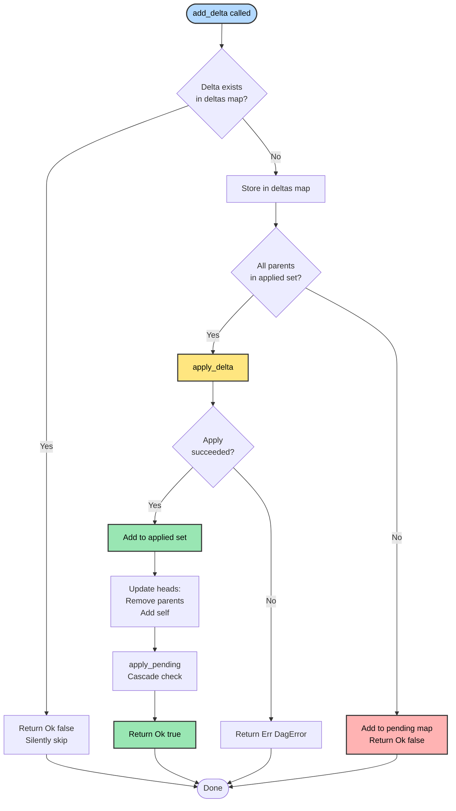
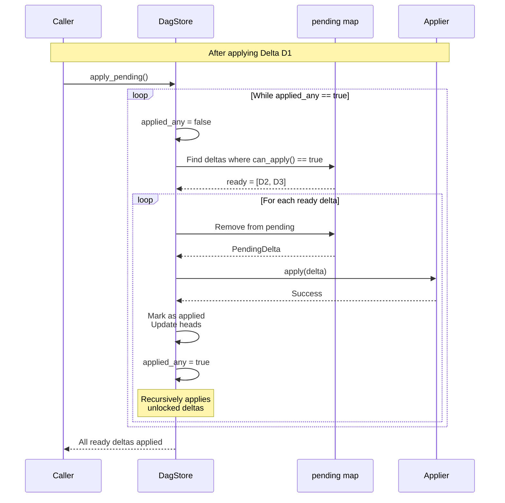

# DAG Architecture

Internal design and implementation details of the Calimero DAG.

---

## Overview

The DAG is implemented as a pure, in-memory data structure that manages causal relationships between deltas. It has **no external dependencies** on storage, network, or WASM, making it easy to test and reuse.

**Core Principle**: Separation of concerns through dependency injection (DeltaApplier trait).

---

## Data Structures

### DagStore<T>

```rust
pub struct DagStore<T> {
    // All deltas we've seen (both applied and pending)
    deltas: HashMap<[u8; 32], CausalDelta<T>>,
    
    // Deltas we've successfully applied
    applied: HashSet<[u8; 32]>,
    
    // Deltas waiting for parents
    pending: HashMap<[u8; 32], PendingDelta<T>>,
    
    // Current heads (deltas with no children yet)
    heads: HashSet<[u8; 32]>,
    
    // Root delta (genesis)
    root: [u8; 32],
}
```

**Design Decisions**:

1. **HashMap for `deltas`**: O(1) lookup by ID
2. **HashSet for `applied`**: O(1) parent existence check
3. **HashMap for `pending`**: O(1) lookup and removal when ready
4. **HashSet for `heads`**: O(1) insert/remove, handles concurrent updates naturally

### PendingDelta<T>

Tracks pending deltas with timeout metadata:

```rust
struct PendingDelta<T> {
    delta: CausalDelta<T>,
    received_at: Instant,  // For timeout eviction
}
```

**Why track timestamp?**
- Enables stale delta cleanup
- Prevents unbounded memory growth
- Identifies deltas stuck waiting (diagnostic)

---

## Core Algorithms

### 1. Delta Addition (`add_delta`)



**Time Complexity**: O(1) for check + O(P) for cascade where P = pending count

### 2. Parent Check (`can_apply`)

```rust
fn can_apply(&self, delta: &CausalDelta<T>) -> bool {
    delta.parents.iter().all(|p| self.applied.contains(p))
}
```

**Why efficient?**
- HashSet lookup is O(1)
- Typical parent count: 1-3 (rarely >5)
- Total: O(k) where k = parent count ≈ O(1)

### 3. Cascade Application (`apply_pending`)



**Why loop until no changes?**
- One delta might unlock multiple others
- Each application might unlock more
- Example: D1 unlocks D2, D2 unlocks D3, D3 unlocks D4

**Time Complexity**: O(N × P) where:
- N = number of deltas that become ready
- P = pending count (to scan for ready deltas)

**Optimization Potential** (future):
- Track which deltas wait for which parents
- Reverse index: `parent_id → [child_ids]`
- Reduces scan from O(P) to O(children)

### 4. Head Management

**Rule**: A delta is a head if it has been applied but has no applied children.

**Updates happen in two places**:

1. **When delta is applied**:
```rust
// Remove parents from heads
for parent in &delta.parents {
    self.heads.remove(parent);
}
// Add this delta as new head
self.heads.insert(delta.id);
```

2. **Automatically handles forks**:
```
Initial: heads = {D0}

Apply D1A (parents: [D0]): heads = {D1A}
Apply D1B (parents: [D0]): heads = {D1A, D1B}  ← Fork!

Apply D2 (parents: [D1A, D1B]): heads = {D2}   ← Merged
```

---

## Pending Buffer Implementation

### Adding to Pending

```rust
if !self.can_apply(&delta) {
    self.pending.insert(delta_id, PendingDelta::new(delta));
    return Ok(false);
}
```

**Key Properties**:
- Pending deltas are also stored in `deltas` map (for deduplication)
- `PendingDelta` wrapper adds `received_at` timestamp
- No limit on pending count (caller's responsibility to cleanup)

### Removing from Pending

Happens in three scenarios:

1. **Parents arrive (cascade)**:
```rust
for id in ready {
    if let Some(pending) = self.pending.remove(&id) {
        self.apply_delta(pending.delta, applier).await?;
    }
}
```

2. **Timeout (cleanup)**:
```rust
self.pending.retain(|_id, pending| pending.age() <= max_age);
```

3. **Manual eviction** (future):
- Based on count limit
- Based on memory pressure

### Finding Missing Parents

```rust
pub fn get_missing_parents(&self) -> Vec<[u8; 32]> {
    let mut missing = HashSet::new();
    
    for pending in self.pending.values() {
        for parent in &pending.delta.parents {
            // Not in deltas map at all = missing
            if !self.deltas.contains_key(parent) {
                missing.insert(*parent);
            }
        }
    }
    
    missing.into_iter().collect()
}
```

**Note**: Missing ≠ Unapplied
- Missing: Not in `deltas` map (never seen)
- Unapplied: In `deltas` but not in `applied` (seen but pending)

---

## Fork Detection and Resolution

### Fork Detection

Forks are detected by **head count**:

```rust
let heads = dag.get_heads();
if heads.len() > 1 {
    // Fork detected!
}
```

**Why multiple heads indicate a fork?**

```
Scenario: Two nodes update simultaneously

Node A:                Node B:
D0 (head)             D0 (head)
  ↓                     ↓
Create D1A            Create D1B
parents: [D0]         parents: [D0]

After both received:
heads = {D1A, D1B}  ← Fork!
```

### Fork Resolution

**DAG layer**: Only tracks structure, doesn't auto-resolve

**Node layer**: Responsible for creating merge delta

```rust
// Node layer (future implementation)
if dag.get_heads().len() > 1 {
    let merge_delta = CausalDelta::new(
        new_id,
        dag.get_heads(),  // All heads as parents
        empty_payload,    // No state changes
        hlc,
    );
    dag.add_delta(merge_delta, &applier).await?;
}
```

**After merge**:
```
D1A ──┐
      └──> D2 (merge)
D1B ──┘

heads = {D2}  ← Resolved!
```

---

## Memory Layout

### Per-Delta Overhead

```
CausalDelta<T>:
  - id: 32 bytes
  - parents: Vec (24 bytes + 32 × parent_count)
  - payload: sizeof(T)
  - hlc: 16 bytes (u64 + u32 + padding)
  
Total: ~72 bytes + payload + (32 × parents)
```

**Typical delta**: 72 + 5KB payload + 32 bytes = ~5.1 KB

### DagStore Memory

For 1000 applied deltas:

```
deltas map:     1000 × 5.1 KB = 5.1 MB
applied set:    1000 × 32 bytes = 32 KB
pending map:    0-100 × 5.1 KB = 0-510 KB
heads set:      1-10 × 32 bytes = 32-320 bytes

Total: ~5-6 MB typical
```

**Memory growth**:
- Linear with delta count
- No pruning implemented (yet)
- Pending buffer bounded by timeout cleanup

---

## Concurrency Considerations

### Current Design (Single-Threaded)

DAG operations are **not thread-safe**:
- No internal locking
- Caller must synchronize access

### Node Layer Wrapping

```rust
// Node layer wraps in Arc<RwLock<>>
pub struct DeltaStore {
    dag: Arc<RwLock<DagStore<Vec<Action>>>>,
    applier: Arc<ContextStorageApplier>,
}

impl DeltaStore {
    pub async fn add_delta(&self, delta: CausalDelta<Vec<Action>>) -> Result<bool> {
        let mut dag = self.dag.write().await;  // Exclusive lock
        dag.add_delta(delta, &*self.applier).await
    }
}
```

**Implications**:
- One writer at a time per context
- Readers blocked during writes
- WASM execution inside write lock (slow!)

**Future Optimization**:
- Fine-grained locking (separate locks for applied, pending, heads)
- Lock-free data structures
- Reader-writer optimizations

---

## Topological Ordering

### get_deltas_since Algorithm

```rust
pub fn get_deltas_since(&self, ancestor: [u8; 32]) -> Vec<CausalDelta<T>> {
    let mut result = Vec::new();
    let mut visited = HashSet::new();
    let mut queue = VecDeque::from_iter(self.heads.iter().copied());
    
    while let Some(id) = queue.pop_front() {
        if visited.contains(&id) || id == ancestor {
            continue;
        }
        
        visited.insert(id);
        
        if let Some(delta) = self.deltas.get(&id) {
            result.push(delta.clone());
            
            // BFS: Visit parents next
            for parent in &delta.parents {
                queue.push_back(*parent);
            }
        }
    }
    
    result
}
```

**Why BFS (Breadth-First Search)?**
- Visits deltas in roughly reverse chronological order
- Ensures parents visited before creating deltas that depend on them
- Good cache locality

**Note**: Result is **not strictly topological**
- May need to sort by dependencies before applying
- Works for sync because receiver re-applies through `add_delta` which buffers

---

## Statistics Collection

### DagStats

```rust
pub struct DagStats {
    pub total_deltas: usize,      // All deltas seen
    pub applied_deltas: usize,    // Successfully applied
    pub pending_deltas: usize,    // Waiting for parents
    pub head_count: usize,        // Current DAG tips
}
```

**Use cases**:
- Monitoring dashboard
- Health checks
- Debugging

### PendingStats

```rust
pub struct PendingStats {
    pub count: usize,                 // Pending count
    pub oldest_age_secs: u64,         // Age of oldest
    pub total_missing_parents: usize, // Sum of missing refs
}
```

**Computation**:
```rust
pub fn pending_stats(&self) -> PendingStats {
    let oldest_age = self.pending.values()
        .map(|p| p.age())
        .max()
        .unwrap_or(Duration::ZERO);
    
    let total_missing: usize = self.pending.values()
        .map(|p| p.delta.parents.iter()
            .filter(|&parent| !self.applied.contains(parent))
            .count()
        )
        .sum();
    
    PendingStats {
        count: self.pending.len(),
        oldest_age_secs: oldest_age.as_secs(),
        total_missing_parents: total_missing,
    }
}
```

**Time Complexity**: O(P × k) where P = pending count, k = avg parents

---

## Design Patterns

### 1. Dependency Injection (DeltaApplier)

**Why?**
- DAG doesn't know about storage, WASM, or network
- Enables testing with mock appliers
- Allows different application strategies

**Pattern**:
```rust
// Production
struct WasmApplier { ... }

#[async_trait]
impl DeltaApplier<Vec<Action>> for WasmApplier {
    async fn apply(&self, delta: &CausalDelta<Vec<Action>>) -> Result<(), ApplyError> {
        execute_wasm(delta.payload).await
    }
}

// Testing
struct MockApplier { applied: Vec<[u8; 32]> }

#[async_trait]
impl DeltaApplier<TestPayload> for MockApplier {
    async fn apply(&self, delta: &CausalDelta<TestPayload>) -> Result<(), ApplyError> {
        self.applied.push(delta.id);
        Ok(())
    }
}
```

### 2. Generics Over Payload

**Why?**
- DAG doesn't care about payload structure
- Works with `Vec<Action>`, `Vec<u8>`, custom types
- Type safety at compile time

**Example**:
```rust
// Different payload types
let dag_actions: DagStore<Vec<Action>> = DagStore::new(root);
let dag_bytes: DagStore<Vec<u8>> = DagStore::new(root);
let dag_custom: DagStore<MyCustomType> = DagStore::new(root);
```

### 3. Builder Pattern (Future)

For complex configuration:
```rust
let dag = DagStore::builder()
    .root(genesis_id)
    .max_pending(100)
    .enable_stats(true)
    .build();
```

---

## Error Handling Strategy

### DagError Design

```rust
pub enum DagError {
    DuplicateDelta([u8; 32]),     // Recoverable
    ApplyFailed(ApplyError),       // Fatal
}
```

**Why two error types?**

1. **DuplicateDelta**: Expected in distributed systems
   - Gossipsub can duplicate messages
   - Sync protocol may re-send
   - **Handle**: Silently ignore (changed to return `Ok(false)`)

2. **ApplyFailed**: Indicates serious issue
   - Storage corruption
   - WASM panic
   - Invalid payload
   - **Handle**: Trigger state sync fallback

### Error Recovery

```rust
match dag.add_delta(delta, &applier).await {
    Ok(true) => { /* Applied */ },
    Ok(false) => { /* Pending or duplicate */ },
    Err(DagError::ApplyFailed(e)) => {
        error!("Delta lost: {}", e);
        trigger_state_sync().await?;
    }
}
```

---

## Testing Strategy

### Unit Tests

```rust
#[tokio::test]
async fn test_dag_linear_sequence() { ... }

#[tokio::test]
async fn test_dag_out_of_order() { ... }

#[tokio::test]
async fn test_dag_concurrent_updates() { ... }
```

**Coverage**: 31 tests validating:
- Linear sequences
- Out-of-order delivery
- Concurrent updates (forks)
- Cleanup and eviction
- Error handling

### Test Patterns

**Mock Applier**:
```rust
struct TestApplier {
    applied: Arc<Mutex<Vec<[u8; 32]>>>,
}

#[async_trait]
impl DeltaApplier<TestPayload> for TestApplier {
    async fn apply(&self, delta: &CausalDelta<TestPayload>) -> Result<(), ApplyError> {
        self.applied.lock().await.push(delta.id);
        Ok(())
    }
}
```

**Assertion Helpers**:
```rust
let applied = applier.applied.lock().await;
assert_eq!(applied.len(), 2);
assert_eq!(applied[0], [1; 32]);
assert_eq!(applied[1], [2; 32]);
```

---

## Performance Optimizations

### Current

1. **HashSet for parent checks**: O(1) instead of O(N) linear scan
2. **Lazy cascade**: Only check pending when delta applied
3. **Early return**: Skip duplicates without processing

### Future

1. **Reverse parent index**: O(children) instead of O(P) for cascade
2. **Bloom filter**: Fast duplicate check before HashMap lookup
3. **Arena allocation**: Reduce allocations for temporary structures
4. **Lock-free structures**: Concurrent access without blocking

---

## See Also

- [Main README](../README.md) - Overview and usage
- [API Reference](api-reference.md) - Complete API
- [Performance](performance.md) - Benchmarks and complexity
- [Design Decisions](design-decisions.md) - Why we built it this way
