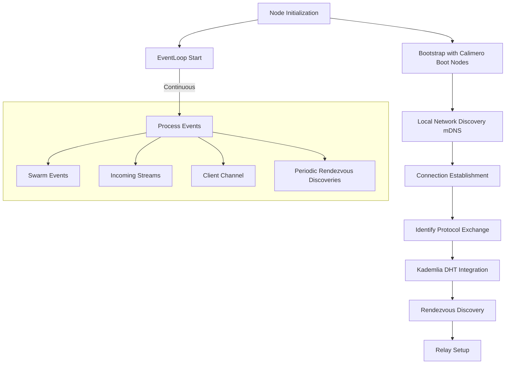
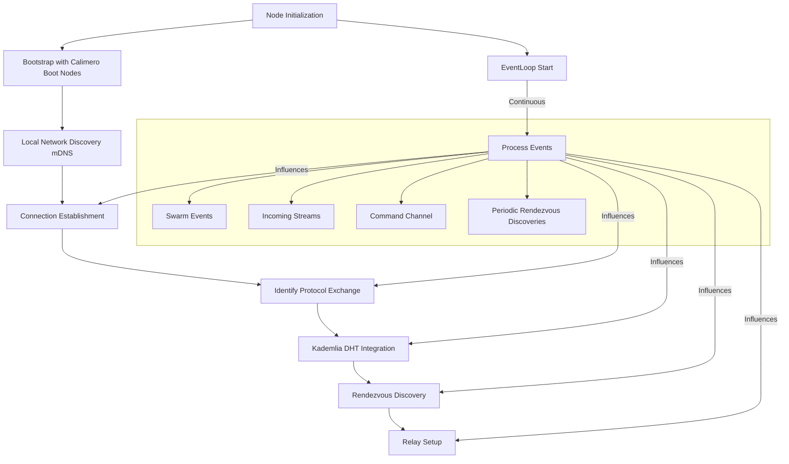

# Calimero networking

- [Calimero networking](#calimero-networking)
  - [Introduction](#introduction)
  - [Core Components](#core-components)
    - [EventLoop](#eventloop)
      - [Main Loop](#main-loop)
    - [Swarm](#swarm)
    - [Identity and Peer ID](#identity-and-peer-id)
    - [Runtime](#runtime)
    - [Transport Protocols](#transport-protocols)
  - [Behaviour and Protocols](#behaviour-and-protocols)
    - [Discovery Protocols](#discovery-protocols)
      - [Kademlia DHT](#kademlia-dht)
      - [mDNS](#mdns)
      - [Rendezvous](#rendezvous)
    - [Data Exchange Protocols](#data-exchange-protocols)
      - [Gossipsub](#gossipsub)
    - [Connectivity Protocols](#connectivity-protocols)
      - [Relay](#relay)
      - [DCUtR (Direct Connection Upgrade through Relay)](#dcutr-direct-connection-upgrade-through-relay)
    - [Meta Protocols](#meta-protocols)
      - [Identify](#identify)
      - [Ping](#ping)
    - [Custom Protocol](#custom-protocol)
      - [Stream](#stream)
  - [Discovery](#discovery)
    - [Client (`NetworkClient` struct)](#client-networkclient-struct)
    - [NetworkEvents](#networkevents)
  - [Conectivity flow](#conectivity-flow)
      - [Key Points in the Connectivity Flow](#key-points-in-the-connectivity-flow)
  - [](#)
    - [NAT Traversal Techniques](#nat-traversal-techniques)

## Introduction

The Networking crate is a robust peer-to-peer networking solution built on top of libp2p. It provides a comprehensive set of tools and abstractions for creating decentralized applications with efficient peer discovery, connection management, and custom protocol implementations.

Key features of this crate include:

- Data exchange capabilities between peers:
  - Topic-based publish/subscribe for multi-peer communication (GossipSub)
  - Direct peer-to-peer data exchange using a custom stream protocol
- Peer discovery through multiple mechanisms (mDNS, Kademlia DHT, Rendezvous)
- NAT traversal capabilities using relay and hole punching techniques
- Event-driven architecture for handling network events and commands

## Core Components

### EventLoop

The EventLoop is the central component of the networking crate, responsible for managing the network's event-driven operations. It's implemented as a struct containing several important fields, including the `swarm`, which is the main libp2p construct for managing network connections and protocols.

#### Main Loop

The EventLoop's main loop uses the `tokio::select!` macro that allows waiting on multiple async computations and returns when a single computation completes :

1. **Swarm Events**:
   Network-related events from libp2p, such as new connections, disconnections, and protocol-specific events. These events are core to managing the peer-to-peer network state.

2. **Incoming Streams**:
   New incoming stream connections from other peers. This allows the node to handle requests and communications initiated by other nodes in the network.

3. **Commands**:
   Instructions received from other parts of the application through a command channel. This enables other components to interact with and control the network operations.

4. **Periodic Rendezvous Discoveries**:
   Regular attempts to discover new peers through the Rendezvous protocol. This helps maintain and expand the node's network of peers.

Each of the events has it's own handler function.

### Swarm

The Swarm is a central construct in libp2p, providing a view of the network from the perspective of a single node. It manages connections, protocols, and peer interactions. In our implementation, the Swarm is defined as:

 ```rust
  Swarm<Behaviour>
```

Where  `Behaviour`  is a custom type that implements the  `NetworkBehaviour`  trait. This allows us to define specific network behaviors tailored to our application's needs.

The `Swarm` in libp2p combines a `Transport` (how to send/receive data) with a `NetworkBehaviour` (what to do with the connections).

### Identity and Peer ID

Identity in libp2p is crucial for unique node identification and secure communications. Each node has a Peer ID derived from its cryptographic key pair. This Peer ID is used in multiaddresses, allowing for persistent addressing:

    /ip4/192.0.2.0/tcp/443/p2p/QmcEPrat8ShnCph8WjkREzt5CPXF2RwhYxYBALDcLC1iV6
The Peer ID (after `/p2p/`) enables connections to persist even if IP addresses change, enhancing network resilience.

### Runtime

This networking crate utilizes Tokio as its asynchronous runtime, leveraging its efficient task scheduler and I/O operations to handle concurrent network activities and event processing.

### Transport Protocols

The networking crate supports multiple transport protocols to ensure wide compatibility and optimal performance:

- TCP: Reliable, connection-oriented protocol for general-purpose communication.
- QUIC: A modern, multiplexed transport built on UDP, offering improved performance and security.

These protocols are configured with encryption (TLS for QUIC, Noise for TCP) and multiplexing (QUIC's native multiplexing, Yamux for TCP) to ensure secure and efficient data transfer.

## Behaviour and Protocols

The `Behaviour` struct in our implementation combines various libp2p protocols to create a comprehensive networking solution. These protocols can be grouped based on their primary functions:

### Discovery Protocols

#### Kademlia DHT

- Purpose: Distributed peer discovery and content routing
- Key Events:
  - `OutboundQueryProgressed`: Indicates progress in DHT operations like finding peers or values
- Custom Implementation:
  - Uses a separate Kademlia network with custom protocol name (`CALIMERO_KAD_PROTO_NAME`)
  - Utilizes dedicated boot nodes instead of IPFS defaults, ensuring network independence
  - Boot nodes are configured in the `BootstrapConfig`, allowing for flexible network setup

This custom Kademlia setup provides full control over the peer discovery process and network topology, tailored specifically for the Calimero network.

#### mDNS

- Purpose: Local network peer discovery
- Key Events:
  - `Discovered`: New peers found on the local network

#### Rendezvous

- Purpose: Peer discovery through a known rendezvous point
- Key Events:
  - `Discovered`: Peers found through the rendezvous server
  - `RegisterFailed`/`DiscoverFailed`: Issues with rendezvous operations

### Data Exchange Protocols

#### Gossipsub

- Purpose: Efficient multi-peer data broadcasting
- Every `context` is one gossip topic
- Key Events:
  - `Message`: New message received on a subscribed topic
  - `Subscribed`: Successfully subscribed to a topic

### Connectivity Protocols

#### Relay

- Purpose: Enables communication between peers that can't directly connect

#### DCUtR (Direct Connection Upgrade through Relay)

- Purpose: Helps establish direct connections between peers initially connected via a relay

### Meta Protocols

#### Identify

- Purpose: Exchange of node metadata and supported protocols
- Key Events:
  - `Received`: Received identify information from a peer

#### Ping

- Purpose: Keep-alive and latency measurements

### Custom Protocol

#### Stream

- Purpose: Application-specific data exchange
- Implementation: Uses a custom `MessageJsonCodec` for serialization/deserialization
- Features:
  - Bidirectional communication between peers
  - Message Structure: The protocol uses a custom `Message` struct defined as
  
 ```rust
  pub  struct  Message  { pub data:  Vec<u8> }
```

This flexible structure allows for sending arbitrary data between peers.

- Key Events:
  - Handled directly in the `EventLoop` as `StreamOpened` events

The custom stream protocol allows for tailored communication patterns specific to our application needs, complementing the standardized libp2p protocols.

## Discovery

We combine multiple protocols in order to improve our connectivity.

- At the begging we dial Calimero boot nodes (which speak Calimero KAD protocol) and we start discovering peers on local network with mDNS.

- During identify exchange (which occurs for every established connection) we record protocols which other peer supports.

- For discovered peers with mDNS we perform direct dial (because we want to be connected to all local peers).

- For discovered peers with rendezvous we perform dial only if peer is not already connected (this means that it most likely already discovered and dialed due to mDNS event).

Beside network state by lip2p (more in `self.swarm.network_info()`) we also have our discovery state.

We keep track of multiaddrs for all connected peers and peers of interest (which are never removed from state so we can reconnect to them when needed).

To improve connectivity, as we discover relay nodes we attempt to make a relay reservation (so other peers can hole punch us).

To improve connectivity, as we discover rendezvous nodes we attempt to register our external addrs (relayed addrs) and we attempt to discover other peers. Additionally, we periodically perform discovery against all discovered rendezvous nodes. At the moment we use single namespace for the rendezvous (check config), but we could use contexId for namespace.

### Client (`NetworkClient` struct)

The NetworkClient serves as the primary interface for other parts of the application to interact with the networking functionality. It provides a clean, easy-to-use API for performing various network operations without directly interacting with the internals of the EventLoop or libp2p.

Key features of the NetworkClient include:

- Simplified methods for common network operations (e.g., listening, dialing, subscribing to topics)
- Abstraction of the underlying network complexity
- Asynchronous operation support

The NetworkClient extensively uses the oneshot pattern for most of its methods. This pattern involves:

1. Creating a new oneshot channel for each operation
2. Sending a command through an mpsc channel to the EventLoop, including the sender half of the oneshot channel
3. Awaiting on the receiver half of the oneshot channel for the result

This approach allows for efficient, non-blocking network operations.

### NetworkEvents

The networking crate defines a set of custom NetworkEvents that are emitted to the consumer of the network. These events are distinct from the internal libp2p events and provide high-level information about significant network occurrences.

Key characteristics of NetworkEvents:

- They represent network activities relevant to the application layer
- They abstract away the complexities of low-level libp2p events
- They are designed to be easily consumable by other parts of the application

The main types of NetworkEvents include:

1. **ListeningOn**: Emitted when the node starts listening on a new address
2. **Subscribed**: Indicates successful subscription to a topic
3. **Message**: Represents a received message on a subscribed topic
4. **StreamOpened**: Signifies the opening of a new stream with a peer

These events allow the application to react to important network state changes and incoming data without needing to understand the underlying libp2p implementation.

## Conectivity flow





#### Key Points in the Connectivity Flow

1. **Bootstrap**: The node initially connects to Calimero boot nodes using a custom Calimero KAD protocol, providing entry points to the network.
2. **Local Discovery**: The node uses mDNS to discover peers on the local network, enabling quick connections to nearby nodes.
3. **Connection Establishment**: The node attempts to establish connections with discovered peers, using direct dial for mDNS-discovered peers to ensure connectivity with all local nodes.
4. **Identify Protocol**: During connection establishment, an Identify protocol exchange occurs, allowing the node to learn about the capabilities and supported protocols of its peers.
5. **Kademlia DHT**: The node integrates with the Kademlia Distributed Hash Table, enhancing its ability to discover and connect with peers across the wider network.
6. **Rendezvous Discovery**: The node utilizes Rendezvous points for discovering peers beyond the local network, especially useful for NAT traversal.
7. **Relay Setup**: As the node discovers relay-capable peers, it sets up relay reservations to improve connectivity, particularly for peers behind NATs
8. **Continuous Event Processing**: The EventLoop continuously processes various events (Swarm events, incoming streams, commands, and periodic discoveries) that influence and refine the connectivity state.

##

### NAT Traversal Techniques

One of the common techniques used for NAT traversal in P2P networks is **Hole
Punching**. This technique allows two peers, each behind a NAT, to establish a
direct connection with each other. Here's a brief explanation:

- **Hole Punching:** This technique involves three steps:
  - **Step 1 - Connection to Public Server:** Both peers initially connect to a
    public server (in this case, the relay server). This creates a NAT mapping
    (a "hole") for outgoing packets to the server.
  - **Step 2 - Exchange of Address Information:** The server shares the public
    address information of each peer with the other. This information includes
    the IP address and port number that the NAT has assigned for the connection
    to the server.
  - **Step 3 - Direct Connection:** Each peer sends a packet to the other peer's
    public address. Since a mapping for this address already exists in the NAT
    (from the connection to the server), the NAT forwards the packet to the
    appropriate internal address, and a direct connection is established.

This technique is particularly useful in P2P networks, as it allows peers to
communicate directly, reducing the load on relay servers and improving network
efficiency. However, it's worth noting that hole punching may not work with all
types of NATs, and success can depend on the specific NAT implementation and
configuration.

- **Reference:**
  [Hole punching in libp2p](https://blog.ipfs.tech/2022-01-20-libp2p-hole-punching/)
- **Reference:**
  [How NAT traversal works](https://tailscale.com/blog/how-nat-traversal-works)
