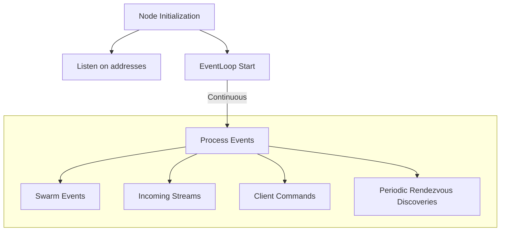
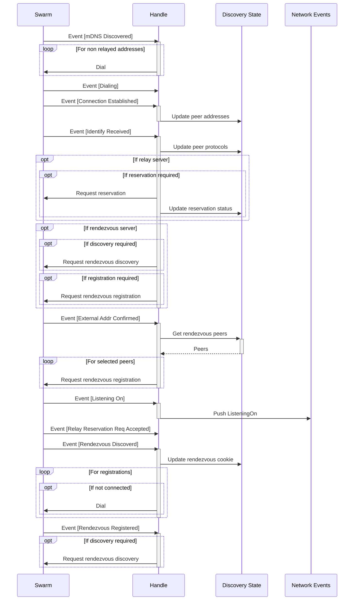

# Calimero networking

- [Calimero networking](#calimero-networking)
  - [Introduction](#introduction)
  - [Core Components](#core-components)
    - [EventLoop](#eventloop)
      - [Main Loop](#main-loop)
    - [Swarm](#swarm)
    - [Identity and Peer ID](#identity-and-peer-id)
    - [Addressing with MultiAddr](#addressing-with-multiaddr)
    - [Runtime](#runtime)
    - [Transport Protocols](#transport-protocols)
  - [Behaviour and Protocols](#behaviour-and-protocols)
    - [Discovery Protocols](#discovery-protocols)
      - [Kademlia DHT](#kademlia-dht)
      - [mDNS](#mdns)
      - [Rendezvous](#rendezvous)
    - [Data Exchange Protocols](#data-exchange-protocols)
      - [Gossipsub](#gossipsub)
      - [Stream](#stream)
    - [Connectivity Protocols](#connectivity-protocols)
      - [Relay](#relay)
      - [DCUtR (Direct Connection Upgrade through Relay)](#dcutr-direct-connection-upgrade-through-relay)
    - [Meta Protocols](#meta-protocols)
      - [Identify](#identify)
      - [Ping](#ping)
  - [Discovery and connectivity flow](#discovery-and-connectivity-flow)
    - [Client (`NetworkClient` struct)](#client-networkclient-struct)
    - [NetworkEvents](#networkevents)
  - [](#)
    - [NAT Traversal Techniques](#nat-traversal-techniques)

## Introduction

The Networking crate is a robust peer-to-peer networking solution built on top of libp2p. It provides a comprehensive set of tools and abstractions for creating decentralized applications with efficient peer discovery, connection management, and custom protocol implementations.

Key features of this crate include:

- Data exchange capabilities between peers:
  - Topic-based publish/subscribe for multi-peer communication (GossipSub)
  - Direct peer-to-peer data exchange using a custom stream protocol
- Peer discovery through multiple mechanisms (mDNS, Kademlia DHT, Rendezvous)
- NAT traversal capabilities using relay and hole punching techniques
- Event-driven architecture for handling network events and commands

## Core Components

### EventLoop

The `EventLoop` is the central component of the networking crate, responsible for managing the network's event-driven operations. It's implemented as a struct containing several important fields, including the `swarm`, which is the main libp2p construct for managing network connections and protocols.



#### Main Loop

The EventLoop's main loop uses the `tokio::select!` macro that allows waiting on multiple async computations and returns when a single computation completes :

1. **Swarm Events**:
   Network-related events from libp2p, such as new connections, disconnections, and protocol-specific events. These events are core to managing the peer-to-peer network state.

2. **Incoming Streams**:
   New incoming stream connections from other peers. This allows the node to handle requests and communications initiated by other nodes in the network.

3. **Commands**:
   Instructions received from other parts of the application through a command channel. This enables other components to interact with and control the network operations.

4. **Periodic Rendezvous Discoveries**:
   Regular attempts to discover new peers through the Rendezvous protocol. This helps maintain and expand the node's network of peers.

Each of the events has it's own handler function.

### Swarm

The Swarm is a central construct in libp2p, providing a view of the network from the perspective of a single node. It manages connections, protocols, and peer interactions. In our implementation, the Swarm is defined as:

 ```rust
  Swarm<Behaviour>
```

Where  `Behaviour`  is a custom type that implements the  `NetworkBehaviour`  trait. This allows us to define specific network behaviors tailored to our application's needs.

The `Swarm` in libp2p combines a `Transport` (how to send/receive data) with a `NetworkBehaviour` (what to do with the connections).

### Identity and Peer ID

Identity in libp2p is crucial for unique node identification and secure communications. Each node has a Peer ID derived from its cryptographic key pair. This Peer ID is used in multiaddresses, allowing for persistent addressing:

    /ip4/192.0.2.0/tcp/443/p2p/QmcEPrat8ShnCph8WjkREzt5CPXF2RwhYxYBALDcLC1iV6
The Peer ID (after `/p2p/`) enables connections to persist even if IP addresses change, enhancing network resilience.

### Addressing with MultiAddr

Flexible networks need flexible addressing systems. libp2p uses `multiaddress` (often abbreviated `multiaddr`), a convention for encoding multiple layers of addressing information into a single "future-proof" path structure.
Key points about multiaddrs:

1. They encode common transport and overlay protocols in a human-readable and machine-optimized format.
2. They allow combining multiple layers of addressing information.

For example:

- `/ip4/192.0.2.0/udp/1234` specifies an IPv4 address and UDP port.
- `/p2p/QmYyQSo1c1Ym7orWxLYvCrM2EmxFTANf8wXmmE7DWjhx5N` uniquely identifies a libp2p node.

Combining location and identity information:
`/ip4/198.51.100.0/tcp/4242/p2p/QmYyQSo1c1Ym7orWxLYvCrM2EmxFTANf8wXmmE7DWjhx5N`

This multiaddr includes both the node's network location (IP and port) and its identity (Peer ID).
Multiaddrs can also represent complex routing scenarios, like circuit relay:
`/ip4/198.51.100.0/tcp/4242/p2p/QmRelay/p2p-circuit/p2p/QmRelayedPeer`

### Runtime

This networking crate utilizes Tokio as its asynchronous runtime, leveraging its efficient task scheduler and I/O operations to handle concurrent network activities and event processing.

### Transport Protocols

The networking crate supports multiple transport protocols to ensure wide compatibility and optimal performance:

- TCP: Reliable, connection-oriented protocol for general-purpose communication.
- QUIC: A modern, multiplexed transport built on UDP, offering improved performance and security.

These protocols are configured as follows:

- TCP:
  - Encryption: TLS (Transport Layer Security), with Noise protocol as a fallback
  - Multiplexing: Yamux
- QUIC:
  - Encryption: TLS (built into the QUIC protocol)
  - Multiplexing: Native (part of the QUIC protocol)

## Behaviour and Protocols

The `Behaviour` struct in our implementation combines various libp2p protocols to create a comprehensive networking solution. These protocols can be grouped based on their primary functions:

### Discovery Protocols

#### Kademlia DHT

- Purpose: Distributed peer discovery and content routing
- Key Events:
  - `OutboundQueryProgressed`: Indicates progress in DHT operations like finding peers or values
- Custom Implementation:
  - Uses a separate Kademlia network with custom protocol name (`CALIMERO_KAD_PROTO_NAME`)
  - Utilizes dedicated boot nodes instead of IPFS defaults, ensuring network independence
  - Boot nodes are configured in the `BootstrapConfig`, allowing for flexible network setup

This custom Kademlia setup provides full control over the peer discovery process and network topology, tailored specifically for the Calimero network.

#### mDNS

- Purpose: Local network peer discovery
- Key Events:
  - `Discovered`: New peers found on the local network

#### Rendezvous

- Purpose: Peer discovery through a known rendezvous point
- Key Events:
  - `Discovered`: Peers found through the rendezvous server
  - `RegisterFailed`/`DiscoverFailed`: Issues with rendezvous operations
- Namespace Usage:
  - Current Implementation:
    - Uses a single, global namespace defined in the configuration (currently `/calimero/devnet/global`)
    - All peers in the network register and discover using this shared namespace
  - Future Plan:
    - Namespace will be set to match the `context_id`
    - This change will allow for more granular peer discovery based on specific contexts or networks
    - Peers will be able to register and discover others within the same context, improving network segmentation and efficiency

### Data Exchange Protocols

#### Gossipsub

- Purpose: Efficient multi-peer data broadcasting
- Every `context` is one gossip topic
- Key Events:
  - `Message`: New message received on a subscribed topic
  - `Subscribed`: Successfully subscribed to a topic
  
#### Stream

- Purpose: Efficient peer-to-peer exchange of large amounts of data
- Implementation: Uses a custom `MessageJsonCodec` for serialization/deserialization
- Features:
  - Bidirectional communication between peers
  - Message Structure: The protocol uses a custom `Message` struct defined as
  
 ```rust
pub struct Message {
  pub data: Vec<u8>,
}
```

This flexible structure allows for sending arbitrary data between peers.

- Key Events:
  - Handled directly in the `EventLoop` as `StreamOpened` events

The custom stream protocol allows for tailored communication patterns specific to our application needs, complementing the standardized libp2p protocols.

### Connectivity Protocols

#### Relay

- Purpose: Enables communication between peers that can't directly connect due to NAT or firewall restrictions
- Components:
  - Relay Server:
    - Acts as an intermediary for peers behind NATs
    - Forwards traffic between peers that can't directly connect
    - Helps coordinate hole-punching attempts
  - Relay Client:
    - Connects to relay servers to establish indirect connections with other peers
    - Requests relay services when direct connections are not possible

#### DCUtR (Direct Connection Upgrade through Relay)

- Purpose: Facilitates the establishment of direct connections between peers initially connected via a relay
- Components:
  - DCUtR Server:
    - Coordinates the hole-punching process between clients
    - Provides necessary information for clients to attempt direct connections
  - DCUtR Client:
    - Initiates and participates in the hole-punching process
    - Attempts to establish direct connections with other peers using information provided by the DCUtR server

Both Relay and DCUtR work together to improve connectivity in challenging network environments:

1. Peers initially connect through a relay server
2. The DCUtR protocol then attempts to establish a direct connection
3. If successful, peers can communicate directly, reducing latency and load on the relay server

### Meta Protocols

#### Identify

- Purpose: Exchange of peer metadata and supported protocols
- Key Events:
  - `Received`: Received identify information from a peer

#### Ping

- Purpose: Liveness check and latency measurements

## Discovery and connectivity flow

Our network employs a multi-faceted approach to peer discovery and connectivity, leveraging several protocols to ensure robust and efficient networking:

1. **Initial Bootstrapping**:
   - Dial Calimero boot nodes using the Calimero KAD protocol
   - Initiate local peer discovery using mDNS

2. **Protocol Identification**:
   - During the Identify exchange for each new connection, record the protocols supported by the peer

3. **Connection Strategies**:
   - For peers discovered via mDNS: Perform direct dial to ensure connectivity with all local peers
   - For peers discovered via Rendezvous: Dial only if not already connected, avoiding redundant connections

4. **Discovery State Management**:
   - Maintain a custom discovery state alongside libp2p's network state
   - Track multiaddresses for all connected peers and peers of interest
   - Retain peer information indefinitely to facilitate future reconnections

5. **Connectivity Enhancements**:
   - Upon discovering relay nodes: Attempt to make relay reservations to enable hole punching
   - Upon discovering Rendezvous nodes:
     - Register our external addresses
     - Initiate peer discovery
     - Periodically perform discovery against all known Rendezvous nodes

6. **Rendezvous Namespace**:
   - Currently utilize a single namespace for Rendezvous operations
   - Future consideration: Implement context-specific namespaces for more granular peer discovery

7. **Relay Setup**:
   - Upon discovery of relay-capable peers:
     - Set up relay reservations
     - Improve connectivity for peers behind NATs
   - Enable communication between peers that can't directly connect

8. **Continuous Event Processing**:
   - Utilize EventLoop for ongoing network maintenance:
     - Process Swarm events
     - Handle incoming streams
     - Execute user commands
     - Perform periodic discoveries




### Client (`NetworkClient` struct)

The NetworkClient serves as the primary interface for other parts of the application to interact with the networking functionality. It provides a clean, easy-to-use API for performing various network operations without directly interacting with the internals of the EventLoop or libp2p.

Key features of the NetworkClient include:

- Simplified methods for common network operations (e.g., listening, dialing, subscribing to topics)
- Abstraction of the underlying network complexity
- Asynchronous operation support

The NetworkClient extensively uses oneshot channels for most of its methods. This involves:

1. Creating a new oneshot channel for each operation
2. Sending a command through an mpsc channel to the EventLoop, including the sender half of the oneshot channel
3. Awaiting on the receiver half of the oneshot channel for the result

This approach allows for efficient, non-blocking network operations.

### NetworkEvents

The networking crate defines a set of custom NetworkEvents that are emitted to the consumer of the network. These events are distinct from the internal libp2p events and provide high-level information about significant network occurrences.

Key characteristics of NetworkEvents:

- They represent network activities relevant to the application layer
- They abstract away the complexities of low-level libp2p events
- They are designed to be easily consumable by other parts of the application

The main types of NetworkEvents include:

1. **ListeningOn**: Emitted when the node starts listening on a new address
2. **Subscribed**: Indicates successful subscription to a topic
3. **Message**: Represents a received message on a subscribed topic
4. **StreamOpened**: Signifies the opening of a new stream with a peer

These events allow the application to react to important network state changes and incoming data without needing to understand the underlying libp2p implementation.

##

### NAT Traversal Techniques

One of the common techniques used for NAT traversal in P2P networks is **Hole
Punching**. This technique allows two peers, each behind a NAT, to establish a
direct connection with each other. Here's a brief explanation:

- **Hole Punching:** This technique involves three steps:
  - **Step 1 - Connection to Public Server:** Both peers initially connect to a
    public server (in this case, the relay server). This creates a NAT mapping
    (a "hole") for outgoing packets to the server.
  - **Step 2 - Exchange of Address Information:** The server shares the public
    address information of each peer with the other. This information includes
    the IP address and port number that the NAT has assigned for the connection
    to the server.
  - **Step 3 - Direct Connection:** Each peer sends a packet to the other peer's
    public address. Since a mapping for this address already exists in the NAT
    (from the connection to the server), the NAT forwards the packet to the
    appropriate internal address, and a direct connection is established.

This technique is particularly useful in P2P networks, as it allows peers to
communicate directly, reducing the load on relay servers and improving network
efficiency. However, it's worth noting that hole punching may not work with all
types of NATs, and success can depend on the specific NAT implementation and
configuration.

- **Reference:**
  [Hole punching in libp2p](https://blog.ipfs.tech/2022-01-20-libp2p-hole-punching/)
- **Reference:**
  [How NAT traversal works](https://tailscale.com/blog/how-nat-traversal-works)
