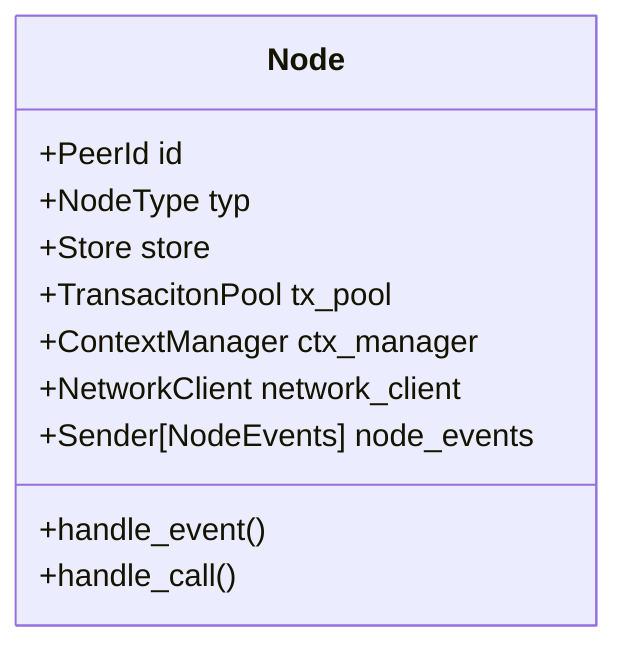
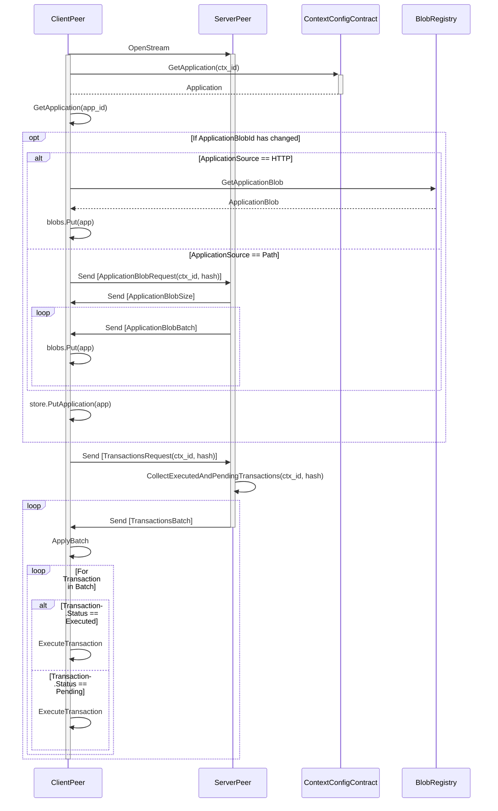

# Calimero Node

- [Introduction](#introduction)
- [Core components](#core-components)
  - [NodeType](#nodetype)
  - [Store](#store)
  - [TransactionPool](#transactionpool)
- [Core flows](#core-flows)
  - [Transaction handling](#transaction-handling)
  - [Coordinator joining ceremony](#coordinator-joining-ceremony)
  - [Catchup](#catchup)

## Introduction

The Node crate is a reference implementation of Calimero protocol.

## Core components

Node struct is the main struct that holds all the components of the node. It is
responsible for handling events from network and calls from server or
interactive CLI.

### NodeType

`NodeType` is an enum that represents the type of the node. It can be either
`Coordinator` or `Peer`.

### Store

TODO: Write about the store and runtime compat layer, link to the store crate

### TransactionPool

`TransactionPool` is a struct that holds all the transactions that are not yet
executed. Transaction pool stores transactions in a `BTreeMap` with the key
being the hash of the transaction. `TransactionPoolEntry` is a struct that holds
the transaction, the sender of a transaction and the outcomen sender channel.

## Core flows

### Transaction handling

TODO: Write about the transaction handling process and draw sequence diagram

### Catchup

The catchup process is initiated by the `ClientPeer` by opening a stream to the
`ServerPeer`.

Once the connection is established, the `ClientPeer` requests the application
information from the ContextConfig contract. If the application blob id has
changed, the `ClientPeer` attempts to fetch new application blob and store it in
the store. Depending on the application source, the `ClientPeer` either fetches
the application blob from the remote BlobRegistry or requests the `ServerPeer`
to send the application blob.

After the application is updated, the `ClientPeer` requests the transactions
from the `ServerPeer`. `ServerPeer` collects executed and pending transactions
from the given hash to the latest transaction. The transactions are sent in
batches to the `ClientPeer` which applies the transactions to the store.

