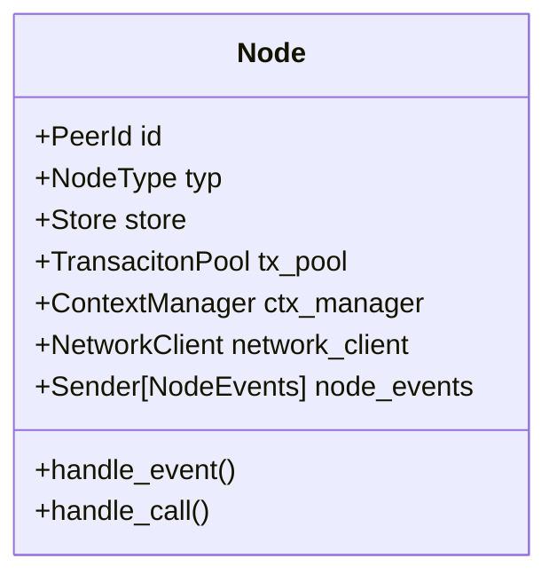
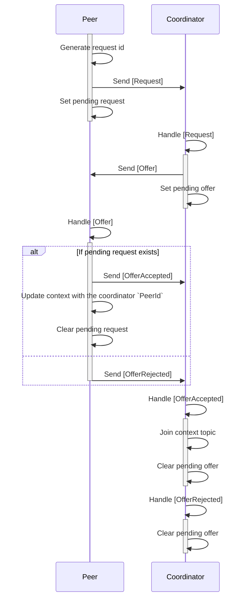

# Calimero Node
- [Introduction](#introduction)
- [Core components](#core-components)
  - [NodeType](#nodetype)
  - [Store](#store)
  - [TransactionPool](#transactionpool)
- [Core flows](#core-flows)
  - [Transaction handling](#transaction-handling)
  - [Coordinator joining ceremony](#coordinator-joining-ceremony)
  - [Catchup](#catchup)

## Introduction

The Node crate is a reference implementation of Calimero protocol.

## Core components

Node struct is the main struct that holds all the components of the node.
It is responsible for handling events from network and calls from server or interactive CLI.

### NodeType

`NodeType` is an enum that represents the type of the node. It can be either `Coordinator` or `Peer`.

### Store

TODO: Write about the store and runtime compat layer, link to the store crate

### TransactionPool

`TransactionPool` is a struct that holds all the transactions that are not yet executed.
Transaction pool stores transactions in a `BTreeMap` with the key being the hash of the transaction.
`TransactionPoolEntry` is a struct that holds the transaction, the sender of a transaction and the outcomen sender channel.

## Core flows

### Transaction handling

TODO: Write about the transaction handling process and draw sequence diagram

### Coordinator joining ceremony

Coorindator joining ceremony is the process of acquiring the coordinator node for the context.

Setup:
- Coordinators and peers are subscribed to the dedicated coordinator ceremony topic.
- Context creator sends a message to the topic requesting a coordinator.
- Interested coordinators send a message to the topic replying with the intent to coordinate.
- Context creator selects a coordinator from the interested coordinators.
- Context creator stores `PeerId` of the selected coordinator.
- Context creator sends a message to the topic with the information about the selected coordinator.
- Selected coordinator joins the context topic, while other coordinators clear pending request.

Following diagram depicts the coordinator joining ceremony which is initiated by a context creator peer.
All the messages exchanged in diagram are GossipSub messages going throught dedicated coordinator ceremony topic.
Additionally, node has a interval tick which is used to clean up pending requests and offers.

### Catchup

TODO: Write about the catchup process and draw sequence diagram
