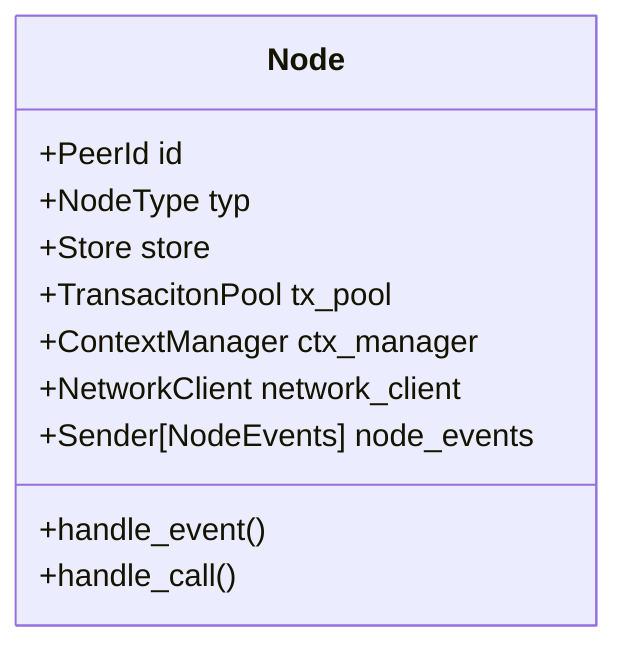
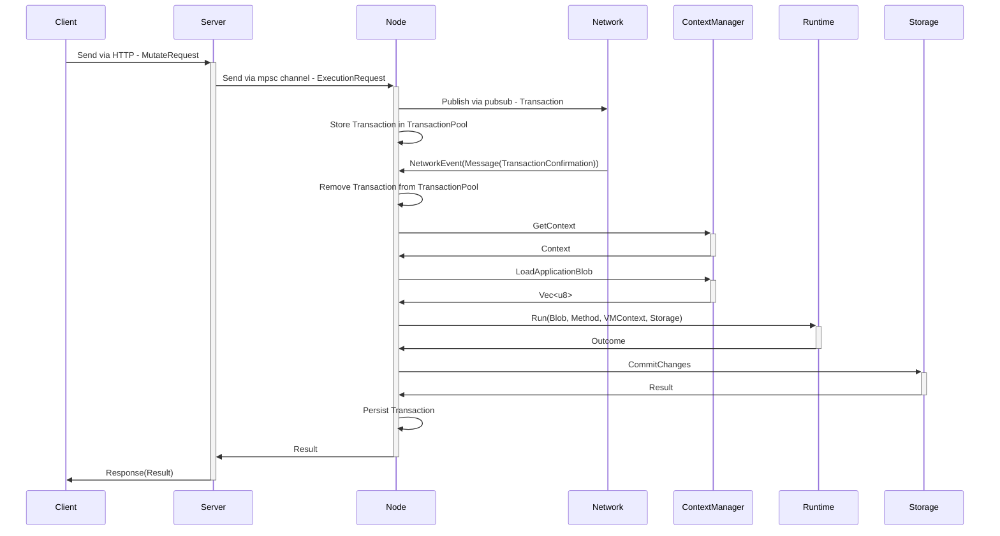
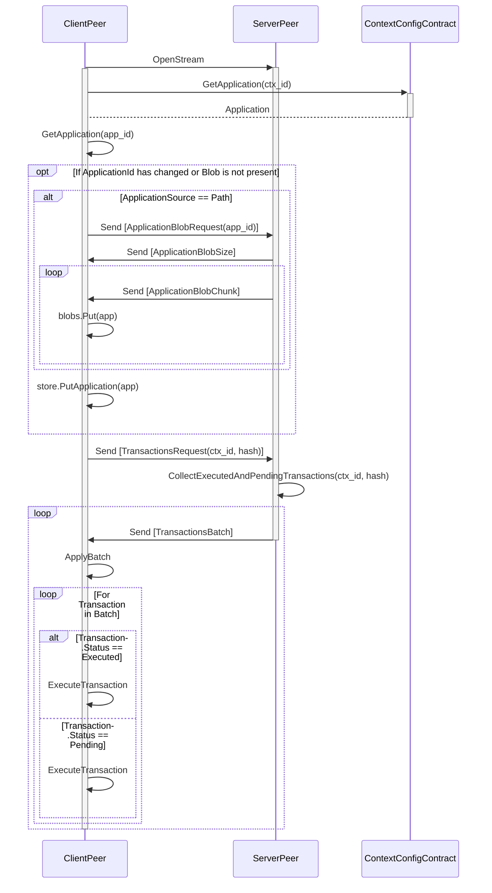

# Calimero Node

- [Introduction](#introduction)
- [Core components](#core-components)
  - [NodeType](#nodetype)
  - [Store](#store)
  - [TransactionPool](#transactionpool)
- [Core flows](#core-flows)
  - [Transaction handling](#transaction-handling)
  - [Coordinator joining ceremony](#coordinator-joining-ceremony)
  - [Catchup](#catchup)

## Introduction

The Node crate is a reference implementation of Calimero protocol.

## Core components

Node struct is the main struct that holds all the components of the node. It is
responsible for handling events from network and calls from server or
interactive CLI.

### NodeType

`NodeType` is an enum that represents the type of the node. It can be either
`Coordinator` or `Peer`.

### Store

`Store` is a struct that is used to interact with the underlying storage. The
node interacts with the store in two ways:

- It passes the store as a `Storage` trait to the runtime when running a method
  on the application WASM.
  - Checkout `runtime_compat` module for more information on interoperability
    between runtime and store.
- It directly interacts with the store to commit changes performed by the
  application WASM, to store ContextTransaction and to update ContextMeta to the
  latest hash.

Important structs in the store are:

- `ContextTransaction`:
  https://github.com/calimero-network/core/blob/37bd68d67ca9024c008bb4746809a10edd8d9750/crates/store/src/types/context.rs#L97
- `ContextMeta`:
  https://github.com/calimero-network/core/blob/37bd68d67ca9024c008bb4746809a10edd8d9750/crates/store/src/types/context.rs#L16

### TransactionPool

`TransactionPool` is a struct that holds all the transactions that are not yet
executed. Transaction pool stores transactions in a `BTreeMap` with the key
being the hash of the transaction. `TransactionPoolEntry` is a struct that holds
the transaction, the sender of a transaction and the outcomen sender channel.

## Core flows

### Transaction handling

The following diagram illustrates the process of mutate request handling in the
Calimero Node. Components involved in the process are:

- Client: The client that sends the request to the server. The only component
  outside the node binary.
- Server: Represent `server` crate.
- Node: Represents `node` crate.
- Network: Represents `network` crate. NetworkClient is used to push commands to
  the network, while NetworkEvent(s) are used to notify the node.
- Runtime: Represents `runtime` crate. The runtime is responsible for running a
  method on a loaded WASM.

Notable structs:

- `MutateRequest` from the server primitives:
  https://github.com/calimero-network/core/blob/37bd68d67ca9024c008bb4746809a10edd8d9750/crates/server-primitives/src/jsonrpc.rs#L190
- `ExecutionRequest` from the node primitives:
  https://github.com/calimero-network/core/blob/37bd68d67ca9024c008bb4746809a10edd8d9750/crates/node-primitives/src/lib.rs#L28
- `Transaction` from the primitives:
  https://github.com/calimero-network/core/blob/37bd68d67ca9024c008bb4746809a10edd8d9750/crates/primitives/src/transaction.rs#L9
- `TransactionConfirmation` from the node:
  https://github.com/calimero-network/core/blob/37bd68d67ca9024c008bb4746809a10edd8d9750/crates/node/src/types.rs#L18
- `NetworkEvent` from the network:
  https://github.com/calimero-network/core/blob/37bd68d67ca9024c008bb4746809a10edd8d9750/crates/network/src/types.rs#L10
- `Context` from the the primitives:
  https://github.com/calimero-network/core/blob/37bd68d67ca9024c008bb4746809a10edd8d9750/crates/primitives/src/context.rs#L180

### Catchup

The catchup process is initiated by the `ClientPeer` by opening a stream to the
`ServerPeer`.

Once the connection is established, the `ClientPeer` requests the application
information from the ContextConfig contract. If the application blob id has
changed, the `ClientPeer` attempts to fetch new application blob and store it in
the store. Depending on the application source, the `ClientPeer` either fetches
the application blob from the remote BlobRegistry or requests the `ServerPeer`
to send the application blob.

After the application is updated, the `ClientPeer` requests the transactions
from the `ServerPeer`. `ServerPeer` collects executed and pending transactions
from the given hash to the latest transaction. The transactions are sent in
batches to the `ClientPeer` which applies the transactions to the store.

Following diagram depicts the catchup process. The `ClientPeer` in this scenario
is regular peer (not coordinator). The `ServerPeer` can be either regular peer
or coordinator.

