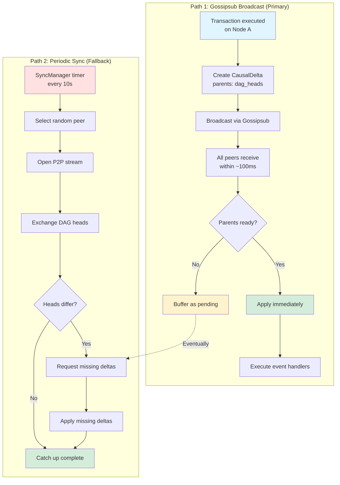
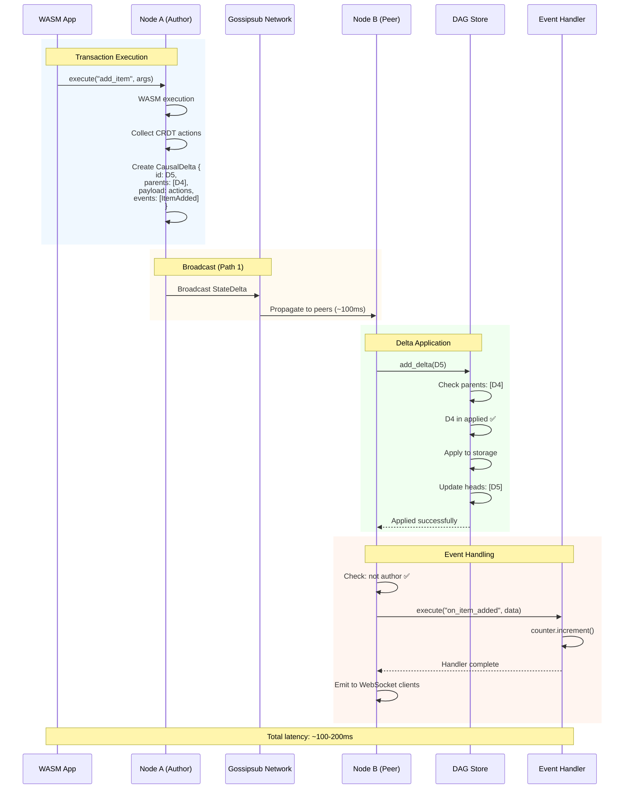
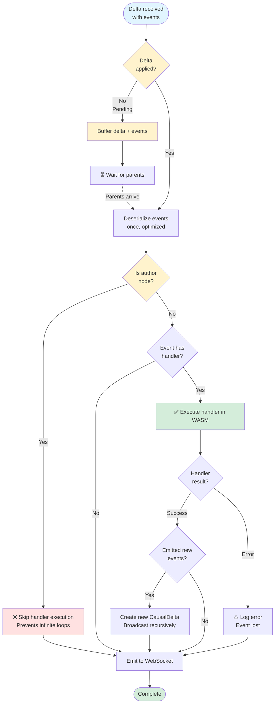
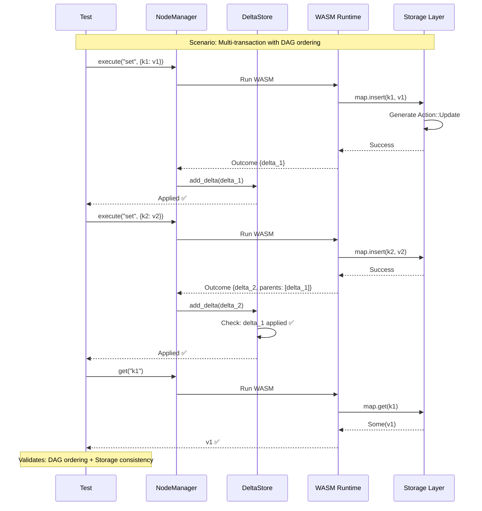
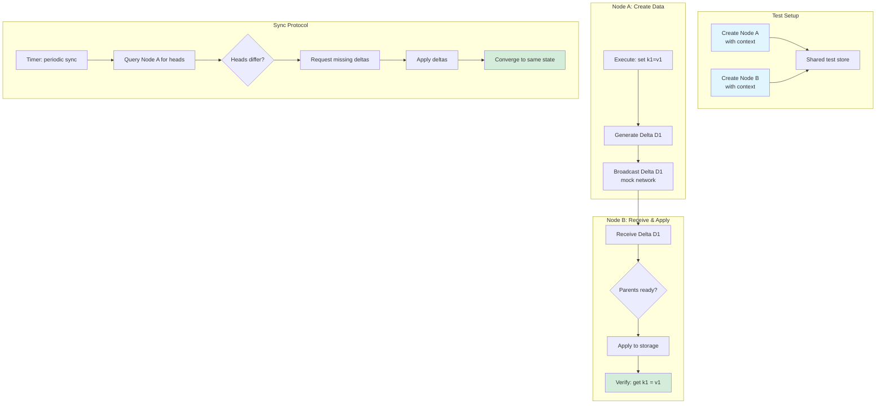

# calimero-node

P2P node runtime with DAG-based CRDT synchronization, event handling, and blob sharing.

## Overview

The node layer orchestrates:
- **Real-time sync**: Gossipsub broadcasts for instant delta propagation
- **Periodic sync**: P2P streams for catch-up and recovery  
- **Event handlersMenuAutomatic execution of application callbacks
- **Blob sharing**: Content-addressed file distribution

## Architecture

```
┌─────────────────────────────────────────────────┐
│ Application Layer (WASM)                        │
│  - User code                                     │
│  - CRDT operations                               │
│  - Event emission                                │
└────────────────┬────────────────────────────────┘
                 │
┌────────────────┴────────────────────────────────┐
│ Node Layer (This Crate)                         │
│  ┌──────────────┐  ┌──────────────┐            │
│  │ NodeManager  │  │ SyncManager  │            │
│  │  - Orchestrate│  │  - P2P sync  │            │
│  └──────┬───────┘  └──────┬───────┘            │
│         │                  │                     │
│  ┌──────┴───────┐  ┌──────┴───────┐            │
│  │ DeltaStore   │  │ Handlers     │            │
│  │  - DAG logic │  │  - Broadcasts│            │
│  │  - Buffering │  │  - Events    │            │
│  └──────────────┘  └──────────────┘            │
└────────────────┬────────────────────────────────┘
                 │
┌────────────────┴────────────────────────────────┐
│ Network Layer (libp2p)                          │
│  - Gossipsub (broadcast)                         │
│  - Streams (P2P)                                 │
│  - Discovery                                     │
└──────────────────────────────────────────────────┘
```

## How Synchronization Works

### Dual-Path Delta Propagation



**Why both paths?**
- **Gossipsub**: Fast (~100ms), reliable in good network conditions
- **Periodic sync**: Ensures eventual consistency even with packet loss, partitions, or downtime

### Synchronization Sequence



### Synchronization Configuration

```rust
// Production defaults (crates/node/src/sync/config.rs)
pub const DEFAULT_SYNC_FREQUENCY_SECS: u64 = 10;  // Check every 10s
pub const DEFAULT_SYNC_INTERVAL_SECS: u64 = 5;    // Min 5s between syncs
pub const DEFAULT_SYNC_TIMEOUT_SECS: u64 = 30;    // 30s timeout

// Optimized for 20-50 node networks with aggressive convergence
```

**Tuning guide**:
- `frequency`: How often to check all contexts for sync
  - Lower = faster recovery from packet loss
  - Higher = less network overhead
- `interval`: Minimum time between syncs for same context
  - Lower = more aggressive convergence
  - Higher = prevents sync spam
- `timeout`: Max time for a sync operation
  - Should be > RTT + state transfer time

## Event Handler Execution

### Handler Execution Flow



**Critical Rules**:

1. **Author nodes DO NOT execute their own handlers**
   - Prevents infinite loops (handler → event → handler → ...)
   - Ensures distributed execution model
   - Only receiving nodes execute handlers

2. **Events lost if delta never applied**
   - Pending deltas buffer events
   - If parents never arrive, handlers never execute
   - TODO: Implement parent request protocol

### Handler Requirements

Event handlers **may execute in parallel** in future optimizations. Handlers MUST be:

1. **Commutative**: Order doesn't matter
   - ✅ `Counter::increment()`
   - ❌ `create() → update()` chains

2. **Independent**: No shared mutable state
   - ✅ Each handler uses unique CRDT key
   - ❌ Multiple handlers modifying same entity

3. **Idempotent**: Safe to retry
   - ✅ CRDT operations
   - ❌ External API calls

4. **Pure**: No side effects
   - ✅ Modify CRDT state only
   - ❌ HTTP requests, file I/O

See [HANDLER_AUDIT.md](./HANDLER_AUDIT.md) for detailed analysis.

## DAG Structure

### Linear History (Simple Case)

```
Root → D1 → D2 → D3
heads = [D3]
```

### Concurrent Updates (Fork)

```
      D0
     / \
    D1A D1B  ← Fork! Two nodes updated simultaneously
     \ /
      D2     ← Merge delta (parents: [D1A, D1B])
heads = [D2]
```

### Out-of-Order Delivery

```
Receive: D3 (parents: [D2])
  → D2 not found → buffer as pending
  → heads = [D1]

Receive: D2 (parents: [D1])
  → D1 exists → apply D2
  → Check pending → D3 now ready → apply D3 (cascade!)
  → heads = [D3]
```

## API

```rust
// Create DAG
let mut dag = DagStore::new([0; 32]);  // root = genesis

// Add delta
let delta = CausalDelta {
    id: compute_id(...),
    parents: dag.get_heads(),  // Build on current tips
    payload: my_data,
    timestamp: now(),
};

let applied = dag.add_delta(delta, &applier).await?;
if !applied {
    // Delta pending - request missing parents
    let missing = dag.get_missing_parents();
    for parent_id in missing {
        request_from_network(parent_id).await?;
    }
}

// Query state
let heads = dag.get_heads();          // Current DAG tips
let delta = dag.get_delta(&id);       // Get specific delta
let stats = dag.pending_stats();      // Pending count, oldest age

// Cleanup
let evicted = dag.cleanup_stale(Duration::from_secs(300));  // 5 min timeout
```

## Performance Characteristics

**Memory** (per context):
```
Applied deltas: ~1000 × 5KB = 5MB
Pending deltas: ~0-100 × 5KB = 0-500KB
Heads: ~1-10 × 32 bytes = 32-320 bytes
Total: ~5-6MB typical, ~10MB worst case
```

**Latency**:
```
Add delta (parents ready): <1ms
Add delta (cascade of 10): ~10ms
Cleanup stale: <1ms for 100 pending
```

## Integration with calimero-node

The node layer wraps `DagStore` with WASM execution:

```rust
// crates/node/src/delta_store.rs
pub struct DeltaStore {
    dag: Arc<RwLock<DagStore<Vec<Action>>>>,
    applier: Arc<ContextStorageApplier>,
}

impl DeltaStore {
    pub async fn add_delta(&self, delta: CausalDelta<Vec<Action>>) -> Result<bool> {
        let mut dag = self.dag.write().await;
        let result = dag.add_delta(delta, &*self.applier).await?;
        
        // Update context DAG heads after apply
        let heads = dag.get_heads();
        drop(dag);  // Release lock before external call
        
        self.applier.context_client
            .update_dag_heads(&self.applier.context_id, heads)?;
        
        Ok(result)
    }
}
```

## Design Principles

- **Pure DAG logic**: No network, storage, or WASM dependencies
- **Generic over payload**: Works with any `T: Serialize + Clone`
- **Dependency injection**: Applier pattern enables testing
- **Memory-only**: DAG state not persisted (handled by wrapper)

## Testing

```bash
cargo test -p calimero-dag

# Key tests validate:
# - Linear sequences apply in order
# - Out-of-order deltas buffer and cascade
# - Concurrent updates create forks
# - Stale deltas get cleaned up
```

## Common Issues

### Deltas stuck in pending

**Symptom**: `pending_stats().count` keeps growing

**Causes**:
1. Missing parent deltas never requested from network
2. Network partition preventing delta delivery
3. Parent delta lost (packet drop)

**Solutions**:
- Implement parent request protocol (TODO)
- Trigger state sync fallback
- Check network connectivity

### Memory growing unbounded

**Symptom**: Node memory usage increasing over time

**Causes**:
1. No timeout for pending deltas
2. Too many deltas kept in `applied` set

**Solutions**:
- `cleanup_stale()` runs every 60s (evicts >5min old)
- Implement DAG pruning (TODO)
- Set reasonable limits (100 pending max)

## Testing

```bash
# Run all node tests
cargo test -p calimero-node

# Run specific integration test
cargo test -p calimero-node --test dag_storage_integration

# With logs
RUST_LOG=debug cargo test -p calimero-node -- --nocapture
```

### Integration Tests

The node crate includes integration tests in `tests/` that validate end-to-end scenarios.

#### Test: DAG + Storage Integration



**What it validates**:
- WASM execution generates valid deltas
- DAG correctly tracks parent relationships
- Storage maintains consistency across transactions
- Heads update properly

**Test file**: `tests/dag_storage_integration.rs`

#### Test: Sync Protocol (Mock Network)



**What it validates**:
- Sync protocol correctly exchanges state
- Nodes converge after sync
- Missing deltas requested and applied
- Periodic sync timer works

**Test file**: `tests/sync_protocols.rs`

### Test Categories

| Test File | What It Tests | Network |
|-----------|---------------|---------|
| `dag_storage_integration.rs` | DAG + WASM + Storage | No (unit) |
| `sync_protocols.rs` | State sync, delta exchange | Mocked |
| `network_simulation.rs` | Multi-node scenarios | Simulated |
| `dag_persistence.rs` | DAG state save/load | No (unit) |

### Running E2E Tests

E2E tests run real nodes with actual network communication:

```bash
# Build release binaries first
cargo build --release

# Run E2E test suite
./target/release/e2e-tests \
  --merod-binary ./target/release/merod \
  --meroctl-binary ./target/release/meroctl \
  --protocols near

# Output: e2e-tests/corpus/report.md
```

**E2E test coverage**:
- ✅ Context creation and joining
- ✅ Application installation
- ✅ Multi-node state sync
- ✅ Event handler execution
- ✅ G-Counter CRDT consistency
- ✅ Network resilience (packet loss scenarios)

## See Also

- [calimero-storage](../storage/README.md) - CRDT actions that flow through DAG
- [calimero-dag](../dag/README.md) - Pure DAG implementation
- [calimero-sdk](../sdk/README.md) - Application developer guide

## License

See [COPYRIGHT](../../COPYRIGHT) and [LICENSE.md](../../LICENSE.md) in the repository root.
