# calimero-node

Node runtime for Calimero - handles P2P sync, blob sharing, and state management using **DAG-based synchronization**.

## Architecture Overview

### Core System


---

## DAG-Based Synchronization

### What is a DAG?

A **Directed Acyclic Graph** where each node represents a state change (CausalDelta) and edges represent causal dependencies (parent relationships).

```mermaid
graph TB
    D0[Delta 0: ROOT<br/>todos = empty]
    
    D0 -->|Alice| D1[Delta 1<br/>Add 'Buy milk'<br/>parents: D0]
    D0 -->|Bob| D2[Delta 2<br/>Add 'Read book'<br/>parents: D0]
    
    D1 -->|Alice gets D2| D3A[Delta 3A MERGE<br/>Has both todos<br/>parents: D1, D2]
    D2 -->|Bob gets D1| D3B[Delta 3B MERGE<br/>Has both todos<br/>parents: D1, D2]
    
    D3A -.->|Converge| D4[Final State<br/>✅ Both todos]
    D3B -.->|Converge| D4
    
    style D0 fill:#e1f5ff
    style D1 fill:#ffe1e1
    style D2 fill:#c3e6cb
    style D3A fill:#fff3cd
    style D3B fill:#fff3cd
    style D4 fill:#d4edda
```



**Key Benefits**:
- ✅ **Concurrent updates**: Multiple nodes can modify state simultaneously
- ✅ **Packet reordering**: Deltas can arrive out of order, applied when parents ready
- ✅ **Explicit causality**: Parent IDs show what depends on what
- ✅ **Automatic merges**: CRDT logic resolves conflicts

**Trade-offs**:
- ❌ **Higher memory**: Pending deltas buffered until parents arrive
- ❌ **More complex**: Requires DAG tracking vs simple sequential
- ❌ **Partial ordering**: No total order (only causal order)

---

## How Synchronization Works

### 1. Live Updates (Primary Path)

**When**: After every WASM execution that changes state  
**How**: Broadcast via Gossipsub to all peers  
**Best for**: Real-time collaboration when nodes are online

```mermaid
sequenceDiagram
    participant App as WASM App
    participant NodeA as Node A<br/>(Author)
    participant Storage as Storage Layer
    participant GS as Gossipsub
    participant NodeB as Node B<br/>(Peer)
    participant DStore as DeltaStore
    
    App->>NodeA: execute("add_todo", args)
    NodeA->>Storage: WASM execution
    
    Note over Storage: 1. Modify data<br/>2. push_action(Compare)<br/>3. Collect in DELTA_CONTEXT
    
    Storage->>Storage: commit_causal_delta(root_hash)
    Note over Storage: Get current heads: [D5]<br/>Create delta with parents<br/>Compute ID = SHA256(...)
    
    Storage-->>NodeA: CausalDelta {<br/>  id: D6,<br/>  parents: [D5],<br/>  actions: [Compare, Update],<br/>  timestamp: now<br/>}
    
    NodeA->>GS: Broadcast StateDelta {<br/>  delta_id: D6,<br/>  parent_ids: [D5],<br/>  artifact: [encrypted],<br/>  events: [TodoAdded]<br/>}
    
    GS->>NodeB: Forward message
    
    NodeB->>DStore: Add delta
    
    alt Parents available
        DStore->>DStore: Apply immediately
        Note over DStore: 1. Decrypt artifact<br/>2. __calimero_sync_next(actions)<br/>3. Update heads: [D6]<br/>4. Execute event handlers
        
        DStore->>WS: Emit StateMutation
        Note over WS: ✅ UI updates in real-time
    else Parents missing
        DStore->>DStore: Buffer as pending
        Note over DStore: ❌ Waiting for D5<br/>❌ Events NOT executed<br/>⚠️ TODO: Request D5
    end
```



**Critical Details**:

1. **No gap checking**: Unlike old height-based system, there's no `gap == 1` check. Deltas are accepted in **any order**.

2. **Buffering behavior**:
   ```rust
   if all_parents_available(delta.parents) {
       apply_immediately();  // Happy path
   } else {
       pending_buffer.insert(delta.id, delta);  // Wait for parents
   }
   ```

3. **Event execution**:
   - **Author node**: Events collected, handlers **NOT** executed
   - **Receiving nodes**: Handlers executed after applying delta
   - **If pending**: Handlers **NOT** executed until parents arrive

4. **Cascade application**:
   ```rust
   apply_delta(D5);  // Might unlock:
   → apply_delta(D6);  // Which might unlock:
   → apply_delta(D7);  // Cascade continues...
   ```

---

### 2. State Sync (Fallback/Recovery)

**When**: Periodic sync (every 60s) or on-demand  
**How**: P2P stream exchange of fresh artifacts  
**Best for**: Catching up after offline, recovering from missing deltas

```mermaid
sequenceDiagram
    participant Timer as Sync Timer<br/>(60s)
    participant SM as SyncManager
    participant NodeA as Node A
    participant NodeB as Node B
    
    Timer->>SM: Tick
    SM->>SM: Select random peer
    SM->>NodeB: Open stream
    
    rect rgb(240, 248, 255)
        Note over NodeA,NodeB: Handshake
        NodeA->>NodeB: Init(StateSync {<br/>  root_hash: ABC<br/>})
        NodeB->>NodeA: Init(StateSync {<br/>  root_hash: XYZ<br/>})
        Note over NodeA,NodeB: Setup encryption
    end
    
    rect rgb(255, 250, 240)
        Note over NodeA,NodeB: Generate Fresh Artifacts
        
        par Node A generates
            NodeA->>NodeA: Generate from current state<br/>(NOT from DAG history)
        and Node B generates
            NodeB->>NodeB: Generate from current state<br/>(NOT from DAG history)
        end
        
        NodeA->>NodeB: Send artifact
        NodeB->>NodeA: Send artifact
    end
    
    rect rgb(240, 255, 240)
        Note over NodeA,NodeB: Apply Changes
        
        par Node A applies
            NodeA->>NodeA: __calimero_sync_next(B's artifact)
            NodeA->>NodeA: New hash: DEF
        and Node B applies
            NodeB->>NodeB: __calimero_sync_next(A's artifact)
            NodeB->>NodeB: New hash: DEF
        end
    end
    
    alt Hashes match
        Note over NodeA,NodeB: ✅ Converged - send empty artifact
        NodeA->>NodeB: Message { artifact: [] }
        NodeB->>NodeA: Message { artifact: [] }
    else Still diverged
        Note over NodeA,NodeB: Repeat until convergence
    end
```



**State Sync vs DAG**:
- **State sync**: Generates artifacts from **current storage state** (ignores DAG)
- **DAG**: Tracks **causal history** via parent relationships
- **Compatibility**: State sync can recover nodes that missed too many DAG deltas

**When State Sync is Needed**:
1. Periodic synchronization (every 60s)
2. Manual sync request
3. When DAG buffer is full (⚠️ Not implemented yet)
4. When hash heartbeat shows divergence (⚠️ Not implemented yet)

---

## Event Propagation (Detailed)

### Event Lifecycle


**Critical Problems**:

1. **Events Lost if Delta Never Applied**:
   ```
   Node receives Delta X with missing parents
   → Delta buffered in pending
   → Events buffered with delta
   → Parents never arrive
   → Events NEVER executed ❌
   ```

2. **Handler Execution Cycles**:
   ```
   Handler: notify_subscribers
   → Emits event: NotificationSent
   → Has handler: log_notification
   → Emits event: LogWritten
   → Has handler: update_metrics
   → Could cycle forever if not careful
   ```
   
   **Protection**: Author node doesn't execute its own handlers.

3. **No Event Retries**:
   - If handler fails → event lost
   - No retry mechanism
   - No dead letter queue

---

## Critical Scenarios (Detailed)

### Scenario 1: Node Offline for 24 Hours

**Timeline**:
```
Day 1, 00:00: Node B goes offline
Day 1, 00:01-23:59: Network creates 1000 deltas
  D1 → D2 → D3 → ... → D1000
  
Day 2, 00:00: Node B comes back online
Day 2, 00:01: Node A creates D1001
```

**What Happens**:



```mermaid
sequenceDiagram
    participant NodeB as Node B<br/>(offline 24h)
    participant Network as Network<br/>(1000 deltas ahead)
    participant DStore as DeltaStore
    
    Note over NodeB,Network: Node B comes back online
    
    Network->>NodeB: Broadcast D1001
    Note over Network: D1001.parents = [D999, D1000]
    
    NodeB->>DStore: Add delta D1001
    DStore->>DStore: Check parents
    Note over DStore: ❌ D999 missing<br/>❌ D1000 missing
    
    DStore->>DStore: Buffer as pending
    Note over DStore: pending = {D1001}<br/>missing_parents = {D999, D1000}
    
    DStore-->>NodeB: ⚠️ Delta pending
    
    Note over NodeB: 🔴 CURRENT BEHAVIOR:<br/>Just logs warning,<br/>does nothing
    
    NodeB->>NodeB: Log: "Missing parents"
    
    Note over NodeB: 🚫 Node B stays out of sync<br/>🚫 Never applies D1001<br/>🚫 Never executes events
```

**What SHOULD Happen** (Not Implemented):

```mermaid
flowchart TD
    Receive([Receive D1001]) --> Missing[Detect missing D999, D1000]
    
    Missing --> Count{How many<br/>missing?}
    
    Count -->|"< 100"| RequestDeltas[Request specific deltas]
    RequestDeltas --> Send1[Send RequestDelta D999]
    RequestDeltas --> Send2[Send RequestDelta D1000]
    
    Send1 --> Receive1[Receive D999]
    Send2 --> Receive2[Receive D1000]
    
    Receive1 --> Apply1[Apply D999]
    Receive2 --> Apply2[Apply D1000]
    
    Apply1 --> Check[Check pending]
    Apply2 --> Check
    
    Check --> ApplyPending[Apply D1001]
    ApplyPending --> Done1([✅ Caught up])
    
    Count -->|"> 100"| Snapshot[Too many missing!]
    Snapshot --> TriggerSync[Trigger State Sync]
    TriggerSync --> GetFresh[Get fresh state from peer]
    GetFresh --> ClearPending[Clear pending buffer]
    ClearPending --> Done2([✅ Synced via snapshot])
    
    style RequestDeltas fill:#c3e6cb
    style Snapshot fill:#ffe1e1
    style Done1 fill:#d4edda
    style Done2 fill:#d4edda
```



**Required Implementation**:
```rust
// In handle_state_delta
let missing = delta_store.get_missing_parents();

if missing.len() > SNAPSHOT_THRESHOLD {
    // Too many missing - use snapshot
    sync_manager.initiate_state_sync(&context_id, source_peer).await?;
    delta_store.clear_pending();
} else if !missing.is_empty() {
    // Request specific deltas
    for parent_id in missing {
        request_delta_from_peer(parent_id, source_peer).await?;
    }
}
```

---

### Scenario 2: Packet Loss (Delta Never Arrives)

**Timeline**:
```
Time 0: All nodes at D0
Time 1: Node A creates D1, broadcasts
        Network drops packet - Node B never receives D1
Time 2: Node A creates D2 (parents: D1), broadcasts
Time 3: Node B receives D2
```

**What Happens**:



```mermaid
sequenceDiagram
    participant NodeA as Node A
    participant Network as Network
    participant NodeB as Node B
    participant DStore as DeltaStore
    
    Note over NodeA,NodeB: Both at D0
    
    NodeA->>NodeA: Create D1
    NodeA->>Network: Broadcast D1
    Network--xNodeB: ❌ Packet lost
    
    Note over NodeA: Node A: heads = [D1]
    Note over NodeB: Node B: heads = [D0]
    
    NodeA->>NodeA: Create D2<br/>parents: [D1]
    NodeA->>Network: Broadcast D2
    Network->>NodeB: ✅ D2 arrives
    
    NodeB->>DStore: Add D2
    DStore->>DStore: Check parents: [D1]
    Note over DStore: ❌ D1 not in deltas<br/>❌ D1 not in applied
    
    DStore->>DStore: Buffer D2 in pending
    DStore->>DStore: missing_parents = {D1}
    
    Note over NodeB: 🔴 CURRENT: Just logs<br/>🔴 D1 never requested<br/>🔴 D2 never applied
```

**What SHOULD Happen**:

```mermaid
flowchart TD
    Receive([Receive D2]) --> Check[Check parents: D1]
    Check --> Missing[D1 not found]
    
    Missing --> Request[Request D1 from peers]
    Request --> Broadcast[Broadcast RequestDelta D1]
    
    Broadcast --> Wait[Wait for response]
    Wait --> Timeout{Response<br/>within 5s?}
    
    Timeout -->|Yes| ReceiveD1[Receive D1]
    ReceiveD1 --> ApplyD1[Apply D1]
    ApplyD1 --> ApplyD2[Apply D2 from pending]
    ApplyD2 --> Done1([✅ Recovered])
    
    Timeout -->|No<br/>Retry 3x| Retry{Retries<br/>left?}
    Retry -->|Yes| Request
    Retry -->|No| GiveUp[Give up on D1]
    
    GiveUp --> Fallback[Trigger State Sync]
    Fallback --> Fresh[Get fresh state]
    Fresh --> Done2([✅ Synced via fallback])
    
    style ApplyD1 fill:#c3e6cb
    style Fallback fill:#ffe1e1
    style Done1 fill:#d4edda
    style Done2 fill:#d4edda
```



**Required Implementation**:
```rust
// New protocol in sync/missing.rs
pub async fn request_delta(
    delta_id: [u8; 32],
    peer: PeerId,
) -> Result<Option<CausalDelta>> {
    let stream = open_stream(peer).await?;
    
    send(stream, StreamMessage::RequestDelta { delta_id }).await?;
    
    match timeout(Duration::from_secs(5), recv(stream)).await {
        Ok(Some(StreamMessage::DeltaResponse { delta })) => Ok(Some(delta)),
        Ok(Some(StreamMessage::DeltaNotFound)) => Ok(None),
        Ok(None) | Err(_) => bail!("Timeout requesting delta"),
    }
}

// In handle_request_delta
pub async fn handle_request_delta(
    delta_id: [u8; 32],
    stream: &mut Stream,
) -> Result<()> {
    if let Some(delta) = delta_store.get_delta(&delta_id) {
        send(stream, StreamMessage::DeltaResponse { delta }).await?;
    } else {
        send(stream, StreamMessage::DeltaNotFound).await?;
    }
}
```

---

### Scenario 3: Concurrent Updates (Multiple Authors)

**Timeline**:
```
Time 0: All nodes at D0, todos = []

Time 1:
  Alice (Node A): add("Buy milk")   → D1A
  Bob (Node B):   add("Read book")  → D1B
  Carol (Node C): add("Call mom")   → D1C
  
  All broadcast simultaneously
```

**What Happens**:


**Step-by-Step**:

1. **All nodes at D0**:
   ```
   Node A: heads = [D0]
   Node B: heads = [D0]
   Node C: heads = [D0]
   ```

2. **Concurrent updates** (all have parent D0):
   ```
   Node A: Creates D1A, broadcasts
   Node B: Creates D1B, broadcasts
   Node C: Creates D1C, broadcasts
   ```

3. **Each node receives others' deltas**:
   ```
   Node A receives D1B:
     - D1B.parents = [D0] ✅
     - Apply D1B
     - heads = [D1A, D1B]  // Multiple heads!
   
   Node A receives D1C:
     - D1C.parents = [D0] ✅
     - Apply D1C
     - heads = [D1A, D1B, D1C]  // Even more heads!
   ```

4. **CRDT Merge**:
   ```rust
   // In storage: Set union for collections
   local_todos = ["Buy milk"]
   apply(D1B) → todos = ["Buy milk", "Read book"]
   apply(D1C) → todos = ["Buy milk", "Read book", "Call mom"]
   ```

5. **Next update creates merge delta**:
   ```
   Node A creates new delta:
     CausalDelta {
       id: D2A,
       parents: [D1A, D1B, D1C],  // All current heads!
       actions: [next operation],
       timestamp: now,
     }
     
     After broadcast: heads = [D2A]
   ```

6. **Convergence**:
   - All nodes apply all deltas
   - All reach same state
   - All have same todos ✅

**Key Insight**: Multiple heads = merge point detection

---

## Missing Implementations (Critical)

### 1. 🔴 CRITICAL: Parent Delta Request

**Why Critical**: Without this, any packet loss = permanent out of sync

**Current Code**:
```rust
// In delta_store.rs:104
if !applied {
    let missing = delta_store_ref.get_missing_parents();
    
    if !missing.is_empty() {
        info!("Requesting missing parent deltas");
        // TODO: Implement request_delta_from_peers
        debug!("Would request missing deltas");  // ❌ Just logs!
    }
}
```

**What's Needed**:
```rust
// New file: crates/node/src/sync/delta_request.rs
pub async fn request_delta(
    context_id: ContextId,
    delta_id: [u8; 32],
    peer: PeerId,
    node_client: &NodeClient,
) -> Result<CausalDelta> {
    // Open stream to peer
    let mut stream = node_client.open_stream(peer, Protocol::DeltaRequest).await?;
    
    // Send request
    send(&mut stream, StreamMessage::RequestDelta { 
        context_id,
        delta_id 
    }).await?;
    
    // Receive response with timeout
    match timeout(Duration::from_secs(10), recv(&mut stream)).await {
        Ok(Some(StreamMessage::DeltaResponse { delta })) => {
            // Verify delta ID matches
            if delta.id != delta_id {
                bail!("Received wrong delta");
            }
            Ok(delta)
        }
        Ok(Some(StreamMessage::NotFound)) => {
            bail!("Delta not found on peer");
        }
        Ok(None) | Err(_) => {
            bail!("Timeout or connection closed");
        }
    }
}

// Handler for incoming requests
impl SyncManager {
    pub async fn handle_delta_request(
        &self,
        context_id: ContextId,
        delta_id: [u8; 32],
        stream: &mut Stream,
    ) -> Result<()> {
        let delta_store = self.state.delta_stores.get(&context_id)
            .ok_or_else(|| eyre!("Context not found"))?;
        
        if let Some(delta) = delta_store.deltas.get(&delta_id) {
            send(stream, StreamMessage::DeltaResponse {
                delta: delta.clone()
            }).await?;
        } else {
            send(stream, StreamMessage::NotFound).await?;
        }
        
        Ok(())
    }
}
```

**Add to StreamMessage enum**:
```rust
pub enum StreamMessage<'a> {
    // ... existing ...
    RequestDelta { 
        context_id: ContextId,
        delta_id: [u8; 32] 
    },
    DeltaResponse { 
        delta: CausalDelta 
    },
    NotFound,
}
```

**Estimated Effort**: 2-3 days

---

### 2. 🔴 CRITICAL: Pending Delta Timeout

**Why Critical**: Without timeout, memory leaks from unbounded pending buffer

**What's Needed**:
```rust
// Enhanced pending tracking
struct PendingDelta {
    delta: CausalDelta,
    received_at: Instant,
    request_count: usize,
    last_request: Option<Instant>,
}

impl DeltaStore {
    /// Cleanup stale pending deltas
    pub fn cleanup_stale(&mut self, max_age: Duration) -> Vec<[u8; 32]> {
        let now = Instant::now();
        let mut evicted = Vec::new();
        
        self.pending.retain(|id, pending| {
            if now.duration_since(pending.received_at) > max_age {
                warn!(delta_id = ?id, age = ?max_age, "Evicting stale pending delta");
                evicted.push(*id);
                false  // Remove from pending
            } else {
                true  // Keep
            }
        });
        
        evicted
    }
    
    /// Get deltas that need parent requests
    pub fn get_deltas_needing_request(&self) -> Vec<([u8; 32], Vec<[u8; 32]>)> {
        let now = Instant::now();
        
        self.pending.iter()
            .filter(|(_, pending)| {
                // Request if:
                // 1. Never requested, OR
                // 2. Last request > 30s ago AND retries < 3
                pending.last_request.is_none() ||
                (pending.request_count < 3 &&
                 pending.last_request.unwrap().elapsed() > Duration::from_secs(30))
            })
            .map(|(id, pending)| {
                let missing: Vec<_> = pending.delta.parents.iter()
                    .filter(|p| !self.applied.contains(p))
                    .copied()
                    .collect();
                (*id, missing)
            })
            .collect()
    }
}

// Background task in NodeManager::started
ctx.run_interval(Duration::from_secs(30), |act, _ctx| {
    for (context_id, delta_store) in act.state.delta_stores.iter() {
        // Cleanup stale (> 5 min)
        delta_store.cleanup_stale(Duration::from_secs(300));
        
        // Retry requests
        for (delta_id, missing) in delta_store.get_deltas_needing_request() {
            for parent_id in missing {
                // Spawn request task
                request_delta(context_id, parent_id, random_peer).await;
            }
        }
    }
});
```

**Estimated Effort**: 1-2 days

---

### 3. 🟡 HIGH: DAG Head Tracking in Storage

**Why Important**: Without proper heads, DAG is disconnected

**Current Problem**:
```rust
// In execute.rs (creates delta)
let delta = CausalDelta {
    id: root_hash.into(),
    parents: vec![],  // ❌ ALWAYS EMPTY!
    actions: vec![],
    timestamp: time_now(),
};
```

**Result**:
```
Every delta has parents = []
DAG looks like:
  D1 (no parents)
  D2 (no parents)
  D3 (no parents)
  
Instead of:
  D0 → D1 → D2 → D3
```

**What's Needed**:

1. **Store heads in Context**:
   ```rust
   // In calimero-primitives/src/context.rs
   pub struct Context {
       pub id: ContextId,
       pub application_id: ApplicationId,
       pub root_hash: Hash,
       pub dag_heads: Vec<[u8; 32]>,  // NEW
   }
   ```

2. **Update execute handler**:
   ```rust
   // Before execution
   calimero_storage::delta::set_current_heads(context.dag_heads.clone());
   
   // Execute
   let outcome = execute(...);
   
   // Commit with heads
   let Some(delta) = calimero_storage::delta::commit_causal_delta(&outcome.root_hash)?;
   
   // Update context
   context.dag_heads = vec![delta.id];
   
   // Save to DB
   save_context(&context)?;
   ```

3. **Initialize heads on context creation**:
   ```rust
   // In create_context
   let context = Context {
       id: new_id,
       application_id,
       root_hash: [0; 32].into(),
       dag_heads: vec![[0; 32]],  // Genesis
   };
   ```

4. **Update heads when receiving deltas**:
   ```rust
   // In DeltaStore::apply_delta
   // After applying:
   context.dag_heads = delta_store.get_heads();
   context_client.update_context(&context)?;
   ```

**Estimated Effort**: 2-3 days

---

### 4. 🟡 MEDIUM: Hash Heartbeat for Divergence Detection

**Why Important**: Silent divergence = silent data loss

**Current State**: No way to know if nodes diverged

**What's Needed**:
```rust
// New broadcast message
pub enum BroadcastMessage {
    // ... existing ...
    HashHeartbeat {
        context_id: ContextId,
        root_hash: Hash,
        dag_heads: Vec<[u8; 32]>,
    },
}

// Background task
async fn broadcast_heartbeats(node_client: &NodeClient) {
    loop {
        sleep(Duration::from_secs(30)).await;
        
        for context in all_contexts() {
            node_client.broadcast_heartbeat(
                &context.id,
                context.root_hash,
                context.dag_heads.clone(),
            ).await?;
        }
    }
}

// Handler
async fn handle_heartbeat(
    peer_id: PeerId,
    context_id: ContextId,
    their_hash: Hash,
    their_heads: Vec<[u8; 32]>,
) -> Result<()> {
    let context = get_context(&context_id)?;
    
    if context.root_hash != their_hash {
        warn!(
            %context_id,
            our_hash = %context.root_hash,
            their_hash = %their_hash,
            "Hash divergence - triggering sync"
        );
        
        sync_manager.initiate_state_sync(&context_id, peer_id).await?;
    }
}
```

**Estimated Effort**: 1-2 days

---

### 5. 🟢 MEDIUM: Persistent DAG Storage

**Why Needed**: History lost on restart

**What's Needed**:
```rust
// Store deltas in RocksDB
impl DeltaStore {
    pub async fn load(
        store: &Store,
        context_id: &ContextId,
    ) -> Result<Self> {
        let mut delta_store = Self::new([0; 32]);
        
        // Load all deltas for this context
        let prefix = format!("dag:{}:", context_id);
        for (key, value) in store.iter_prefix(&prefix)? {
            let delta: CausalDelta = borsh::from_slice(&value)?;
            delta_store.deltas.insert(delta.id, delta);
            delta_store.applied.insert(delta.id);
        }
        
        // Rebuild heads
        delta_store.rebuild_heads();
        
        Ok(delta_store)
    }
    
    fn rebuild_heads(&mut self) {
        // Heads = deltas with no children
        let all_parents: HashSet<_> = self.deltas.values()
            .flat_map(|d| &d.parents)
            .copied()
            .collect();
        
        self.heads = self.deltas.keys()
            .filter(|id| !all_parents.contains(id))
            .copied()
            .collect();
    }
    
    pub async fn persist_delta(
        &self,
        store: &Store,
        context_id: &ContextId,
        delta: &CausalDelta,
    ) -> Result<()> {
        let key = format!("dag:{}:{:?}", context_id, delta.id);
        let value = borsh::to_vec(delta)?;
        store.put(key.as_bytes(), &value)?;
        Ok(())
    }
}
```

**Estimated Effort**: 2-3 days

---

### 6. 🟢 LOW: DAG Pruning

**Why Eventually Needed**: Unbounded growth

**Strategies**:

**Option A: Checkpoint-based**:
```rust
const CHECKPOINT_INTERVAL: usize = 10_000;

if delta_count % CHECKPOINT_INTERVAL == 0 {
    // Create snapshot
    let snapshot = generate_snapshot()?;
    
    // Mark checkpoint
    delta_store.set_checkpoint(current_delta_id, snapshot);
    
    // Prune deltas before previous checkpoint
    if let Some(prev_checkpoint) = delta_store.prev_checkpoint {
        delta_store.prune_before(prev_checkpoint)?;
    }
}
```

**Option B: Time-based**:
```rust
const RETENTION: Duration = Duration::from_days(7);

async fn prune_old_deltas() {
    let cutoff = time_now() - RETENTION.as_nanos() as u64;
    
    delta_store.deltas.retain(|id, delta| {
        delta.timestamp >= cutoff
    });
}
```

**Option C: Size-based**:
```rust
const MAX_DELTAS: usize = 100_000;

if delta_store.deltas.len() > MAX_DELTAS {
    // Keep newest 50k, remove oldest 50k
    let sorted: Vec<_> = delta_store.deltas.values()
        .sorted_by_key(|d| d.timestamp)
        .collect();
    
    for delta in &sorted[..50_000] {
        delta_store.deltas.remove(&delta.id);
    }
}
```

**Estimated Effort**: 2-3 days

---

## Comparison with Other Systems

### Git (Inspiration)

```
Similarities:
  ✅ DAG of commits (deltas)
  ✅ Content-addressed (SHA hashes)
  ✅ Parent references
  ✅ Merge commits (multiple parents)

Differences:
  ❌ Git: Manual conflict resolution
  ✅ Calimero: Automatic CRDT merges
  
  ❌ Git: Full history required
  ✅ Calimero: Can work with partial history
  
  ❌ Git: Pull/push explicit
  ✅ Calimero: Automatic broadcast
```

### IPFS/IPLD

```
Similarities:
  ✅ Content-addressed
  ✅ DAG structure
  ✅ Merkle hashing

Differences:
  ❌ IPFS: Immutable data
  ✅ Calimero: Mutable with CRDT
  
  ❌ IPFS: No automatic merges
  ✅ Calimero: CRDT conflict resolution
```

### Automerge/Yjs (CRDT Libraries)

```
Similarities:
  ✅ CRDT-based
  ✅ Automatic merges
  ✅ Eventual consistency

Differences:
  ❌ Automerge: Rich CRDT types (Text, etc)
  ✅ Calimero: Simple LWW + Set Union
  
  ❌ Automerge: Synchronous merge
  ✅ Calimero: Async network merge
```

---

## Production Readiness Checklist

### Must-Have (Before Production)
- [ ] Parent delta request protocol
- [ ] Pending delta timeout
- [ ] Snapshot fallback for long offline
- [ ] DAG head tracking in Context
- [ ] Persistent delta storage
- [ ] Hash heartbeat verification

### Should-Have (Before Scale)
- [ ] DAG pruning mechanism
- [ ] Byzantine protection (signatures)
- [ ] Metrics and monitoring
- [ ] Delta compression
- [ ] Rate limiting

### Nice-to-Have (Future)
- [ ] Operational Transform for text
- [ ] Multi-Value Register for conflicts
- [ ] Reputation system for peers
- [ ] Advanced merge strategies

---

## Performance Characteristics

### Memory Usage

**Per Context**:
```
DeltaStore:
  - deltas: HashMap<[u8; 32], CausalDelta>
    ~ 100 deltas × 5 KB = 500 KB
  
  - applied: HashSet<[u8; 32]>
    ~ 100 × 32 bytes = 3.2 KB
  
  - pending: HashMap<[u8; 32], CausalDelta>
    ~ 0-1000 deltas × 5 KB = 0-5 MB (worst case)
  
  - heads: HashSet<[u8; 32]>
    ~ 1-10 × 32 bytes = 32-320 bytes

Total: ~500 KB - 5 MB per context
```

**For 100 Contexts**:
- Normal: 50 MB
- Worst case (all pending): 500 MB

### Network Bandwidth

**Live Updates**:
- Delta: ~1-10 KB (just actions)
- Broadcast overhead: ~200 bytes (delta_id, parents, etc)
- Total: ~1-10 KB per update

**State Sync**:
- Small state: ~10-100 KB
- Medium state: ~1 MB
- Large state: ~10 MB

**Delta Request** (if implemented):
- Per delta: ~5 KB
- For 100 missing: ~500 KB

### Latency

**Live Update**:
- Local execution: <10 ms
- Gossipsub broadcast: ~50-200 ms
- Remote application: <10 ms
- **Total: ~60-220 ms** for real-time updates

**State Sync**:
- Handshake: ~100 ms
- Artifact generation: ~10-100 ms
- Transfer: ~100 ms - 10 s (depends on size)
- Application: ~10-100 ms
- **Total: ~200 ms - 11 s**

**Pending Application** (cascade):
- Per delta: ~10 ms
- For 10 buffered: ~100 ms
- For 100 buffered: ~1 s

---

## Module Reference

### crates/node/src/

```
├── lib.rs                 # NodeManager with delta_stores
├── run.rs                 # start(NodeConfig)
├── delta_store.rs         # 🆕 DAG management (271 lines)
├── gc.rs                  # Tombstone cleanup
├── arbiter_pool.rs        # Actor spawning
├── utils.rs               # choose_stream utility
│
├── handlers/
│   ├── network_event.rs   # Main dispatcher
│   ├── state_delta.rs     # 🔄 DAG-based handler (235 lines)
│   ├── blob_protocol.rs   # Blob sharing
│   ├── stream_opened.rs   # Stream routing
│   └── get_blob_bytes.rs  # Blob caching
│
└── sync/
    ├── manager.rs         # 🔄 State sync only (515 lines)
    ├── state.rs           # State sync protocol
    ├── config.rs          # SyncConfig
    ├── tracking.rs        # SyncState, Sequencer
    ├── key.rs             # Key sharing
    ├── blobs.rs           # Blob sharing
    ├── handshake.rs       # Common handshake
    ├── stream.rs          # Send/recv + encryption
    └── helpers.rs         # Validation utilities
```

### Key Changes from Height-Based

| File | Old Approach | New Approach |
|------|-------------|--------------|
| **delta_store.rs** | ❌ Didn't exist | ✅ Full DAG management |
| **state_delta.rs** | ❌ Gap checking (`gap == 1`) | ✅ Parent checking |
| **sync/delta.rs** | ❌ Height-based replay | ✅ **DELETED** |
| **sync/manager.rs** | ❌ Try delta → fallback state | ✅ State sync only |
| **BroadcastMessage** | ❌ `height: NonZeroUsize` | ✅ `delta_id`, `parent_ids` |

---

## Quick Start

```rust
use calimero_node::{start, NodeConfig};
use calimero_node::sync::SyncConfig;

#[tokio::main]
async fn main() -> eyre::Result<()> {
    let config = NodeConfig {
        home: "/path/to/data".into(),
        identity: keypair,
        network: network_config,
        sync: SyncConfig::default(),
        gc_interval_secs: Some(43200),  // 12 hours
        // ... other config
    };
    
    start(config).await  // Runs until shutdown
}
```

---

## Bootstrapping and Peer Selection

### Problem: Newly Joined Nodes Failing to Initialize

**Symptoms**:
```
Node joins context → Attempts to sync
→ Queries random peer → Peer also uninitialized
→ Sync fails → Node stays uninitialized
→ Method calls return "Uninitialized" error
```

**Root Cause**: DAG vs WASM Root Semantics Mismatch

When a DeltaStore is created:
```rust
DagStore::new([0; 32])  // Marks [0; 32] as "applied" (valid genesis)
```

But in WASM context:
```rust
context.root_hash == [0; 32]  // Means "uninitialized" (no state)
```

When deltas arrive with `parents: [[0; 32]]`:
- **DAG thinks**: "Parent exists (marked as applied), can apply this delta" ✅
- **WASM thinks**: "I have no state yet" ❌
- **Result**: Delta gets applied to uninitialized storage → wrong state

### Solution: Intelligent Peer Selection

**Implementation** (`sync/manager.rs`):

When `root_hash == [0; 32]` (uninitialized), the node:
1. Queries ALL available peers for their DAG heads
2. Checks if each peer has actual state:
   - Non-empty `dag_heads`
   - Non-zero `root_hash`
3. Selects first peer found with state
4. Falls back to random selection if none found

```rust
// In perform_interval_sync()
if *context.root_hash == [0; 32] {
    info!("Node is uninitialized, selecting peer with state for bootstrapping");
    
    match self.find_peer_with_state(context_id, &peers).await {
        Ok(peer_id) => {
            info!(%peer_id, "Found peer with state, syncing from them");
            return self.initiate_sync(context_id, peer_id).await;
        }
        Err(e) => {
            warn!("Failed to find peer with state, falling back to random selection");
            // Continue with fallback
        }
    }
}
```

**Expected Log Output**:
```
INFO: Node is uninitialized, selecting peer with state for bootstrapping [peer_count=2]
DEBUG: Querying peer for state [peer_id=12D3Koo...]
DEBUG: Received DAG heads [heads_count=0, root_hash=11111..., has_state=false] ❌
DEBUG: Querying peer for state [peer_id=12D3Koo...]
DEBUG: Received DAG heads [heads_count=1, root_hash=3kEXV6..., has_state=true] ✅
INFO: Found peer with state for bootstrapping
INFO: Successfully added DAG head delta
DEBUG: Applied delta to WASM storage [new_root_hash=<non-zero>]
```

**Benefits**:
- ✅ Eliminates "Uninitialized" errors on newly joined nodes
- ✅ Ensures bootstrapping from authoritative source
- ✅ Short timeouts prevent blocking on slow peers
- ✅ Graceful fallback maintains backward compatibility

---

## Troubleshooting

### Problem: Deltas stuck in pending

**Symptoms**:
```rust
delta_store.stats() = DeltaStoreStats {
    total_deltas: 100,
    applied_deltas: 50,
    pending_deltas: 50,  // ❌ Too many pending!
    head_count: 1,
}
```

**Diagnosis**:
1. Check missing parents: `delta_store.get_missing_parents()`
2. Check if parents exist on other nodes
3. Check for network partition

**Solutions**:
- **Short term**: Trigger state sync manually
- **Long term**: Implement parent request protocol

### Problem: Events not executing

**Symptoms**:
- Delta received but handler never runs
- WebSocket clients don't get updates

**Diagnosis**:
1. Check if delta is in pending: `delta_store.pending.contains_key(&delta_id)`
2. Check missing parents: `delta_store.get_missing_parents()`

**Root Cause**: Delta buffered due to missing parents

**Solution**: Request missing parents (not implemented yet)

### Problem: Memory growing

**Symptoms**:
- Node RSS increasing over time
- `delta_store.pending.len()` growing

**Diagnosis**:
- Check pending delta count
- Check oldest pending delta age

**Solutions**:
- **Immediate**: Restart node (clears pending)
- **Proper**: Implement timeout and eviction

### Problem: Nodes diverged

**Symptoms**:
- Same operations, different root hashes
- Peers have different state

**Diagnosis**:
1. Compare root hashes
2. Compare DAG heads
3. Check for missing deltas

**Solutions**:
- Trigger state sync
- Implement hash heartbeat for early detection

---

## See Also

- [DAG_SYNC_EXPLAINED.md](./DAG_SYNC_EXPLAINED.md) - Deep dive into DAG implementation
- [calimero-storage/README.md](../storage/README.md) - CRDT and Merkle tree details
- [calimero-store](../store/README.md) - Database layer

---

## License

See [COPYRIGHT](../../COPYRIGHT) and [LICENSE.md](../../LICENSE.md) in the repository root.
