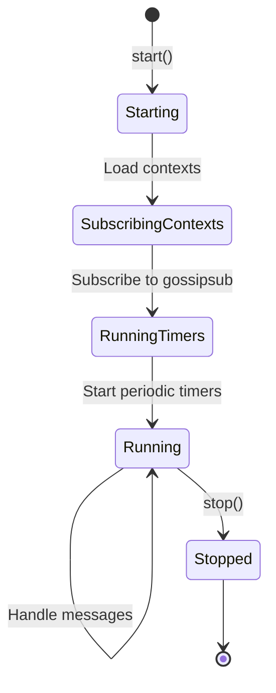
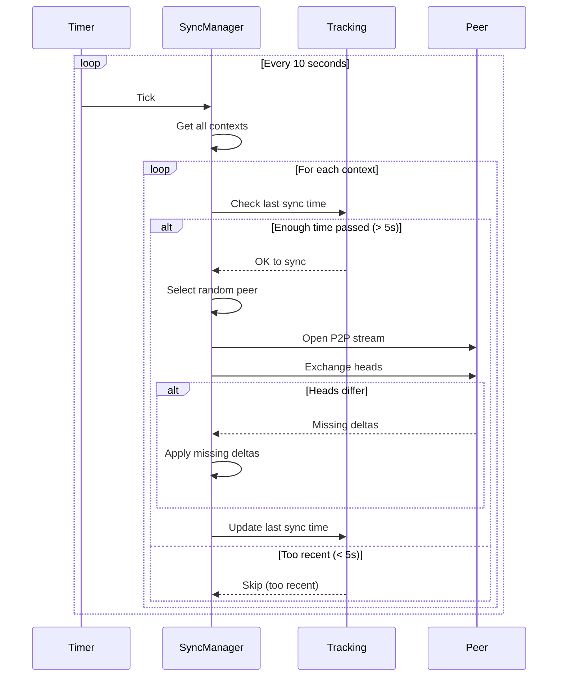
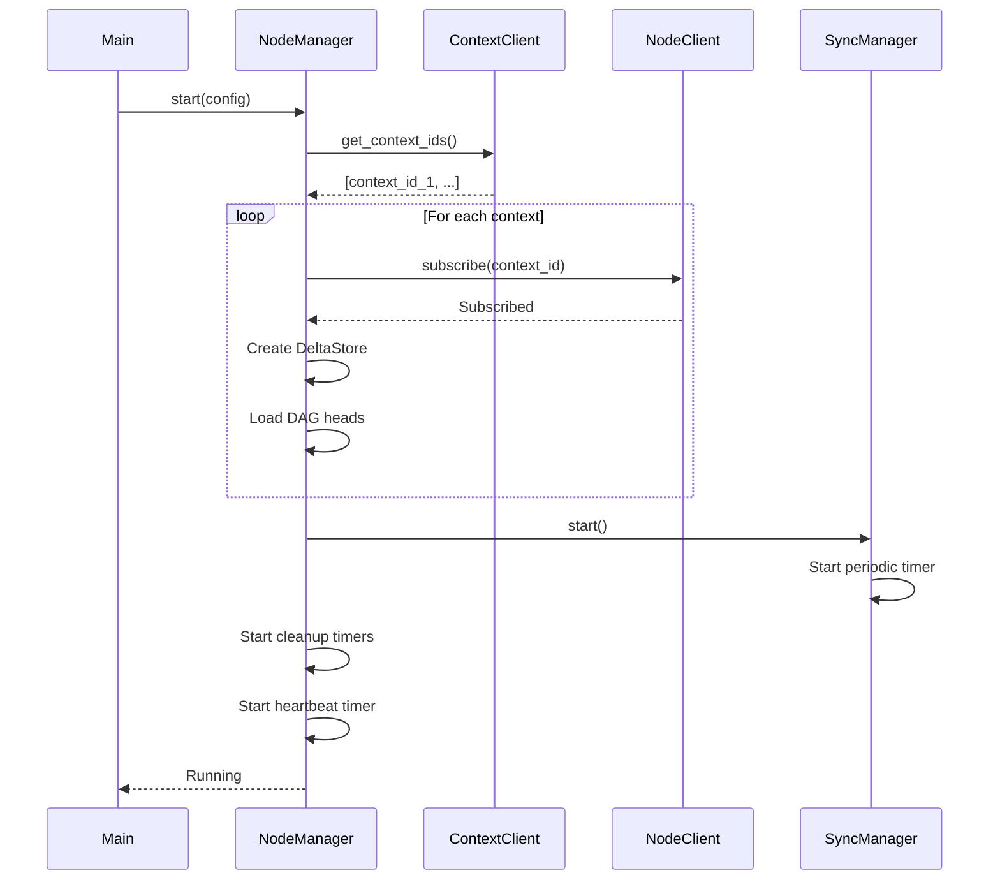
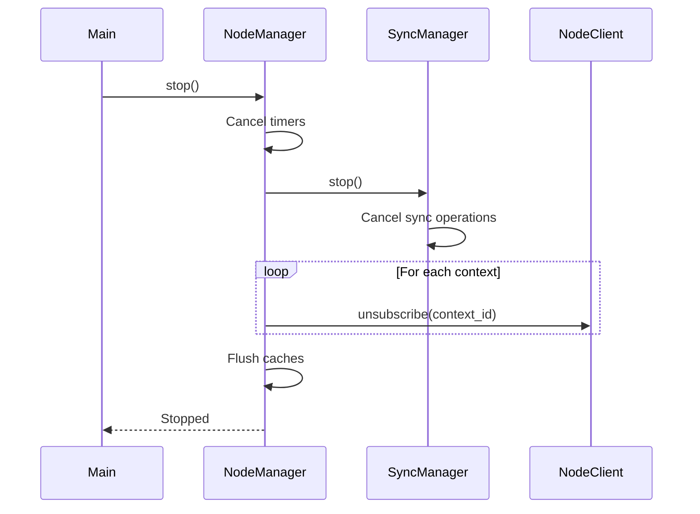

# Node Architecture

Internal design and component structure of Calimero Node.

---

## Overview

The node layer orchestrates **synchronization, event handling, and blob distribution** across a distributed network of peers. It wraps the DAG with WASM execution, networking, and lifecycle management.

**Core Responsibilities**:
1. **Delta Management**: Apply deltas to WASM state
2. **Network Coordination**: Gossipsub + P2P sync
3. **Event Execution**: Trigger event handlers on receiving nodes
4. **Blob Distribution**: Content-addressed file sharing
5. **Resource Management**: Memory limits, cleanup, GC

---

## Component Hierarchy

```
┌─────────────────────────────────────────────────────────┐
│ NodeManager (Actix Actor)                               │
│  - Orchestrates all components                          │
│  - Periodic timers (cleanup, heartbeat)                 │
└────────────────┬────────────────────────────────────────┘
                 │
     ┌───────────┴───────────┬─────────────┐
     │                       │             │
┌────▼────────┐    ┌────────▼──────┐   ┌──▼───────────┐
│NodeClients  │    │NodeManagers   │   │NodeState     │
│ - Context   │    │ - BlobManager │   │ - BlobCache  │
│ - Node      │    │ - SyncManager │   │ - DeltaStores│
└─────────────┘    └───────────────┘   └──────────────┘
```

**Design Pattern**: [Single Responsibility Principle](https://en.wikipedia.org/wiki/Single-responsibility_principle)
- `NodeClients`: External service clients
- `NodeManagers`: Service managers
- `NodeState`: Runtime state (caches, stores)

---

## Core Components

### NodeManager

**File**: `crates/node/src/lib.rs`

```rust
pub struct NodeManager {
    pub(crate) clients: NodeClients,
    pub(crate) managers: NodeManagers,
    pub(crate) state: NodeState,
}
```

**Role**: Main orchestrator (Actix Actor)

**Lifecycle**:


**Periodic Timers**:

| Timer | Interval | Purpose |
|-------|----------|---------|
| **Blob Eviction** | 5 min | LRU cache cleanup |
| **Delta Cleanup** | 60 sec | Evict stale pending deltas |
| **Hash Heartbeat** | 30 sec | Broadcast root hash for divergence detection |

**Implementation**:

```rust
impl Actor for NodeManager {
    type Context = actix::Context<Self>;
    
    fn started(&mut self, ctx: &mut Self::Context) {
        // 1. Subscribe to all contexts
        self.subscribe_to_contexts(ctx);
        
        // 2. Blob cache eviction (every 5 minutes)
        ctx.run_interval(Duration::from_secs(300), |act, _ctx| {
            act.state.evict_old_blobs();
        });
        
        // 3. Delta cleanup (every 60 seconds)
        ctx.run_interval(Duration::from_secs(60), |act, ctx| {
            act.cleanup_stale_deltas(ctx);
        });
        
        // 4. Hash heartbeat (every 30 seconds)
        ctx.run_interval(Duration::from_secs(30), |act, ctx| {
            act.broadcast_heartbeats(ctx);
        });
    }
}
```

---

### NodeClients

**External service clients** (injected dependencies):

```rust
pub(crate) struct NodeClients {
    pub(crate) context: ContextClient,  // WASM execution, storage
    pub(crate) node: NodeClient,        // Network operations
}
```

**ContextClient**:
- Execute WASM methods
- Get/update context metadata
- Query DAG heads, root hash

**NodeClient**:
- Subscribe/unsubscribe to contexts
- Broadcast deltas via gossipsub
- Open P2P streams for sync

---

### NodeManagers

**Service managers** (injected dependencies):

```rust
pub(crate) struct NodeManagers {
    pub(crate) blobstore: BlobManager,  // Blob storage
    pub(crate) sync: SyncManager,       // P2P sync coordination
}
```

**BlobManager**:
- Store blobs (content-addressed)
- Retrieve blobs by ID
- Garbage collection

**SyncManager**:
- Trigger periodic sync
- Track last sync time per context
- Coordinate P2P streams

---

### NodeState

**Runtime state** (mutable caches):

```rust
pub(crate) struct NodeState {
    pub(crate) blob_cache: Arc<DashMap<BlobId, CachedBlob>>,
    pub(crate) delta_stores: Arc<DashMap<ContextId, DeltaStore>>,
}
```

**blob_cache**: LRU cache for frequently accessed blobs
**delta_stores**: Per-context DAG stores

---

## DeltaStore

**File**: `crates/node/src/delta_store.rs`

Wraps `DagStore` with thread-safety and WASM execution:

```rust
pub struct DeltaStore {
    dag: Arc<RwLock<DagStore<Vec<Action>>>>,
    applier: Arc<ContextStorageApplier>,
}
```

### ContextStorageApplier

**How deltas are applied**:

```rust
pub struct ContextStorageApplier {
    pub context_client: ContextClient,
    pub context_id: ContextId,
    pub our_identity: PublicKey,
}

#[async_trait]
impl DeltaApplier<Vec<Action>> for ContextStorageApplier {
    async fn apply(&self, delta: &CausalDelta<Vec<Action>>) -> Result<(), ApplyError> {
        // 1. Serialize actions for WASM
        let artifact = borsh::to_vec(&StorageDelta::Actions(delta.payload.clone()))?;
        
        // 2. Execute __calimero_sync_next in WASM
        let outcome = self.context_client
            .execute(
                &self.context_id,
                &self.our_identity,
                "__calimero_sync_next",
                artifact,
                vec![],
                None,
            )
            .await?;
        
        // 3. Check result
        outcome.returns?;
        
        Ok(())
    }
}
```

**Flow**:
1. Actions serialized with Borsh
2. WASM function `__calimero_sync_next` executed
3. WASM applies actions to CRDT storage
4. Success/failure returned

---

## Blob Cache System

**File**: `crates/node/src/lib.rs` (lines 43-193)

### CachedBlob

```rust
pub struct CachedBlob {
    pub data: Arc<[u8]>,
    pub last_accessed: Instant,
}
```

**Access tracking**: `touch()` updates `last_accessed` for LRU eviction

### Eviction Strategy (3-Phase)

```rust
fn evict_old_blobs(&self) {
    const MAX_BLOB_AGE: Duration = Duration::from_secs(300);       // 5 minutes
    const MAX_CACHE_COUNT: usize = 100;                            // 100 blobs
    const MAX_CACHE_BYTES: usize = 500 * 1024 * 1024;              // 500 MB
    
    // Phase 1: Remove blobs older than 5 minutes
    self.blob_cache.retain(|_, blob| blob.age() < MAX_BLOB_AGE);
    
    // Phase 2: Remove oldest if count > 100
    if self.blob_cache.len() > MAX_CACHE_COUNT {
        // LRU eviction by last_accessed
        let to_remove = self.blob_cache.len() - MAX_CACHE_COUNT;
        evict_oldest(to_remove);
    }
    
    // Phase 3: Remove oldest if total size > 500 MB
    let total_size = self.blob_cache.iter().map(|b| b.data.len()).sum();
    if total_size > MAX_CACHE_BYTES {
        evict_oldest_until_under_budget(MAX_CACHE_BYTES);
    }
}
```

**Why 3 phases?**
1. **Time-based**: Quick removal of stale blobs
2. **Count-based**: Prevent too many small blobs
3. **Size-based**: Prevent memory exhaustion

---

## Periodic Cleanup

**File**: `crates/node/src/lib.rs` (lines 257-310)

### Stale Delta Cleanup

```rust
ctx.run_interval(Duration::from_secs(60), |act, ctx| {
    let max_age = Duration::from_secs(300);  // 5 minutes
    
    for delta_store in act.state.delta_stores.iter() {
        let context_id = *delta_store.key();
        
        // Evict stale pending deltas
        let evicted = delta_store.cleanup_stale(max_age).await;
        
        if evicted > 0 {
            warn!(context_id, evicted_count = evicted,
                  "Evicted stale pending deltas");
        }
        
        // Log stats
        let stats = delta_store.pending_stats().await;
        if stats.count > 0 {
            debug!(context_id, 
                   pending_count = stats.count,
                   oldest_age_secs = stats.oldest_age_secs,
                   "Pending delta statistics");
        }
        
        // Trigger snapshot fallback if too many pending
        if stats.count > 100 {
            warn!(context_id, pending_count = stats.count,
                  "Too many pending - state sync will recover");
        }
    }
});
```

**Why cleanup every 60 seconds?**
- Prevents unbounded memory growth
- Detects stuck pending deltas early
- Triggers recovery mechanisms

---

## Hash Heartbeat Broadcasting

**File**: `crates/node/src/lib.rs` (lines 312-353)

### Silent Divergence Detection

```rust
ctx.run_interval(Duration::from_secs(30), |act, ctx| {
    for context_id in act.clients.context.get_context_ids() {
        let context = act.clients.context.get_context(&context_id)?;
        
        // Broadcast root hash + DAG heads
        act.clients.node.broadcast_heartbeat(
            &context_id,
            context.root_hash,
            context.dag_heads.clone(),
        ).await?;
    }
});
```

**Purpose**: Detect silent divergence
- Nodes broadcast their root hash periodically
- Receiving nodes compare with their own
- Mismatch triggers state sync fallback

**Why every 30 seconds?**
- Fast enough to detect divergence quickly
- Slow enough to avoid network spam
- Balances detection speed vs. overhead

---

## Sync Manager

**File**: `crates/node/src/sync/manager.rs`

### SyncManager Structure

```rust
pub struct SyncManager {
    config: SyncConfig,
    tracking: Arc<RwLock<SyncTracking>>,
    node_client: NodeClient,
    context_client: ContextClient,
}
```

### Periodic Sync Loop



**Configuration** (see `sync/config.rs`):

```rust
pub const DEFAULT_SYNC_FREQUENCY_SECS: u64 = 10;  // Check every 10s
pub const DEFAULT_SYNC_INTERVAL_SECS: u64 = 5;    // Min 5s between syncs
pub const DEFAULT_SYNC_TIMEOUT_SECS: u64 = 30;    // 30s timeout
pub const DEFAULT_MAX_CONCURRENT_SYNCS: usize = 30;
```

---

## Sync Tracking

**File**: `crates/node/src/sync/tracking.rs`

### Purpose

Prevent sync spam by tracking last sync time per context:

```rust
pub struct SyncTracking {
    last_sync: HashMap<ContextId, Instant>,
}

impl SyncTracking {
    pub fn should_sync(&self, context_id: &ContextId, interval: Duration) -> bool {
        match self.last_sync.get(context_id) {
            Some(last) => last.elapsed() >= interval,
            None => true,  // Never synced
        }
    }
    
    pub fn record_sync(&mut self, context_id: ContextId) {
        self.last_sync.insert(context_id, Instant::now());
    }
}
```

**Why needed?**
- Without tracking, could sync same context every 10s
- With tracking, respects minimum 5s interval
- Reduces redundant sync operations

---

## Arbiter Pool

**File**: `crates/node/src/arbiter_pool.rs`

### Purpose

Distribute async tasks across Actix arbiters (worker threads):

```rust
pub struct ArbiterPool {
    arbiters: Vec<Arbiter>,
    next_idx: AtomicUsize,
}

impl ArbiterPool {
    pub fn new(size: usize) -> Self {
        let arbiters = (0..size).map(|_| Arbiter::new()).collect();
        Self {
            arbiters,
            next_idx: AtomicUsize::new(0),
        }
    }
    
    pub fn next(&self) -> &Arbiter {
        let idx = self.next_idx.fetch_add(1, Ordering::Relaxed);
        &self.arbiters[idx % self.arbiters.len()]
    }
}
```

**Use cases**:
- Distribute WASM execution across threads
- Parallelize event handler execution
- Balance load across CPU cores

**Round-robin strategy**: Simple, fair, good for balanced workloads

---

## GC Module

**File**: `crates/node/src/gc.rs`

### Garbage Collection

Cleans up abandoned contexts:

```rust
pub async fn run_gc(
    context_client: &ContextClient,
    node_client: &NodeClient,
) {
    // Find contexts with no recent activity
    let stale_contexts = find_stale_contexts(context_client).await;
    
    for context_id in stale_contexts {
        // Unsubscribe from gossipsub
        node_client.unsubscribe(&context_id).await?;
        
        // Remove from local state
        context_client.delete_context(&context_id).await?;
    }
}
```

**Criteria for GC**:
- No activity for X days
- No peers in context
- User marked as deleted

---

## Handlers

**File**: `crates/node/src/handlers/`

### Handler Types

| Handler | File | Purpose |
|---------|------|---------|
| **network_event** | `network_event.rs` | Gossipsub message handling |
| **state_delta** | `state_delta.rs` | Delta application + event execution |
| **stream_opened** | `stream_opened.rs` | P2P stream handling |
| **blob_protocol** | `blob_protocol.rs` | Blob sync over P2P |
| **get_blob_bytes** | `get_blob_bytes.rs` | Blob retrieval |

### network_event Handler

```rust
pub async fn handle_network_event(
    event: NetworkEvent,
    manager: &NodeManager,
) -> Result<()> {
    match event {
        NetworkEvent::StateDelta { context_id, delta, source } => {
            // 1. Get or create delta store
            let delta_store = manager.state.delta_stores
                .entry(context_id)
                .or_insert_with(|| create_delta_store(&context_id, &manager.clients));
            
            // 2. Apply delta to DAG
            let applied = delta_store.add_delta(delta.clone()).await?;
            
            if applied {
                // 3. Execute event handlers (if not author)
                if source != our_peer_id {
                    execute_event_handlers(&context_id, &delta.events, manager).await?;
                }
                
                // 4. Emit to WebSocket clients
                manager.clients.node.emit_delta(&context_id, &delta).await?;
            } else {
                // Delta pending - request missing parents
                request_missing_parents(&context_id, &delta, manager).await?;
            }
        }
        
        // ... other event types
    }
}
```

---

## Memory Layout

### Per-Context Memory

```
DeltaStore:
  - DAG (in-memory): 5-10 MB (1000 deltas × 5 KB)
  - Applied set: 32 KB (1000 × 32 bytes)
  - Pending: 0-500 KB (0-100 × 5 KB)

Total per context: ~5-11 MB
```

### Node-Wide Memory

```
100 contexts × 10 MB = 1 GB (DAGs)
Blob cache: 500 MB (configurable)
Arbiters: 50 MB (thread overhead)
Network: 100 MB (buffers, connections)

Total: ~1.6 GB for 100 contexts
```

**Scalability**: Linear with context count

---

## Thread Model

### Actix Actor System

```
Main Thread (System Arbiter)
  ↓
NodeManager Actor
  ↓
Spawns futures on:
  - System arbiter (default)
  - Arbiter pool (WASM execution)
  - Tokio threadpool (I/O)
```

**Concurrency**:
- One actor instance (single-threaded message handling)
- Futures can run on any thread
- DAG access synchronized via RwLock

---

## Configuration

### Node Config

```rust
pub struct NodeConfig {
    pub sync_config: SyncConfig,
    pub blob_cache_size: usize,
    pub blob_cache_ttl: Duration,
    pub delta_cleanup_interval: Duration,
    pub delta_max_age: Duration,
}
```

**Defaults** (production):
```rust
impl Default for NodeConfig {
    fn default() -> Self {
        Self {
            sync_config: SyncConfig::default(),
            blob_cache_size: 100,
            blob_cache_ttl: Duration::from_secs(300),
            delta_cleanup_interval: Duration::from_secs(60),
            delta_max_age: Duration::from_secs(300),
        }
    }
}
```

---

## Startup Sequence



**Total startup time**: ~1-2 seconds for 100 contexts

---

## Shutdown Sequence



**Graceful shutdown**: ~500ms

---

## See Also

- [Sync Protocol](sync-protocol.md) - How sync works
- [Event Handling](event-handling.md) - Event execution
- [Performance](performance.md) - Performance characteristics
- [Design Decisions](design-decisions.md) - Why we built it this way
