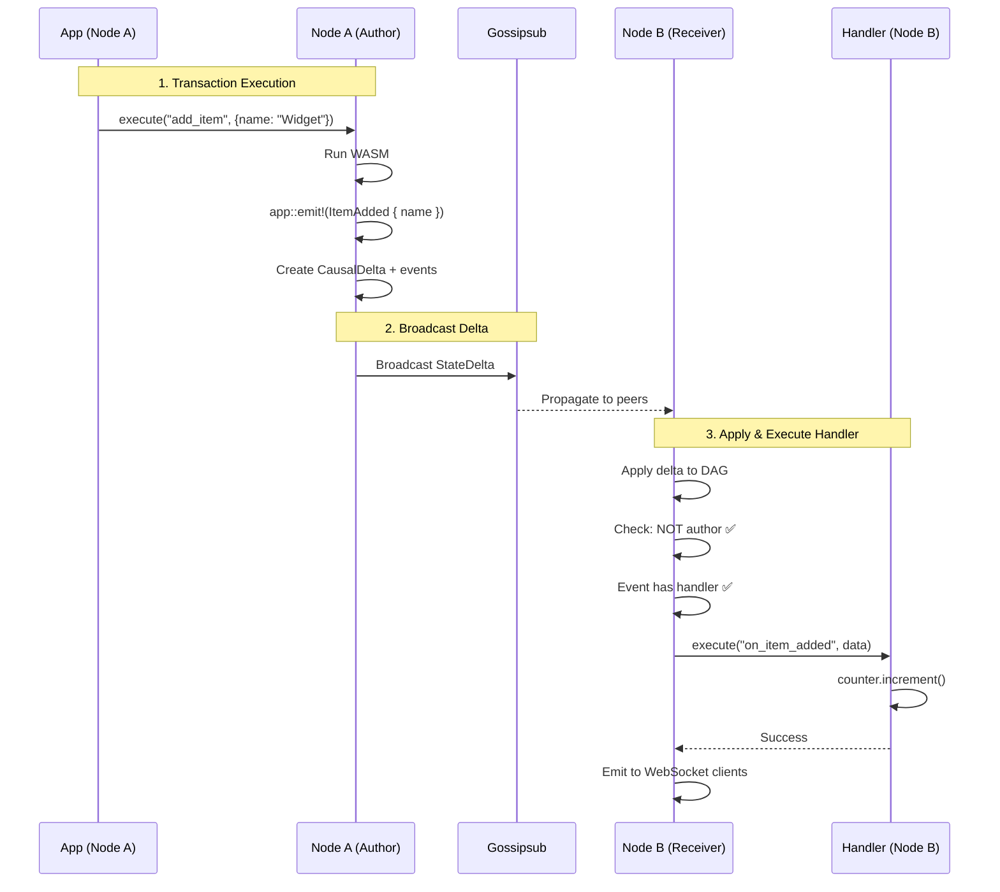

# Event Handling Guide

Complete guide to how Calimero handles and executes events.

---

## Overview

Events in Calimero allow applications to react to state changes. When a transaction executes and emits events, **receiving nodes** (not the author) automatically execute handler functions.

**Key Principle**: **Author nodes DO NOT execute their own event handlers**. This prevents infinite loops and ensures a proper distributed execution model.

---

## Event Flow

### Step-by-Step Execution



---

## Execution Rules

### Rule 1: Author Nodes Skip Handlers

**Why**: Prevents infinite loops

```rust
// In: crates/node/src/handlers/network_event.rs
if source_peer == our_peer_id {
    // We are the author - skip handler execution
    debug!("Skipping handler execution (we are author)");
    return Ok(());
}

// Not author - execute handler
execute_event_handler(context_id, event).await?;
```

**Example Scenario**:
```rust
// Node A executes transaction
pub fn add_item(&mut self, name: String) {
    self.items.insert(name.clone(), Item::new());
    
    app::emit!(ItemAdded { name });
    // If Node A also executed handler, it would:
    // → emit another event
    // → execute handler again
    // → infinite loop! ❌
}

// Handler (only runs on Node B, C, D...)
#[app::event_handler]
pub fn on_item_added(&mut self, event: ItemAdded) {
    self.event_count.increment(); // Only Node B, C, D increment
}
```

### Rule 2: Handlers Execute After Delta Application

Handlers only run after the delta is successfully applied:

```rust
// Apply delta first
let applied = dag.add_delta(delta, &applier).await?;

if !applied {
    // Delta pending - handlers buffered, will execute later
    return Ok(());
}

// Delta applied ✅ - now execute handlers
for event in &delta.events {
    execute_handler(context_id, event).await?;
}
```

### Rule 3: Handlers May Create New Events

Handlers can emit events, creating a chain of reactions:

```rust
#[app::event_handler]
pub fn on_item_added(&mut self, event: ItemAdded) {
    self.event_count.increment();
    
    // Emit new event
    app::emit!(CounterIncremented {
        new_value: self.event_count.value().unwrap(),
    });
}

// This creates a new delta with the event!
// Other nodes will receive and execute CounterIncremented handler
```

**Important**: Nested events still follow Rule 1 - the node that executes the handler is the author of the new event, so it won't execute nested handlers.

---

## Handler Patterns

### Pattern 1: Simple Counter

Track number of events:

```rust
#[app::event]
#[derive(Debug)]
pub enum MyEvent {
    ItemAdded { name: String },
}

#[app::state(emits = MyEvent)]
pub struct MyApp {
    items: UnorderedMap<String, Item>,
    event_count: Counter,  // Tracks events
}

#[app::logic]
impl MyApp {
    pub fn add_item(&mut self, name: String) {
        self.items.insert(name.clone(), Item::new());
        app::emit!(MyEvent::ItemAdded { name });
    }
}

// Handler runs on receiving nodes
#[app::event_handler]
impl MyApp {
    pub fn on_item_added(&mut self, event: MyEvent) {
        if let MyEvent::ItemAdded { .. } = event {
            self.event_count.increment();
        }
    }
}
```

### Pattern 2: Aggregate Statistics

Collect stats from distributed events:

```rust
#[app::event]
pub enum SalesEvent {
    ProductSold { product: String, price: u64 },
}

#[app::state(emits = SalesEvent)]
pub struct SalesApp {
    inventory: UnorderedMap<String, u64>,
    total_revenue: Counter,        // Sum of all sales
    sales_by_product: UnorderedMap<String, Counter>,
}

#[app::event_handler]
impl SalesApp {
    pub fn on_product_sold(&mut self, event: SalesEvent) {
        if let SalesEvent::ProductSold { product, price } = event {
            // Update total revenue
            for _ in 0..price {
                self.total_revenue.increment();
            }
            
            // Update per-product sales
            let mut product_counter = self.sales_by_product
                .get(&product)
                .unwrap_or_else(|| Counter::new());
            product_counter.increment();
            self.sales_by_product.insert(product, product_counter);
        }
    }
}
```

### Pattern 3: Derived State

Maintain derived views:

```rust
#[app::event]
pub enum TaskEvent {
    TaskCreated { id: String, assignee: String },
    TaskCompleted { id: String },
}

#[app::state(emits = TaskEvent)]
pub struct TaskApp {
    tasks: UnorderedMap<String, Task>,
    
    // Derived: tasks per user
    tasks_by_user: UnorderedMap<String, UnorderedSet<String>>,
    
    // Derived: completion stats
    completion_count: Counter,
}

#[app::event_handler]
impl TaskApp {
    pub fn on_task_created(&mut self, event: TaskEvent) {
        if let TaskEvent::TaskCreated { id, assignee } = event {
            // Update index
            let mut user_tasks = self.tasks_by_user
                .get(&assignee)
                .unwrap_or_else(|| UnorderedSet::new());
            user_tasks.insert(id.clone());
            self.tasks_by_user.insert(assignee, user_tasks);
        }
    }
    
    pub fn on_task_completed(&mut self, _event: TaskEvent) {
        self.completion_count.increment();
    }
}
```

---

## Handler Requirements

Event handlers **may execute in parallel** in future optimizations. Design handlers to be:

### 1. Commutative

Order doesn't matter:

```rust
// ✅ GOOD: Counter increments are commutative
#[app::event_handler]
pub fn on_event(&mut self, _event: MyEvent) {
    self.counter.increment();  // A→B same as B→A
}

// ❌ BAD: Sequential dependencies
#[app::event_handler]
pub fn on_event(&mut self, event: MyEvent) {
    let item = self.items.get(&event.id).unwrap(); // ⚠️ Assumes exists
    item.update(event.data);  // Breaks if events reordered!
}
```

### 2. Independent

No shared mutable state:

```rust
// ✅ GOOD: Each handler uses unique key
#[app::event_handler]
pub fn on_user_event(&mut self, event: UserEvent) {
    let user_id = event.user_id.clone();
    let mut user_stats = self.stats.get(&user_id)
        .unwrap_or_else(|| Stats::new());
    user_stats.counter.increment();
    self.stats.insert(user_id, user_stats);
}

// ❌ BAD: Multiple handlers modify same entity
#[app::event_handler]
pub fn handler_a(&mut self, _event: EventA) {
    self.global_state.field1 = "A";  // ⚠️ Race condition!
}

#[app::event_handler]
pub fn handler_b(&mut self, _event: EventB) {
    self.global_state.field1 = "B";  // ⚠️ Conflicts with A!
}
```

### 3. Idempotent

Safe to retry:

```rust
// ✅ GOOD: CRDT operations are idempotent
#[app::event_handler]
pub fn on_event(&mut self, event: MyEvent) {
    self.items.insert(event.id, event.data);  // Same result if retried
}

// ❌ BAD: Side effects
#[app::event_handler]
pub fn on_event(&mut self, event: MyEvent) {
    http_post("https://api.example.com", event.data); // ⚠️ Not idempotent!
}
```

### 4. Pure

No external side effects:

```rust
// ✅ GOOD: Only modifies CRDT state
#[app::event_handler]
pub fn on_event(&mut self, event: MyEvent) {
    self.counter.increment();
    self.items.insert(event.id, event.data);
}

// ❌ BAD: External I/O
#[app::event_handler]
pub fn on_event(&mut self, event: MyEvent) {
    std::fs::write("/tmp/log", event.data); // ⚠️ Side effect!
    send_email(event.user); // ⚠️ External API call!
}
```

---

## Debugging Handlers

### Enable Handler Logging

```rust
// Set log level
RUST_LOG=debug cargo run

// Look for:
// "Event emitted with handler (will be executed on receiving nodes)"
// "Executing event handler"
// "Handler execution completed"
```

### Check Handler Execution

```rust
// Add debug logging to your handler
#[app::event_handler]
pub fn on_item_added(&mut self, event: MyEvent) {
    env::log(&format!("Handler executing: {:?}", event));
    self.counter.increment();
    env::log(&format!("Counter now: {}", self.counter.value().unwrap()));
}
```

### Verify Handler Registration

```rust
// In your app, check handler is registered
#[app::event_handler]
impl MyApp {
    pub fn on_my_event(&mut self, event: MyEvent) {
        // Handler name MUST match: "on_" + event_name_snake_case
        // ✅ Event: ItemAdded → Handler: on_item_added
        // ❌ Event: ItemAdded → Handler: handle_item_added (won't work!)
    }
}
```

---

## Common Issues

### Handler Not Executing

**Symptom**: Events emitted but handler never runs

**Causes**:
1. You are the author node (expected behavior!)
2. Handler name doesn't match event name
3. Event doesn't have `handler` field set
4. Delta not applied (still pending)

**Solutions**:
```rust
// 1. Check you're testing on a receiving node, not author
if source_peer == our_peer_id {
    // This is CORRECT - author skips handlers
}

// 2. Verify handler name matches
#[app::event]
pub enum MyEvent {
    ItemAdded { name: String },  // Event name
}

#[app::event_handler]
impl MyApp {
    pub fn on_item_added(&mut self, event: MyEvent) {
        // Handler MUST be "on_" + snake_case(event_name)
        // ✅ on_item_added
        // ❌ on_itemadded, on_item_add, handle_item_added
    }
}

// 3. Check event has handler set
app::emit!(MyEvent::ItemAdded {
    name: "Widget".to_string(),
});
// SDK automatically sets handler field

// 4. Verify delta applied
let applied = dag.add_delta(delta, &applier).await?;
if !applied {
    // Handler will execute when parents arrive
}
```

### Infinite Loop

**Symptom**: Handler keeps executing, creating more events

**Cause**: Handler emits event that triggers itself

**Solution**:
```rust
// ❌ BAD: Infinite loop
#[app::event_handler]
pub fn on_item_added(&mut self, event: MyEvent) {
    app::emit!(MyEvent::ItemAdded { ... }); // Triggers itself on other nodes!
}

// ✅ GOOD: Use different event type
#[app::event_handler]
pub fn on_item_added(&mut self, event: MyEvent) {
    app::emit!(MyEvent::CounterIncremented { ... }); // Different event
}
```

### Handler Errors Lost

**Symptom**: Handler errors don't show up

**Cause**: Handler errors are logged but don't propagate

**Solution**:
```rust
// Add explicit logging
#[app::event_handler]
pub fn on_my_event(&mut self, event: MyEvent) -> Result<(), String> {
    match self.process_event(event) {
        Ok(()) => Ok(()),
        Err(e) => {
            env::log(&format!("Handler error: {}", e));
            Err(e)
        }
    }
}
```

---

## See Also

- [Main README](../README.md) - Overview
- [Sync Protocol](sync-protocol.md) - How events propagate
- [DAG Documentation](../../dag/README.md) - Delta application
- [Storage Documentation](../../storage/README.md) - CRDTs in handlers

