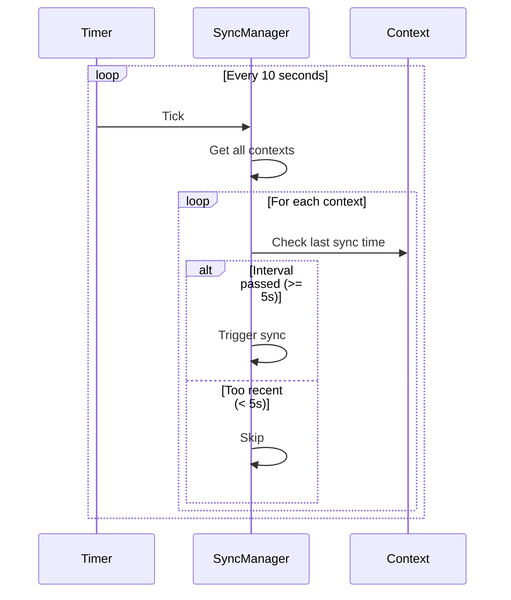

# Sync Configuration Guide

Complete guide to configuring node synchronization behavior.

---

## Overview

Calimero's sync system uses a **dual-path approach**:

1. **Gossipsub Broadcast** (Primary): Fast, real-time propagation (~100ms)
2. **Periodic P2P Sync** (Fallback): Ensures eventual consistency

Configuration controls the fallback path timing and behavior.

---

## SyncConfig Structure

```rust
pub struct SyncConfig {
    /// Timeout for entire sync operation
    pub timeout: Duration,
    
    /// Minimum interval between syncs for same context
    pub interval: Duration,
    
    /// Frequency of periodic sync checks
    pub frequency: Duration,
    
    /// Maximum concurrent sync operations
    pub max_concurrent: usize,
    
    /// Snapshot chunk size for full resync (bytes)
    pub snapshot_chunk_size: usize,
    
    /// Maximum delta gap before falling back to full resync
    pub delta_sync_threshold: usize,
}
```

---

## Configuration Parameters

### 1. timeout

**What**: Maximum time for a complete sync operation

**Default**: `30 seconds`

```rust
pub const DEFAULT_SYNC_TIMEOUT_SECS: u64 = 30;
```

**Purpose**:
- Prevents hung sync operations
- Frees resources if peer unresponsive
- Allows retry on next sync cycle

**Tuning**:

| Environment | Recommended | Rationale |
|-------------|-------------|-----------|
| **Local** | 10s | Low latency, fast networks |
| **Cloud** | 30s | Moderate latency |
| **Satellite** | 60s | High latency (500ms+ RTT) |

**Example**:
```rust
let config = SyncConfig {
    timeout: Duration::from_secs(10),  // Fast local network
    ..Default::default()
};
```

---

### 2. interval

**What**: Minimum time between syncs for the **same context**

**Default**: `5 seconds`

```rust
pub const DEFAULT_SYNC_INTERVAL_SECS: u64 = 5;
```

**Purpose**:
- Prevents sync spam
- Allows rapid re-sync if broadcasts fail
- Balances convergence speed vs. overhead

**How it works**:
```
Context A last synced at T=0
- T=3s: Skip sync (only 3s elapsed, < 5s interval)
- T=5s: Sync allowed (5s elapsed, >= 5s interval)
- T=7s: Skip sync (only 2s since last sync)
```

**Tuning**:

| Network Size | Recommended | Rationale |
|--------------|-------------|-----------|
| **Small (< 10 nodes)** | 2s | Fast convergence, low overhead |
| **Medium (10-50 nodes)** | 5s | Balanced (default) |
| **Large (> 50 nodes)** | 10s | Reduce network load |

**Example**:
```rust
// Aggressive convergence for small network
let config = SyncConfig {
    interval: Duration::from_secs(2),
    ..Default::default()
};
```

---

### 3. frequency

**What**: How often to check **all contexts** for sync

**Default**: `10 seconds`

```rust
pub const DEFAULT_SYNC_FREQUENCY_SECS: u64 = 10;
```

**Purpose**:
- Periodic timer that scans all contexts
- Triggers sync if `interval` has passed
- Aggressive fallback for broadcast failures

**How it works**:


**Tuning**:

| Use Case | Recommended | Rationale |
|----------|-------------|-----------|
| **Dev/Testing** | 5s | Fast iteration |
| **Production** | 10s | Balanced (default) |
| **Low Activity** | 30s | Reduce overhead |
| **High Activity** | 5s | Fast recovery |

**Example**:
```rust
// Fast development iteration
let config = SyncConfig {
    frequency: Duration::from_secs(5),
    interval: Duration::from_secs(2),
    ..Default::default()
};
```

**Trade-off**:
- Lower frequency = less overhead, slower recovery
- Higher frequency = more overhead, faster recovery

---

### 4. max_concurrent

**What**: Maximum number of concurrent sync operations

**Default**: `30`

```rust
pub const DEFAULT_MAX_CONCURRENT_SYNCS: usize = 30;
```

**Purpose**:
- Prevents resource exhaustion
- Limits network connections
- Bounds memory usage

**Calculation**:
```
Max memory = max_concurrent × avg_sync_size
           = 30 × 10 MB
           = 300 MB
```

**Tuning**:

| Node Resources | Recommended | Rationale |
|----------------|-------------|-----------|
| **Low (2GB RAM)** | 10 | Conserve memory |
| **Medium (8GB RAM)** | 30 | Balanced (default) |
| **High (16GB+ RAM)** | 50 | Max parallelism |

**Example**:
```rust
// Low-resource node
let config = SyncConfig {
    max_concurrent: 10,
    ..Default::default()
};
```

---

### 5. snapshot_chunk_size

**What**: Size of chunks when transferring full state snapshots

**Default**: `64 KB`

```rust
pub const DEFAULT_SNAPSHOT_CHUNK_SIZE: usize = 64 * 1024;
```

**Purpose**:
- Break large states into manageable pieces
- Stream state without loading all in memory
- Progress tracking for large syncs

**When used**:
- Full state sync (when delta sync fails)
- Initial context join
- Large state gaps

**Tuning**:

| Network | Recommended | Rationale |
|---------|-------------|-----------|
| **Slow (mobile)** | 32 KB | Smaller packets |
| **Normal** | 64 KB | Balanced (default) |
| **Fast (LAN)** | 128 KB | Fewer round-trips |

**Example**:
```rust
// Mobile-optimized
let config = SyncConfig {
    snapshot_chunk_size: 32 * 1024,  // 32 KB
    ..Default::default()
};
```

---

### 6. delta_sync_threshold

**What**: Maximum delta gap before switching to full state resync

**Default**: `128`

```rust
pub const DEFAULT_DELTA_SYNC_THRESHOLD: usize = 128;
```

**Purpose**:
- Avoid sending 1000s of deltas
- Switch to snapshot for large gaps
- Optimize bandwidth

**How it works**:
```
Node A: 1000 deltas
Node B: 872 deltas

Gap = 1000 - 872 = 128 deltas

if gap <= 128:
    Send 128 deltas (delta sync)
else:
    Send full snapshot (state sync)
```

**Tuning**:

| State Size | Recommended | Rationale |
|------------|-------------|-----------|
| **Small (< 1 MB)** | 256 | Delta sync cheap |
| **Medium (1-10 MB)** | 128 | Balanced (default) |
| **Large (> 10 MB)** | 64 | Snapshot cheaper |

**Example**:
```rust
// Large state, prefer snapshots
let config = SyncConfig {
    delta_sync_threshold: 64,
    ..Default::default()
};
```

---

## Preset Configurations

### Development (Aggressive)

**Use**: Local testing, fast iteration

```rust
pub fn dev_config() -> SyncConfig {
    SyncConfig {
        timeout: Duration::from_secs(10),
        interval: Duration::from_secs(2),
        frequency: Duration::from_secs(5),
        max_concurrent: 50,
        snapshot_chunk_size: 128 * 1024,
        delta_sync_threshold: 256,
    }
}
```

**Characteristics**:
- Fast convergence (2s interval)
- Frequent checks (5s frequency)
- Large chunks (128 KB)
- High concurrency (50)

---

### Production (Balanced)

**Use**: Normal production deployment

```rust
pub fn production_config() -> SyncConfig {
    SyncConfig::default()
}
```

**Default values**:
```rust
timeout: 30s
interval: 5s
frequency: 10s
max_concurrent: 30
snapshot_chunk_size: 64 KB
delta_sync_threshold: 128
```

**Characteristics**:
- Balanced convergence vs. overhead
- Reliable for 20-50 nodes
- Moderate resource usage

---

### Large Network (Conservative)

**Use**: 50-200 nodes, high traffic

```rust
pub fn large_network_config() -> SyncConfig {
    SyncConfig {
        timeout: Duration::from_secs(60),
        interval: Duration::from_secs(15),
        frequency: Duration::from_secs(30),
        max_concurrent: 20,
        snapshot_chunk_size: 64 * 1024,
        delta_sync_threshold: 64,
    }
}
```

**Characteristics**:
- Slower convergence (15s interval)
- Less frequent checks (30s)
- Lower concurrency (20)
- Prefer snapshots (threshold 64)

---

### Mobile/Satellite (High Latency)

**Use**: High-latency networks (500ms+ RTT)

```rust
pub fn high_latency_config() -> SyncConfig {
    SyncConfig {
        timeout: Duration::from_secs(120),
        interval: Duration::from_secs(30),
        frequency: Duration::from_secs(60),
        max_concurrent: 10,
        snapshot_chunk_size: 32 * 1024,
        delta_sync_threshold: 128,
    }
}
```

**Characteristics**:
- Very long timeout (2 min)
- Slow interval (30s)
- Small chunks (32 KB)
- Low concurrency (10)

---

## Configuration Best Practices

### 1. Match Network Conditions

**Low Latency (< 50ms)**:
```rust
let config = SyncConfig {
    timeout: Duration::from_secs(10),
    interval: Duration::from_secs(2),
    ..Default::default()
};
```

**High Latency (> 500ms)**:
```rust
let config = SyncConfig {
    timeout: Duration::from_secs(60),
    interval: Duration::from_secs(30),
    ..Default::default()
};
```

---

### 2. Scale with Node Count

**Small Network (< 10 nodes)**:
```rust
let config = SyncConfig {
    frequency: Duration::from_secs(5),
    interval: Duration::from_secs(2),
    max_concurrent: 50,
    ..Default::default()
};
```

**Large Network (> 50 nodes)**:
```rust
let config = SyncConfig {
    frequency: Duration::from_secs(30),
    interval: Duration::from_secs(15),
    max_concurrent: 20,
    ..Default::default()
};
```

---

### 3. Consider Resource Constraints

**Low RAM (< 4GB)**:
```rust
let config = SyncConfig {
    max_concurrent: 10,
    snapshot_chunk_size: 32 * 1024,
    ..Default::default()
};
```

**High RAM (16GB+)**:
```rust
let config = SyncConfig {
    max_concurrent: 50,
    snapshot_chunk_size: 128 * 1024,
    ..Default::default()
};
```

---

### 4. Optimize for State Size

**Small State (< 1 MB)**:
```rust
let config = SyncConfig {
    delta_sync_threshold: 256,  // Deltas cheap
    snapshot_chunk_size: 128 * 1024,
    ..Default::default()
};
```

**Large State (> 10 MB)**:
```rust
let config = SyncConfig {
    delta_sync_threshold: 64,  // Prefer snapshots
    snapshot_chunk_size: 64 * 1024,
    ..Default::default()
};
```

---

## Monitoring Sync Performance

### Key Metrics

```rust
// Track sync operations
metrics::counter!("sync.operations.total", 1);
metrics::counter!("sync.operations.success", 1);
metrics::counter!("sync.operations.failure", 1);

// Track sync duration
metrics::histogram!("sync.duration", duration.as_secs_f64());

// Track concurrent syncs
metrics::gauge!("sync.concurrent", active_syncs as f64);

// Track delta vs. snapshot
metrics::counter!("sync.type.delta", 1);
metrics::counter!("sync.type.snapshot", 1);
```

### Alert Thresholds

| Metric | Warning | Critical |
|--------|---------|----------|
| `sync.operations.failure` rate | > 10% | > 25% |
| `sync.duration` p99 | > timeout × 0.8 | > timeout |
| `sync.concurrent` | > max_concurrent × 0.8 | > max_concurrent |

---

## Troubleshooting

### Slow Convergence

**Symptom**: Nodes take minutes to sync

**Possible Causes**:
1. `interval` too long
2. `frequency` too long
3. Network latency high

**Solutions**:
```rust
// Reduce interval and frequency
let config = SyncConfig {
    interval: Duration::from_secs(2),
    frequency: Duration::from_secs(5),
    ..Default::default()
};
```

---

### High Network Traffic

**Symptom**: Excessive bandwidth usage

**Possible Causes**:
1. `frequency` too short
2. `max_concurrent` too high
3. Too many contexts

**Solutions**:
```rust
// Increase intervals
let config = SyncConfig {
    frequency: Duration::from_secs(30),
    interval: Duration::from_secs(15),
    max_concurrent: 10,
    ..Default::default()
};
```

---

### Sync Timeouts

**Symptom**: Many sync operations timeout

**Possible Causes**:
1. `timeout` too short for network latency
2. Large state transfers
3. Slow peer nodes

**Solutions**:
```rust
// Increase timeout
let config = SyncConfig {
    timeout: Duration::from_secs(60),
    ..Default::default()
};
```

---

### Memory Pressure

**Symptom**: Node OOM or high memory usage

**Possible Causes**:
1. `max_concurrent` too high
2. `snapshot_chunk_size` too large
3. Too many contexts

**Solutions**:
```rust
// Reduce concurrency and chunk size
let config = SyncConfig {
    max_concurrent: 10,
    snapshot_chunk_size: 32 * 1024,
    ..Default::default()
};
```

---

## Environment Variables

### Override Defaults

```bash
# Sync frequency (seconds)
export CALIMERO_SYNC_FREQUENCY=10

# Sync interval (seconds)
export CALIMERO_SYNC_INTERVAL=5

# Sync timeout (seconds)
export CALIMERO_SYNC_TIMEOUT=30

# Max concurrent syncs
export CALIMERO_MAX_CONCURRENT_SYNCS=30
```

### Example: Development

```bash
#!/bin/bash
export CALIMERO_SYNC_FREQUENCY=5
export CALIMERO_SYNC_INTERVAL=2
export CALIMERO_MAX_CONCURRENT_SYNCS=50

cargo run --bin merod
```

---

## See Also

- [Sync Protocol](sync-protocol.md) - How sync works
- [Performance](performance.md) - Performance analysis
- [Architecture](architecture.md) - Component design
- [Troubleshooting](troubleshooting.md) - Common issues

