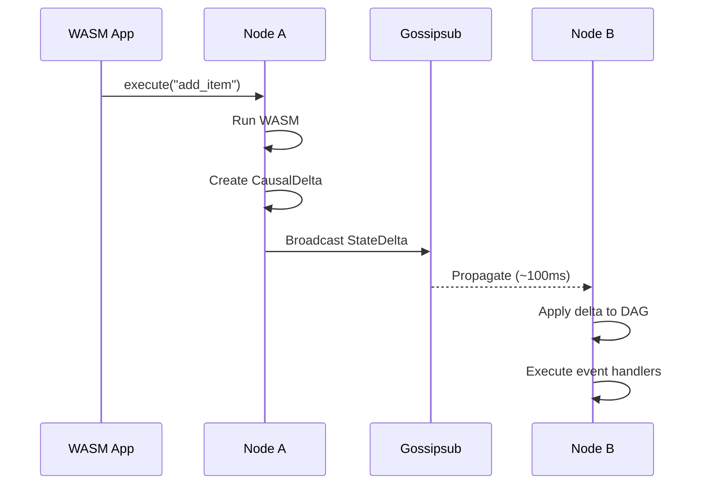
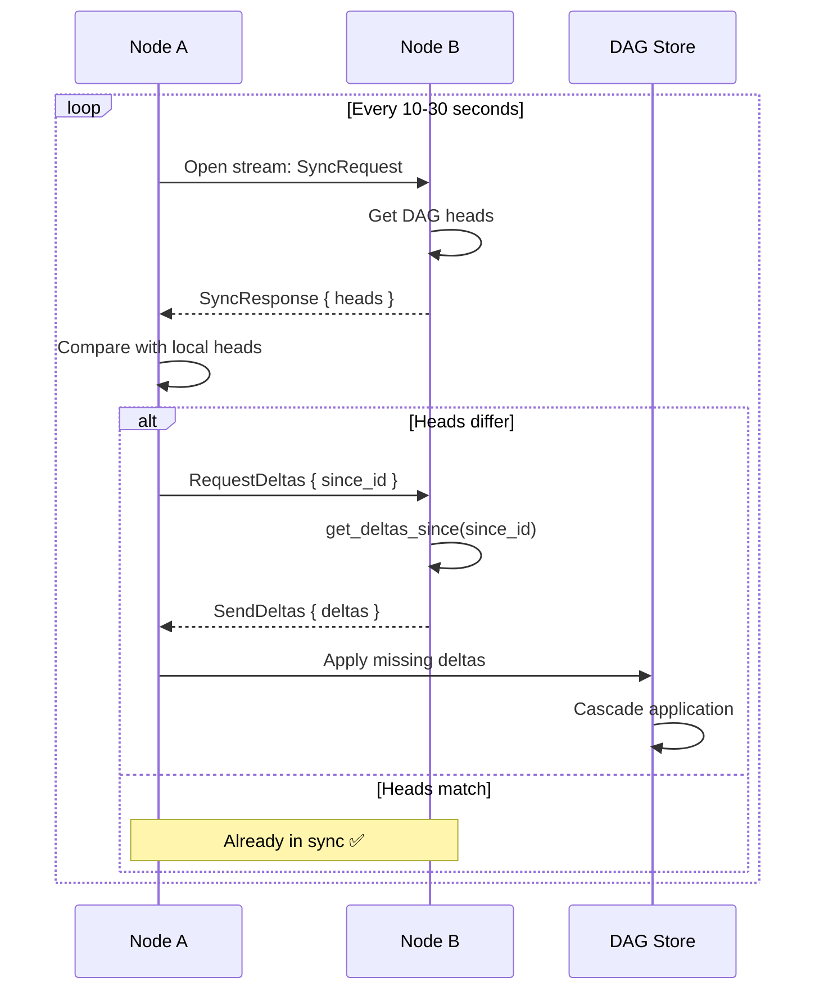
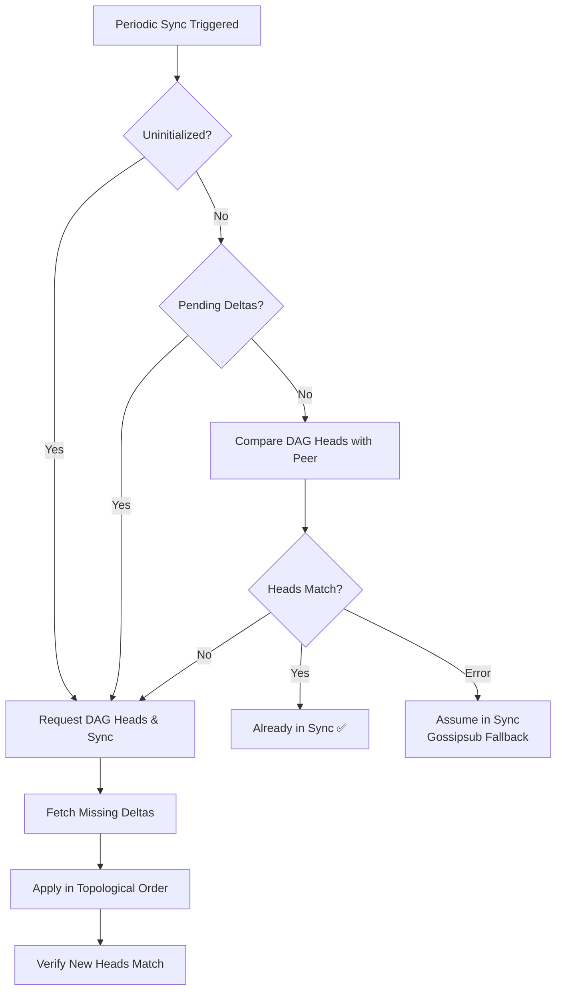

# Node Sync Protocol Guide

Complete guide to how Calimero nodes synchronize state.

---

## Overview

Calimero uses a **dual-path synchronization** strategy:

1. **Gossipsub Broadcast** (Primary) - Fast, real-time propagation (~100ms)
2. **Periodic P2P Sync** (Fallback) - Ensures eventual consistency

This combination provides both low latency and strong consistency guarantees.

---

## Dual-Path Architecture

### Path 1: Gossipsub Broadcast (Primary)

**Purpose**: Real-time delta propagation  
**Latency**: ~100-200ms  
**Reliability**: High in good network conditions



**Flow**:
1. Transaction executes on Node A
2. Creates `CausalDelta` with:
   - Unique ID (content hash)
   - Parents (current DAG heads)
   - Payload (CRDT actions)
   - Events (for handlers)
3. Broadcasts to gossipsub topic: `/calimero/context/{context_id}/state-delta`
4. All subscribed peers receive within ~100ms
5. Each peer applies delta to their local DAG

**Advantages**:
- ✅ Fast: Sub-second propagation
- ✅ Efficient: One broadcast reaches all peers
- ✅ Scalable: Works well for 20-50 nodes

**Limitations**:
- ❌ Unreliable: Packets can be lost
- ❌ No ordering: Deltas can arrive out-of-order
- ❌ No recovery: If missed, delta is lost

### Path 2: Periodic P2P Sync (Fallback)

**Purpose**: Catch-up and consistency verification  
**Frequency**: Every 10-30 seconds  
**Reliability**: High (TCP streams)



**Flow**:
1. **Timer triggers** (every `sync_frequency` seconds)
2. **Select peer** (random from context members)
3. **Open P2P stream** (libp2p TCP connection)
4. **Exchange DAG heads**:
   - Send our heads
   - Receive their heads
5. **Compare heads**:
   - If same → already in sync
   - If different → request missing deltas
6. **Transfer deltas**:
   - Request deltas since common ancestor
   - Receive and apply in topological order
7. **Verify convergence**:
   - Check DAG heads match
   - Verify root hash matches

**Advantages**:
- ✅ Reliable: TCP ensures delivery
- ✅ Recovery: Catches missed gossipsub deltas
- ✅ Ordered: Topological ordering maintained
- ✅ Verification: Root hash comparison

**Limitations**:
- ❌ Slow: 10-30 second intervals
- ❌ Overhead: N peers → N sync streams

---

## Delta Flow

### Step 1: Delta Creation

When a transaction executes on a node:

```rust
// In: crates/context/src/handlers/execute.rs
let outcome = module.run(context_id, executor, method, input, storage)?;

if !outcome.artifact.is_empty() {
    // Create causal delta
    let actions = deserialize_actions(&outcome.artifact)?;
    let parents = context.dag_heads.clone();
    let hlc = env::hlc_timestamp();
    let delta_id = CausalDelta::compute_id(&parents, &actions, &hlc);
    
    let delta = CausalDelta {
        id: delta_id,
        parents,
        actions,
        hlc,
    };
    
    // Update DAG heads
    context.dag_heads = vec![delta.id];
    
    // Broadcast to network
    broadcast_delta(context_id, delta).await?;
}
```

### Step 2: Gossipsub Broadcast

```rust
// In: crates/node/src/handlers/network_event.rs
pub async fn broadcast_delta(
    context_id: ContextId,
    delta: CausalDelta<Vec<Action>>,
) -> Result<()> {
    // Serialize delta
    let payload = borsh::to_vec(&delta)?;
    
    // Publish to gossipsub topic
    let topic = format!("/calimero/context/{}/state-delta", context_id);
    network_client.publish(topic, payload).await?;
    
    Ok(())
}
```

### Step 3: Delta Reception

```rust
// In: crates/node/src/handlers/network_event.rs
async fn handle_state_delta(
    context_id: ContextId,
    delta: CausalDelta<Vec<Action>>,
    source: PeerId,
) -> Result<()> {
    // Get DAG for this context
    let delta_store = get_or_create_delta_store(context_id).await?;
    
    // Add delta to DAG
    let applied = delta_store.add_delta(delta.clone()).await?;
    
    if applied {
        debug!("Delta applied immediately: {:?}", delta.id);
        
        // Execute event handlers (if not author)
        if source != our_peer_id {
            execute_event_handlers(context_id, &delta.events).await?;
        }
    } else {
        debug!("Delta buffered as pending: {:?}", delta.id);
        
        // Request missing parents
        request_missing_parents(context_id, &delta).await?;
    }
    
    Ok(())
}
```

### Step 4: DAG Application

```rust
// In: crates/node/src/delta_store.rs
pub async fn add_delta(&self, delta: CausalDelta<Vec<Action>>) -> Result<bool> {
    let mut dag = self.dag.write().await;
    
    // Try to apply delta
    let applied = dag.add_delta(delta, &*self.applier).await?;
    
    if applied {
        // Update context DAG heads
        let heads = dag.get_heads();
        self.update_context_heads(heads).await?;
    }
    
    Ok(applied)
}
```

### Step 5: Storage Application

```rust
// In: crates/node/src/delta_store.rs (DeltaApplier impl)
async fn apply(&self, delta: &CausalDelta<Vec<Action>>) -> Result<(), ApplyError> {
    // Serialize actions for WASM
    let artifact = borsh::to_vec(&StorageDelta::Actions(delta.payload.clone()))?;
    
    // Execute __calimero_sync_next in WASM
    let outcome = self.context_client
        .execute(
            &self.context_id,
            &self.our_identity,
            "__calimero_sync_next",
            artifact,
            vec![],
            None,
        )
        .await
        .map_err(|e| ApplyError::Application(e.to_string()))?;
    
    // Verify successful execution
    outcome.returns
        .map_err(|e| ApplyError::Application(format!("WASM error: {:?}", e)))?;
    
    Ok(())
}
```

---

## Periodic Sync Flow

### Configuration

```rust
// Default values (crates/node/src/sync/config.rs)
pub struct SyncConfig {
    pub frequency: Duration,  // How often to check all contexts (10s)
    pub interval: Duration,   // Min time between syncs for same context (5s)
    pub timeout: Duration,    // Max time for sync operation (30s)
}
```

### Sync Manager Loop

```rust
// In: crates/node/src/sync/manager.rs
pub async fn run(&mut self) {
    let mut interval = tokio::time::interval(self.config.frequency);
    
    loop {
        interval.tick().await;
        
        // Get all contexts
        let contexts = self.context_client.list_contexts().await?;
        
        for context in contexts {
            // Check if enough time passed since last sync
            if should_sync(&context) {
                // Select random peer
                if let Some(peer) = select_random_peer(&context).await {
                    // Trigger sync
                    self.sync_with_peer(context.id, peer).await?;
                }
            }
        }
    }
}
```

### Sync Protocol (P2P Stream)

```rust
async fn sync_with_peer(
    &self,
    context_id: ContextId,
    peer_id: PeerId,
) -> Result<()> {
    // 1. Open P2P stream
    let mut stream = self.network_client
        .open_stream(peer_id, &SYNC_PROTOCOL)
        .await?;
    
    // 2. Send our DAG heads
    let our_heads = self.get_dag_heads(context_id).await?;
    send_message(&mut stream, SyncMessage::OurHeads(our_heads)).await?;
    
    // 3. Receive their DAG heads
    let their_heads = match receive_message(&mut stream).await? {
        SyncMessage::TheirHeads(heads) => heads,
        _ => return Err("Protocol error"),
    };
    
    // 4. Compare heads
    if our_heads == their_heads {
        debug!("Already in sync with peer {:?}", peer_id);
        return Ok(());
    }
    
    // 5. Find common ancestor
    let common_ancestor = find_common_ancestor(&our_heads, &their_heads).await?;
    
    // 6. Request missing deltas
    send_message(&mut stream, SyncMessage::RequestDeltas {
        since: common_ancestor,
    }).await?;
    
    // 7. Receive and apply deltas
    let missing_deltas = match receive_message(&mut stream).await? {
        SyncMessage::Deltas(deltas) => deltas,
        _ => return Err("Protocol error"),
    };
    
    for delta in missing_deltas {
        self.delta_store.add_delta(delta).await?;
    }
    
    // 8. Verify convergence
    let new_heads = self.get_dag_heads(context_id).await?;
    if new_heads != their_heads {
        warn!("Heads still differ after sync!");
        // Trigger state snapshot sync (TODO)
    }
    
    Ok(())
}
```

---

## DAG Heads Verification (Stale State Detection)

### The Problem: Silent Divergence After Reconnect

Nodes that disconnect and reconnect can appear to be in sync while actually having stale state:

```
Timeline:
T=0:   Node A online with 100 deltas
T=10:  Node A crashes
T=20:  Other nodes create 1000 new deltas
T=60:  Node A restarts, loads old state from disk
       - Has: 100 old deltas (internally consistent)
       - No pending deltas (DAG complete locally)
       - Old check: "DAG complete? ✅ Must be in sync!"
       - Reality: ❌ 1000 deltas behind!
```

**Impact**: Without verification, stale nodes remain behind indefinitely until:
- A new delta is created (triggers missing parent detection)
- Manual sync is triggered
- Or they never catch up 😱

### The Solution: Compare DAG Heads Every Sync

Instead of only checking if the local DAG is complete, we **verify that our DAG heads match the peer's heads**.

#### Why DAG Heads Instead of Root Hash?

| Aspect | DAG Heads | Root Hash |
|--------|-----------|-----------|
| **Precision** | Exact - shows what deltas we have | Derived - hash of final state |
| **Multiple concurrent ops** | ✅ Can have multiple heads (normal) | ⚠️ Single value (less granular) |
| **Divergence detection** | ✅ Shows exactly what differs | ⚠️ Only shows "different" |
| **Sync efficiency** | ✅ Directly usable for delta requests | Requires additional head query |

**DAG heads are the source of truth** for what state a node has!

### Implementation

Every periodic sync now includes a heads comparison step:

```rust
// In: crates/node/src/sync/manager.rs
async fn initiate_sync(...) -> Result<SyncProtocol> {
    // 1. Check if uninitialized
    if is_uninitialized {
        return request_dag_heads_and_sync().await;
    }
    
    // 2. Check if DAG has pending deltas (incomplete)
    if has_pending_deltas {
        return request_dag_heads_and_sync().await;
    }
    
    // 3. NEW: Even if DAG is complete, verify we're in sync
    let our_heads = delta_store.get_heads().await;
    
    match compare_dag_heads_with_peer(peer, &our_heads).await {
        Ok(true) => {
            // Heads match - truly in sync ✅
            Ok(SyncProtocol::None)
        }
        Ok(false) => {
            // Heads differ - need to sync 🔄
            request_dag_heads_and_sync().await
        }
        Err(e) => {
            // On error, assume in sync (gossipsub will trigger sync later)
            Ok(SyncProtocol::None)
        }
    }
}
```

### DAG Heads Comparison

```rust
async fn compare_dag_heads_with_peer(
    peer: PeerId,
    our_heads: &[[u8; 32]],
) -> Result<bool> {
    // Request peer's DAG heads
    let peer_heads = request_dag_heads(peer).await?;
    
    // Convert to sets for comparison (order doesn't matter)
    let our_set: HashSet<_> = our_heads.iter().collect();
    let peer_set: HashSet<_> = peer_heads.iter().collect();
    
    // Check if heads match
    let match = our_set == peer_set;
    
    if !match {
        // Log what's different for debugging
        let only_ours = our_set.difference(&peer_set).count();
        let only_theirs = peer_set.difference(&our_set).count();
        
        info!(
            "DAG heads differ: {} unique to us, {} unique to peer",
            only_ours, only_theirs
        );
    }
    
    Ok(match)
}
```

### Sync Behavior



### Scenarios

#### 1. Normal Case: Nodes in Sync

```
Node A heads: [delta_1000]
Peer heads:   [delta_1000]
Match? ✅ Yes
Action: None (already synced)
```

#### 2. Node Behind (Stale State)

```
Node A heads: [delta_100]   ← Stale!
Peer heads:   [delta_1000]
Match? ❌ No
Action: Sync deltas 101-1000
Result: Catches up within 10-20 seconds ✅
```

#### 3. Multiple Heads (Concurrent Operations)

```
Node A heads: [delta_100, delta_101]   ← Branch 1, Branch 2
Peer heads:   [delta_100, delta_101]
Match? ✅ Yes (set comparison)
Action: None (already synced)
```

#### 4. Diverged Heads (Partial Sync)

```
Node A heads: [delta_100, delta_102]
Peer heads:   [delta_100, delta_101, delta_103]
Match? ❌ No
Unique to us: 1 (delta_102)
Unique to peer: 2 (delta_101, delta_103)
Action: Sync missing deltas
```

### Network Cost

| Scenario | Cost | Notes |
|----------|------|-------|
| **In sync** | +1 RTT (~100ms) | DAG heads request/response |
| **Out of sync** | +1 + N RTTs | Heads check + delta sync |
| **Bandwidth** | ~200 bytes/sync | Heads list |

**Cost-Benefit Analysis:**
- **Cost**: 1 extra RTT every 10 seconds (~100ms)
- **Benefit**: Detects stale state within 10-20 seconds
- **Alternative**: Silent divergence (can persist indefinitely)

**Verdict**: The overhead is negligible compared to the correctness guarantee!

### Logs

#### When Heads Match (In Sync)
```
INFO DAG complete locally, comparing heads with peer our_heads_count=1
DEBUG DAG heads match peer heads_count=1
```

#### When Heads Differ (Need Sync)
```
INFO DAG complete locally, comparing heads with peer our_heads_count=1
INFO DAG heads differ - need to sync 
     our_heads_count=1 peer_heads_count=1 
     unique_to_us=0 unique_to_peer=1
INFO Requesting DAG heads from peer to catch up
INFO Requesting missing parent deltas initial_missing_count=900
INFO Received batch of missing deltas batch_size=100
INFO Completed fetching missing delta ancestors total_fetched=900
```

#### Network Error (Graceful Degradation)
```
INFO DAG complete locally, comparing heads with peer
WARN Failed to compare DAG heads, assuming in sync 
     error="connection timeout"
```

### Edge Cases

**Graceful Error Handling:**
- Network timeout → assume in sync (gossipsub will trigger sync on next delta)
- Peer unavailable → try next peer
- Protocol error → log warning, continue

**Multiple Peers:**
- Compare with random peer each sync
- If mismatch detected, sync from that peer
- Next sync will verify with different peer

**Rapid Changes:**
- Heads can change between request and response
- This is fine - next sync will catch it
- DAG's eventual consistency guarantees convergence

---

## Out-of-Order Handling

### Problem

Deltas can arrive via gossipsub in any order:
```
Send order: D1 → D2 → D3
Receive order: D3 → D1 → D2  (out of order!)
```

### Solution: DAG Buffering

```rust
// Delta D3 arrives first (parents: [D2])
dag.add_delta(D3, &applier).await?;
// → D2 not in DAG → buffer as pending
// → heads = [D1]

// Delta D1 arrives (parents: [root])
dag.add_delta(D1, &applier).await?;
// → root exists → apply D1
// → heads = [D1]
// → No cascade (D2 still missing)

// Delta D2 arrives (parents: [D1])
dag.add_delta(D2, &applier).await?;
// → D1 exists → apply D2
// → heads = [D2]
// → CHECK PENDING: D3 now ready!
// → CASCADE: apply D3
// → heads = [D3]
```

The DAG automatically handles out-of-order delivery through:
1. **Buffering**: Pending deltas wait for parents
2. **Cascade**: Applying one delta triggers pending children

---

## Convergence Guarantees

### Same Deltas → Same State

**Guarantee**: If two nodes receive the same set of deltas, they will converge to the same state.

**Why**:
1. DAG enforces topological ordering
2. CRDTs provide deterministic merge
3. HLC provides tie-breaking for LWW

**Verification**:
```rust
// After sync, check root hash
let our_hash = get_root_hash(context_id).await?;
let their_hash = query_peer_root_hash(peer_id, context_id).await?;

if our_hash != their_hash {
    error!("DIVERGENCE: Same DAG heads but different state!");
    // This should NEVER happen if CRDTs are correct
}
```

### Eventual Consistency

**Guarantee**: All nodes will eventually converge, even with:
- Packet loss
- Network partitions
- Temporary node failures

**Why**:
- Gossipsub provides fast propagation
- Periodic sync provides recovery
- DAG buffering handles out-of-order
- State sync fallback (future)

---

## Security: Challenge-Response Authentication

All KeyShare operations use mutual authentication to prevent identity impersonation.

### Protocol Flow

**Asymmetric handshake to prevent deadlock:**

```
Initiator                                 Responder
---------                                 ---------
1. Generate random challenge_A
2. Send Challenge { challenge_A } →       Receive challenge_A
3.                                ←       Sign(challenge_A, private_key_B)
4. Verify(signature, public_key_B) ✅
5.                                ←       Send Challenge { challenge_B }
6. Sign(challenge_B, private_key_A) →     Receive signature
7.                                        Verify(signature, public_key_A) ✅
8. Send KeyShare { sender_key_A } →       Receive sender_key_A
9.                                ←       Send KeyShare { sender_key_B }

Both parties cryptographically proved private key ownership!
```

### Security Properties

| Property | Implementation |
|----------|----------------|
| **Authentication** | Ed25519 signature proves private key ownership |
| **Mutual** | Both parties challenge and verify each other |
| **Replay Protection** | Random 32-byte challenges |
| **Transport Security** | libp2p Noise (ChaCha20-Poly1305 AEAD) |
| **No Impersonation** | Can't claim identity without private key |

### Network Cost

- **Messages**: 6 round trips
- **Data**: ~300 bytes (64B challenges + 128B signatures + 64B keys + overhead)
- **Latency**: ~200-500ms

**When It Runs:**
- Initial sync on context join
- Periodic sync (when new peers detected)
- On-demand when sender_key missing

---

## Performance Characteristics

### Latency

| Scenario                      | Latency   | Notes                        |
|-------------------------------|-----------|------------------------------|
| **Gossipsub (good network)**  | 100-200ms | Primary path                 |
| **Gossipsub (packet loss)**   | 10-30s    | Falls back to periodic sync  |
| **Periodic sync**             | 10-30s    | Configurable                 |
| **Full state sync**           | 1-5s      | Future: for large state      |

### Throughput

| Metric             | Value    | Notes                |
|--------------------|----------|----------------------|
| **Deltas/sec**     | 100-1000 | Per context          |
| **Contexts/node**  | 100-1000 | Depends on resources |
| **Peers/context**  | 20-50    | Gossipsub works best |

### Memory

| Component            | Size      | Notes                   |
|----------------------|-----------|-------------------------|
| **DAG per context**  | 5-10MB    | ~1000 deltas @ 5KB each |
| **Pending deltas**   | 0-500KB   | Temporary buffer        |
| **Total per node**   | 500MB-1GB | For 100 contexts        |

---

## Tuning Guide

### Aggressive Convergence (Dev/Testing)

```rust
SyncConfig {
    frequency: Duration::from_secs(5),   // Check every 5s
    interval: Duration::from_secs(2),    // Sync every 2s
    timeout: Duration::from_secs(15),    // 15s timeout
}
```

**Use when**: Fast iteration, small networks (< 10 nodes)

### Balanced (Production Default)

```rust
SyncConfig {
    frequency: Duration::from_secs(10),  // Check every 10s
    interval: Duration::from_secs(5),    // Sync every 5s  
    timeout: Duration::from_secs(30),    // 30s timeout
}
```

**Use when**: Normal production (10-50 nodes)

### Conservative (Large Networks)

```rust
SyncConfig {
    frequency: Duration::from_secs(30),  // Check every 30s
    interval: Duration::from_secs(15),   // Sync every 15s
    timeout: Duration::from_secs(60),    // 60s timeout
}
```

**Use when**: Large networks (> 50 nodes), high latency

---

## See Also

- [Main README](../README.md) - Overview
- [Event Handling](event-handling.md) - How events are processed
- [Troubleshooting](troubleshooting.md) - Common sync issues
- [DAG Documentation](../../dag/README.md) - How DAG works

