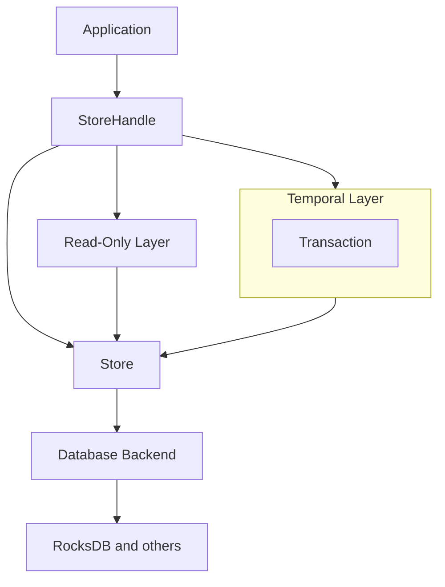

# Calimero store

[RocksDB]: https://rocksdb.org/

- [Introduction](#introduction)
- [Core components](#core-components)
  - [Database interface](#database-interface)
  - [Key structure](#key-structure)
  - [Data types and entries](#data-types-and-entries)
  - [Layers](#layers)
  - [Transactions](#transactions)
  - [Iterators](#iterators)
- [Operation flow](#operation-flow)
- [Key concepts](#key-concepts)
- [Advanced features](#advanced-features)
- [Detailed component descriptions](#detailed-component-descriptions)
  - [Database interface](#database-interface-1)
  - [Key structure](#key-structure-1)
  - [Data types and entries](#data-types-and-entries-1)
  - [Layers](#layers-1)
  - [Transactions](#transactions-1)
  - [Iterators](#iterators-1)

## Introduction

The store library is a versatile and efficient key-value storage system designed
for managing application state and transactions. It provides a flexible and
extensible architecture for storing, retrieving, and manipulating data across
different storage backends.

Key features of the store library include:

- Support for potentially multiple storage backends (currently just [RocksDB][])
- Transactional operations with atomic commits
- Flexible key-value structure with custom data types
- Iteration and range queries
- Temporal layers for augmenting/adapting lower-level database functionality,
  allowing, for example, atomic transactions, caching, etc.

## Core components

### Database interface

The `Database` trait defines the core interface for interacting with the
underlying storage system. It provides methods for basic CRUD operations,
iteration, and transaction application.

Key operations:

- `open()`: Initialise the database with a given configuration
- `has()`, `get()`, `put()`, `delete()`: Basic key-value operations
- `iter()`: Create an iterator for range queries
- `apply()`: Apply a transaction to the database

The `RocksDB` struct implements this trait, providing a concrete implementation
using the [RocksDB][] storage engine.

### Key structure

The library uses a flexible key structure defined by the `Key` type and
associated traits:

- `KeyComponent`: Defines a part of a key with a specific length
- `KeyComponents`: Combines multiple `KeyComponent`s into a complete key
- `AsKeyParts`: Converts a key into its column and components
- `FromKeyParts`: Constructs a key from its components

This structure allows for efficient encoding and decoding of complex keys,
supporting various data models.

### Data types and entries

The `DataType` trait defines how values are serialised and deserialised. The
`Entry` trait combines a key with its associated data type, providing a complete
representation of a stored item.

Predefined entry types include:

- `ContextMeta`: Metadata for a context
- `ContextState`: State data for a context
- `ContextIdentity`: Identity information for a context
- `ContextTransaction`: Transaction data for a context
- `Generic`: A generic key-value pair

### Layers

The library implements a layered architecture for managing data access and
modifications:

- `Layer`: Base trait for all layers
- `ReadLayer`: Provides read-only access to the underlying data
- `WriteLayer`: Extends `ReadLayer` with write operations

### Transactions

The `Transaction` struct represents a set of operations to be applied
atomically. It supports putting and deleting entries, as well as merging with
other transactions.

### Iterators

The library provides a flexible iteration system:

- `Iter`: Base iterator type
- `DBIter`: Trait for database-specific iterators

## Operation flow

1. Initialise the store with a specific backend (e.g., [RocksDB][])
2. Create a `StoreHandle` to interact with the store
3. Perform read/write operations directly on the store
4. For atomic write operations:
   - Create a `Temporal` layer
   - Accumulate changes in the temporal layer
   - Commit changes to the underlying store
5. Use transactions for atomic operations across multiple keys
6. Utilise iterators for range queries and scans



## Key concepts

1. **Columns**: The library uses a column-based structure to organise different
   types of data (`Identity`, `State`, `Transaction`, `Generic`).

2. **Context**: Many operations are context-aware, allowing for isolation
   between different application contexts.

3. **Serialisation**: The library supports custom serialisation through the
   `DataType` trait.

4. **Error handling**: The library uses the `eyre` crate for error handling,
   providing detailed error context.

5. **Generic programming**: Extensive use of generic programming allows for
   flexibility and type safety.

## Advanced features

1. **Temporal layer**: Allows for accumulating changes in memory before
   committing to the underlying storage, useful for managing complex
   transactions or temporary state changes as an atomic operation.

2. **Read-only layer**: Provides a way to ensure that certain operations are
   read-only, enhancing safety and preventing accidental modifications.

3. **Custom key types**: The key system allows for creating complex, typed keys
   that can encode multiple pieces of information efficiently.

4. **Flexible iteration**: The iterator system supports both unstructured and
   structured data, allowing for type-safe iteration over complex data
   structures.

5. **Transaction support**: Built-in support for creating and applying
   transactions, ensuring atomic updates across multiple operations.

## Detailed component descriptions

### Database interface

The database interface is a fundamental component of the store library, serving
as the foundation for all data storage and retrieval operations. Defined by the
`Database` trait, this interface provides a uniform way to interact with the
underlying storage system, abstracting away the specifics of any particular
database implementation.

At its core, the database interface is designed to support a key-value storage
model, where each piece of data is associated with a unique key. This model is
further enhanced by the concept of columns, which allow for logical separation
of different types of data within the same database. The interface defines four
primary columns: `Identity`, `State`, `Transaction`, and `Generic`, each serving
a specific purpose in the overall data architecture.

The `Database` trait specifies a set of primary operations that any implementing
storage system must provide. These operations include checking for the existence
of a key (`has()`), retrieving data associated with a key (`get()`), storing new
data or updating existing data (`put()`), and removing data (`delete()`). These
operations therefore align to the well-known, fundamental "CRUD" actions. Each
of these operations is column-aware, allowing for efficient organisation and
retrieval of data based on its type or purpose.

In addition to these basic operations, the interface also defines methods for
more complex interactions. The `iter()` method allows for iteration over a range
of keys within a specific column, enabling efficient scanning and querying of
data. This is particularly useful for operations that need to process multiple
related entries, such as retrieving all state data for a particular context.

One of the most important features of the database interface is its support for
transactions through the `apply()` method. This method takes a `Transaction`
object, which represents a set of changes to be applied atomically to the
database. By supporting transactions, the interface ensures that complex
operations involving multiple keys can be performed consistently, maintaining
data integrity even in the face of concurrent access or system failures.

The interface is designed with flexibility and extensibility in mind. It uses
Rust's powerful type system to ensure type safety and to allow for custom key
and value types. The use of the `eyre` crate for error handling provides rich
context for any errors that might occur during database operations, aiding in
debugging and error recovery.

Importantly, the database interface is designed to be asynchronous and
thread-safe. This is enforced by applying `Send + Sync` bounds to the `Database`
trait, ensuring that implementations can be safely shared and used across
multiple threads. This design choice allows for high-performance, concurrent
access to the database, which is crucial for applications dealing with large
amounts of data or high request volumes.

While the interface defines the contract that any database implementation must
fulfill, it doesn't prescribe how these operations should be implemented. This
abstraction allows the library to support different storage backends without
changing the core logic of the store system. Currently, the library provides an
implementation for [RocksDB][], a high-performance key-value store, but the
design allows for easy addition of other backends in the future.

### Key structure

The key structure in the store library is a sophisticated and flexible system
designed to efficiently encode and manage complex keys for data storage and
retrieval. This structure is fundamental to the library's ability to organise
and access data in a type-safe and performant manner.

#### Core components

At the heart of the key structure are several interrelated traits and types:

- **`KeyComponent`**: This trait defines a single part of a key. It associates a
  type with a specific length, allowing for fixed-size key components. This is
  crucial for efficient storage and retrieval in many database systems.

- **`KeyComponents`**: Building on `KeyComponent`, this trait allows for the
  composition of multiple components into a single key. It uses Rust's type
  system to calculate the total length of the combined components at
  compile-time, ensuring type safety and optimal performance.

- **`Key<T>`**: This is a newtype wrapper around a `GenericArray` of bytes. The
  type parameter `T` must implement `KeyComponents`, which determines the size
  and structure of the key.

- **`AsKeyParts`**: This trait defines how a key type can be decomposed into its
  column and components. It's essential for the library's ability to work with
  keys in a generic manner while still preserving type information.

- **`FromKeyParts`**: The counterpart to `AsKeyParts`, this trait allows for the
  construction of a key from its components. It includes an associated `Error`
  type, allowing for type-specific error handling during key construction.

#### Flexibility and type safety

The key structure's design prioritises both flexibility and type safety. By
using Rust's generic programming features, the library allows for the creation
of complex, multi-component keys while still maintaining strong type checking at
compile-time. This prevents many potential runtime errors related to key
formatting or interpretation.

For example, a key might be composed of a context ID and a state key:

```rust
pub struct ContextState(Key<(ContextId, StateKey)>);
```

Here, `ContextId` and `StateKey` are separate `KeyComponent` types, combined
into a single key structure. The library can then provide methods to safely
access these components:

```rust
use calimero_primitives::context::ContextId;

impl ContextState {
    pub fn context_id(&self) -> ContextId { ... }
    pub fn state_key(&self) -> [u8; 32] { ... }
}
```

#### Performance considerations

The key structure is designed with performance in mind. By using fixed-size
components and compile-time length calculation, the library can avoid runtime
allocations and provide predictable performance characteristics. This is
particularly important for database operations where key comparisons and sorting
are frequent operations.

#### Integration with database operations

The key structure integrates seamlessly with the database interface. The
`AsKeyParts` trait allows the database to efficiently determine the column for a
given key, which is crucial for operations like `put()`, `get()`, and
`delete()`. Similarly, the `FromKeyParts` trait enables the creation of
structured keys from raw byte data, which is essential for operations like
iteration and range queries.

#### Predefined key types

The library provides several predefined key types that leverage this structure:

- `ContextMeta`
- `ContextIdentity`
- `ContextState`
- `ContextTransaction`
- `Generic`

These predefined types demonstrate how the key structure can be used to create
semantically meaningful keys that encode multiple pieces of information.

### Data types and entries

The store library implements a sophisticated system for handling diverse data
types and entries, providing a flexible and type-safe approach to storing and
retrieving various kinds of information. This system is built around two key
traits: `DataType` and `Entry`, which work together to define how data is
serialised, deserialised, and associated with keys in the store.

#### The `DataType` trait

The `DataType` trait is at the core of the library's value handling system. It
defines how different types of data are converted to and from raw bytes for
storage. This trait has two primary methods:

1. **`from_slice()`**: This method converts a slice of bytes into the specific
   data type.

2. **`as_slice()`**: This method converts the data type back into a slice of
   bytes.

The `DataType` trait is generic over a lifetime `'a`, allowing it to handle both
owned and borrowed data efficiently. It also includes an associated `Error`
type, enabling implementors to define type-specific error handling for
serialisation and deserialisation operations.

This design allows for flexibility in how data is stored and retrieved.
Implementors can choose their own serialisation formats, optimise for specific
use cases, or integrate with existing data structures seamlessly.

The design allows for easy extensibility, as new data types can be created by
implementing the `DataType` trait. This extensibility is crucial for adapting
the library to various use cases and data models without modifying the core
library code.

#### The `Entry` trait

The `Entry` trait builds upon `DataType` to create a complete representation of
a stored item. It associates a key type with a data type, effectively defining
the structure of entries in the store. The `Entry` trait has two associated
types:

1. **`Key`**: The type used as the key for this entry, which must implement
   `AsKeyParts`.

2. **`DataType`**: The type of data stored for this entry, which must implement
   the `DataType` trait.

The `Entry` trait also includes a `key()` method, which returns a reference to
the key for the entry. This design allows for efficient key access without
unnecessary copying or cloning.

#### Predefined entry types

The library provides several predefined entry types that demonstrate the power
and flexibility of this system:

1. **`ContextMeta`**: Stores metadata about a context, including an application
   ID and the hash of the last transaction.

2. **`ContextState`**: Represents the state data for a context, storing it as a
   raw slice of bytes.

3. **`ContextIdentity`**: Holds identity information for a context, including an
   optional private key.

4. **`ContextTransaction`**: Stores information about a transaction, including
   the method name, payload, and the hash of the prior transaction.

5. **`Generic`**: A flexible entry type for storing arbitrary data associated
   with a scope and fragment.

Each of these predefined types implements both the `DataType` and
`PredefinedEntry` traits, with the latter being a convenience trait that
implements `Entry` for all defined keys, with the entry key as the key it's
defined for.

#### Flexibility and type safety

The combination of the `DataType` and `Entry` traits with Rust's type system
provides a high degree of flexibility while maintaining strong type safety. This
design allows developers to define custom data types and entries that fit their
specific needs, while the compiler ensures that keys and values are used
correctly throughout the application.

For instance, the `ContextState` entry type demonstrates how the system can
handle raw byte data efficiently:

```rust
pub struct ContextState<'a> {
    pub value: Slice<'a>,
}

impl<'a> DataType<'a> for ContextState<'a> {
    type Error = io::Error;

    fn from_slice(slice: Slice<'a>) -> Result<Self, Self::Error> {
        Ok(Self { value: slice })
    }

    fn as_slice(&'a self) -> Result<Slice<'a>, Self::Error> {
        Ok(self.value.as_ref().into())
    }
}
```

This implementation allows for efficient storage and retrieval of raw state data
without unnecessary copying or processing.

#### Integration with the broader system

The data types and entries system integrates seamlessly with other components of
the library, such as the key structure and the database interface. This
integration allows for type-safe operations across the entire storage system,
from key creation to value serialisation and database interaction.

### Layers

The store library implements a sophisticated layered architecture that provides
flexible and powerful data access and manipulation capabilities. This layered
approach allows for separation of concerns, enhanced functionality, and the
ability to compose different behaviours in a modular fashion.

#### Core layer concepts

The layer system is built around several key traits:

1. **`Layer`**: This is the base trait for all layers. It defines an associated
   type `Base` which represents the underlying layer that this layer is built
   upon.

2. **`ReadLayer`**: This trait extends `Layer` and provides read-only access to
   the data store. It defines methods for checking if a key exists (`has()`),
   retrieving data (`get()`), and creating iterators (`iter()`).

3. **`WriteLayer`**: This trait further extends `ReadLayer` to provide write
   capabilities. It includes methods for putting data (`put()`), deleting data
   (`delete()`), applying transactions (`apply()`), and committing changes
   (`commit()`).

These traits form a hierarchy that allows layers to build upon each other,
adding or modifying functionality at each level.

#### The store as a base layer

The `Store` struct serves as the foundational layer in this architecture. It
implements both `ReadLayer` and `WriteLayer`, providing direct access to the
underlying database. The `Store` is typically backed by a concrete database
implementation, such as [RocksDB][].

#### Specialised layers

The library includes several specialised layers that provide additional
functionality:

1. **Temporal layer**

   The `Temporal` layer is a key component of the library's transactional
   capabilities. It acts as a buffer between the application and the underlying
   store, accumulating changes without immediately applying them to the base
   layer.

   This allows for complex operations to be built up over time and then
   committed atomically.

   Key features of the `Temporal` layer include:

   - **Shadowing reads**: When reading data, it first checks its internal shadow
     store before falling back to the base layer.
   - **Buffering writes**: All write operations are stored in the shadow store
     rather than being immediately applied.
   - **Atomic commit**: When the `commit()` method is called, all accumulated
     changes are applied to the base layer in a single operation.

   The `Temporal` layer is particularly useful for scenarios where you need to
   make multiple related changes and ensure they are all applied together, or
   not at all.

2. **Read-only layer**

   The `ReadOnly` layer provides a way to restrict access to read-only
   operations. This is useful for ensuring that certain parts of your code
   cannot accidentally modify the store, enhancing safety and preventing
   unintended side effects.

   The `ReadOnly` layer implements `ReadLayer` but not `WriteLayer`, effectively
   preventing any write operations from being performed through it.

#### Layer composition

One of the most powerful aspects of the layer system is the ability to compose
layers. Layers can be stacked on top of each other, each adding or modifying
functionality.

This composability is achieved through the use of the `Base` associated type in
the `Layer` trait. Each layer specifies what type of layer it's built on top of,
allowing for type-safe composition of layers.

#### Integration with the rest of the system

The layer system integrates seamlessly with other components of the library:

- It works with the key and entry system, allowing for type-safe operations on
  structured data.

- It supports the iteration system, allowing for efficient scanning and querying
  of data.

- It interacts with the transaction system, particularly in the case of the
  `Temporal` layer.

#### Extensibility

The layer system is designed to be extensible. New layers can be easily created
by implementing the appropriate traits. This allows for the creation of
specialised layers for specific use cases, such as logging layers, caching
layers, or layers that implement specific business logic.

Another interesting one is `Tee` (named after the Linux command), which wraps
two `Layer`s, reading from one and falling back on to the other when it doesn't
exist, or writing to both.

Notably, this is part of the design considerations that influenced the decision
of why `WriteLayer::apply()` takes a `&Transaction`.

#### Performance considerations

The layered architecture does introduce some overhead, particularly in terms of
method call indirection. However, this is generally outweighed by the benefits
in terms of flexibility and functionality. Moreover, the use of Rust's zero-cost
abstractions means that much of this overhead can be optimised away at compile
time.

### Transactions

The store library implements a robust transaction system that allows for atomic,
consistent updates to the data store. This system is crucial for maintaining
data integrity, especially in scenarios involving complex operations or
concurrent access.

#### Core transaction concept

At the heart of the transaction system is the `Transaction` struct. This
structure represents a set of operations to be applied atomically to the store.
The key features of a transaction include:

1. **Atomic operations**: All operations in a transaction are applied together,
   or not at all. This ensures consistency in the face of failures or
   interruptions.

2. **Isolation**: Changes made within a transaction are not visible to other
   parts of the system until the transaction is committed.

3. **Durability**: Once a transaction is committed, its changes are permanently
   stored and will survive system failures (depending, of course, upon the
   `Database` implementation in use).

#### Transaction structure

The `Transaction` struct is designed to be both efficient and flexible:

- It uses a `BTreeMap` to store operations, allowing for efficient lookups and
  range queries.

- Each entry in the map consists of an `Entry` (representing a key) and an
  `Operation` (representing the action to be performed).

- The `Operation` enum can represent either a `Put` operation (to insert or
  update data) or a `Delete` operation.

#### Transaction operations

The `Transaction` struct provides several key methods for building and
manipulating transactions:

1. **`put()`**: Adds a put operation to the transaction, associating a key with
   a value.

2. **`delete()`**: Adds a delete operation to the transaction for a specific
   key.

3. **`get()`**: Retrieves the operation associated with a specific key in the
   transaction.

4. **`merge()`**: Combines the operations from another transaction into this
   one.

5. **`iter()`**: Creates an iterator over all operations in the transaction.

6. **`iter_range()`**: Creates an iterator over a range of operations in the
   transaction.

These methods allow for flexible construction of complex transactions involving
multiple operations across different keys.

#### Integration with layers

Transactions are deeply integrated with the layer system in the library:

1. **Write layer**: The `WriteLayer` trait includes an `apply()` method that
   takes a `Transaction` as an argument. This method is responsible for applying
   the transaction's operations to the underlying storage.

2. **Temporal layer**: The `Temporal` layer uses transactions internally to
   accumulate changes before committing them to the underlying store. This
   allows for efficient batching of operations and provides a natural way to
   implement transactional semantics.

#### Transaction execution

The execution of a transaction typically follows these steps:

1. A new `Transaction` is created.

2. Operations (`put()` and `delete()`) are added to the transaction.

3. The transaction is passed to a layer's `apply()` method.

4. The layer (often a `Temporal` layer) processes the transaction's operations.

5. If using a `Temporal` layer, the changes are accumulated until `commit()` is
   called.

6. Upon commit, all changes are applied atomically to the underlying store.

#### Consistency and isolation

The transaction system helps ensure consistency and isolation:

- **Consistency**: By grouping related operations together, transactions help
  maintain invariants and consistency rules in the data.

- **Isolation**: Changes made within a transaction (especially when using the
  `Temporal` layer) are not visible to other parts of the system until the
  transaction is committed.

#### Performance considerations

The transaction system is designed with performance in mind:

- The use of a `BTreeMap` for storing operations allows for efficient lookups
  and range queries.

- The ability to batch multiple operations into a single transaction can
  significantly reduce the number of interactions with the underlying storage
  system.

- The `Temporal` layer's ability to accumulate changes before committing allows
  for efficient batching of writes.

## Iterators

The store library implements a sophisticated iterator system that provides
efficient and flexible means of traversing and processing stored data. This
system is crucial for operations that need to work with ranges of data, such as
scanning, filtering, or aggregating over large datasets.

### Core iterator concepts

The iterator system is built around several key types and traits:

1. **`Iter`**: This is the primary iterator type in the library. It's generic
   over two type parameters, `K` and `V`, which represent the key and value
   types respectively.

2. **`DBIter`**: This trait defines the core functionality that any
   database-specific iterator must implement. It includes methods for moving to
   the next item (`next()`) and reading the current value (`read()`). In this
   way it is similar to Rust's `Iterator` trait (however, see the
   [limitations section](#limitations-and-considerations) below).

3. **`Structured` and `Unstructured`**: These types are used to differentiate
   between iterators that work with typed, structured data and those that work
   with raw byte slices.

### Iterator functionality

The `Iter` struct provides several important methods:

1. **`keys()`**: Returns an iterator over just the keys.

2. **`entries()`**: Returns an iterator over key-value pairs.

3. **`structured_key()`**: Converts an unstructured key iterator into a
   structured one.

4. **`structured_value()`**: Converts an unstructured value iterator into a
   structured one.

These methods allow for flexible processing of data, enabling operations on keys
alone, on full entries, or on structured representations of the data.

#### Type-safe iteration

One of the most powerful features of the iterator system is its use of Rust's
type system to provide type-safe iteration. The `Structured` type parameter
allows the iterator to work with strongly-typed keys and values, while still
allowing for efficient, low-level storage.

For example, an iterator might be defined as:

```rust
Iter<Structured<ContextState>, Structured<StateData>>
```

This type ensures that the iterator will yield keys of type `ContextState` and
values of type `StateData`, providing compile-time guarantees about the types of
data being processed.

#### Integration with layers and transactions

The iterator system is deeply integrated with other components of the library:

1. **Layer integration**: The `ReadLayer` trait includes an iter method that
   returns an `Iter`. This allows each layer to provide its own implementation
   of iteration, potentially adding additional functionality or optimisations.

2. **Transaction integration**: The `Transaction` struct provides methods for
   creating iterators over its operations. This allows for efficient processing
   of pending changes in a transaction.

#### Range queries

The iterator system supports efficient range queries through the use of a
`start` key in the `iter()` method of `ReadLayer`. This allows for iteration to
begin at a specific point in the key space, enabling efficient partial scans of
the data.

#### Performance considerations

The iterator system is designed with performance in mind:

1. **Lazy evaluation**: Iterators are lazy, meaning they only do work when asked
   for the next item. This allows for efficient processing of large datasets
   without unnecessary memory usage, and allows for early stopping when the
   desired item is found.

2. **Zero-cost abstractions**: The use of Rust's trait system and generic
   programming allows many of the abstractions to be resolved at compile-time,
   resulting in efficient machine code.

3. **Custom implementations**: The `DBIter` trait allows for database-specific
   optimisations in the underlying iteration logic.

#### Extensibility

The iterator system is designed to be extensible:

1. **Custom iterators**: New iterator types can be easily created by
   implementing the `DBIter` trait.

2. **Composition**: The `IterPair` struct allows for the composition of multiple
   iterators, enabling complex iteration patterns.

#### Use cases

The iterator system supports a wide range of use cases:

1. **Scanning**: Efficiently scan through large portions of the data store.

2. **Filtering**: Iterate over data and filter based on key or value properties.

3. **Aggregation**: Perform aggregations or reductions over ranges of data.

4. **Prefix queries**: Efficiently query all keys with a certain prefix.

#### Limitations and considerations

While powerful, users of the iterator system should be aware of certain
considerations:

1. **Consistency**: In a multi-threaded environment, iterators provide a
   point-in-time view and may not reflect concurrent modifications. If an
   iterator is to be shared across threads, care should be taken to ensure
   consistency.

2. **Resource usage**: Long-running iterations may hold resources for extended
   periods. Care should be taken in concurrent scenarios.
