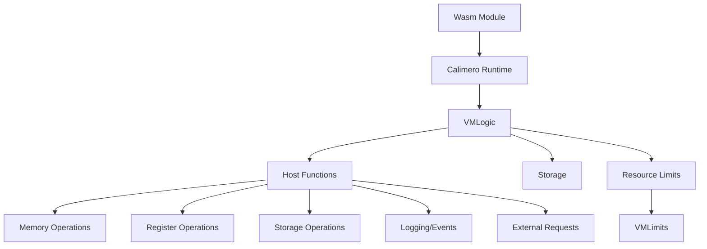
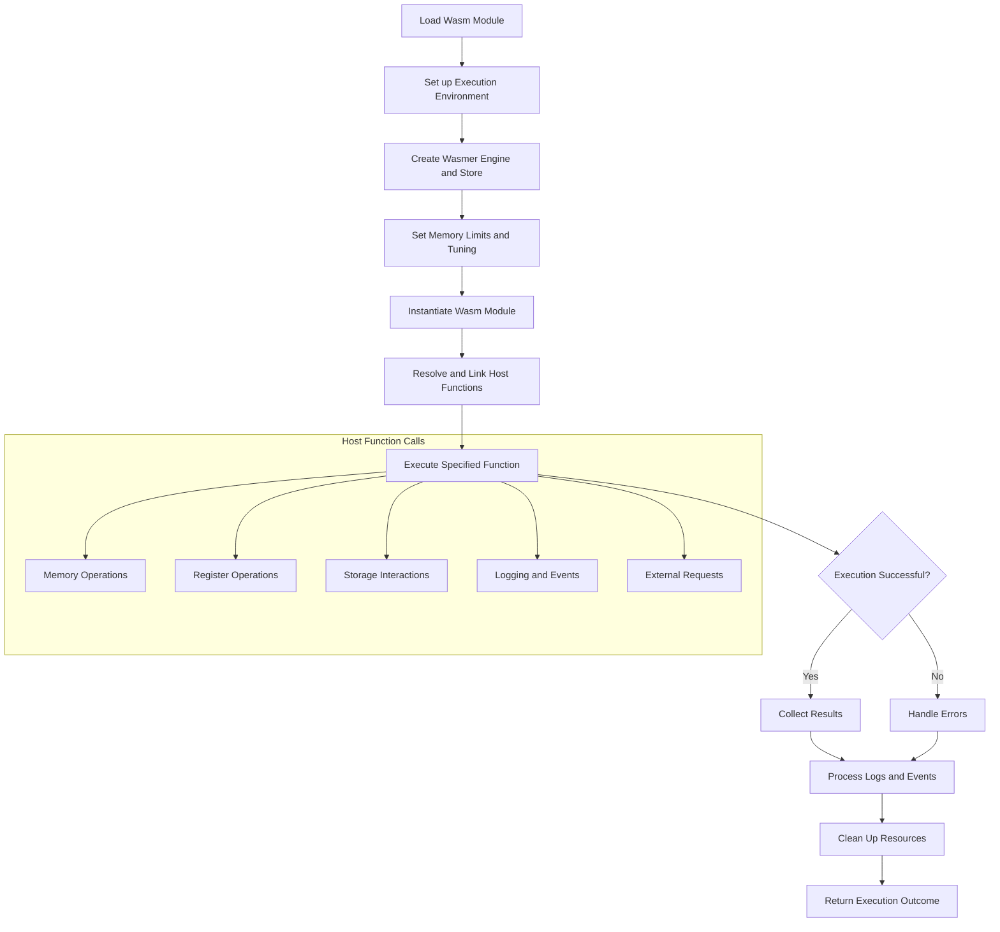
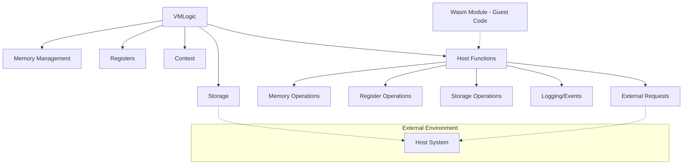

# Calimero runtime

[Serde]: https://serde.rs/
[Wasmer]: https://wasmer.io/

- [Calimero runtime](#calimero-runtime)
  - [Introduction](#introduction)
  - [Core components](#core-components)
    - [Overview](#overview)
    - [VMLogic](#vmlogic)
    - [Host functions](#host-functions)
    - [Resource limits](#resource-limits)
    - [Storage](#storage)
    - [Error handling](#error-handling)
  - [Operational flow](#operational-flow)
  - [Detailed component descriptions](#detailed-component-descriptions)
    - [Topology](#topology)
    - [Wasm module execution (`run()` function)](#wasm-module-execution-run-function)
    - [VMLogic](#vmlogic-1)
    - [Host functions](#host-functions-1)
    - [Memory management](#memory-management)
    - [Storage](#storage-1)
    - [Error handling](#error-handling-1)
  - [Usage examples](#usage-examples)

## Introduction

The Calimero runtime is a lightweight, sandboxed execution environment for
WebAssembly (Wasm) modules. It provides a secure and controlled platform for
running untrusted code with defined resource limits and a set of host-provided
functions. The runtime is designed to facilitate the execution of smart

contracts or similar applications in a blockchain-like environment. Its modular
design allows for easy extension and customisation, making it suitable for
various applications requiring sandboxed execution of untrusted code.

Key features of the Calimero runtime include:

- Secure execution of Wasm modules
- Resource limitation and metering
- Host-provided functions for storage, logging, and external interactions
- Support for deterministic execution
- Error handling and panic recovery

This document provides a [high-level summary](#core-components) of the runtime's
architecture and core components, followed by a
[detailed description of each component](#detailed-component-descriptions) . It
also includes a brief overview of the [operational flow](#operational-flow), and
[usage examples](#usage-examples).

## Core components

### Overview

### VMLogic

The `VMLogic` struct is the central component of the runtime. It encapsulates:

- Storage access
- Memory management
- Context information
- Resource limits
- Logging and event emission

_[Read more...](#vmlogic-1)_

### Host functions

The runtime provides a set of host functions that can be called from the guest
Wasm module:

- Memory and register operations
- Storage read/write
- Logging and event emission
- Cryptographic operations (signing and verification)
- External HTTP requests (fetch)

_[Read more...](#host-functions-1)_

### Resource limits

The `VMLimits` struct defines constraints on various resources:

- Memory usage
- Stack size
- Number and size of registers
- Logging and event limits
- Storage key and value size limits

### Storage

The runtime includes an abstract `Storage` trait and an in-memory implementation
(`InMemoryStorage`) for persisting state.

_[Read more...](#storage-1)_

### Error handling

A comprehensive error handling system is implemented, covering various
scenarios:

- Host errors
- Wasm execution errors
- Storage errors
- Function call errors

_[Read more...](#error-handling-1)_

## Operational flow

1. Load Wasm module
2. Set up execution environment (memory, limits, storage)
3. Resolve and link host functions
4. Execute specified function in the Wasm module
5. Handle return values, logs, and events
6. Clean up and return execution outcome

## Detailed component descriptions

### Topology

### Wasm module execution (`run()` function)

The `run()` function in `lib.rs` is the entry point for executing a Wasm module:

1. Creates a Wasmer engine and store
2. Sets up memory limits and tuning
3. Instantiates the Wasm module
4. Links host functions
5. Executes the specified method
6. Handles errors and returns the execution outcome

The `run()` function is the primary entry point for executing WebAssembly (Wasm)
modules within the Calimero runtime. Its purpose is to orchestrate the entire
process of loading, preparing, and executing a Wasm module, while ensuring that
all operations occur within the defined constraints and security boundaries of
the runtime environment.

At the core of the `run()` function's operation is [Wasmer][Wasmer], a
high-performance WebAssembly runtime. Wasmer is an open-source project that
allows for the execution of Wasm modules outside of web browsers. It provides a
sandboxed environment for running Wasm code, handling tasks such as module
compilation, memory management, and function invocation. Wasmer's architecture
is designed to be extensible and performant, making it an ideal choice for the
Calimero runtime.

The execution process begins with the creation of a Wasmer engine and store. The
engine is responsible for compiling Wasm modules into executable code, while the
store serves as a container for all runtime objects, including the compiled
module, its memory, and any imported functions. In the Calimero runtime, a
custom engine is created with specific tuning parameters defined by the
`WasmerTunables` struct, allowing for fine-grained control over memory
allocation and other runtime behaviours.

Next, the `run()` function sets up the execution environment by creating an
instance of `VMLogic`. This struct encapsulates the runtime's core logic,
including storage access, resource limits, and the context for the current
execution. The `VMLogic` instance serves as a mediator between the Wasm module
and the host environment, ensuring that all interactions occur within the
defined boundaries.

The Wasm module is then loaded from the provided byte array and compiled using
Wasmer's module compilation facilities. This step involves parsing the Wasm
binary, validating its structure, and transforming it into a format that can be
efficiently executed by the host system. If any errors occur during this
process, such as invalid Wasm code, they are caught and returned as part of the
execution outcome.

Once the module is compiled, the `run()` function proceeds to link the required
import functions. These imports, defined by the `VMLogic::imports()` method,
provide the interface between the Wasm module and the host environment. They
include functions for memory operations, storage access, logging, and other
runtime services. By controlling these imports, the Calimero runtime ensures
that the Wasm module can only interact with the host system in predefined,
secure ways.

With the module compiled and imports linked, the `run()` function creates an
instance of the Wasm module. This instance represents a unique execution context
for the module, with its own memory and global state. The function then
retrieves the module's memory and associates it with the `VMLogic` instance,
allowing for safe, controlled access to the Wasm module's memory space.

The next step is to locate and prepare the specified entry point function within
the Wasm module. The `run()` function checks that the requested function exists
and has the correct signature (no parameters and no return value). This check
ensures that the function can be called safely within the constraints of the
runtime.

Finally, the `run()` function invokes the specified Wasm function. During
execution, any calls to imported functions are handled by the `VMLogic`
instance, ensuring that all operations adhere to the defined resource limits and
security policies. If any errors or exceptions occur during execution, they are
caught, wrapped in appropriate error types, and included in the execution
outcome.

Throughout the execution process, the `run()` function leverages Wasmer's
capabilities for sandboxing and resource control. Wasmer provides mechanisms for
limiting memory usage, controlling CPU usage through "fuel metering", and
isolating the Wasm execution from the host system. These features, combined with
the additional controls implemented in the Calimero runtime, ensure a high level
of security and predictability in the execution of untrusted Wasm code.

After the function execution completes (or if an error occurs), the `run()`
function collects the results, logs, and any emitted events. It then calls
`VMLogic::finish()` to package all this information into an `Outcome` struct,
which provides a comprehensive summary of the execution results.

### VMLogic

The `VMLogic` struct manages the execution context:

- Holds references to storage and resource limits
- Manages registers for temporary data storage
- Collects logs and events during execution
- Provides methods for interacting with the host environment

The `VMLogic` struct is the centre of the Calimero runtime, orchestrating the
execution of WebAssembly modules within a controlled and sandboxed environment.
Its primary purpose is to manage the state, resources, and interactions between
the guest Wasm code and the host system, ensuring safe and deterministic
execution.

At its core, `VMLogic` encapsulates several crucial elements: a mutable
reference to the storage system, a [Wasmer][Wasmer] memory instance, the
execution context, resource limits, a register system for temporary data
storage, and collections for logs and events. This comprehensive set of
components allows `VMLogic` to maintain full control over the execution
environment, mediating all interactions between the guest code and the host
system.

One of the key responsibilities of `VMLogic` is to enforce resource limits
defined in the `VMLimits` struct. These limits cover various aspects of
execution, including memory usage, stack size, register count and size, and
constraints on storage operations. By strictly adhering to these limits,
`VMLogic` prevents potential abuse of resources and ensures that all executions
remain within predefined boundaries, which is crucial for maintaining the
integrity and security of the runtime.

`VMLogic` also plays a vital role in managing the execution context. It holds
the `VMContext` struct, which contains input data for the current execution.
This allows the runtime to provide necessary contextual information to the guest
code, such as function parameters or environmental data, in a controlled and
standardised manner.

Another critical aspect of `VMLogic` is its role in facilitating host function
calls. Through the `host_functions()` method, it provides a set of functions
that the guest code can invoke to interact with the host environment. These
functions cover a [wide range of operations](#host-functions-1). By channeling
all these interactions through `VMLogic`, the runtime can ensure that they are
performed safely and within the defined limits.

Throughout the execution of a Wasm module, `VMLogic` collects and manages logs
and events emitted by the guest code. This feature is crucial for debugging,
monitoring, and auditing purposes, allowing developers and system administrators
to gain insights into the execution flow and any significant occurrences during
runtime.

When the execution of a Wasm function concludes, `VMLogic` is responsible for
gathering all the results, logs, and events, and packaging them into an
`Outcome` struct. This struct provides a comprehensive summary of the execution,
including any return values or errors encountered during the process. By
centralising this information, `VMLogic` ensures that the caller of the runtime
receives a complete and consistent report of the execution results.

### Host functions

Host functions are implemented in the `imports.rs` file:

- Panic handling
- Register operations (read, write, get length)
- Storage interactions
- Logging and event emission
- External HTTP requests (fetch)

Host functions serve as the bridge between the sandboxed WebAssembly (Wasm)
environment and the host system. These functions provide a carefully curated set
of capabilities to the guest Wasm code, allowing it to interact with the outside
world in a controlled and secure manner. The primary purpose of host functions
is to extend the functionality of the Wasm module beyond its inherent
limitations while maintaining strict control over its access to system resources
and external services.

At the core of the host function implementation is the `VMHostFunctions` struct,
which encapsulates the runtime's logic and provides a safe interface for the
guest code to interact with.

One of the fundamental responsibilities of host functions is memory management.
They provide methods for reading from and writing to the guest's memory space,
ensuring that all memory accesses are bounds-checked and secure. This includes
functions for reading raw bytes from memory as well as higher-level operations
like retrieving UTF-8 strings.

Register operations form another critical aspect of the host functions. The host
functions ensure that all register operations adhere to the size and count
limits specified in `VMLimits`, preventing resource abuse and maintaining the
integrity of the execution environment.

Storage interactions are also facilitated through host functions. These
functions provide a key-value storage interface, allowing the guest code to read
from and write to a persistent storage system.

Logging and event emission are crucial for debugging and monitoring Wasm
execution. The host functions provide methods for the guest code to log messages
and emit events, which are collected by the runtime for later analysis. These
functions ensure that logging and event emission adhere to the specified limits,
preventing potential denial-of-service attacks through excessive logging.

One of the more powerful capabilities provided by the host functions is the
ability to make external HTTP requests. The `fetch()` function allows the guest
code to interact with external services, opening up possibilities for complex,
interconnected applications.

Error handling and panic management are also key responsibilities of the host
functions. They provide mechanisms for the guest code to signal errors or panic
conditions, which are then safely propagated to the runtime environment. This
includes functions for reporting panics with detailed location information,
allowing for better debugging and error reporting.

Throughout all these operations, the host functions maintain a strong focus on
security and resource management. They consistently check operations against the
defined resource limits, ensure proper error handling, and prevent any
unauthorised access to system resources. This strict control allows the Calimero
runtime to provide a wide set of capabilities to Wasm modules whilst maintaining
a high level of security and predictability.

### Memory management

The `memory.rs` file contains custom memory tuning for the [Wasmer][Wasmer]
runtime:

- Sets memory limits based on the provided `VMLimits`
- Configures memory styles and table styles

Memory management is a critical component of the Calimero runtime, playing a
vital role in ensuring secure, efficient, and controlled execution of
WebAssembly (Wasm) modules. The primary purpose of the memory management system
is to provide a sandboxed memory environment for Wasm modules while enforcing
strict limits and maintaining control over memory access and allocation.

At the heart of the memory management system is the `WasmerTunables` struct,
defined in the `memory.rs` file. This struct extends Wasmer's base tuning
capabilities, allowing the Calimero runtime to exert fine-grained control over
memory allocation and usage. The `WasmerTunables` struct encapsulates both the
base tuning parameters and a custom `VMConfig`, which together define the memory
constraints and behaviour for Wasm execution.

One of the key aspects of the memory management system is the enforcement of
memory limits. The `WasmerTunables` struct uses the `VMLimits` provided by the
runtime to set strict boundaries on memory usage. This includes setting a
maximum number of memory pages that can be allocated (`max_memory_pages`,
`max_stack_size`), which directly controls the total amount of memory available
to a Wasm module. By enforcing these limits, the runtime prevents potential
out-of-memory scenarios and ensures that each Wasm module operates within its
allocated resources.

Another crucial aspect of the memory management system is its role in defining
the memory style for Wasm modules. The `memory_style` method in `WasmerTunables`
determines how memory should be allocated and managed for a given module. This
allows the runtime to optimise memory usage based on the specific requirements
of each module and the overall system configuration.

The `create_host_memory()` and `create_vm_memory()` methods in `WasmerTunables`
are responsible for actually allocating and initialising memory for Wasm
modules. These methods ensure that all memory allocations adhere to the defined
limits and styles, providing a consistent and controlled memory environment for
each module.

In addition to managing the raw memory allocations, the Calimero runtime's
memory management system works closely with the `VMLogic` struct to provide safe
memory access to the guest Wasm code. The `VMLogic` struct includes methods for
reading from and writing to the Wasm module's memory, ensuring that all memory
accesses are bounds-checked and secure.

The memory management system also plays a crucial role in the implementation of
host functions. Many host functions, such as those for reading and writing data,
interacting with registers, or performing I/O operations, require careful
management of memory.

Error handling is another important aspect of the memory management system. When
memory-related errors occur, such as attempts to allocate more memory than
allowed or access memory outside of bounds, the system generates appropriate
error responses. These errors are then propagated through the runtime, allowing
for proper handling and reporting of memory-related issues.

The memory management system also considers performance implications. By
carefully tuning memory allocations and access patterns, it aims to provide
efficient memory usage while maintaining strict security controls. This balance
is crucial for ensuring that the Calimero runtime can execute Wasm modules with
good performance while still providing a secure and controlled environment.

### Storage

The `store.rs` file defines the `Storage` trait and provides an in-memory
implementation:

- Key-value storage interface
- Operations: `get`, `set`, `has`

The storage system in the Calimero runtime maintains state and facilitates data
persistence across Wasm module executions. Its primary purpose is to provide a
controlled, secure, and flexible mechanism for Wasm modules to store and
retrieve data, enabling stateful applications and complex smart contract-like
functionality within the runtime environment.

At the core of the storage system is the `Storage` trait, defined in the
`store.rs` file. This trait establishes a standard interface for storage
operations, including methods for getting, setting, and checking the existence
of key-value pairs. By defining storage as a trait, the Calimero runtime
achieves a high degree of flexibility, allowing for different storage
implementations to be used interchangeably depending on the specific needs of
the application or deployment environment.

The most basic implementation provided in the runtime is the `InMemoryStorage`
struct, which uses a `BTreeMap` to store key-value pairs in memory. This
implementation is particularly useful for testing, development, and scenarios
where persistent storage is not required. However, the trait-based approach
allows for easy integration of more sophisticated storage solutions without
requiring changes to the rest of the runtime code.

One of the key aspects of the storage system is its integration with the
`VMLogic` struct. `VMLogic` holds a mutable reference to the storage
implementation, allowing it to mediate all storage interactions between the Wasm
module and the underlying storage system.

The storage system works in close conjunction with the host functions provided
by the runtime. Specifically, the `storage_read()` and `storage_write()` host
functions serve as the primary interface for Wasm modules to interact with the
storage system. These functions allow the guest code to read from and write to
storage in a controlled manner, with all operations being subject to the limits
and restrictions defined in the VMLimits struct.

Security and resource management are paramount in the design of the storage
system. All storage operations are bounds-checked to prevent potential
vulnerabilities like buffer overflows. The system also enforces strict limits on
key and value sizes, as defined in `VMLimits`, to prevent resource abuse and
ensure fair usage of storage resources across different Wasm modules or
executions.

Error handling is another crucial aspect of the storage system. When storage
operations fail, either due to resource limits being exceeded or other issues,
appropriate errors are generated and propagated through the runtime. This allows
for proper handling and reporting of storage-related issues, contributing to the
overall robustness and reliability of applications built on the Calimero
runtime.

The storage system also plays a vital role in enabling deterministic execution
of Wasm modules. By providing a consistent view of stored data across multiple
executions, it ensures that given the same input and initial state, a Wasm
module will always produce the same output. This property is particularly
important for applications like smart contracts, where predictability and
auditability are key requirements.

Furthermore, the storage system's design allows for potential future
enhancements such as versioning, rollback capabilities, or differential updates.
While not explicitly implemented in the current version, the flexibility of the
`Storage` trait and its integration with `VMLogic` provide a solid foundation
for adding such features in the future.

The storage system also considers performance implications. The use of a
key-value model allows for efficient data access patterns, while the ability to
plug in different storage implementations enables optimisation for specific use
cases or deployment environments. For instance, you could implement a caching
layer or use a high-performance database system as the backing store for
improved performance in production environments.

### Error handling

The `errors.rs` file defines a comprehensive error hierarchy:

- `VMRuntimeError`: Top-level error type
- `FunctionCallError`: Errors related to function execution
- `HostError`: Errors occurring in host functions
- `WasmTrap`: Wasm execution traps

Error handling is a critical part of the Calimero runtime, designed to provide
robust, informative, and secure management of various error conditions that may
arise during the execution of WebAssembly (Wasm) modules. The primary purpose of
the error handling system is to capture, categorise, and propagate errors in a
way that maintains the integrity of the runtime, provides useful information for
debugging and auditing, and ensures that errors in guest code do not compromise
the host system.

- `VMRuntimeError` encapsulates all possible errors that can occur within the
  runtime. Under this umbrella, there are several more specific error types.

- `FunctionCallError` covers a wide range of issues that can occur during the
  execution of a Wasm function. This includes compilation errors, linking
  errors, method resolution errors, and various types of execution errors.

- One of the key aspects of the error handling system is how it handles both
  host-side and guest-side errors. `HostError` covers issues that occur within
  the host functions or other parts of the runtime, while `WasmTrap` handles
  errors that originate from the Wasm execution itself, such as stack overflows
  or invalid memory accesses.

- The error handling system also includes sophisticated panic handling
  capabilities. The runtime sets up a custom panic hook that captures detailed
  information about panics, including the panic message and the location (file,
  line, and column) where the panic occurred. This information is then wrapped
  in a `HostError::Panic` variant, allowing panics to be handled consistently
  with other types of errors. This is notable because, of course, it is usually
  an ambition to avoid panics in Rust, but in this case, they cannot currently
  be avoided.

Security considerations are paramount in the design of the error handling
system.

Testing and validation of the error handling system are crucial aspects of its
implementation. The `errors.rs` file includes a comprehensive set of unit tests
that verify the correct behaviour of various error scenarios, including
serialisation, error conversion, and string formatting of error messages.

## Usage examples

The repository includes several example applications demonstrating the use of
the Calimero runtime:

- **[`demo.rs`](examples/demo.rs)**: Demonstrates basic key-value storage
  operations.

- **[`fetch.rs`](examples/fetch.rs)**: Shows how to make external HTTP requests
  from within the Wasm module.

- **[`rps.rs`](examples/rps.rs)**: Implements a more complex rock-paper-scissors
  game, showcasing state management and cryptographic operations.

These examples provide practical insights into how to build and interact with
Wasm modules using the runtime.
