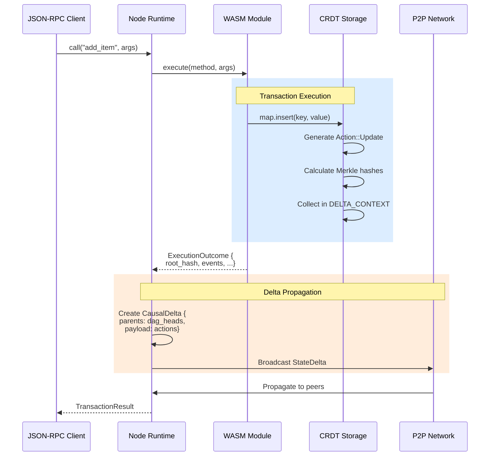
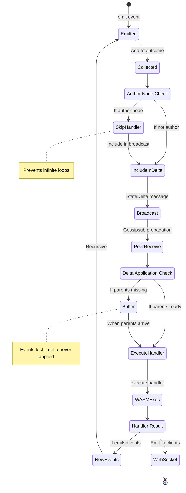
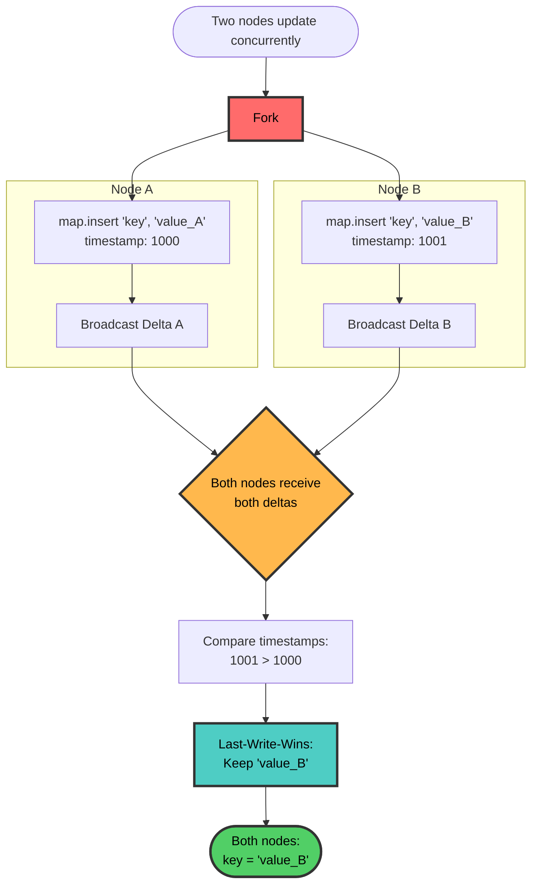
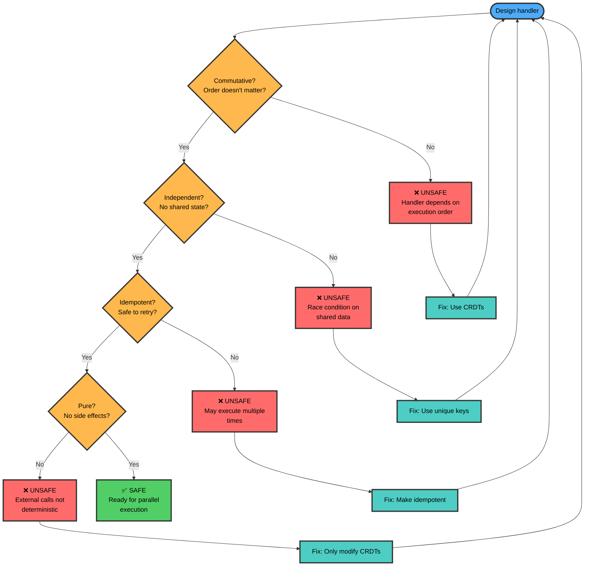
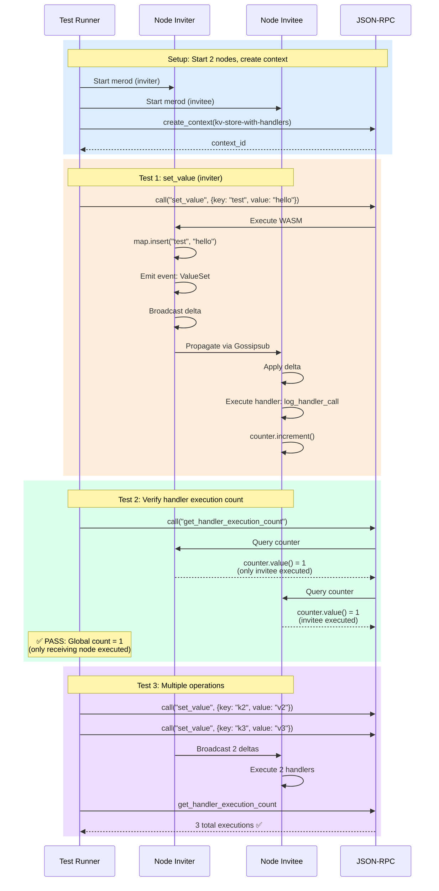
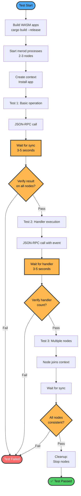

# Calimero SDK

Build distributed applications with automatic CRDT synchronization and conflict-free state management.

## Quick Start

```rust
use calimero_sdk::app;
use calimero_sdk::borsh::{BorshSerialize, BorshDeserialize};
use calimero_storage::collections::UnorderedMap;

#[app::state]
#[derive(BorshSerialize, BorshDeserialize)]
#[borsh(crate = "calimero_sdk::borsh")]
pub struct MyApp {
    items: UnorderedMap<String, String>,
}

#[app::logic]
impl MyApp {
    #[app::init]
    pub fn init() -> MyApp {
        MyApp {
            items: UnorderedMap::new(),
        }
    }
    
    pub fn add_item(&mut self, key: String, value: String) -> app::Result<()> {
        self.items.insert(key, value)?;
        Ok(())
    }
    
    pub fn get_item(&self, key: &str) -> app::Result<Option<String>> {
        self.items.get(key).map_err(Into::into)
    }
}
```

## Architecture

### WASM Execution Flow



### Event Lifecycle



## Core Concepts

### CRDT Collections

All state in Calimero apps uses **CRDTs** (Conflict-free Replicated Data Types):

```rust
use calimero_storage::collections::{UnorderedMap, Vector, Counter};

// Key-value map
let mut map = UnorderedMap::new();
map.insert("key".to_string(), "value".to_string())?;

// Ordered list  
let mut list = Vector::new();
list.push("item".to_string())?;

// Distributed counter (G-Counter)
let mut counter = Counter::new();
counter.increment()?;  // Uses node's identity
let total = counter.value()?;  // Sum across all nodes
```

**Why CRDTs?**
- ✅ Automatic conflict resolution
- ✅ No coordination needed for updates
- ✅ Eventually consistent across nodes
- ✅ Works offline, syncs when reconnected

### CRDT Conflict Resolution



### G-Counter (Distributed Counter)

```mermaid
flowchart LR
    subgraph "Initial State"
        I[counter = 0<br/>storage: empty]
    end
    
    subgraph "Node A Increments"
        A1[executor_id = 'node_a']
        A2[storage['node_a'] = 1]
        A3[counter.value = 1]
    end
    
    subgraph "Node B Increments (Concurrent)"
        B1[executor_id = 'node_b']
        B2[storage['node_b'] = 1]
        B3[counter.value = 1]
    end
    
    subgraph "After Sync"
        S1[storage['node_a'] = 1<br/>storage['node_b'] = 1]
        S2[counter.value = sum<br/>= 1 + 1 = 2]
    end
    
    I --> A1
    I --> B1
    A1 --> A2 --> A3
    B1 --> B2 --> B3
    A3 --> S1
    B3 --> S1
    S1 --> S2
    
    style I fill:#4DABF7,stroke:#333,stroke-width:3px,color:#000
    style A3 fill:#FF6B6B,stroke:#333,stroke-width:3px,color:#000
    style B3 fill:#FF6B6B,stroke:#333,stroke-width:3px,color:#000
    style S2 fill:#51CF66,stroke:#333,stroke-width:3px,color:#000
```

### Events and Handlers

Emit events to notify other parts of your app:

```rust
#[app::event]
pub enum Event {
    ItemAdded { key: String, value: String },
    ItemRemoved { key: String },
}

// Emit event without handler
app::emit!(Event::ItemAdded { 
    key: "foo".to_owned(), 
    value: "bar".to_owned() 
});

// Emit event WITH handler
app::emit!((
    Event::ItemAdded { 
        key: "foo".to_owned(), 
        value: "bar".to_owned() 
    },
    "on_item_added"  // Handler name
));
```

## ⚠️ CRITICAL: Event Handler Requirements

**Handlers may execute in PARALLEL** (not guaranteed sequential order).

### Handler Safety Check



Your handlers **MUST** be:

### 1. Commutative (Order-Independent)
```rust
// ✅ SAFE - Counter increment is commutative
pub fn handler_a(&mut self) { self.counter.increment(); }
pub fn handler_b(&mut self) { self.counter.increment(); }
// Result: counter = 2, regardless of order

// ❌ UNSAFE - Operations depend on order
pub fn create(&mut self, id: &str) { self.items.insert(id, "new"); }
pub fn update(&mut self, id: &str) {
    let item = self.items.get(id).expect("must exist");  // BREAKS if create() not run first!
    self.items.insert(id, format!("{} updated", item));
}
```

### 2. Independent (No Shared State)
```rust
// ✅ SAFE - Each handler uses unique key
pub fn handler_a(&mut self, user: &str) {
    self.counters.insert(format!("a_{}", user), 1);
}
pub fn handler_b(&mut self, user: &str) {
    self.counters.insert(format!("b_{}", user), 1);
}

// ❌ UNSAFE - Both modify same key
pub fn handler_a(&mut self) {
    self.shared.insert("count", "1");  // RACE CONDITION!
}
pub fn handler_b(&mut self) {
    self.shared.insert("count", "2");  // RACE CONDITION!
}
```

### 3. Idempotent (Safe to Retry)
```rust
// ✅ SAFE - CRDT operations are naturally idempotent
pub fn handler(&mut self) {
    self.counter.increment();  // Safe to call multiple times
}

// ❌ UNSAFE - External calls are not idempotent
pub fn handler(&mut self, amount: u64) {
    external_payment_api::charge(amount);  // DANGER: May charge twice!
}
```

### 4. Pure (No External Side Effects)
```rust
// ✅ SAFE - Only modifies CRDT state
pub fn handler(&mut self, item: &str) {
    self.items.insert(item.to_owned(), "processed".to_owned());
    app::log!("Handler called");  // Logging is fine
}

// ❌ UNSAFE - External side effects
pub fn handler(&mut self, email: &str) {
    http_client::post("/notify", email);  // DANGER: Not deterministic!
    write_to_file(email);  // DANGER: Not WASM-compatible!
}
```

## Best Practices

### Use CRDTs for Everything

```rust
// ❌ BAD - Simple counter (loses concurrent updates)
struct App {
    counter: u64,
}
impl App {
    pub fn increment(&mut self) {
        self.counter += 1;  // Concurrent updates = lost count!
    }
}

// ✅ GOOD - G-Counter (handles concurrent updates)
struct App {
    counter: Counter,
}
impl App {
    pub fn increment(&mut self) {
        self.counter.increment();  // Each node tracks separately
    }
    pub fn total(&self) -> u64 {
        self.counter.value()  // Sum across all nodes
    }
}
```

### Keep Handlers Simple

```rust
// ✅ GOOD - Simple CRDT operation
pub fn on_user_registered(&mut self, user_id: &str) {
    self.registration_count.increment();
}

// ❌ BAD - Complex logic with dependencies
pub fn on_user_registered(&mut self, user_id: &str) {
    // Creates ordering dependency!
    self.create_user_profile(user_id);
    self.send_welcome_email(user_id);
    self.update_analytics();
}
```

### Use Events for Workflow

```rust
// Instead of chaining in handlers, emit events:
pub fn register_user(&mut self, user: User) -> app::Result<()> {
    self.users.insert(user.id.clone(), user.clone())?;
    
    // Each event has its own independent handler
    app::emit!((Event::UserRegistered { id: user.id.clone() }, "count_registration"));
    app::emit!((Event::UserRegistered { id: user.id.clone() }, "log_registration"));
    app::emit!((Event::UserRegistered { id: user.id }, "notify_admins"));
    
    Ok(())
}

// Handlers can run in parallel safely (each modifies different CRDT)
pub fn count_registration(&mut self, id: &str) {
    self.registrations.increment();
}
pub fn log_registration(&mut self, id: &str) {
    self.logs.push(format!("User {} registered", id));
}
pub fn notify_admins(&mut self, id: &str) {
    self.notifications.insert(id.to_owned(), "new_user".to_owned());
}
```

## Available Macros

```rust
#[app::state]           // Mark application state struct
#[app::state(emits = Event)]  // With events

#[app::logic]           // Mark implementation block
#[app::init]            // Mark constructor
#[app::event]           // Mark event enum

app::emit!(event)       // Emit event
app::emit!((event, "handler"))  // Emit with handler
app::log!("msg")        // Logging
app::bail!(Error::X)    // Early return with error
```

## Building

```bash
# Add WASM target
rustup target add wasm32-unknown-unknown

# Build application
cargo build --target wasm32-unknown-unknown --release

# Output: target/wasm32-unknown-unknown/release/my_app.wasm
```

## Testing

### Unit Tests (Application Logic)

```rust
#[cfg(test)]
mod tests {
    use super::*;
    
    #[test]
    fn test_add_item() {
        let mut app = MyApp::init();
        app.add_item("key".to_owned(), "value".to_owned()).unwrap();
        assert_eq!(app.get_item("key").unwrap(), Some("value".to_owned()));
    }
    
    #[test]
    fn test_counter_increments() {
        let mut app = MyApp::init();
        app.counter.increment().unwrap();
        app.counter.increment().unwrap();
        assert_eq!(app.counter.value().unwrap(), 2);
    }
}
```

### E2E Tests (Real Network Scenarios)

E2E tests validate multi-node scenarios in `e2e-tests/` directory.

#### E2E Test: kv-store-with-handlers



**What it validates**:
- Event handlers execute on receiving nodes only
- Author node skips its own handlers
- G-Counter correctly sums across nodes
- Real network propagation via Gossipsub
- CRDT consistency in multi-node setup

**Test file**: `e2e-tests/config/protocols/near/kv-store-with-handlers-test.json`

#### E2E Test Flow Diagram



**E2E Test Configuration**:

```json
{
  "protocol": "near",
  "steps": [
    {
      "action": "call",
      "node": "inviter",
      "method": "set_value",
      "args": {"key": "test", "value": "hello"},
      "expectedResultJson": null
    },
    {
      "action": "wait",
      "durationMs": 3000
    },
    {
      "action": "call",
      "node": "inviter",
      "method": "get_handler_execution_count",
      "args": {},
      "expectedResultJson": 1
    }
  ]
}
```

### Test Commands

```bash
# Unit tests (fast, no network)
cargo test -p my-app

# Integration tests (WASM execution)
cargo test -p my-app --test integration
```

**End-to-End Testing:**

E2E tests are automatically run via GitHub Actions workflows on every pull request:

- **`merobox-workflows.yml`** - Runs merobox workflows for all applications to validate functionality
- **`merobox-proposals.yml`** - Tests blockchain integration proposals (NEAR, ICP, Ethereum)
- **`test-sdk-js.yml`** - Ensures JavaScript SDK compatibility with core changes

**Test Pyramid**:
- **Unit tests**: Application logic, fast (<1s), no network
- **Integration tests**: WASM execution, medium (~5s), mocked storage
- **E2E tests**: Full stack, slow (~30s), real network

## Common Patterns

### Counter Pattern (Distributed Counting)

```rust
use calimero_storage::collections::Counter;

pub struct Analytics {
    page_views: Counter,
    user_signups: Counter,
}

impl Analytics {
    pub fn track_page_view(&mut self) {
        self.page_views.increment();
    }
    
    pub fn get_total_views(&self) -> u64 {
        self.page_views.value()  // Sum across all nodes
    }
}
```

### Map Pattern (Key-Value Storage)

```rust
use calimero_storage::collections::UnorderedMap;

pub struct UserStore {
    users: UnorderedMap<String, User>,
}

impl UserStore {
    pub fn upsert_user(&mut self, id: String, user: User) {
        self.users.insert(id, user);  // LWW on conflict
    }
}
```

### List Pattern (Ordered Items)

```rust
use calimero_storage::collections::Vector;

pub struct Timeline {
    posts: Vector<Post>,
}

impl Timeline {
    pub fn add_post(&mut self, post: Post) {
        self.posts.push(post);
    }
    
    pub fn get_posts(&self) -> Vec<Post> {
        self.posts.iter().cloned().collect()
    }
}
```

## Error Handling

```rust
use calimero_sdk::app;
use thiserror::Error;

#[derive(Debug, Error)]
#[error("Not found: {0}")]
pub struct NotFoundError(String);

pub fn get_user(&self, id: &str) -> app::Result<User> {
    let Some(user) = self.users.get(id)? else {
        app::bail!(NotFoundError(id.to_owned()));
    };
    Ok(user)
}
```

## Environment Functions

```rust
use calimero_sdk::env;

// Get current executor
let executor = env::executor_id();  // [u8; 32]

// Get context
let context = env::context_id();  // [u8; 32]

// Logging
env::log("Hello from WASM");

// Time
let now = env::time_now();  // u64 nanoseconds
```

## See Also

- [calimero-storage](../storage/README.md) - CRDT collections and storage
- [calimero-node](../node/README.md) - Node runtime and synchronization
- [Example apps](../../apps/) - Reference implementations

## License

See [COPYRIGHT](../../COPYRIGHT) and [LICENSE.md](../../LICENSE.md) in the repository root.
