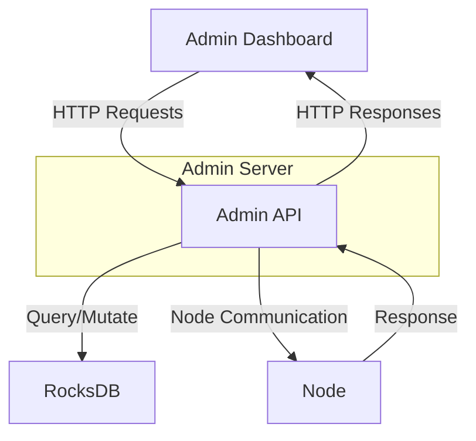
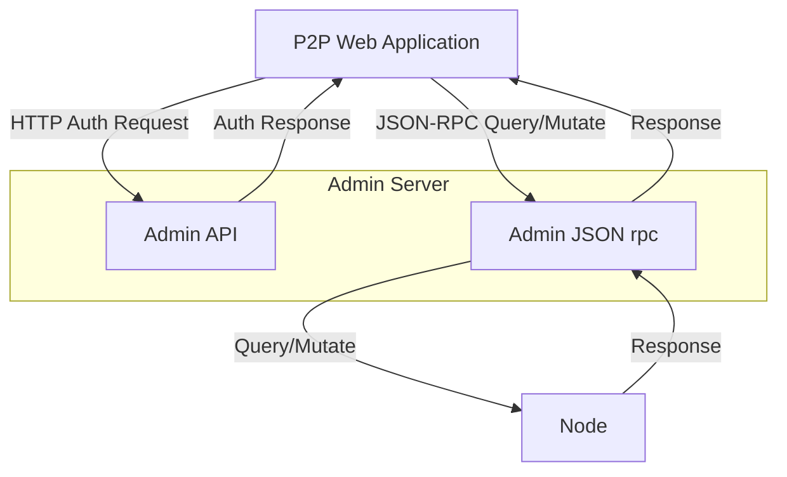
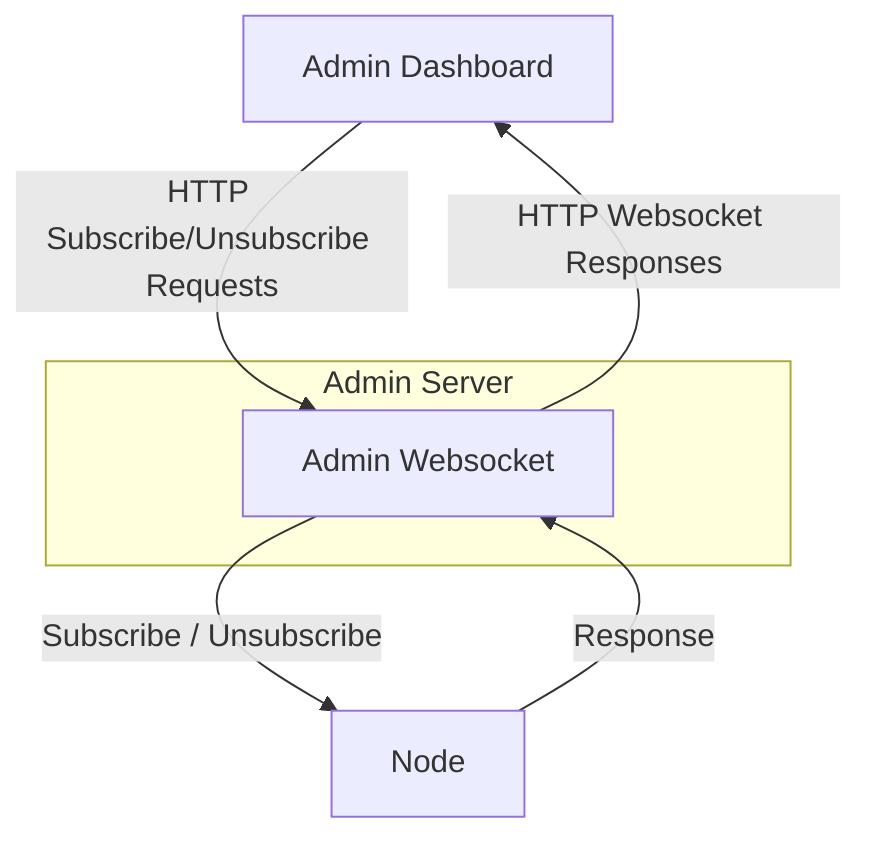

# Calimero Admin

- [Introduction](#introduction)
    - [Admin API](#1-admin-api)
    - [Admin JSON rpc](#2-admin-json-rpc)
    - [Admin Websocket](#3-admin-websocket)
- [Calimero Admin Workflows](#calimero-admin-workflows)
    - [Admin API Workflow](#workflow-for-admin-dashboard)
    - [Admin JSON rpc Workflow](#workflow-for-p2p-web-applications-and-admin-json-rpc)
    - [Admin Websocket Workflow](#workflow-for-p2p-web-application-and-admin-websocket)

## Introduction

The Calimero Admin is a server component of the Calimero Node that has crucial part in
managing the Calimero Admin Dashboard and the P2P Applications built for Calimero Nodes.

Calimero Admin Server component is split into 3 parts:

### 1. Admin API

The Admin API component of the Calimero Admin server connects web applications with the node and its functionalities. It is primarily utilized by the Admin Dashboard to query and manage various aspects of the node, including:

 - Identity information
 - Root keys
 - Client keys
 - Installed applications
 - Started contexts

**Data Querying**: The Admin API allows the Admin Dashboard to fetch important data from the node, such as identity details, root and client keys, and information about installed and active applications.

**Application Management**: The API provides functionalities to install new applications and start contexts. This enables administrators to dynamically manage the software running on the node.

**Key Management**: Administrators can manage root and client keys through the API, ensuring secure access and control over the node.

**Authentication**: The Admin API facilitates user authentication via selected wallets, currently supporting MetaMask and NEAR networks. Authentication details will be explained in later sections.

**Integration with Web Applications**: The authentication mechanism is also used by web applications designed to interact with P2P applications installed on the node, ensuring secure and authenticated access.

### 2. Admin JSON rpc

The Admin JSON-RPC component of the Calimero Admin server facilitates communication between the front-end web applications of P2P systems and the application binaries (contexts) running on Calimero nodes. This allows seamless interaction and data management for applications.

The JSON-RPC interface provides two primary methods:

- Query
- Mutate

#### Query Method
The `Query` method retrieves data from the applications running on the Calimero nodes. For instance, in the Only Peers forum application, posts and comments stored in the application's storage can be queried using the JSON-RPC interface. This enables users to fetch and display content from the forum.

#### Mutate Method
The `Mutate` method allows modification of the application's data. For example, in the Only Peers forum application, users can create new posts or comments. The Mutate method updates the application's storage with these new entries, facilitating dynamic content creation and interaction within the application.

The Admin JSON-RPC component is crucial for enabling interactive and real-time data management between P2P application front-ends and the back-end contexts running on Calimero nodes.

### 3. Admin Websocket

The Admin WebSocket is used for subscribing to and unsubscribing from certain contexts within the Calimero Admin server. Defined handlers manage subscription states for WebSocket connections, allowing clients to receive updates about specific contexts they are interested in.
WebSocket handlers are essential for managing real-time, context-specific subscriptions within the Calimero Admin server. They allow clients to dynamically subscribe to and unsubscribe from updates about various application contexts, enhancing the interactivity and responsiveness of the P2P application.

#### Subscription Handling:

Websocket handles requests to subscribe to specific contexts and send responses back to the client with the subscribed context IDs.

#### Unsubscription Handling:

Websocket handle requests to unsubscribe from specific contexts and send responses back to the client with the unsubscribed context IDs.

## Calimero Admin Workflows

### Workflow for Admin Dashboard

### Workflow for P2P Web applications and Admin JSON rpc

### Workflow for P2P Web application and Admin Websocket
