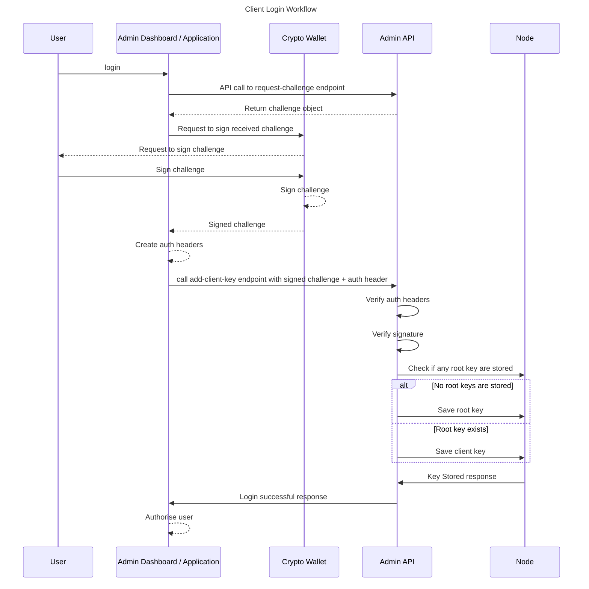
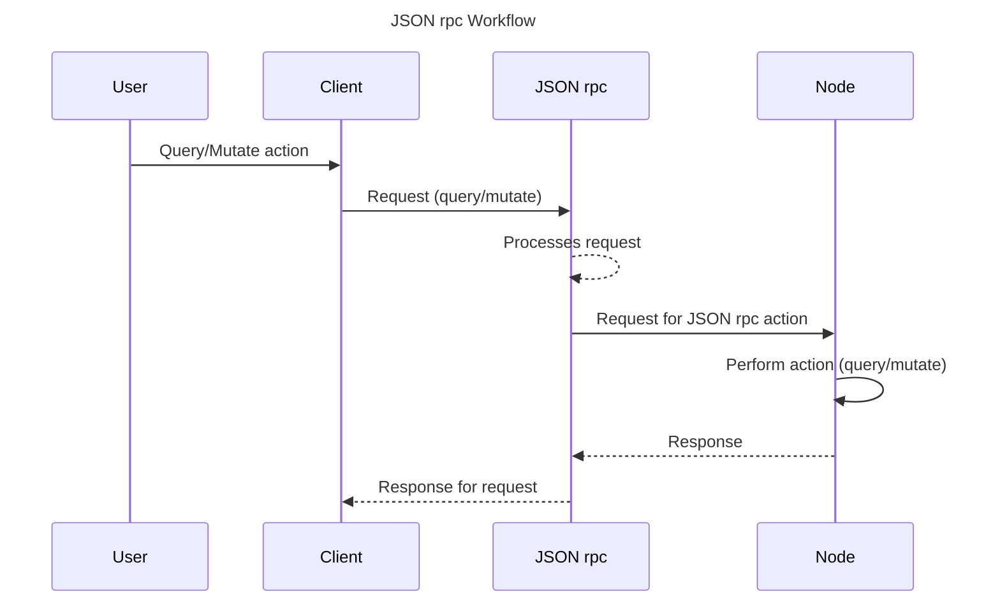
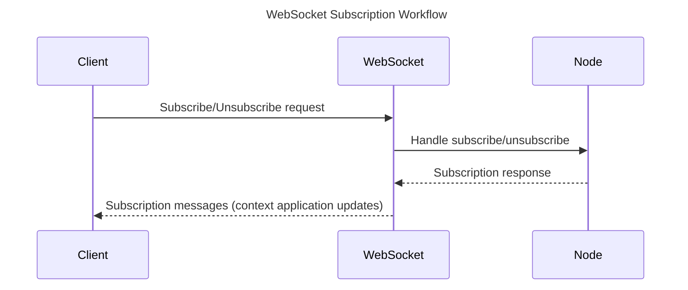
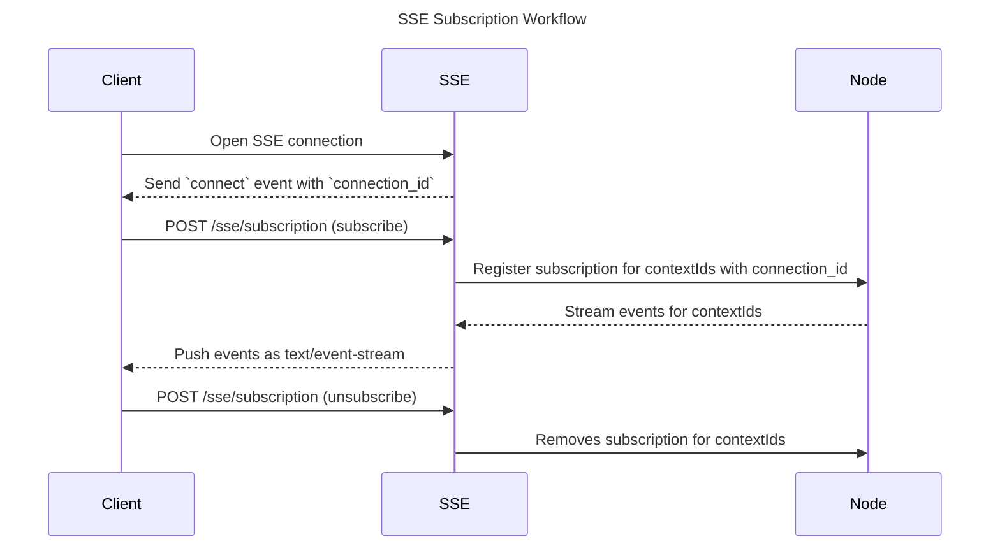

# Node Server

- [Node Server](#node-server)
  - [Introduction](#introduction)
  - [Build Modes](#build-modes)
    - [Default mode (external auth)](#default-mode-external-auth)
    - [Embedded auth mode](#embedded-auth-mode)
    - [1. Admin API](#1-admin-api)
    - [2. JSON rpc](#2-json-rpc)
      - [Query Method](#query-method)
      - [Mutate Method](#mutate-method)
    - [3. Websocket](#3-websocket)
      - [Subscription Handling:](#subscription-handling)
      - [Unsubscription Handling:](#unsubscription-handling)
    - [4. Server Sent Event (SSE)](#4-server-sent-event-sse)
      - [SSE Subscription Handling:](#sse-subscription-handling)
      - [SSE Unsubscription Handling:](#sse-unsubscription-handling)
  - [Node Server Workflows](#node-server-workflows)
    - [Client Login Workflow](#client-login-workflow)
    - [JSON rpc Workflow](#json-rpc-workflow)
    - [Websocket Workflow](#websocket-workflow)
    - [SSE Workflow](#sse-workflow)
  - [Admin API endpoints](#admin-api-endpoints)
    - [Protected Routes](#protected-routes)
    - [Unprotected Routes](#unprotected-routes)
  - [JSON rpc endpoint](#json-rpc-endpoint)
  - [Websocket endpoints](#websocket-endpoints)
  - [SSE endpoints](#sse-endpoints)
  - [Examples](#examples)

## Introduction

Node Server is a component in node that facilitates node administration and
enables communication with the logic of an application (loaded wasm) in
participating contexts.

Node Server component is split into 4 parts:

1.  [Admin API](https://github.com/calimero-network/core/blob/feat-admin_api_docs/crates/server/src/admin/service.rs)
2.  [JSON rpc](https://github.com/calimero-network/core/blob/feat-admin_api_docs/crates/server/src/jsonrpc.rs)
3.  [Websocket](https://github.com/calimero-network/core/blob/feat-admin_api_docs/crates/server/src/ws.rs)
4.  [SSE](https://github.com/calimero-network/core/blob/master/crates/server/src/sse.rs)

## Build Modes

Two build outputs are supported so operators can choose whether the authentication
service runs alongside the node or inside it.

### Default mode (external auth)

- `calimero-server` is built with default Cargo features.
- The node expects an external `mero-auth` deployment and continues to forward
  authentication traffic to it, matching the current production setup.
- Existing configuration files work without modification.

### Embedded auth mode

- Choose the mode at runtime: `merod run --auth-mode embedded` or set
  `network.server.auth_mode = "embedded"` in `config.toml`.
- The node boots the embedded `mero-auth` service, mounts its `/auth` and `/admin`
  routes, and guards the JSON-RPC, admin, WebSocket, and SSE endpoints with the
  bundled JWT middleware.
- When `auth_mode = "embedded"` but there is no `[network.server.embedded_auth]`
  block, the service defaults to a local RocksDB store under the node’s home
  directory (`auth/`) and enables only the `user_password` provider.
- Switching back to proxy mode is as simple as running with
  `--auth-mode proxy` (or removing the `auth_mode` line), keeping existing
  deployments compatible.

#### Configuring `server.embedded_auth`

When embedded mode is active you can inline authentication settings under
`network.server.embedded_auth`. The schema matches `mero-auth` configuration; for example:

```toml
[network.server.embedded_auth]
listen_addr = "0.0.0.0:3001"

[network.server.embedded_auth.jwt]
issuer = "calimero-auth"
access_token_expiry = 3600
refresh_token_expiry = 2_592_000

[network.server.embedded_auth.storage]
type = "rocksdb"
path = "data/auth"

[network.server.embedded_auth.providers]
user_password = true
```

Omitting the block leaves the embedded defaults in place (RocksDB storage at
`auth/`, username/password authentication). External deployments can keep existing
configs unchanged while opting in environment by environment.

#### CI/CD expectations

- Build the node once: `cargo build -p calimero-server`.
- Publish or package the single artefact; operators select the mode through
  configuration or the CLI flag.
- For the bundled build, ensure the environment exposes the frontend assets:
  - `CALIMERO_AUTH_FRONTEND_SRC` pointing to a release archive or local build, or
  - `CALIMERO_AUTH_FRONTEND_PATH` pointing to a prebuilt directory.
- When running integration suites, exercise at least one smoke test in each mode to
  confirm `/auth` endpoints are reachable in embedded mode and that the proxy mode
  continues to rely on the external service.

### 1. Admin API

The Admin API component of the Node Server exposes API for connection with the
node and its functionalities. It is primarily utilized by the Admin Dashboard to
query and manage various aspects of the node, including:

- Identity information
- Root keys
- Client keys
- Installed applications
- Started contexts

**Data Querying**: The Admin API allows the Admin Dashboard to fetch important
data from the node, such as identity details, root and client keys, and
information about installed and active applications.

**Application Management**: The API provides functionalities for managing
applications and contexts, allowing for the installation and uninstallation of
applications and starting contexts.

**Key Management**: Administrators can manage root and client keys through the
API, ensuring secure access and control over the node.

**Authentication**: The Admin API facilitates user authentication via selected
wallets, currently supporting MetaMask and NEAR networks. Authentication details
will be explained in later sections.

**Integration with Web Applications**: The authentication mechanism is also used
by web applications designed for applications (loaded wasm) in participating
context, ensuring secure and authenticated access.

### 2. JSON rpc

The JSON rpc component of the Node Server facilitates communication between the
clients and the context. This allows seamless interaction and data management
for applications.

The JSON rpc interface provides two primary methods:

- Query
- Mutate

#### Query Method

The `Query` method retrieves data from the application in participating context.
For instance, in the Only Peers forum application, posts and comments stored in
the application's storage can be queried using the JSON rpc interface. This
enables users to fetch and display content from the forum.

#### Mutate Method

The `Mutate` method allows modification of the application's data in
participating context. For example, in the Only Peers forum application, users
can create new posts or comments. The Mutate method updates the application's
storage with these new entries, facilitating dynamic content creation and
interaction within the application.

### 3. Websocket

The WebSocket is used for subscribing to and unsubscribing from certain context
running in the Node Server. Defined handlers manage subscription states for
WebSocket connections, allowing clients to receive updates about specific
contexts they are interested in. WebSocket handlers are essential for managing
real-time subscriptions within the Node Server. They allow clients to
dynamically subscribe to and unsubscribe from updates about various application
contexts.

**Important**: WebSocket connections are **unidirectional for events** - the server
pushes events to subscribed clients. For executing transactions (`mutate`) or 
reading state (`query`), clients must use the separate JSON-RPC endpoint. This 
separation of concerns provides:

- **WebSocket/SSE**: Real-time event streaming (Server → Client)
- **JSON-RPC**: Execute transactions and queries (Client ↔ Server)

This architecture ensures efficient event streaming while maintaining reliable
request/response patterns for state modifications.

#### Subscription Handling:

Websocket handles requests to subscribe to specific contexts and send responses
back to the client with the subscribed context IDs.

#### Unsubscription Handling:

Websocket handle requests to unsubscribe from specific contexts and send
responses back to the client with the unsubscribed context IDs.

### 4. Server Sent Event (SSE)

The Server-Sent Events (SSE) endpoint allows clients to subscribe to real-time 
updates for specific contexts running in the Node Server. Unlike WebSockets, which 
support two-way communication, SSE provides a one-way channel where the server continuously 
pushes updates to the client over a single long-lived HTTP connection. Subscriptions are 
automatically cleaned up after closing the connection.

The very first event received after opening the SSE stream is a `connect` event, which contains
a `connection_id`. This `connection_id` is required when making subscription requests.

#### SSE Subscription Handling:

To subscribe, the client must send a `POST` request to the `/sse/subscription` endpoint with 
one or more `contextIds`. 

#### SSE Unsubscription Handling:

To unsubscribe, the client must send a `POST` request to the `/sse/subscription` endpoint with 
one or more `contextIds`.

## Node Server Workflows

### Client Login Workflow



### JSON rpc Workflow



### Websocket Workflow



### SSE Workflow



## Admin API endpoints

The Admin API endpoints are split into protected and unprotected routes, where
protected routes require authentication.

**Base path**: `/admin-api`

### Protected Routes

These routes require authentication using auth headers. Auth headers are
generated using `createAuthHeader` function from the `calimero sdk` library.

Parts of the Auth Headers

1.  `wallet_type`: Specifies the type of wallet used (e.g., NEAR).
2.  `signing_key`: Encoded public key used for signing the request.
3.  `signature`: Encoded signature generated from the payload hash.
4.  `challenge`: Encoded hash of the payload, serving as a challenge.
5.  `context_id`: Context identifier for additional request context. Optional
    for Admin Dashboard but mandatory for applications.

**1. Create Root Key**

- **Path**: `/root-key`
- **Method**: `POST`
- **Description**: Creates a new root key in the node.

**2. Install Application**

- **Path**: `/install-application`
- **Method**: `POST`
- **Description**: Installs a new application in the node.

**3. List Applications**

- **Path**: `/applications`
- **Method**: `GET`
- **Description**: Lists all installed applications in the node.

**4. Fetch DID**

- **Path**: `/did`
- **Method**: `GET`
- **Description**: Fetches the DID (Decentralized Identifier) of the node.

**5. Create Context**

- **Path**: `/contexts`
- **Method**: `POST`
- **Description**: Creates a new context.

**6. Delete Context**

- **Path**: `/contexts/:context_id`
- **Method**: `DELETE`
- **Description**: Deletes a specific context by ID.

**7. Get Context**

- **Path**: `/contexts/:context_id`
- **Method**: `GET`
- **Description**: Retrieves details of a specific context by ID.

**8. Get Context Users**

- **Path**: `/contexts/:context_id/users`
- **Method**: `GET`
- **Description**: Lists users associated with a specific context.

**9. Get Context Client Keys**

- **Path**: `/contexts/:context_id/client-keys`
- **Method**: `GET`
- **Description**: Lists client keys for a specific context.

**10. Get Context Storage**

- **Path**: `/contexts/:context_id/storage`
- **Method**: `GET`
- **Description**: Retrieves storage information for a specific context.

**11. List Contexts**

- **Path**: `/contexts`
- **Method**: `GET`
- **Description**: Lists all contexts.

**12. Delete Auth Keys**

- **Path**: `/identity/keys`
- **Method**: `DELETE`
- **Description**: Deletes all root and client keys.

### Unprotected Routes

These routes do not require authentication.

**1. Health Check**

- **Path**: `/health`
- **Method**: `GET`
- **Description**: Checks the health of the API.

**2. Request Challenge**

- **Path**: `/request-challenge`
- **Method**: `POST`
- **Description**: Requests a challenge for authentication.

**3. Add Client Key**

- **Path**: `/add-client-key`
- **Method**: `POST`
- **Description**: Adds a new client key.

**4. Install Dev Application**

- **Path**: `/dev/install-application`
- **Method**: `POST`
- **Description**: Installs a development application.

**5. Manage Dev Contexts**

- **Path**: `/dev/contexts`
- Methods: `GET`, `POST`
- **Description**: Lists (`GET`) and creates (`POST`) development contexts.

**6. List Dev Applications**

- **Path**: `/dev/applications`
- **Method**: `GET`
- **Description**: Lists all development applications.

## JSON rpc endpoint

The JSON-rpc server endpoint is structured to handle various request types.

**Base path**: `/jsonrpc`

**1. Handle JSON-rpc Request**

- **Path**: `/jsonrpc`
- **Method**: `POST`
- **Description**: Handles incoming JSON-rpc requests, which can be `query` or
  `mutate` requests, processes them, and returns the appropriate response.

## Websocket endpoints

The WebSocket, accessible at /ws, allows clients to dynamically subscribe to and
unsubscribe from real-time updates about specific contexts within the Node
Server.

**1. Handle WebSocket Request**

- **Path**: `/ws`
- **Method**: `GET`
- **Description**: Handles incoming WebSocket requests, which can be subscribe
  or unsubscribe requests, processes them, and returns the appropriate response.

## SSE endpoints

The SSE endpoint, accessible at `/sse`, allows clients to establish a real-time connection 
to receive updates for specific contexts within the Node Server.

**1. Establish SSE Connection**

- **Path**: `/sse`
- **Method**: `GET`
- **Description**: Opens a long-lived HTTP connection for receiving server-sent events.  
  The very first message received is a `connect` event containing a `connection_id`.  
  This `connection_id` must be used for subsequent subscription requests.
- **Example response (first event)**:
    ```text
    event: connect
    data: "connection_id"
    ```

**2. Subscribe to Context**

- **Path**: `/sse/subscription`
- **Method**: `POST`
- **Description**: Subscribes the active connection (identified by `connection_id`) to one or more `contextIds`.  
  After subscribing, updates for those contexts are streamed over the open SSE connection.
- **Example request**:
    ```http
    POST /sse/subscription
    Content-Type: application/json

    {
        "id": "connection_id received from the connect event from GET /sse",
        "method": "subscribe",
        "params": {
            "contextIds": ["context_1"]
        }
    }
    ```

**3. Unsubscribe from Context**

- **Path**: `/sse/subscription`
- **Method**: `POST`
- **Description**: To unsubscribe, clients send an `unsubscribe` request similar to subscription request
  with one or more `contextIds`.  
- **Example request**:
    ```http
    POST /sse/subscription
    Content-Type: application/json

    {
        "id": "connection_id received from the connect event from GET /sse",
        "method": "unsubscribe",
        "params": {
            "contextIds": ["context_1"]
        }
    }
    ```

## Examples

Examples of Node Server usage can be found within the
[Admin Dashboard](https://github.com/calimero-network/admin-dashboard) and the
[Only Peers example](https://github.com/calimero-network/only-peers-client)
application. All communication with the node is exposed through
[calimero sdk](https://github.com/calimero-network/core-js-sdk) library.
