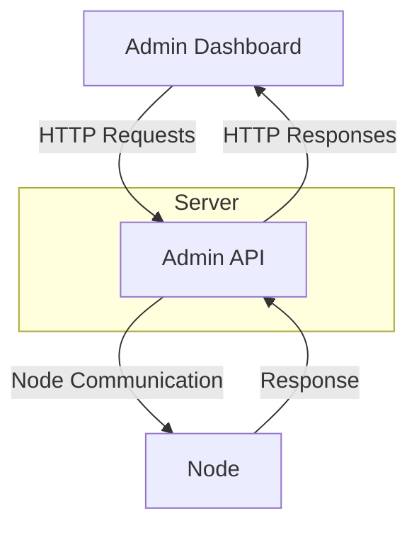
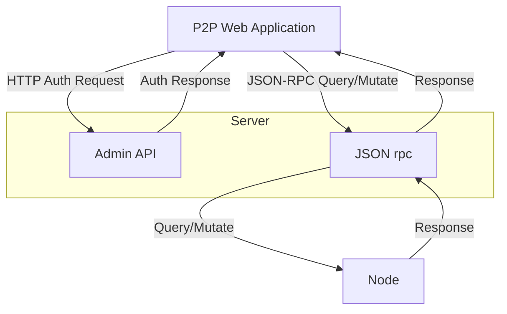
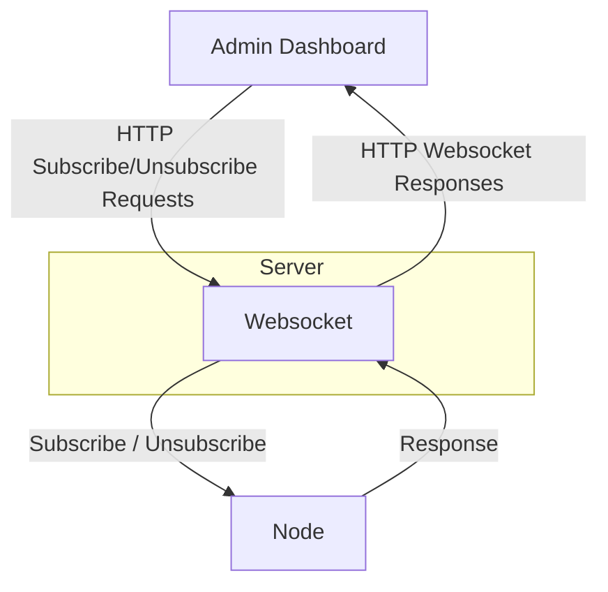

# Node Server

- [Introduction](#introduction)
    - [Admin API](#1admin-api)
    - [JSON rpc](#2json-rpc)
    - [Websocket](#3websocket)
- [Node Server Workflows](#node-server-workflows)
    - [Admin API Workflow](#workflow-for-admin-dashboard)
    - [JSON rpc Workflow](#workflow-for-p2p-web-applications-and-json-rpc)
    - [Websocket Workflow](#workflow-for-p2p-web-application-and-websocket)
- [Admin API endpoints](#admin-api-endpoints)
    - [Protected Routes](#protected-routes)
    - [Unprotected Routes](#unprotected-routes)
- [JSON rpc endpoint](#json-rpc-endpoint)
- [Websocket endpoints](#websocket-endpoints)
- [Examples](#examples)

## Introduction

Node server is a component in node that facilitates node administration and enables communication with the logic of application (loaded wasm) in participating contexts.

Node Server component is split into 3 parts:

### 1. Admin API

The Admin API component of the Node Server exposes API for connection with the node and its functionalities. It is primarily utilized by the Admin Dashboard to query and manage various aspects of the node, including:

 - Identity information
 - Root keys
 - Client keys
 - Installed applications
 - Started contexts

**Data Querying**: The Admin API allows the Admin Dashboard to fetch important data from the node, such as identity details, root and client keys, and information about installed and active applications.

**Application Management**: The API provides functionalities to install new applications and start contexts. This enables administrators to dynamically manage the software running on the node.

**Key Management**: Administrators can manage root and client keys through the API, ensuring secure access and control over the node.

**Authentication**: The Admin API facilitates user authentication via selected wallets, currently supporting MetaMask and NEAR networks. Authentication details will be explained in later sections.

**Integration with Web Applications**: The authentication mechanism is also used by web applications designed to interact with P2P applications installed on the node, ensuring secure and authenticated access.

### 2. JSON rpc

The JSON-RPC component of the Node Server facilitates communication between the front-end web applications of P2P systems and the application binaries (contexts) running on node. This allows seamless interaction and data management for applications.

The JSON-RPC interface provides two primary methods:

- Query
- Mutate

#### Query Method
The `Query` method retrieves data from the applications running on the node. For instance, in the Only Peers forum application, posts and comments stored in the application's storage can be queried using the JSON-RPC interface. This enables users to fetch and display content from the forum.

#### Mutate Method
The `Mutate` method allows modification of the application's data. For example, in the Only Peers forum application, users can create new posts or comments. The Mutate method updates the application's storage with these new entries, facilitating dynamic content creation and interaction within the application.

### 3. Websocket

The WebSocket is used for subscribing to and unsubscribing from certain contexts within the Node Server. Defined handlers manage subscription states for WebSocket connections, allowing clients to receive updates about specific contexts they are interested in.
WebSocket handlers are essential for managing real-time, context-specific subscriptions within the Node Server. They allow clients to dynamically subscribe to and unsubscribe from updates about various application contexts, enhancing the interactivity and responsiveness of the P2P application.

#### Subscription Handling:

Websocket handles requests to subscribe to specific contexts and send responses back to the client with the subscribed context IDs.

#### Unsubscription Handling:

Websocket handle requests to unsubscribe from specific contexts and send responses back to the client with the unsubscribed context IDs.

## Node Server Workflows

### Workflow for Admin Dashboard

### Workflow for P2P Web applications and JSON rpc

### Workflow for P2P Web application and Websocket

## Admin API endpoints

The Admin API endpoints are split into protected and unprotected routes, where protected routes require authentication.

**Base path**: `/admin-api`

### Protected Routes

These routes require authentication using auth headers.
Auth headers are generated using `createAuthHeader` function from the `calimero sdk` library.

Parts of the Auth Headers
 1. `wallet_type`: Specifies the type of wallet used (e.g., NEAR).
 2. `signing_key`: Encoded public key used for signing the request.
 3. `signature`: Encoded signature generated from the payload hash.
 4. `challenge`: Encoded hash of the payload, serving as a challenge.
 5. `context_id`: Optional context identifier for additional request context.

**1. Create Root Key**

 - **Path**: `/root-key`
 - **Method**: `POST`
 - **Description**: Creates a new root key in the node.

**2. Install Application**

 - **Path**: `/install-application`
 - **Method**: `POST`
 - **Description**: Installs a new application in the node.

**3. List Applications**
 - **Path**: `/applications`
 - **Method**: `GET`
 - **Description**: Lists all installed applications in the node.

**4. Fetch DID**
 - **Path**: `/did`
 - **Method**: `GET`
 - **Description**: Fetches the DID (Decentralized Identifier) of the node.

**5. Create Context**
 - **Path**: `/contexts`
 - **Method**: `POST`
 - **Description**: Creates a new context.

**6. Delete Context**
 - **Path**: `/contexts/:context_id`
 - **Method**: `DELETE`
 - **Description**: Deletes a specific context by ID.

**7. Get Context**
 - **Path**: `/contexts/:context_id`
 - **Method**: `GET`
 - **Description**: Retrieves details of a specific context by ID.

**8. Get Context Users**
 - **Path**: `/contexts/:context_id/users`
 - **Method**: `GET`
 - **Description**: Lists users associated with a specific context.

**9. Get Context Client Keys**
 - **Path**: `/contexts/:context_id/client-keys`
 - **Method**: `GET`
 - **Description**: Lists client keys for a specific context.

**10. Get Context Storage**
 - **Path**: `/contexts/:context_id/storage`
 - **Method**: `GET`
 - **Description**: Retrieves storage information for a specific context.

**11. List Contexts**
 - **Path**: `/contexts`
 - **Method**: `GET`
 - **Description**: Lists all contexts.

**12. Delete Auth Keys**
 - **Path**: `/identity/keys`
 - **Method**: `DELETE`
 - **Description**: Deletes all root and client keys.
 

### Unprotected Routes
These routes do not require authentication.

**1. Health Check**
 - **Path**: `/health`
 - **Method**: `GET`
 - **Description**: Checks the health of the API.

**2. Request Challenge**
 - **Path**: `/request-challenge`
 - **Method**: `POST`
 - **Description**: Requests a challenge for authentication.

**3. Add Client Key**
 - **Path**: `/add-client-key`
 - **Method**: `POST`
 - **Description**: Adds a new client key.

**4. Install Dev Application**
 - **Path**: `/dev/install-application`
 - **Method**: `POST`
 - **Description**: Installs a development application.

**5. Manage Dev Contexts**
 - **Path**: `/dev/contexts`
 - Methods: `GET`, `POST`
 - **Description**: Lists (`GET`) and creates (`POST`) development contexts.

**6. List Dev Applications**

 - **Path**: `/dev/applications`
 - **Method**: `GET`
 - **Description**: Lists all development applications.

## JSON rpc endpoint

The JSON-RPC server endpoint is structured to handle various request types.

**Base path**: `/jsonrpc`

**1. Handle JSON-RPC Request**

- **Path**: `/jsonrpc`
- **Method**: `POST`
- **Description**: Handles incoming JSON-RPC requests, which can be `query` or `mutate` requests, processes them, and returns the appropriate response.

## Websocket endpoints

The WebSocket, accessible at /ws, allows clients to dynamically subscribe to and unsubscribe from real-time updates about specific contexts within the Node Server.

**1. Handle WebSocket Request**

 - **Path**: `/ws`
 - **Method**: `GET`
 - **Description**: Handles incoming WebSocket requests, which can be subscribe or unsubscribe requests, processes them, and returns the appropriate response.

## Examples
Examples of Node Server usage can be found within the [Admin Dashboard](https://github.com/calimero-network/admin-dashboard) and the [Only Peers example](https://github.com/calimero-network/only-peers-client
) application. All communication with the node is exposed through `calimero sdk` library.
