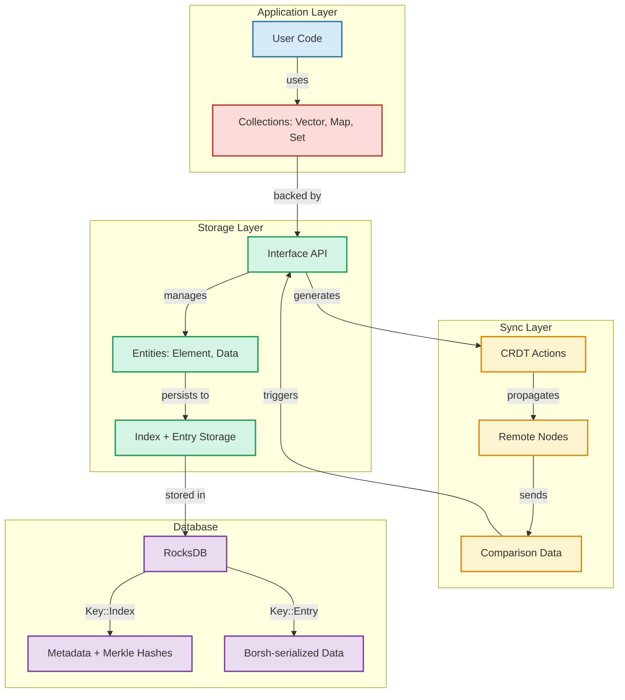
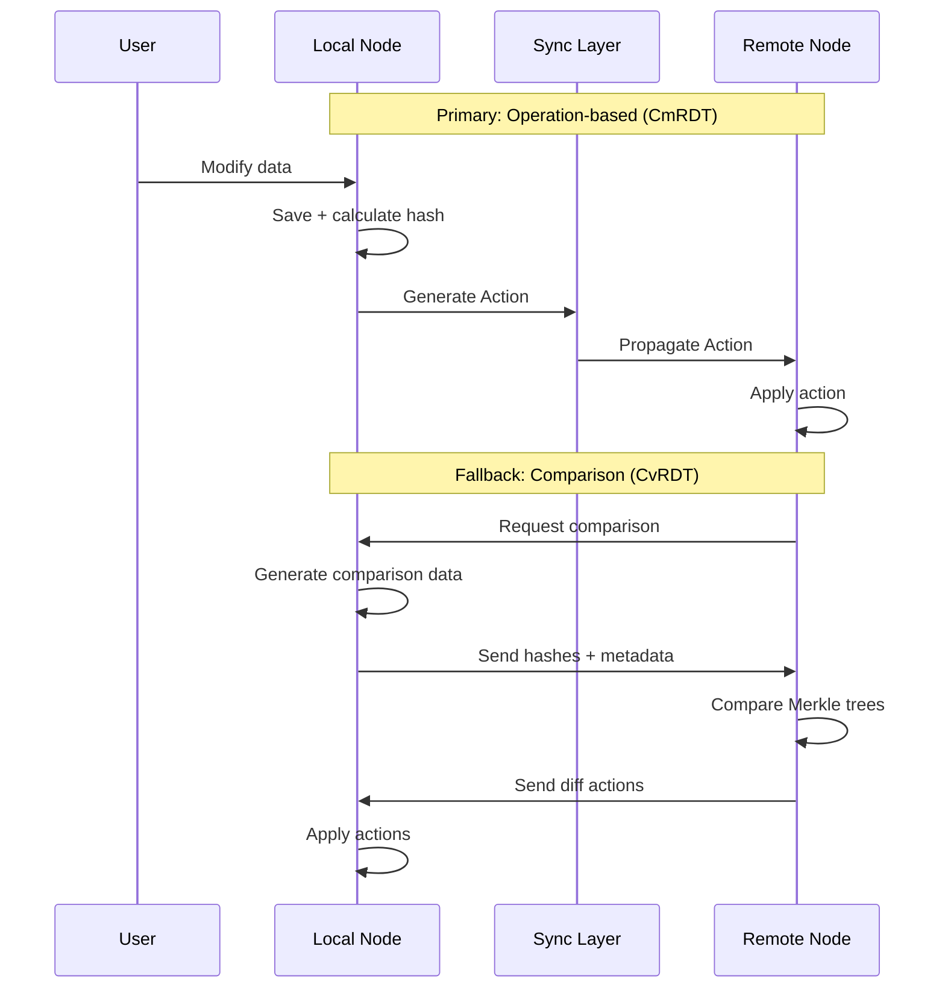
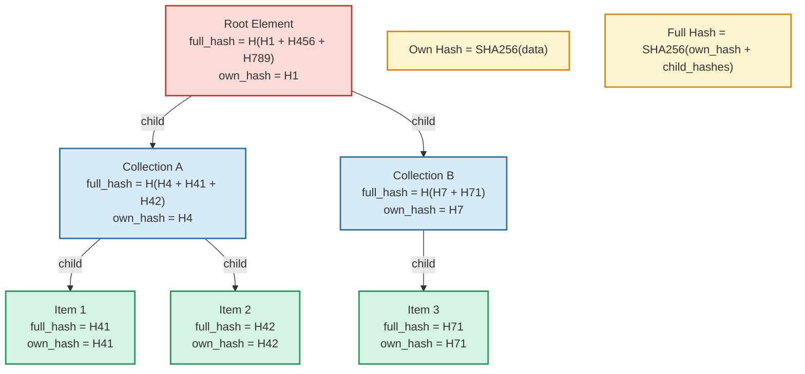
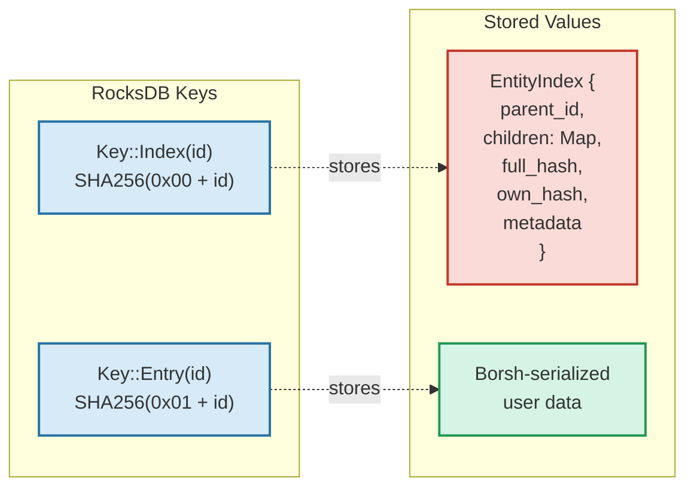
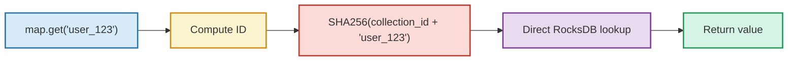
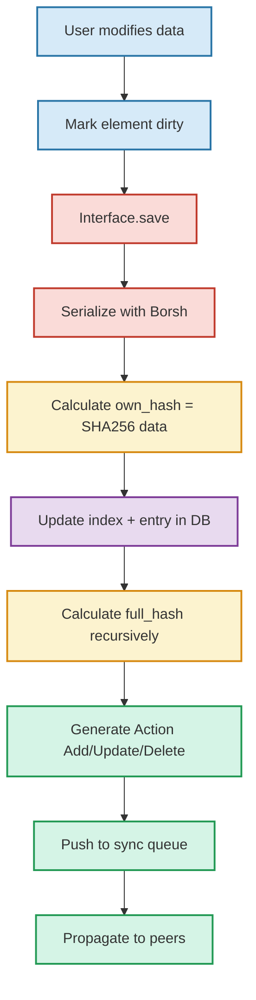
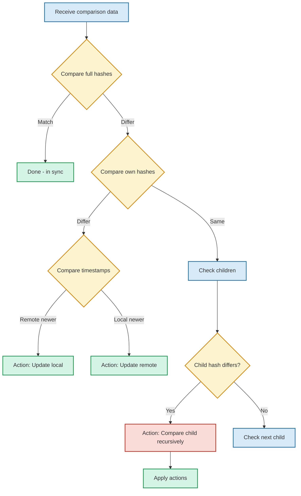
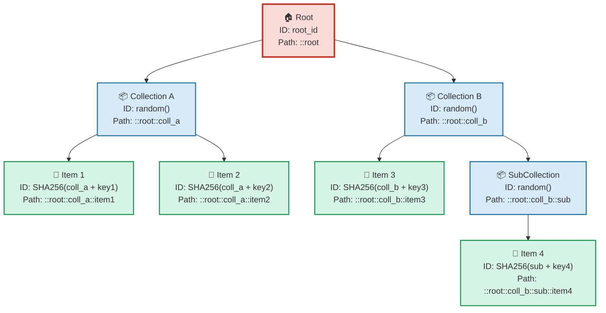
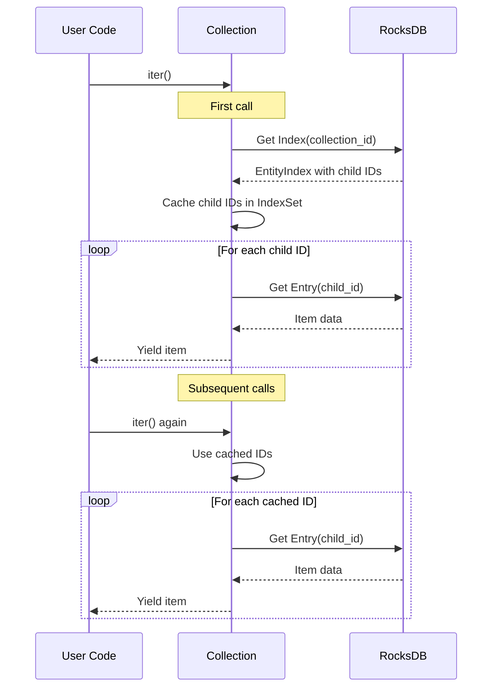

# Calimero Storage

A CRDT-based hierarchical storage system with automatic synchronization and conflict resolution.

## Quick Start

```rust
use calimero_storage::{Root, UnorderedMap, Vector};

// Define your data structures
#[derive(AtomicUnit, BorshSerialize, BorshDeserialize)]
struct Todo {
    title: String,
    completed: bool,
    #[storage]
    storage: Element,
}

// Use collections
let mut state = Root::new(|| UnorderedMap::new());
state.insert("todo-1".to_string(), Todo { 
    title: "Learn Calimero".to_string(), 
    completed: false,
    storage: Element::new(&path, None),
})?;
state.commit();
```

## Architecture Overview

### System Architecture



### Hybrid CRDT Model



Calimero uses a **hybrid approach** combining operation-based and state-based CRDTs:

1. **Operation-based (CmRDT)**: Local changes emit `Action`s that propagate to peers
2. **State-based (CvRDT)**: Merkle tree comparison for catch-up and reconciliation

This provides:
- ✅ Efficient operation propagation (no full state transfer)
- ✅ Reliable catch-up when nodes miss updates (offline, packet loss)
- ✅ Automatic conflict resolution via last-write-wins
- ✅ Partial replication support

### Merkle Hashing



Each entity maintains two hashes:
- **Own hash**: SHA-256 of immediate data
- **Full hash**: Combined hash including all descendants

This enables efficient tree comparison—only subtrees with differing hashes need examination.

### Storage Layout



**Two-tier key structure:**
- `Key::Index(id)` → Metadata, parent/child relationships, Merkle hashes
- `Key::Entry(id)` → Actual user data (Borsh-serialized)

**Deterministic IDs**: Collection items use `SHA256(parent_id + key)` for O(1) lookups:



**Tradeoff**: Hashed IDs prevent RocksDB range scans. Iteration fetches child IDs from the index, then point-lookups each item.

## API Overview

### Core Interface

**Data Operations:**
```rust
Interface::save(&mut entity)                    // Save/update entity
Interface::find_by_id::<T>(id)                  // Direct lookup by ID
Interface::add_child_to(parent_id, coll, child) // Add to collection
Interface::remove_child_from(parent_id, coll, id) // Remove from collection
```

**Synchronization:**
```rust
Interface::apply_action(action)                        // Execute sync action
Interface::compare_trees(foreign_data, comparison_data) // Generate sync actions
```

**Queries:**
```rust
Interface::children_of(parent_id, collection)  // Get collection items
Interface::parent_of(child_id)                 // Navigate hierarchy
```

### Collections

Built-in persistent collections:

- **`Vector<T>`** - Ordered, index-based list
- **`UnorderedMap<K, V>`** - Key-value map with deterministic IDs
- **`UnorderedSet<T>`** - Unique values
- **`Root<T>`** - Special root state container

All collections:
- Serialize with Borsh
- Store metadata (timestamps, hashes)
- Support iteration and standard operations
- Auto-sync via CRDT actions

## Implementation Details

### CRDT Synchronization

**Direct Changes Flow:**



**Comparison Flow:**



**Conflict Resolution**:
- Last-write-wins based on `updated_at` timestamp
- Orphaned children (from out-of-order ops) stored temporarily
- Future comparison reconciles inconsistencies

### Entity Hierarchy



**Each entity stores:**
- Unique ID (32-byte) - Random for collections, deterministic for map/set items
- Parent ID (in EntityIndex)
- Children list (by collection name)
- Own hash (SHA256 of data)
- Full hash (SHA256 of own_hash + child_hashes)
- Metadata (created_at, updated_at timestamps)


## Background and Purpose

Within the Calimero Network we want to be able to share data between nodes as a
basic premise. Fundamentally this involves the implementation of checks to
ensure that data is legitimate, along with supportive data structures to aid in
the synchronisation of the data and merging of any changes, plus appropriate
mechanisms to share and propagate the data over the network.

### Features

- ✅ Intervention-free merging with automatic conflict resolution
- ✅ Full propagation of data across the Calimero Network
- ✅ Eventual consistency of general-purpose data
- ✅ Local storage of unshared personal data
- ✅ Partial sharing based on preference or permissions
- ✅ Hierarchical data organization
- ✅ Efficient partial replication

### Design Principles

- **Atomic elements**: Data items are indivisible units
- **Separate metadata**: System properties kept distinct from user data
- **Partial representation**: Support for incomplete data views
- **Hierarchical structure**: Tree-based organization with Merkle validation

## CRDT Theory

### Why Hybrid?

**State-based CRDTs (CvRDTs)**:
- ✅ Simple to implement
- ❌ Require full state transmission (inefficient)
- ❌ Prevent partial replication

**Operation-based CRDTs (CmRDTs)**:
- ✅ Efficient (only transmit operations)
- ✅ Support partial replication
- ❌ Require reliable, ordered delivery

**Calimero's Hybrid**:
- Primary: CmRDT for efficiency
- Fallback: CvRDT comparison for reliability
- Result: Best of both worlds

### CRDT Implementation

Calimero does **not** expose traditional academic CRDT types (GCounter, PNCounter, GSet, TwoPSet, ORSet). Instead, it provides **general-purpose collections** with CRDT semantics built-in:

**Implemented collections:**
- `Vector<T>` - Ordered list with LWW semantics
- `UnorderedMap<K, V>` - Key-value map with deterministic IDs
- `UnorderedSet<T>` - Unique values set
- `Root<T>` - Root state container

**CRDT properties:**
- Last-write-wins conflict resolution (timestamp-based)
- Unique IDs for elements (ORSet-style tagging)
- Merkle tree validation
- Automatic sync via Actions

The underlying mechanism is inspired by **LWWElementSet** but provides a more ergonomic API for application developers.

## Developer Interface

### Low-level Access

Direct element and collection manipulation:

```rust
// By ID (stable across moves)
let entity = Interface::find_by_id::<Todo>(id)?;

// By hierarchy
let children = Interface::children_of(parent_id, &collection)?;
```

### High-level Access

Macro-based structure mapping:

```rust
#[derive(AtomicUnit)]
struct Auction {
    owner_id: Id,

    #[collection]
    bids: Bids,
    
    #[storage]
    storage: Element,
}

#[derive(Collection)]
#[children(Bid)]
struct Bids;

#[derive(AtomicUnit)]
struct Bid {
    price: Decimal,
    time: DateTime<Utc>,
    #[storage]
    storage: Element,
}
```

The storage system handles:
- Serialization/deserialization
- Hierarchy management
- ID assignment
- Merkle hash calculation
- Sync action generation

## Performance Considerations

### Iteration

Collections use index-based iteration (not RocksDB scans due to hashed IDs):



**Cost for 1000 items:**
- 1 index lookup + 1000 individual gets
- (vs. 1 scan with sequential keys)

**Mitigation**: Child IDs cached in memory after first access.

### Merkle Updates

When updating an entity:
```
1. Update own hash
2. Recalculate full hash (own + children)
3. Propagate changes up ancestor chain
```

Cost: O(depth) hash recalculations per update.

## Module Organization

```
storage/
├─ address.rs          # ID and Path types
├─ entities.rs         # Element, Data, AtomicUnit traits
├─ collections.rs      # Base Collection implementation
├─ collections/
│  ├─ vector.rs        # Vector<T> collection
│  ├─ unordered_map.rs # UnorderedMap<K,V> collection
│  ├─ unordered_set.rs # UnorderedSet<T> collection
│  └─ root.rs          # Root<T> state container
├─ interface.rs        # Main storage API
├─ index.rs            # EntityIndex and hierarchy management
├─ store.rs            # StorageAdaptor abstraction
└─ sync.rs             # CRDT action tracking
```

## Testing

```bash
# Run all storage tests
cargo test -p calimero-storage

# Run specific test module
cargo test -p calimero-storage --test interface

# With output
cargo test -p calimero-storage -- --nocapture
```

## Future Improvements

**Current TODOs**:
- [ ] Replace child_info Vec with proper index for better iteration
- [ ] Implement path-based queries (find_by_path)
- [ ] Add validation framework
- [ ] Handle edge case: child added offline while parent updated remotely
- [ ] Implement sharding for large child collections
- [ ] Add garbage collection for deleted entities

See inline comments and issues for details.

## Design Decisions

### Element-Data-AtomicUnit Relationship

**Problem**: How should user types (e.g., `Person`) relate to storage metadata (`Element`)?

**Considered approaches:**

1. **Generate wrapper structs** - Macro creates `PersonData` containing user fields
   - ❌ Leaky abstraction, painful to construct

2. **Element as trait** - User types implement Element directly  
   - ❌ Clutters user types with storage internals

3. **Circular reference** - Element ↔ Data with `Arc<Weak<T>>`
   - ❌ Forces Arc/Mutex, prevents Default impl

4. **Data contains Element** ✅ - User types own an Element field
   - ✅ Simple to use, full ownership
   - ✅ Abstracts storage internals
   - ✅ Supports Default and other traits
   - ✅ No circular references

5. **Generic Element<D>** - Element parameterized by Data type
   - ❌ Unnecessary complexity, phantom data needed

**Chosen**: Option 4 (Data contains Element)

Trade-off: Element can't directly access Data (must be passed in), but this keeps the user interface clean and avoids imposing constraints.

### Collection Implementation Approaches

**Problem**: How should parent-child relationships be expressed?

**Considered approaches:**

1. **Struct-based** - `#[derive(Collection)]` on struct, single child type
   - ❌ Can't have multiple child types

2. **Enum-based** - `enum ChildType { Page(Page), Author(Author) }`
   - ❌ Requires match statements, added complexity

3. **Field-based** ✅ - Fields annotated with `#[collection]`
   - ✅ Most flexible
   - ✅ Easy developer interface
   - ✅ Multiple collection types per parent

**Chosen**: Option 3 (Field-based collections)

Example:
```rust
#[derive(AtomicUnit)]
struct Book {
    title: String,
    
    #[collection]
    pages: Pages,
    
    #[collection]  
    authors: Authors,
    
    #[storage]
    storage: Element,
}
```

### Index vs. Embedded Child Lists

**Current implementation**: Children stored in parent's EntityIndex

**Future improvement**: Dedicated index table for path-based queries

**Rationale**:
- Path is primary addressing mechanism
- Maintaining child list is second point of maintenance
- Index enables better performance for large child sets
- Current approach prioritizes correctness over optimization

**Why no parent ID field?**
- Path is sufficient to determine parent
- Reduces maintenance burden
- Moving elements only requires path update
- Relational DB patterns (NestedSet, AdjacencyList) don't suit key-value stores

## License

See [COPYRIGHT](../../COPYRIGHT) and [LICENSE.md](../../LICENSE.md) in the repository root.
