# calimero-storage

CRDT-based hierarchical storage with automatic synchronization and Merkle tree validation.

## Quick Start

```rust
use calimero_storage::collections::{UnorderedMap, Vector, Counter};

// Key-value map
let mut map = UnorderedMap::new();
map.insert("user_123".to_string(), user_data)?;
let user = map.get("user_123")?;

// Ordered list
let mut list = Vector::new();
list.push(item)?;
let items: Vec<_> = list.iter().collect();

// Distributed counter (G-Counter)
let mut counter = Counter::new();
counter.increment()?;  // Increments for current node
let total = counter.value()?;  // Sum across all nodes
```

## Core Concept: Hybrid CRDT

Calimero uses **both** operation-based and state-based CRDTs:

### Hybrid CRDT Protocol

```mermaid
sequenceDiagram
    participant NodeA as Node A
    participant NetOp as Network<br/>(Operations)
    participant NodeB as Node B
    participant NetSync as Network<br/>(Sync)
    
    rect rgb(240, 248, 255)
        Note over NodeA,NodeB: Path 1: Operation-based (CmRDT) - Primary
        NodeA->>NodeA: User modifies data
        NodeA->>NodeA: Generate Action::Update
        NodeA->>NodeA: Calculate Merkle hashes
        NodeA->>NetOp: Broadcast CausalDelta<br/>[Action::Update]
        NetOp->>NodeB: Propagate (~100ms)
        NodeB->>NodeB: Apply action
        NodeB->>NodeB: Recalculate hashes
    end
    
    rect rgb(255, 250, 240)
        Note over NodeA,NodeB: Path 2: State-based (CvRDT) - Fallback
        NodeB->>NodeB: Periodic sync timer (10s)
        NodeB->>NetSync: Request comparison data
        NetSync->>NodeA: Forward request
        NodeA->>NodeA: Generate comparison data<br/>(Merkle tree hashes)
        NodeA->>NetSync: Send comparison
        NetSync->>NodeB: Receive comparison
        NodeB->>NodeB: Compare Merkle trees
    end
    
    rect rgb(240, 255, 240)
        Note over NodeB: Divergence detected!
        NodeB->>NodeB: full_hash differs<br/>own_hash same
        NodeB->>NodeB: Recurse to children
        NodeB->>NodeB: Find leaf: own_hash differs
        NodeB->>NetSync: Request Action::Compare<br/>for divergent entity
        NetSync->>NodeA: Forward request
        NodeA->>NodeA: Generate Action::Update<br/>with latest data
        NodeA->>NetSync: Send action
        NetSync->>NodeB: Receive action
        NodeB->>NodeB: Apply action
        NodeB->>NodeB: Hashes now match ✅
    end
    
    Note over NodeA,NodeB: Hybrid ensures convergence even with packet loss
```



### Operation-based (Primary Path)
```
Local change → Generate Action → Broadcast to peers → Apply action
```

**Actions**:
- `Add(id, data)` - Insert new entity
- `Update(id, data)` - Modify existing entity
- `Remove(id)` - Delete entity (tombstone)
- `Compare(id)` - Request comparison data

### State-based (Fallback Path)
```
Periodic sync → Generate comparison data → Compare Merkle trees → Send diff actions
```

**Why both?**
- **Operations**: Efficient (only send changes, ~1-10KB)
- **Comparison**: Reliable (recovers from missed operations, detects divergence)

## CRDT Collections

### UnorderedMap<K, V>

Key-value map with last-write-wins semantics:

```rust
let mut map = UnorderedMap::new();

// Insert/update (LWW based on timestamp)
map.insert("key".to_owned(), "value".to_owned())?;

// Get
let value = map.get("key")?;  // Option<V>

// Check existence
let exists = map.contains("key")?;

// Remove
map.remove("key")?;

// Iterate
for (key, value) in map.entries()? {
    println!("{}: {}", key, value);
}

// Count
let len = map.len()?;
```

**Conflict resolution**: Last-write-wins (highest timestamp)

**ID strategyMenuDeterministic - `SHA256(collection_id + key)`

### Vector<T>

Ordered list with LWW semantics:

```rust
let mut list = Vector::new();

list.push(item)?;
list.insert(0, first_item)?;
let item = list.get(2)?;  // Option<T>
list.remove(1)?;
let len = list.len()?;

for item in list.iter() {
    println!("{:?}", item);
}
```

**Conflict resolutionMenuLast-write-wins per index

### Counter (G-Counter)

Grow-only distributed counter:

```rust
let mut counter = Counter::new();

// Increment for current node (uses env::executor_id())
counter.increment()?;

// Get global sum across all nodes
let total = counter.value()?;
```

**How it works**:
- Each node maintains its own count
- Stored as `UnorderedMap<String, u64>` internally
- `value()` returns sum of all node counts
- **Concurrent increments never lost** (each node has unique key)

**Use cases**:
- View counts
- Like counts
- Download counters
- Handler execution tracking

## Merkle Tree Validation

### Two-Hash System


**Why two hashes?**

Enables efficient sync comparison:

```mermaid
flowchart TD
    Start([Compare entities]) --> CompFull{full_hash<br/>matches?}
    
    CompFull -->|Yes| Skip[✅ Skip - identical<br/>No sync needed]
    CompFull -->|No| CompOwn{own_hash<br/>matches?}
    
    CompOwn -->|No| Transfer[📤 Transfer entity data<br/>Data changed]
    CompOwn -->|Yes| Recurse[🔄 Recurse to children<br/>Only children changed]
    
    Transfer --> UpdateLocal[Update local entity]
    Recurse --> CompareChildren[Compare child hashes]
    
    UpdateLocal --> Done([Sync complete])
    CompareChildren --> Done
    Skip --> Done
    
    style Start fill:#b3d9ff,stroke:#333,stroke-width:2px,color:#000
    style CompFull fill:#ffe680,stroke:#333,stroke-width:2px,color:#000
    style CompOwn fill:#ffe680,stroke:#333,stroke-width:2px,color:#000
    style Skip fill:#99e6b3,stroke:#333,stroke-width:2px,color:#000
    style Transfer fill:#ffb3b3,stroke:#333,stroke-width:2px,color:#000
    style Recurse fill:#80d4a6,stroke:#333,stroke-width:2px,color:#000
```



**Example optimization**:
```
Root (full_hash differs, own_hash same)
  → Only children changed, skip root data
  → Collection A (full_hash differs, own_hash same)
    → Only children changed, skip collection data
    → Item 1 (full_hash differs, own_hash differs) ← TRANSFER THIS!
    → Item 2 (hashes match) ← SKIP

Result: Only Item 1's data needs to be sent!
Saved: Root data + Collection A data + Item 2 data
```

## Storage Layout

### Two-Tier Keys

```rust
// Metadata + relationships
Key::Index(entity_id) → EntityIndex {
    parent_id: Option<Id>,
    children: Map<String, Set<Id>>,  // "collection_name" → child IDs
    full_hash: [u8; 32],
    own_hash: [u8; 32],
    metadata: Metadata {
        created_at: u64,
        updated_at: u64,
    },
}

// Actual user data
Key::Entry(entity_id) → Borsh-serialized user data
```

**Why split?**
- Index loaded for comparisons (no need to deserialize data)
- Entry loaded only when data needed
- Enables efficient Merkle traversal

### Deterministic IDs

Collections use content-addressed IDs:

```rust
// Map/Set items
id = SHA256(parent_id + key)

// Vector items  
id = SHA256(parent_id + index)

// Collections (random)
id = random()
```

**BenefitMenuO(1) lookups without maintaining separate index

**Drawback**: Can't use RocksDB range scans (must iterate via index)

## Synchronization Flow

### Action Generation

```mermaid
flowchart TB
    Start([WASM execution begins]) --> Op1[map.insert 'key', 'value']
    
    Op1 --> Save[Interface::save entity]
    
    Save --> Serialize[Borsh::serialize data]
    Serialize --> CalcOwn[Calculate own_hash<br/>= SHA256 data]
    CalcOwn --> WriteEntry[Write Key::Entry id, data]
    
    WriteEntry --> UpdateIndex[Update Key::Index<br/>Add to parent's children]
    UpdateIndex --> CalcFull[Calculate full_hash<br/>recursively]
    
    CalcFull --> GenAction{Entity exists?}
    
    GenAction -->|No| ActionAdd[Generate Action::Add<br/>DELTA_CONTEXT.push]
    GenAction -->|Yes| ActionUpdate[Generate Action::Update<br/>DELTA_CONTEXT.push]
    
    ActionAdd --> Next{More ops?}
    ActionUpdate --> Next
    
    Next -->|Yes| Op1
    Next -->|No| Commit[commit_causal_delta]
    
    Commit --> CreateDelta[Create CausalDelta {<br/>  id: hash,<br/>  parents: dag_heads,<br/>  payload: DELTA_CONTEXT,<br/>  timestamp: now<br/>}]
    
    CreateDelta --> Clear[Clear DELTA_CONTEXT]
    Clear --> Return([Return delta])
    
    style Start fill:#b3d9ff,stroke:#333,stroke-width:2px,color:#000
    style GenAction fill:#ffe680,stroke:#333,stroke-width:2px,color:#000
    style ActionAdd fill:#ffb3b3,stroke:#333,stroke-width:2px,color:#000
    style ActionUpdate fill:#80d4a6,stroke:#333,stroke-width:2px,color:#000
    style CreateDelta fill:#99e6b3,stroke:#333,stroke-width:2px,color:#000
    style Return fill:#99e6b3,stroke:#333,stroke-width:2px,color:#000
```

### Creating a Delta

```rust
// In WASM execution
storage.push_action(Action::Update { id, data, ... });
storage.push_action(Action::Add { id, data, ... });

// On commit
let delta = storage.commit_causal_delta(&new_root_hash)?;

// Delta structure
CausalDelta {
    id: SHA256(parents + actions + timestamp),
    parents: current_dag_heads,  // [D5, D6] if fork
    payload: vec![Action::Update(...), Action::Add(...)],
    timestamp: now(),
}
```

### Applying a Delta

```rust
// Received from network
let delta: CausalDelta<Vec<Action>> = ...;

// Apply via WASM
let artifact = borsh::to_vec(&StorageDelta::Actions(delta.payload))?;
let outcome = execute("__calimero_sync_next", artifact)?;

// Actions applied in order:
for action in delta.payload {
    match action {
        Action::Add { id, data, .. } => {
            storage_write(Key::Entry(id), data);
            update_index(id);
        }
        Action::Update { id, data, .. } => {
            storage_write(Key::Entry(id), data);
            update_merkle_hashes(id);
        }
        Action::Remove { id, .. } => {
            mark_deleted(id, timestamp);
        }
        Action::Compare { ... } => {
            // Generate comparison data for sync
        }
    }
}
```

## Recent Optimizations

### 1. Index Robustness (Fixed 2025-10-27)

**ProblemMenu`Index not found` errors during CRDT sync

**Root cause**: Nested collections created without parent index

**Fix**:
```rust
// crates/storage/src/index.rs:58-66
pub fn add_child_to(...) -> Result<(), StorageError> {
    let mut parent_index = Self::get_index(parent_id)?
        .unwrap_or_else(|| {
            // CREATE parent index if missing (robustness fix)
            EntityIndex {
                id: parent_id,
                parent_id: None,
                children: BTreeMap::new(),
                // ...
            }
        });
    // ...
}
```

### 2. Collection::children_cache() Resilience

**ProblemMenuCrash when syncing collections before index fully populated

**Fix**:
```rust
// crates/storage/src/collections.rs:232-242
fn children_cache(&self) -> Result<IndexSet<Id>, StorageError> {
    match S::Index::children_of(self.parent_id(), &self.name()) {
        Ok(children) => Ok(children),
        Err(StorageError::IndexNotFound(_)) => {
            // Return empty set if index not found (robustness fix)
            Ok(IndexSet::new())
        }
        Err(e) => Err(e),
    }
}
```

### 3. Counter Refactoring

**PreviousMenuCounter used `Collection` directly (wrong abstraction)

**Current**: Counter wraps `UnorderedMap<String, u64>` (correct)

```rust
// crates/storage/src/collections/counter.rs
pub struct Counter<S: StorageAdaptor = MainStorage> {
    inner: UnorderedMap<String, u64, S>,
}

pub fn increment(&mut self) -> Result<(), StorageError> {
    let executor_id = crate::env::executor_id();  // Node's identity
    let key = bs58::encode(executor_id).into_string();
    
    // Get current value, increment, store
    let current = self.inner.get(&key)?.unwrap_or(0);
    self.inner.insert(key, current + 1)?;
    
    Ok(())
}

pub fn value(&self) -> Result<u64, StorageError> {
    // Sum all nodes' contributions
    Ok(self.inner.entries()?.map(|(_, v)| v).sum())
}
```

## Environment Functions

```rust
use calimero_storage::env;

// Get current executor (who's running this transaction)
let executor = env::executor_id();  // [u8; 32]

// Get context ID
let context = env::context_id();  // [u8; 32]

// Get current time (for timestamps)
let now = env::time_now();  // u64 nanoseconds

// Storage operations (low-level)
env::storage_write(key, value);
let value = env::storage_read(key);
env::storage_remove(key);
```

## Module Organization

```
storage/
├── lib.rs                # Re-exports
├── env.rs                # WASM environment bindings
├── interface.rs          # Main Interface API
├── index.rs              # EntityIndex, hierarchy management
├── collections.rs        # Base Collection implementation
├── collections/
│   ├── counter.rs        # G-Counter (distributed counting)
│   ├── unordered_map.rs  # Key-value map
│   ├── unordered_set.rs  # Unique values set
│   ├── vector.rs         # Ordered list
│   └── root.rs           # Root state container
├── delta.rs              # Delta and Action types
├── merge.rs              # CRDT merge logic
└── store.rs              # StorageAdaptor abstraction
```

## Advanced: Custom CRDT Types

To implement your own CRDT collection:

```rust
use calimero_storage::collections::Collection;

pub struct MyCollection<S: StorageAdaptor = MainStorage> {
    parent_id: Id,
    _phantom: PhantomData<S>,
}

impl<S: StorageAdaptor> Collection<S> for MyCollection<S> {
    type Item = MyItem;
    
    fn new() -> Self {
        Self {
            parent_id: Id::root(),
            _phantom: PhantomData,
        }
    }
    
    fn parent_id(&self) -> Id { self.parent_id }
    fn name(&self) -> String { "my_collection".to_owned() }
}

// Implement custom operations
impl<S: StorageAdaptor> MyCollection<S> {
    pub fn my_operation(&mut self) -> Result<(), StorageError> {
        // Use Interface::add_child_to, Interface::save, etc.
        Ok(())
    }
}
```

## Testing

```bash
# Run all storage tests
cargo test -p calimero-storage

# Run specific collection tests
cargo test -p calimero-storage counter
cargo test -p calimero-storage unordered_map

# With output
cargo test -p calimero-storage -- --nocapture
```

### Test Coverage

The storage crate includes comprehensive tests for CRDT properties and synchronization scenarios.

#### Test 1: UnorderedMap LWW (Last-Write-Wins)


**What it validates**:
- Concurrent updates resolve via LWW
- Timestamp comparison works correctly
- Both nodes converge to same value

#### Test 2: Counter (G-Counter) - No Lost Increments


**What it validates**:
- Each node uses unique key (executor_id)
- No overwrites on concurrent increments
- Sum across all nodes gives correct total
- **Zero lost increments** (critical for counters)

**Code**: Tests in `crates/storage/src/collections/counter.rs`

#### Test 3: Merkle Tree Comparison (Efficient Sync)


**What it validates**:
- Two-hash system detects changes efficiently
- Only modified entities transferred
- Skips unchanged subtrees
- Optimal bandwidth usage

#### Test 4: Collection Index Robustness

```mermaid
sequenceDiagram
    participant Sync as Sync Protocol
    participant Storage as Storage Layer
    participant Index as EntityIndex
    
    Note over Sync,Index: Scenario: Nested collection created on Node A
    
    Sync->>Storage: Apply Action::Add(collection_id)
    Storage->>Storage: Create collection entity
    Storage->>Index: add_child_to(root, "collection")
    
    Note over Index: ❌ OLD: parent_index not found → CRASH
    
    rect rgb(240, 255, 240)
        Note over Index: ✅ NEW: Robustness fix
        Index->>Index: parent_index not found?
        Index->>Index: Create parent_index!
        Index->>Index: Add child to new index
        Index-->>Storage: Success
    end
    
    Sync->>Storage: Apply Action::Add(item_id, parent: collection)
    Storage->>Index: add_child_to(collection, "item")
    Index->>Index: Collection index exists ✅
    Index-->>Storage: Success
    
    Storage->>Storage: Calculate Merkle hashes
    Storage-->>Sync: ✅ All applied successfully
    
    Note over Sync,Index: Result: No more "Index not found" errors
```



**What it validates**:
- Missing parent indexes auto-created
- Nested collections sync correctly
- No crashes during CRDT sync
- Robustness under real network conditions

**Fix**: `crates/storage/src/index.rs:58-66`

### Key Test Categories

| Category | What's Tested |
|----------|---------------|
| **CRDT Properties** | Commutativity, idempotence, convergence |
| **Collections** | UnorderedMap, Vector, Counter, Root |
| **Merkle Trees** | Hash calculation, comparison, optimization |
| **Index Management** | Parent-child relationships, robustness |
| **Synchronization** | Action generation, application, LWW |
| **Edge Cases** | Missing indexes, concurrent updates, nested collections |

All tests validate **production scenarios** encountered in real deployments.

## Known Limitations

1. **No tombstone GCMenuDeleted entities marked but never pruned
2. **No partial replication**: All or nothing per context
3. **Simple LWW**: No multi-value registers or complex CRDTs
4. **No Text CRDT**: No OT or CRGA for collaborative editing
5. **Index not optimized**: Could use dedicated index table

See inline `TODO` comments and issues for details.

## See Also

- [calimero-dag](../dag/README.md) - DAG structure for causal deltas
- [calimero-node](../node/README.md) - Node runtime integration
- [calimero-sdk](../sdk/README.md) - Application developer API

## License

See [COPYRIGHT](../../COPYRIGHT) and [LICENSE.md](../../LICENSE.md) in the repository root.
