# Calimero Application Lifecycle: Signing, Installation, and Migration

> Developer guide for the complete application lifecycle on Calimero — from
> signing a bundle to upgrading a live context with state migration.

---

## Table of Contents

1. [Overview](#overview)
2. [Concepts](#concepts)
3. [Part 1 — Bundle Signing](#part-1--bundle-signing)
   - [Why Signing?](#why-signing)
   - [Key Primitives](#key-primitives)
   - [Generating a Signing Key](#generating-a-signing-key)
   - [Signing a Manifest](#signing-a-manifest)
   - [How Signing Works (internals)](#how-signing-works-internals)
   - [ApplicationId Derivation](#applicationid-derivation)
   - [AppKey Continuity](#appkey-continuity)
4. [Part 2 — Bundle Structure and Build](#part-2--bundle-structure-and-build)
   - [Bundle Layout (.mpk)](#bundle-layout-mpk)
   - [Manifest Fields](#manifest-fields)
   - [Build Script Walkthrough](#build-script-walkthrough)
5. [Part 3 — Installation and Context Creation](#part-3--installation-and-context-creation)
   - [Installing an Application](#installing-an-application)
   - [Creating a Context](#creating-a-context)
   - [Application State and CRDTs](#application-state-and-crdts)
6. [Part 4 — Writing a Migration](#part-4--writing-a-migration)
   - [When Do You Need a Migration?](#when-do-you-need-a-migration)
   - [Migration Function Anatomy](#migration-function-anatomy)
   - [Step-by-Step: KV Store v1 to v2](#step-by-step-kv-store-v1-to-v2)
   - [Deserialization Pitfall: `try_from_slice` vs `deserialize`](#deserialization-pitfall-try_from_slice-vs-deserialize)
   - [Migration Best Practices](#migration-best-practices)
7. [Part 5 — Deploying a Migration](#part-5--deploying-a-migration)
   - [Build the New Bundle](#build-the-new-bundle)
   - [Install and Update](#install-and-update)
   - [What Happens Under the Hood](#what-happens-under-the-hood)
8. [Part 6 — End-to-End Walkthrough](#part-6--end-to-end-walkthrough)
9. [Architecture Reference](#architecture-reference)
   - [Signing Flow Diagram](#signing-flow-diagram)
   - [Migration Flow Diagram](#migration-flow-diagram)
   - [Crate Map](#crate-map)
10. [Troubleshooting](#troubleshooting)

---

## Overview

Every Calimero application goes through a lifecycle:

```mermaid
flowchart LR
  A[Generate signing key] --> B[Build WASM]
  B --> C[Create manifest.json]
  C --> D[Sign manifest.json]
  D --> E[Package .mpk bundle]
  E --> F[Install app on node]
  F --> G[Create context]
  G --> H[Build next version bundle]
  H --> I[Sign with SAME key]
  I --> J[Install next version]
  J --> K[Context update + migration]
```



This document covers each step in detail, with working code examples based on
the `kv-store` (v1) and `kv-store-v2` example apps in this repo.

---

## Concepts

| Term                  | Description                                                                                                                                  |
| --------------------- | -------------------------------------------------------------------------------------------------------------------------------------------- |
| **Bundle (.mpk)**     | A tar.gz archive containing `manifest.json`, `app.wasm`, and optionally `abi.json`. The deployable unit.                                     |
| **Manifest**          | JSON metadata inside the bundle: package name, version, signing identity, and artifact references.                                           |
| **SignerId**          | A `did:key` identifier derived from the Ed25519 public key that signs the bundle. Establishes cryptographic update authority.                |
| **AppKey**            | A composite identity: `(package, signerId)`. Determines the `ApplicationId`. Same AppKey across versions means the same logical application. |
| **ApplicationId**     | A 32-byte hash derived from `hash(package, signer_id)` for bundles. Stable across version upgrades.                                          |
| **Context**           | A running instance of an application with its own isolated state. Multiple contexts can run the same app.                                    |
| **Migration**         | A function in the new application that reads old state, transforms it, and returns new state — enabling schema upgrades.                     |
| **`#[app::migrate]`** | SDK proc-macro that marks a function as a migration entry point, generating the WASM export.                                                 |
| **`read_raw()`**      | SDK function that reads the raw Borsh bytes of the existing root state (stripping storage-layer metadata).                                   |

---

## Part 1 — Bundle Signing

### Why Signing?

Signing prevents unauthorized updates. Without signing, anyone who knows the
`ApplicationId` could push a malicious version. With signing:

- **Only the holder of the private key** can produce a valid signed bundle.
- The node **verifies the signature** at install time and rejects tampered or
  unsigned bundles.
- **AppKey continuity** ensures that only the same signer can update an existing
  application (same `package` + same `signerId` = same `ApplicationId`).

### Key Primitives

**SignerId** — A `did:key` string derived from the Ed25519 public key:

```
did:key:z{base58btc(0xed01 || public_key_32_bytes)}
```

The `0xed01` prefix is the multicodec indicator for Ed25519 public keys.

**AppKey** — Display format is `{package}:{signerId}`:

```
com.calimero.kv-store:did:key:z6MktDyUgjyGaEMxMyuZMs2v2L46zvVKNqB5K3KTvFxudtKL
```

**Key file format** (JSON):

```json
{
  "private_key": "<base64url-encoded 32-byte Ed25519 seed>",
  "public_key": "<base64url-encoded 32-byte Ed25519 public key>",
  "signer_id": "did:key:z6Mk..."
}
```

### Generating a Signing Key

```bash
# Build the signing tool
cargo build -p mero-sign

# Generate a new Ed25519 keypair
cargo run -p mero-sign -- generate-key --output my-key.json
```

Output:

```
Generated new keypair: my-key.json
  signerId: did:key:z6MktDyUgjy...
```

> **Warning:** For production, keep `my-key.json` secret. The repo ships a
> **test-only** key at `scripts/test-signing-key/test-key.json` — never use it
> in production.

### Signing a Manifest

```bash
# Sign a manifest.json in-place
cargo run -p mero-sign -- sign path/to/manifest.json --key my-key.json

# Check the signerId from a key file
cargo run -p mero-sign -- derive-signer-id --key my-key.json
```

### How Signing Works (internals)

The signing algorithm (implemented in `crates/node/primitives/src/bundle/signature.rs`):

1. **Add `signerId`** to the manifest (derived from the public key as `did:key`).
2. **Add `minRuntimeVersion`** if not present.
3. **Strip transient fields**: remove `signature` and all underscore-prefixed
   fields (`_binary`, `_overwrite`, etc.).
4. **Canonicalize** the remaining JSON using RFC 8785 (JSON Canonicalization
   Scheme / JCS) — this produces deterministic byte ordering regardless of how
   the JSON was formatted.
5. **Hash**: Compute `bundleHash = SHA-256(canonical_bytes)`.
6. **Sign**: `signature = Ed25519_Sign(private_key, bundleHash)`.
7. **Attach** the signature object to the manifest:

```json
{
  "signature": {
    "algorithm": "ed25519",
    "publicKey": "<base64url-no-pad>",
    "signature": "<base64url-no-pad>"
  }
}
```

**Verification** (at install time) runs the same steps in reverse:

1. Extract `signature` object.
2. Decode `publicKey` and `signature` from base64url.
3. Canonicalize the manifest (excluding `signature` and `_`-prefixed fields).
4. Compute `signingPayload = SHA-256(canonical_bytes)`.
5. Verify: `Ed25519_Verify(publicKey, signingPayload, signature)`.
6. Derive `signerId` from `publicKey` and confirm it matches the manifest's
   `signerId` field.

### ApplicationId Derivation

For **bundles** (signed):

```
ApplicationId = hash(package, signer_id)
```

This means:

- Same `package` + same `signerId` + different versions → **same ApplicationId**
  (version upgrades).
- Same `package` + different `signerId` → **different ApplicationId**
  (independent forks by different developers).

For **non-bundle** installs (raw WASM, backwards compatibility):

```
ApplicationId = hash(blob_content)
```

### AppKey Continuity

When updating a context's application, the node verifies that the new bundle's
`signerId` matches the existing application's `signerId`. This is the **AppKey
continuity check** — it prevents a different signer from hijacking an
application.

If you lose your signing key, you cannot push updates to existing installations.
There is no key recovery mechanism in v0.

---

## Part 2 — Bundle Structure and Build

### Bundle Layout (.mpk)

An `.mpk` file is a `tar.gz` archive:

```
kv-store-1.0.0.mpk
├── manifest.json    # Signed manifest with metadata
├── app.wasm         # Compiled WASM binary
└── abi.json         # (optional) ABI descriptor
```

### Manifest Fields

```json
{
  "version": "1.0",
  "package": "com.calimero.kv-store",
  "appVersion": "1.0.0",
  "minRuntimeVersion": "0.1.0",
  "signerId": "did:key:z6Mk...",
  "wasm": {
    "path": "app.wasm",
    "size": 132912,
    "hash": null
  },
  "abi": {
    "path": "abi.json",
    "size": 1234,
    "hash": null
  },
  "migrations": [],
  "signature": {
    "algorithm": "ed25519",
    "publicKey": "<base64url>",
    "signature": "<base64url>"
  }
}
```

| Field               | Required | Description                                                                 |
| ------------------- | -------- | --------------------------------------------------------------------------- |
| `version`           | Yes      | Manifest schema version (`"1.0"`).                                          |
| `package`           | Yes      | Reverse-DNS package name. Must match across versions for AppKey continuity. |
| `appVersion`        | Yes      | Semver application version.                                                 |
| `minRuntimeVersion` | Yes      | Minimum Calimero runtime version required.                                  |
| `signerId`          | Yes      | `did:key` identifier (set by `mero-sign`).                                  |
| `wasm`              | Yes      | WASM artifact descriptor (`path`, `size`, `hash`).                          |
| `abi`               | No       | ABI artifact descriptor.                                                    |
| `migrations`        | No       | Reserved for declarative migration descriptors (currently `[]`).            |
| `signature`         | Yes      | Ed25519 signature object (set by `mero-sign`).                              |

> **Critical:** The `package` field must be **identical** between v1 and v2
> bundles, and both must be signed by the **same key**. This is what makes them
> the "same" application.

### Build Script Walkthrough

Both `apps/kv-store/build-bundle.sh` and `apps/kv-store-v2/build-bundle.sh`
follow the same pattern:

```bash
#!/bin/bash
set -e
cd "$(dirname $0)"

# 1. Build the WASM binary
./build.sh

# 2. Prepare bundle directory
mkdir -p res/bundle-temp
cp res/kv_store.wasm res/bundle-temp/app.wasm
cp res/abi.json res/bundle-temp/abi.json  # if exists

# 3. Write manifest.json
cat > res/bundle-temp/manifest.json <<EOF
{
  "version": "1.0",
  "package": "com.calimero.kv-store",
  "appVersion": "1.0.0",
  "minRuntimeVersion": "0.1.0",
  "wasm": { "path": "app.wasm", "size": ${WASM_SIZE}, "hash": null },
  "abi":  { "path": "abi.json", "size": ${ABI_SIZE},  "hash": null },
  "migrations": []
}
EOF

# 4. Sign the manifest (SAME key for both v1 and v2!)
cargo run -p mero-sign --quiet -- sign res/bundle-temp/manifest.json \
    --key ../../scripts/test-signing-key/test-key.json

# 5. Create the .mpk archive
cd res/bundle-temp
tar -czf ../kv-store-1.0.0.mpk manifest.json app.wasm abi.json
```

The key point: **both v1 and v2 use the same signing key** at
`scripts/test-signing-key/test-key.json`. This ensures AppKey continuity so
that a context running v1 can be updated to v2.

---

## Part 3 — Installation and Context Creation

### Installing an Application

```bash
# Build the bundle first
cd apps/kv-store && ./build-bundle.sh 

# Install on a running node
meroctl --node node1 app install --path apps/kv-store/res/kv-store-1.0.0.mpk
```

At install time, the node:

1. Extracts the `.mpk` archive.
2. **Verifies the manifest signature** (rejects unsigned/tampered bundles).
3. Derives `ApplicationId = hash(package, signer_id)`.
4. Stores the blob and metadata (including `signer_id`).

### Creating a Context

```bash
meroctl --node node1 context create --protocol near \
    --application-id <APPLICATION_ID>
```

This creates a new context instance:

- Allocates a unique `ContextId`.
- Calls the application's `#[app::init]` function to initialize state.
- Assigns the creator as the first member.

### Application State and CRDTs

Calimero applications use **CRDT collections** for state:

```rust
#[app::state(emits = for<'a> Event<'a>)]
#[derive(Debug, BorshSerialize, BorshDeserialize)]
pub struct KvStore {
    items: UnorderedMap<String, LwwRegister<String>>,
}
```

State is persisted as Borsh-serialized bytes in the storage layer. The storage
layer wraps user data with metadata:

```
Storage bytes = borsh(user_struct) ++ borsh(Element.id [32 bytes])
```

This detail matters when writing migrations (see Part 4).

---

## Part 4 — Writing a Migration

### When Do You Need a Migration?

You need a migration when the **state schema changes** between versions:

| Scenario                               | Migration needed?             |
| -------------------------------------- | ----------------------------- |
| Adding a new method (no state change)  | No — just deploy the new WASM |
| Adding a new field to the state struct | **Yes**                       |
| Removing a field from the state struct | **Yes**                       |
| Changing a field's type                | **Yes**                       |
| Renaming a field                       | **Yes**                       |
| Only changing method logic             | No                            |

### Migration Function Anatomy

A migration function is a standalone function decorated with `#[app::migrate]`:

```rust
use calimero_sdk::app;
use calimero_sdk::borsh::BorshDeserialize;
use calimero_sdk::state::read_raw;

/// V1 state layout (must match the old app's struct exactly).
#[derive(BorshDeserialize)]
#[borsh(crate = "calimero_sdk::borsh")]
struct OldState {
    items: UnorderedMap<String, LwwRegister<String>>,
}

/// Migration entry point: V1 → V2.
#[app::migrate]
pub fn migrate_v1_to_v2() -> NewState {
    // 1. Read the raw state bytes (V1 format)
    let old_bytes = read_raw().expect("No existing state to migrate");

    // 2. Deserialize as the old schema
    let old: OldState = BorshDeserialize::deserialize(&mut &old_bytes[..])
        .expect("Failed to deserialize old state");

    // 3. Emit migration event (optional but recommended)
    app::emit!(Event::Migrated {
        from_version: "1.0.0",
        to_version: "2.0.0",
    });

    // 4. Build and return the new state
    NewState {
        items: old.items,                                      // preserved
        new_field: LwwRegister::new("default".to_owned()),     // added
    }
}
```

**What the `#[app::migrate]` macro generates:**

For WASM targets, the macro expands to:

```rust
#[no_mangle]
pub extern "C" fn migrate_v1_to_v2() {
    setup_panic_hook();
    register::<NewState>();             // register event emitter for new state
    let new_state = __migration_logic();   // your code
    let output_bytes = borsh::to_vec(&new_state).unwrap();
    value_return(&Ok::<Vec<u8>, Vec<u8>>(output_bytes));
}
```

Key points:

- The function takes **no parameters**. Old state is read via `read_raw()`.
- The function **returns the new state struct**. The macro serializes it and
  passes it back to the runtime.
- Events can be emitted during migration via `app::emit!()`.

### Step-by-Step: KV Store v1 to v2

**V1 state** (`apps/kv-store/src/lib.rs`):

```rust
#[app::state(emits = for<'a> Event<'a>)]
pub struct KvStore {
    items: UnorderedMap<String, LwwRegister<String>>,
}
```

**V2 state** (`apps/kv-store-v2/src/lib.rs`) — adds `migration_version`:

```rust
#[app::state(emits = for<'a> Event<'a>)]
pub struct KvStoreV2 {
    items: UnorderedMap<String, LwwRegister<String>>,
    migration_version: LwwRegister<String>,
}
```

**What changed:**

- New field: `migration_version` (tracks which schema version the state is on).
- New methods: `get_migration_version`, `get_with_default`, `set_if_absent`,
  `schema_info`.
- Existing methods (`set`, `get`, `entries`, etc.): unchanged — they work on
  the migrated state without modification.

**The migration function:**

```rust
#[derive(BorshDeserialize)]
#[borsh(crate = "calimero_sdk::borsh")]
struct KvStoreV1 {
    items: UnorderedMap<String, LwwRegister<String>>,
}

#[app::migrate]
pub fn migrate_v1_to_v2() -> KvStoreV2 {
    let old_bytes = read_raw().unwrap_or_else(|| {
        panic!("Migration failed: no existing state.");
    });

    let old_state: KvStoreV1 =
        BorshDeserialize::deserialize(&mut &old_bytes[..]).unwrap_or_else(|e| {
            panic!("Migration failed: deserialization error {:?}", e);
        });

    app::emit!(Event::Migrated {
        from_version: "1.0.0",
        to_version: "2.0.0",
    });

    KvStoreV2 {
        items: old_state.items,
        migration_version: LwwRegister::new("2.0.0".to_owned()),
    }
}
```

### Deserialization Pitfall: `try_from_slice` vs `deserialize`

The `read_raw()` function strips the 32-byte `Element.id` suffix, but the raw
bytes may still contain trailing metadata from the storage layer (CRDT
bookkeeping, `Entry<T>` wrapping, etc.).

| Method                                           | Behavior                                                               | Use for migration?                             |
| ------------------------------------------------ | ---------------------------------------------------------------------- | ---------------------------------------------- |
| `BorshDeserialize::try_from_slice(&bytes)`       | **Strict**: fails if any bytes remain after deserialization.           | **No** — will error with "Not all bytes read". |
| `BorshDeserialize::deserialize(&mut &bytes[..])` | **Lenient**: reads only what the struct needs, ignores trailing bytes. | **Yes** — correct for migration.               |

Always use the reader-based `deserialize`:

```rust
// CORRECT
let old: OldState = BorshDeserialize::deserialize(&mut &old_bytes[..]).unwrap();

// WRONG — will fail with "Not all bytes read"
let old: OldState = BorshDeserialize::try_from_slice(&old_bytes).unwrap();
```

### Migration Best Practices

1. **Define a `V1` struct** in your v2 app that exactly matches the old state
   layout (field order, field types). Borsh is positional — field names don't
   matter, order does.

2. **Use `deserialize` (reader-based)**, not `try_from_slice`, to handle
   trailing storage metadata.

3. **Emit a migration event** so clients can observe the upgrade.

4. **Test locally** with `#[cfg(test)]` — the macro generates a native test
   stub alongside the WASM export.

5. **Keep old fields in order** in the V1 struct. If v1 had
   `(items, counter)`, v1 must be deserialized as `(items, counter)` in that
   exact order.

6. **Use constants for version strings** to avoid typos:

   ```rust
   const SCHEMA_VERSION_V1: &str = "1.0.0";
   const SCHEMA_VERSION_V2: &str = "2.0.0";
   ```

7. **New methods don't require migration.** If you only add methods without
   changing state, just deploy the new WASM — no migration needed.

---

## Part 5 — Deploying a Migration

### Build the New Bundle

```bash
# Build v2 WASM and create the signed bundle
cd apps/kv-store-v2
./build-bundle.sh
```

The critical requirement: the v2 `build-bundle.sh` must:

- Use the **same `package` name** as v1 (`"com.calimero.kv-store"`).
- Sign with the **same key** as v1 (AppKey continuity).

### Install and Update

```bash
# 1. Install the v2 bundle (this does NOT affect running contexts)
meroctl --node node1 app install \
    --path apps/kv-store-v2/res/kv-store-2.0.0.mpk

# 2. Update an existing context with migration
meroctl --node node1 context update \
    --context <CONTEXT_ID> \
    --application-id <V2_APP_ID> \
    --as <MEMBER_PUBLIC_KEY> \
    --migrate-method migrate_v1_to_v2
```

The `--migrate-method` flag specifies the name of the `#[app::migrate]`
function to call. Without this flag, the update would replace the WASM without
running migration logic.

### What Happens Under the Hood

When `meroctl context update --migrate-method migrate_v1_to_v2` is executed:

```
CLI (meroctl)
  │
  │  POST /admin/contexts/{id}/application
  │  body: { application_id, executor_public_key, migrate_method }
  ▼
Server (crates/server)
  │
  │  ctx_client.update_application(...)
  ▼
Context Manager (crates/context)
  │
  ├─ 1. Verify AppKey Continuity
  │     └─ Check new bundle's signerId matches existing app's signerId
  │
  ├─ 2. Invalidate Cached Module
  │     └─ Force fresh WASM load (same ApplicationId, new bytecode)
  │
  ├─ 3. Load New WASM Module
  │     └─ Fetch blob, compile with wasmer
  │
  ├─ 4. Execute Migration
  │     │
  │     │  module.run(context_id, executor, "migrate_v1_to_v2", &[])
  │     ▼
  │   WASM Runtime (crates/runtime)
  │     │
  │     ├─ Call exported function "migrate_v1_to_v2"
  │     ├─ Function calls read_raw() → host reads old state from storage
  │     ├─ Function deserializes V1, builds V2, serializes V2
  │     └─ Function calls value_return(Ok(new_state_bytes))
  │
  ├─ 5. Write Migrated State
  │     ├─ Append ROOT_STORAGE_ENTRY_ID suffix (32 bytes)
  │     ├─ Save via Interface::save_raw() (updates Entry + Index)
  │     └─ Compute Merkle tree hash → new root_hash
  │
  ├─ 6. Update Context Metadata
  │     ├─ Set context.root_hash = Hash(merkle_hash)
  │     ├─ Set context.dag_heads = [root_hash]
  │     └─ Persist to datastore
  │
  └─ 7. Emit Events & Sync
        ├─ Emit migration events to WebSocket clients
        └─ Trigger P2P sync
```

**Key guarantees:**

- Migration is **atomic**: if any step fails, the context retains its old state.
- The migration function runs the **new WASM** code against the **old state**.
- After migration, the context runs the new WASM with the new state.

---

## Part 6 — End-to-End Walkthrough

This walkthrough uses a running node (start one with `merod --node node1 run`).

```bash
# Step 1: Build both bundles
cd apps/kv-store && ./build-bundle.sh && cd ../..
cd apps/kv-store-v2 && ./build-bundle.sh && cd ../..

# Step 2: Install v1
meroctl --node node1 app install \
    --path apps/kv-store/res/kv-store-1.0.0.mpk
# → Note the ApplicationId

# Step 3: Create a context
meroctl --node node1 context create --protocol near \
    --application-id <V1_APP_ID>
# → Note ContextId and MemberPublicKey

# Step 4: Populate state (v1)
meroctl --node node1 call set --context <CTX> --as <MEMBER> \
    --args '{"key": "hello", "value": "world"}'

meroctl --node node1 call get --context <CTX> --as <MEMBER> \
    --args '{"key": "hello"}'
# → Returns "world"

# Step 5: Install v2
meroctl --node node1 app install \
    --path apps/kv-store-v2/res/kv-store-2.0.0.mpk
# → Note the new ApplicationId (same as v1 if same package + signer)

# Step 6: Migrate the context
meroctl --node node1 context update \
    --context <CTX> \
    --application-id <V2_APP_ID> \
    --as <MEMBER> \
    --migrate-method migrate_v1_to_v2

# Step 7: Verify state preservation
meroctl --node node1 call get --context <CTX> --as <MEMBER> \
    --args '{"key": "hello"}'
# → Still returns "world"

# Step 8: Use new V2-only methods
meroctl --node node1 call get_migration_version \
    --context <CTX> --as <MEMBER>
# → Returns "2.0.0"

meroctl --node node1 call get_with_default --context <CTX> --as <MEMBER> \
    --args '{"key": "missing", "default": "fallback"}'
# → Returns "fallback"

meroctl --node node1 call schema_info --context <CTX> --as <MEMBER>
# → Returns { schema_version: "2.0.0", migration_version: "2.0.0" }
```

---

## Troubleshooting

### "Not all bytes read" during migration

**Cause:** Using `BorshDeserialize::try_from_slice()` instead of
`BorshDeserialize::deserialize()`. The raw bytes from `read_raw()` may contain
trailing storage-layer metadata.

**Fix:** Switch to the reader-based deserializer:

```rust
// Before (broken)
let old: V1 = BorshDeserialize::try_from_slice(&old_bytes).unwrap();

// After (correct)
let old: V1 = BorshDeserialize::deserialize(&mut &old_bytes[..]).unwrap();
```

### "signerId mismatch" during context update

**Cause:** The v2 bundle was signed with a different key than v1.

**Fix:** Sign both bundles with the same key file. The `package` field must also
match.

### "manifest is missing required 'signature' field"

**Cause:** The bundle was not signed before packaging.

**Fix:** Add the signing step to your `build-bundle.sh`:

```bash
cargo run -p mero-sign --quiet -- sign res/bundle-temp/manifest.json \
    --key path/to/your-key.json
```

### "Migration failed: no existing state"

**Cause:** The context was not properly initialized before migration, or
`read_raw()` returned `None`.

**Fix:** Ensure the context was created with v1 (which calls `#[app::init]`) and
has at least one state-modifying call before migration.

### "unsupported signature algorithm"

**Cause:** The signature in the manifest uses an algorithm other than `ed25519`.
Only lowercase `"ed25519"` is accepted.

**Fix:** Use `mero-sign` to sign manifests — it always uses `ed25519`.

### proc-macro errors in IDE (rust-analyzer)

**Cause:** Rust-analyzer may struggle with `#[app::migrate]` and other Calimero
proc-macros, showing false-positive errors like "internal error: proc-macro map
is missing error entry for crate".

**Fix:** Add to `.vscode/settings.json`:

```json
{
  "rust-analyzer.procMacro.enable": true,
  "rust-analyzer.procMacro.attributes.enable": true,
  "rust-analyzer.cargo.buildScripts.enable": true,
  "rust-analyzer.diagnostics.disabled": ["proc-macro-error"]
}
```

These are IDE-only issues — the code compiles correctly with `cargo build`.
